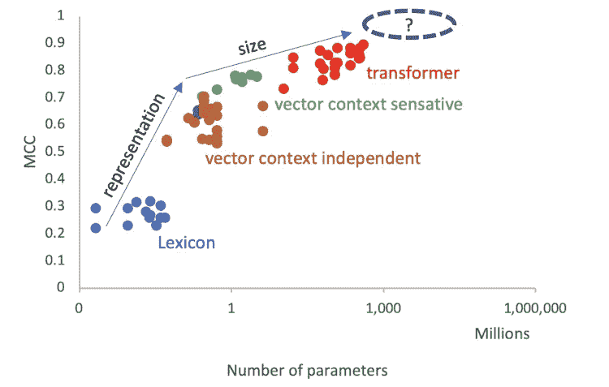

# 情感分析的评价:反思自然语言处理的过去和未来

> 原文：<https://towardsdatascience.com/evaluation-of-sentiment-analysis-a-reflection-on-the-past-and-future-of-nlp-ccfd98ee2adc?source=collection_archive---------31----------------------->

## 我们能不能发现一些仍然缺失的元素的线索，从而使 NLP 更加有效？我们应该在哪里寻找下一件大事？

Javier Allegue Barros 在 [Unsplash](https://unsplash.com?utm_source=medium&utm_medium=referral) 上拍摄的照片

我最近收到[一篇新论文](https://href.li/?https://ieeexplore.ieee.org/stamp/stamp.jsp?arnumber=9142175)，题为“金融中的情绪分析评估:从词典到变形金刚”，发表于 2020 年 7 月 16 日的 IEEE。作者 KostadinMishev、Ana Gjorgjevikj、Irena Vodenska、Lubomir T. Chitkushev 和 DimitarTrajanov 比较了应用于两个已知金融情绪数据集的一百多种情绪算法，并评估了它们的有效性。虽然这项研究的目的是测试不同自然语言处理(NLP)模型的有效性，但论文中的研究结果可以告诉我们更多关于 NLP 在过去十年中的进展，特别是更好地了解哪些因素对情绪预测任务贡献最大。

所以让我们从情绪预测任务的定义开始。给定一组段落，该模型将每个段落分为三个可能的类别:正面情绪、负面情绪或中性情绪。然后，基于混淆矩阵(3X3)来评估该模型，该混淆矩阵是根据预测情感与基本事实(每个段落的真实标签)的计数来构建的。

作者实施的评估指标被称为马修斯相关系数(MCC)，并作为二元(两类)分类质量的衡量标准([马修斯](https://href.li/?https://en.wikipedia.org/wiki/Brian_Matthews_(biochemist))，1975)。尽管 MCC 度量仅适用于二元情况，但是作者没有提及他们如何在多类别情况(3 个情感类别)中应用 MCC 函数。他们是使用了微平均法，还是对多类情况应用了广义方程？

作者根据文本表示将 NLP 模型分为五大类:(1)基于词汇的知识，(2)统计方法，(3)单词编码器，(4)句子编码器，(5)转换器。每个类别应用了几个不同的模型，其性能记录在[表中](https://ieeexplore.ieee.org/mediastore_new/IEEE/content/media/6287639/8948470/9142175/mishe.t2-3009626-large.gif)。

上表展示了这些年来在文本表示方法的推动下情感分析的进展。作者证实，与其他评估方法相比，transformers 表现出更好的性能，并且文本表示扮演了主要角色，因为它将单词和句子的语义输入到模型中。

但是等等！关于 NLP 的未来，也许可以从这个实验中得出更多的结论。我们能发现仍然缺失的元素的线索，使 NLP 在更复杂的任务中更有效吗？为了用语言模型更好地表现人类语言，下一个重大突破可能是什么？

为了解决这个问题，我开始进一步挖掘模型的结果，寻找文本表示、模型大小和模型性能之间的联系，试图提取模型大小和文本表示对最终性能的影响。基于作者的分析，我创建了下图。下图显示了每个模型的 MCC 分数，作为模型数值参数的函数。颜色代表模型主类别。

图 1:作为模型中参数数量(对数标度)的函数的情感分类(MCC 分数)的改进

从我的分析中可以看出，情绪预测任务的进展包括两个阶段。第一阶段主要归功于更好的文本表示，而第二阶段是由于引入了转换器，该转换器可以通过增加网络规模和管理数百万个参数来处理巨大的语料库。

从上图中可以看出，从 80 年代初开始，文本表示发生了三次重大变革。第一次是从词汇表征到嵌入向量表征。嵌入向量的主要优点是其无监督的性质，因为它不需要任何标记，同时仍然捕获单词之间有意义的语义关系，并受益于模型的泛化能力。重要的是要记住这些嵌入模型，比如 word2vec 和 GloVe，是上下文无关的。它们将同一个相关向量分配给同一个单词，而不管该单词周围的上下文。因此，它们不能处理自然语言中的多义性或复杂语义。

然后，面向 2016 年推出了与上下文相关的单词表示法，如埃尔莫和 GPT。这些模型具有依赖于其上下文的单词的向量表示。埃尔莫双向编码上下文，而 GPT 从左到右编码上下文。它们的主要贡献是处理多义词和更复杂的语义的能力。

NLP 中最近的革命是 BERT(来自转换器的双向编码器表示)，它结合了双向上下文编码，并且对于广泛的自然语言处理任务只需要最小的架构改变。BERT 输入序列的嵌入是记号嵌入、段嵌入和位置嵌入的总和。BERT 和以下模型的独特之处在于，它们可以处理一批序列，从 1M 的参数到达到 500M 以上的最新模型。从图中可以看出，模型中的参数数量是过去 4 年中性能持续改善的主要原因。

尽管 NLP 模型在最近几年取得了长足的进步，但仍有很大的改进空间。根据多项研究，1，2 仅仅增加网络规模是不够的，即使在今天该模型也处于过度参数化的状态。下一个突破可能来自文本表示的进一步发展，届时 NLP 模型将能够更好地捕捉语言的组成性(通过组成其组成部分的含义来学习一大段文本的含义的能力)。语法推理领域是寻找新的文本表示方法的好地方。通过学习受控形式语法，我们可以更深入地了解应该在测试方面综合处理(Solan et al，2005)的元素，如系统性、替代性、生产率、本地化等。(Hupkes 等人，2019；Onnis & Edelman，2019)。

**传记**

(1) Hupkes，d .，Dankers，v .，Mul，m .，& Bruni，E. (2019)。神经网络的组合性:整合符号主义和连接主义。 *arXiv 预印本 arXiv:1908.08351* 。‏

(2)科瓦列娃、罗马诺夫、罗杰斯和拉姆斯斯基(2019)。揭露伯特的黑暗秘密。 *arXiv 预印本 arXiv:1908.08593* 。‏

(3) Onnis，l .，& Edelman，S. (2019)。本地与全球语言统计学习。‏

(4) Solan，z .，Horn，d .，Ruppin，e .，和 Edelman，S. (2005 年)。自然语言的无监督学习。*美国国家科学院院刊*， *102* (33)，11629–11634。‏

(5)米舍夫，k .，Gjorgjevikj，a .，沃登斯卡，I .，奇库舍夫，L. T .，和特拉亚诺夫，D. (2020)。金融中情感分析的评价:从词典到变形金刚。 *IEEE 访问*， *8* ，131662–131682。‏