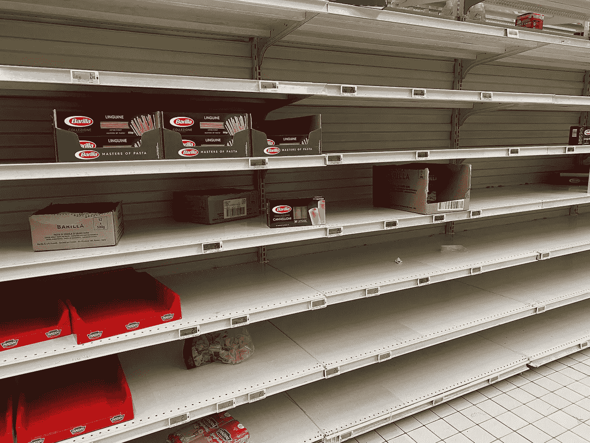
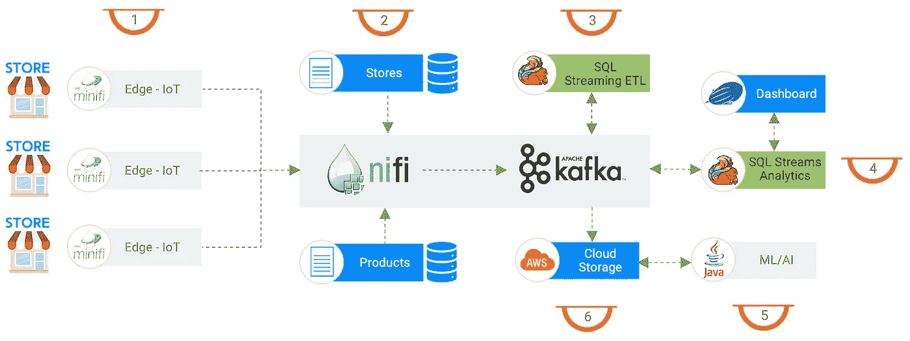

# FlinkSQL 和 Zeppelin 危机事件驱动供应链

> 原文：<https://towardsdatascience.com/event-driven-supply-chain-for-crisis-with-flinksql-be80cb3ad4f9?source=collection_archive---------21----------------------->

## 开源流媒体技术如何帮助改善新冠肺炎供应链

*原载于*[*https://www . data crafts . fr*](https://www.datacrafts.fr/Hub-And-Spoke/)

技术正在帮助世界度过由 Covid19 病毒引起的卫生、经济和社会危机。人工智能帮助科学家了解病毒，以找到治疗方法/疫苗。移动应用程序让远方的家人和朋友保持联系。物联网用于管理通过蓝牙点对点交互传播的病毒。更多关于技术如何帮助的例子在许多博客文章中列出。在这篇博文中，我将重点讨论流媒体技术如何在危机期间帮助供应链。

# 供应链如何受到挑战？

一张图胜过千言万语。下面是我在宣布封锁前几天在巴黎一家商店拍的照片。吓人吧？焦虑之下，人们开始囤积食物，尽管 CPG 行业已经宣布不会出现短缺。这种行为造成了暂时的短缺，使人们感到恐惧，阻碍了他们对官方信息的信任。他们开始囤积货物，使情况变得更糟。恶性循环。



宣布社会距离后，在巴黎的意大利面货架上肆虐

零售只是大众熟知的一个例子。医院供应链面临的挑战要大得多。Covid19 病例的指数级增长对检测试剂盒、个人防护设备、药物、ICU 病床、呼吸机和工作人员造成了持续的压力。在法国，病人通过医疗列车和航班在城市间转移。他们中的一些人在德国受到照顾。航空公司正在帮助货运活动从中国运送数百万个口罩。每个决定都需要在许多未知的情况下快速做出，并且会影响人们的生活。

> 但是巨大的挑战伴随着巨大的机遇。

借助物联网和流媒体平台，我们可以实时了解整个供应商、国家甚至行业的库存和需求。当库存因意外需求而更快耗尽时，我们可以立即触发警报。可以对行动进行优先排序，决策得到数据的支持，可以快速做出决策以适应不断变化的模式。此外，该平台有助于收集更多数据，从而使预测更加准确。

# 开源事件驱动的零售供应链

为了实际起见，让我们看看如何利用 [Cloudera 数据平台](https://www.cloudera.com/products/cloudera-data-platform.html)和 [Cloudera 数据流](https://www.cloudera.com/products/cdf.html)中的开源软件来实现这一愿景。该架构使用:

1.  [MiNiFi](https://nifi.apache.org/minifi/) :在每个销售点(POS)部署小型数据收集代理，收集销售交易，并实时发送到数据中心或云端。
2.  [阿帕奇尼菲](https://nifi.apache.org/index.html):收集来自代理商的销售事件，并发送给[阿帕奇卡夫卡](https://kafka.apache.org/)经纪人。NiFi 还将来自几个数据库的商店和产品数据实时导入 Kafka。
3.  [Apache Flink](https://flink.apache.org/) :处理来自不同 Kafka 主题的数据，以丰富 POS 事件，在时间窗口上聚合它们，检测阈值违反等。Apache Flink 有一个 SQL API，使得编写管道更加容易。
4.  [Apache Zeppelin](https://zeppelin.apache.org/) :是一款交互式笔记本，支持 Apache Flink 和 Flink SQL，用于探索数据、构建实时仪表盘以及与不同团队交流信息。
5.  [Kafka Connect:](https://kafka.apache.org/documentation/#connect) 收集不同主题的事件，并将其存储到类似 S3 或 ADLS 的云存储中。数据保存在更便宜的存储设备上，用于长期归档或其他批量使用情况。
6.  [Cloudera 机器学习](https://www.cloudera.com/products/machine-learning.html):处理数据，训练机器学习模型，提取特征，根据各种数据集预测未来模式。



面向零售的事件驱动架构的高级架构。[商店图标](https://commons.wikimedia.org/wiki/File:Store_Building_Flat_Icon_Vector.svg)来自 by [视频整形](https://videoplasty.com/)， [CC-BY-SA 4.0](https://creativecommons.org/licenses/by-sa/4.0/deed.en)

在接下来的部分中，我们将关注事件流管道。

# 数据模型和摄取

我在几篇博客中讨论过 NiFi 和 MiNiFi 功能。我们可以在商店中部署数千个小型代理，并从一个中心位置控制它们。每个代理可以在本地从商店的数据源(数据库、文件或类似 MQTT 的轻量级代理)收集数据，并将其发送到中央 NiFi。关于这部分的更多信息，可以参考我写的关于如何建立一个工业物联网系统，然后用商店代替工厂的详细博文。

[](https://medium.com/free-code-camp/building-an-iiot-system-using-apache-nifi-mqtt-and-raspberry-pi-ce1d6ed565bc) [## 如何使用 Apache NiFi、MiNiFi、C2 服务器、MQTT 和 Raspberry Pi 构建 IIoT 系统

### 您认为构建一个先进的工业物联网原型需要多长时间，它可以:

medium.com](https://medium.com/free-code-camp/building-an-iiot-system-using-apache-nifi-mqtt-and-raspberry-pi-ce1d6ed565bc) 

一旦在 NiFi 中接收到数据，我们就可以通过一个简单的流程将事件发布到 Kafka。下面的流程为每个事件附加一个模式名(pos ),并将其推送到 *pos* Kafka 主题。


NiFi 使用模式注册表向 Kafka 发送 POS 事件

来自商店的事件具有以下属性。

```
{
  "tstx" : "1586615062225", //transaction timestamp
  "idtx" : "1871134",// transaction identifier
  "idstore" : 5, // store identifier
  "idproduct" : 8, // product identifier
  "quantity" : 3 // quantity at which the product was sold
}
```

此事件意味着商店“5”售出了 3 件产品“8”

类似地，NiFi 可以监视几个表，并把新的或更新的行增量地接收到 Kafka 中。在我们的用例中，我们从一个*商店*表中获取数据，该表中有每个商店的详细信息，比如用户名和位置。

```
{
  "idstore":1,
  "namestore":"supermarket",
  "city":"paris"
}
```

我们还从一个*产品*表中获取数据，该表包含每个产品的详细信息，比如产品名称和在给定频率下观察到的平均销售量。

```
{
  "idproduct":8,
  "nameproduct":"hand-sanitiser",
  "avgsales":2
}
```

数据摄取的结果可以在下面的视频中看到，我使用 *Streams Messaging Manager* 来探索三个 Kafka 主题的内容: *pos* 、 *stores* 和 *products* 。这些主题被划分，事件根据 *id* 字段进行分配，以便在以后对处理进行负载平衡。我们还准备了第四个主题， *alerts* ，稍后当我们检测到某个产品的销售速度比平时快时，我们将使用它来发送警报。从视频中，你还可以看到生产者和消费者对每个话题的看法。

卡夫卡主题、事件、生产者和消费者概述

# 使用 Flink SQL 和 Zeppelin 进行数据探索

Apache Flink 是一个现代的、开源的流引擎，我们将使用它来构建我们的数据管道。Flink 可用于实时 ETL，其中事件被实时转换。它还可以用于计算基于不同时间操作(事件时间和处理时间、窗口、全状态处理等)的高级 KPI。Apache Flink 拥有强大的 API，如 DataStream 和 ProcessFunction APIs，可用于构建现代事件驱动的应用程序。它还具有易于使用的表格和 SQL API，使分析用户可以使用这项技术。我们将利用 SQL API 使这个博客能够被更广泛的社区访问。要使用 Flink SQL，现成的选项是 SQL 客户端 CLI。让我们先用它来探究 POS 主题的内容:

使用 FlinkSQL CLI 客户端实时读取事件

Flink SQL CLI 非常适合简单的分析。但是，对于想要测试和修改几个查询的数据探索来说，这并不方便。幸运的是，数据科学笔记本 Apache Zeppelin 支持运行 Flink 和 Flink SQL 代码。我们将在接下来的章节中使用它。我们开始吧！

## 我们手里有什么？

为了在 FlinkSQL 中处理我们的流，我们需要创建表。一个表定义了 Kafka 主题中的事件模式，并提供了对 SQL API 的访问。例如，要创建我们的 POS 流的表，我们可以使用:

```
CREATE TABLE pos (
   tstx BIGINT,
   idtx BIGINT,
   idstore INT,
   idproduct INT,
   quantity INT,
   timetx AS CAST(from_unixtime(floor(tstx/1000)) AS TIMESTAMP(3)),
   WATERMARK FOR timetx AS timetx - INTERVAL '10' SECOND
) WITH (
   'connector.type' = 'kafka',
   'connector.version' = 'universal',
   'connector.topic' = 'pos',
   'connector.startup-mode' = 'latest-offset',
   'connector.properties.bootstrap.servers' = 'kafka-url:9092',
   'connector.properties.group.id' = 'FlinkSQLPOS',
   'format.type' = 'json'
);
```

这创建了一个名为 *pos* 的表，指向 *pos* Kafka 主题中的事件。这些事件采用 *JSON* 格式，拥有我们之前介绍的五个属性。除了这些属性之外，它还定义了一个事件时间字段，该字段是根据事务时间戳(tstx)计算的，并定义了一个 10 秒的水印。该表使用 **Flink Kafka 连接器**连接到 edge2ai-1.dim.local:9092 中运行的集群。类似地，在 Flink SQL 中使用商店和产品表之前，我们需要创建它们。

```
CREATE TABLE stores (
   idstore INT,
   namestore STRING,
   city STRING
) WITH (
   'connector.type' = 'kafka',
   'connector.version' = 'universal',
   'connector.topic' = 'stores',
   'connector.startup-mode' = 'earliest-offset',
   'connector.properties.bootstrap.servers' = 'kafka-url:9092',
   'connector.properties.group.id' = 'FlinkSQLStore',
   'format.type' = 'json'
);CREATE TABLE products (
   idproduct INT,
   nameproduct STRING,
   avgsales INT
) WITH (
   'connector.type' = 'kafka',
   'connector.version' = 'universal',
   'connector.topic' = 'products',
   'connector.startup-mode' = 'earliest-offset',
   'connector.properties.bootstrap.servers' = 'kafka-url:9092',
   'connector.properties.group.id' = 'FlinkSQLProducts',
   'format.type' = 'json'
);
```

我们准备好查询我们的表: *SELECT * FROM pos* 。这就像在 SQL 数据库中查询数据一样简单。这是它在齐柏林飞艇中的样子。事件不断地从 Kafka 中被消费并打印在 UI 中。FlinkSQL 作业在 Flink 仪表板和 Yarn UI 上可见。

在 Zeppelin 中创建 FlinkSQL 表

Zeppelin 有一个嵌入在笔记本中的简单数据可视化的好特性。我们可以用它来绘制按产品和商店分组的事件。这对于快速浏览非常有用，仅适用于结果集，而不是所有数据或时间窗口。真正的分组应该以后在 FlinkSQL 里做。


按商店组织的售出产品数量图表

## 流到流的连接和丰富

在上图中，我们可以看到按产品和商店分组的事件。但是，我们只有产品和店铺 id。对理解正在发生的事情没什么用。我们可以通过将产品和商店流加入 POS 流来丰富交易。使用 *idproduct* 和 *idstore* ，我们可以获得其他元数据，比如产品名称和城市。

请记住，POS 流是一个高速的仅附加流，在数据仓库世界(DWH)中也称为*事实表*。商店和产品是缓慢变化的流，在 DWH 世界被称为维度表。它们也是只附加的流，其中更新是具有现有 ID 的新事件。即使流连接看起来类似于表连接，但还是有根本的区别。例如，如果我有几个关于产品 x 的事件，我将加入哪一个 POS 事件？最新的那个？时间戳最近的那个？为了保持这篇博客的简洁，我将暂时忽略这些方面，我将在未来几天发表一篇关于 streams joins 的深度博客。

转到 FlinkSQL，这里是我们如何加入我们的三个流:

```
SELECT tstx,idtx, namestore, city, nameproduct, quantity 
FROM 
   pos AS po, 
   stores AS s,
   products AS pr
WHERE po.idstore = s.idstore AND po.idproduct = pr.idproduct;
```

使用 Zeppelin 图表，我们可以看到我们的产品在每个城市的销售速度。下面的视频展示了查询的执行。

使用 SQL 连接丰富数据流

## 快速检测用完的产品

现在我们对数据有了更好的理解，我们可以寻找产品销售模式，并将它们与历史数据进行比较。我们不能让某人一直监控仪表板，我们希望生成警报。

请记住，在我们的 products 表中，我们有一个列 avgsales，它告诉我们在给定的时间范围(例如 4 小时)内，我们通常在每个商店销售的每个产品的平均数量。出于演示的目的，我们将考虑一个非常短的时间尺度(15 秒)来加速。那么如何才能检测出一个产品卖的快呢？

首先，我们需要在 15 秒的时间窗口内聚合我们的 POS 事件。对于每个窗口，我们将计算售出数量的总和。我们希望每个商店也这样做，因此也按商店分组。该查询如下所示。请注意，该查询引入了两个新列，starttime 和 endtime，分别表示时间窗口的开始和结束。

```
SELECT TUMBLE_START(timetx, INTERVAL '15' SECOND) as starttime, TUMBLE_END(timetx, INTERVAL '15' SECOND) as endtime, idstore, idproduct, SUM(quantity) as aggregate
FROM pos
GROUP BY idproduct,idstore, TUMBLE(timetx, INTERVAL '15' SECOND)
```

一旦我们有了聚合流，我们希望将它与商店和产品流结合起来，以获得其他字段，如 avgsales。我们希望将计算出的总量 aggregate 与 hostorical avgsales 进行比较。这给了我们完整的查询:

```
SELECT starttime, endtime, nameproduct, aggregate, avgsales, namestore, city 
FROM
  (
    SELECT TUMBLE_START(timetx, INTERVAL '30' SECOND) as starttime,     
    TUMBLE_END(timetx, INTERVAL '30' SECOND) as endtime, idstore,   
    idproduct, SUM(quantity) as aggregate
    FROM pos
    GROUP BY idproduct,idstore, TUMBLE(timetx, INTERVAL '30' SECOND) 
  ) AS a,
  products as p,
  stores as s
WHERE aggregate > avgsales AND a.idproduct = p.idproduct AND a.idstore = s.idstore;
```

下面的视频展示了 Zeppelin 中查询的执行和 Flink 仪表板中生成的查询计划。我们可以观察到，在所有城市，洗手液的购买速度都比平时快。

当产品销售速度比平时快时发出警报

# 创建新的通知流

既然我们对我们的数据处理和探索感到满意，我们需要创建一个新的警报流。该流可用于通过移动应用程序向商店经理发送推送通知。收到此通知后，商店经理可以要求员工优先重新装满特定产品的货架。这在员工数量可能减少的危机时期非常重要。这将有助于主动管理当地活动，以避免空货架，从而减少焦虑和购买可能无法获得的产品的冲动。

FlinkSQL 也可以用来创建新的 Kafka 流。我们必须像以前一样创建一个新表。

```
CREATE TABLE alerts (
   starttime TIMESTAMP(3),
   endtime TIMESTAMP(3),
   nameproduct STRING,
   aggregate INT,
   avgsales INT,
   namestore STRING,
   city STRING
) WITH (
   'connector.type' = 'kafka',
   'connector.version' = 'universal',
   'connector.topic' = 'alerts',
   'connector.startup-mode' = 'latest-offset',
   'connector.properties.bootstrap.servers' = 'kafka-url:9092',
   'connector.properties.group.id' = 'FlinkSQLAlerting',
   'format.type' = 'json'
);
```

然后，我们可以将之前的聚合和警报查询嵌入到 insert into 语句中。

```
INSERT INTO alerts
   SELECT starttime, endtime, nameproduct, aggregate, avgsales,   
          namestore, city 
   FROM
     (
     SELECT TUMBLE_START(timetx, INTERVAL '15' SECOND) as    
        starttime, TUMBLE_END(timetx, INTERVAL '15' SECOND) as 
        endtime, idstore, idproduct, SUM(quantity) as aggregate
     FROM pos
     GROUP BY idproduct,idstore, TUMBLE(timetx, INTERVAL '15' 
     SECOND) ) AS a,
     products as p,
     stores as s
   WHERE aggregate > avgsales AND a.idproduct = p.idproduct AND 
   a.idstore = s.idstore;
```

这样，所有生成的警报都被发送到 *alerts* Kafka 主题中，就像我们在 SMM 看到的那样。从 Kafka，我们可以让 NiFi、KStreams 或 Java 应用程序订阅这些警报事件，并将它们推送到我们的商店管理器中。

在 Kafka 中存储警报以支持下游应用程序

# 结论

在这篇博客中，我们解释了流媒体平台如何让任何供应链获得实时洞察。在需求巨大、不确定性不断增加的危机形势下，这些见解将改变游戏规则。这正是我们今天面临的危机。

我们还展示了如何使用 Apache NiFi、Apache Flink 和 Apache Zeppelin 等工具构建一个高级的事件驱动警报系统，而无需任何代码。Flink 通过一个简单的 SQL API 提供高级流操作，如流连接和窗口。建立一个先进的实时供应链系统变得人人可及。CDF 等事件流平台将所有这些工具打包成一个统一的堆栈，易于部署和使用。

在以后的博客中，我将介绍 Flink 和 Flink SQL 中的流连接类型。如果你对这些话题有兴趣，过几天再来看看这个博客。

谢谢你读到这里。一如既往，欢迎反馈和建议。