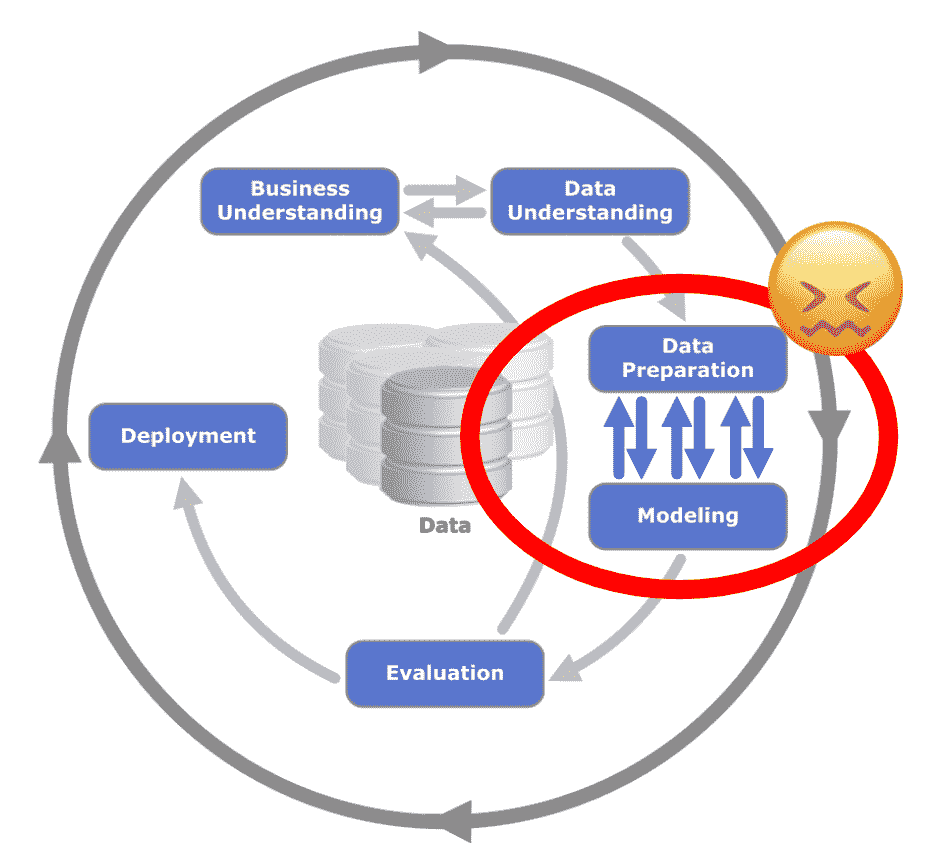
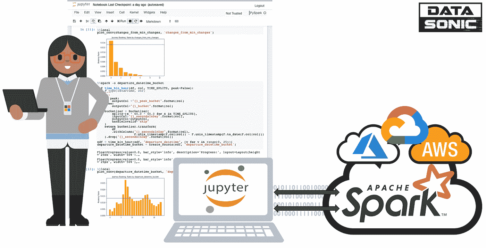
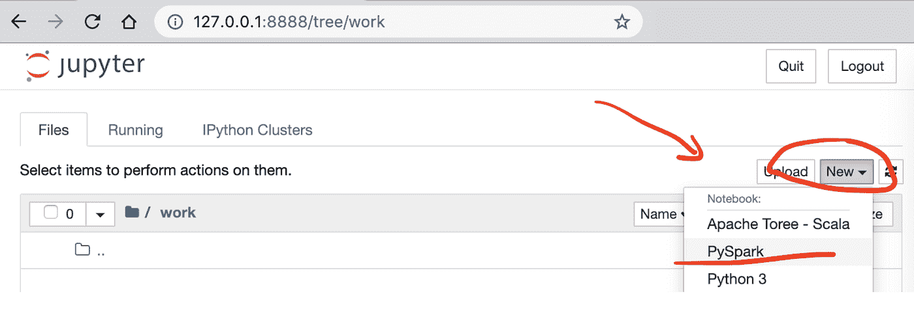
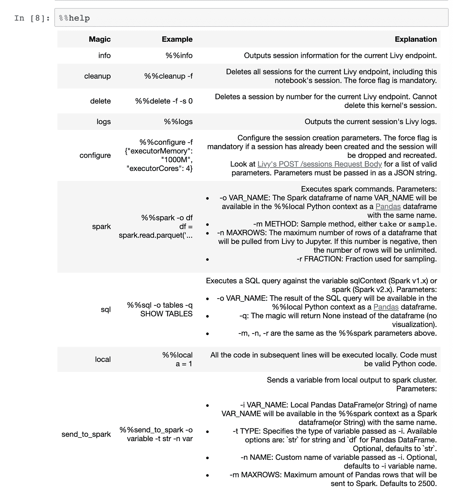
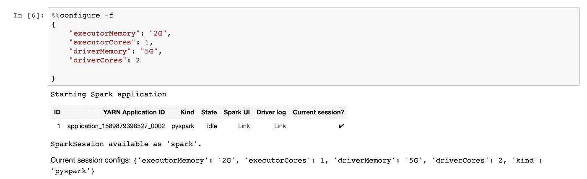
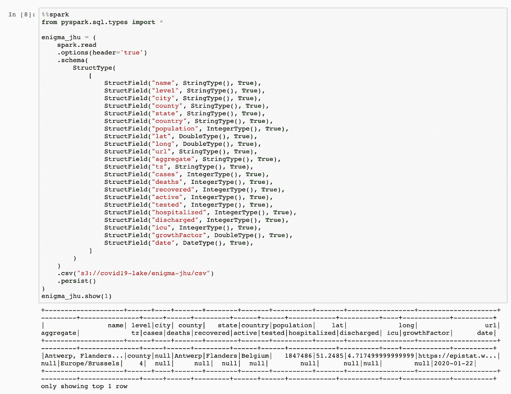
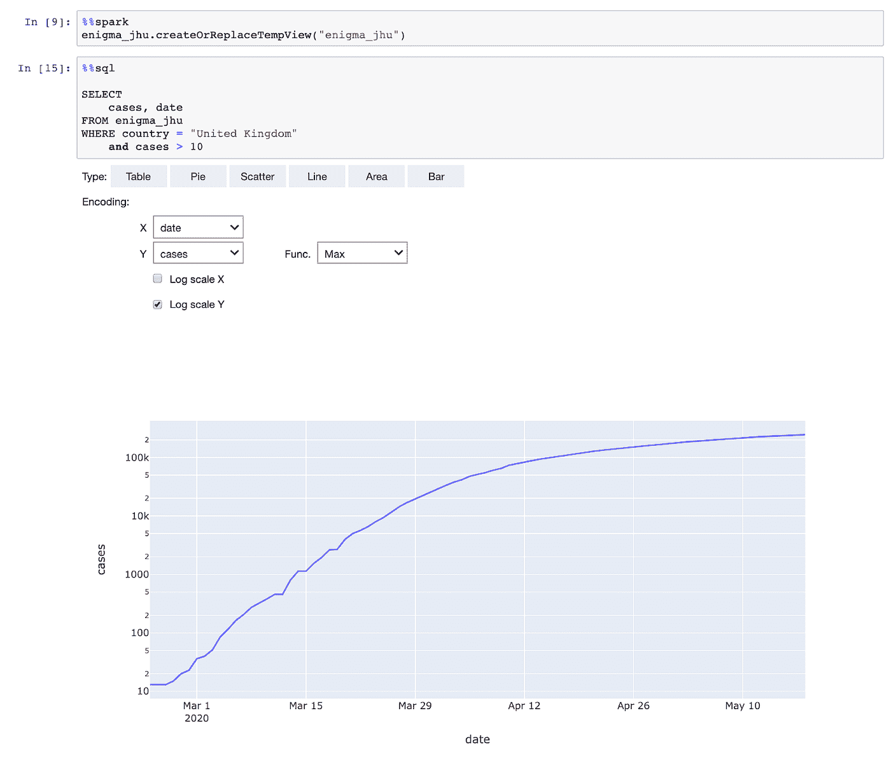

# 每个数据科学家都需要一些火花魔法

> 原文：<https://towardsdatascience.com/every-data-scientist-can-need-some-spark-magic-853da0b81006?source=collection_archive---------8----------------------->

## 如何借助 Spark Magic 改进您的数据探索和高级分析



CC BY-SA 3.0，[肯尼斯·詹森](https://en.wikipedia.org/wiki/Cross-industry_standard_process_for_data_mining#/media/File:CRISP-DM_Process_Diagram.png)

虽然数据科学被吹捧为 21 世纪最性感的工作，但它也不能幸免于臭名昭著的**帕累托法则**或 **80/20 法则**。商业数据科学家 80%的时间花在寻找、清理和准备数据上。这是数据科学家工作中效率最低也是最可怕的部分。

互联网为如何打破数据科学的 80/20 法则提供了无尽的意见，但好的建议却很难得到。低生产率的一个主要原因在于**数据准备的双重性**:

*   快速访问、连接和聚合存储在企业数据湖中的大数据
*   探索和可视化笔记本中的数据和统计数据，这些数据和统计数据对 Python 包具有复杂的依赖性

大数据大部分是非结构化的，存储在**生产环境**中，存在企业治理和安全限制。快速访问数据需要昂贵的分布式系统，这些系统由 IT 部门集中管理，并且必须与其他数据科学家和分析师共享。

Spark 是数据行业在分布式数据湖中处理数据的黄金标准。但是，要经济高效地使用 Spark 集群，甚至允许多租户，很难适应单独的需求和依赖性。分布式数据基础设施的行业趋势是朝着**短暂集群**发展，这使得数据科学家更难部署和管理他们的 **Jupyter** **笔记本环境**。

毫不奇怪，许多数据科学家**在本地**使用高规格笔记本电脑工作，在那里他们可以更容易地安装和维护他们的 Jupyter 笔记本环境。到目前为止还可以理解。那么，许多数据科学家如何将他们的本地开发环境与生产数据湖中的数据联系起来呢？他们用 Spark 将 csv 文件具体化，并从云存储控制台下载它们。

从云存储控制台手动下载 csv 文件既不高效，也不是特别健壮。以终端用户友好和透明的方式将本地 Jupyter 笔记本与远程集群无缝连接不是更好吗？认识一下 SparkMagic！

# Jupyter 笔记本的 SparkMagic



麻省理工学院 Sandro Pereira 授权的合理使用和公共领域图标和 svg

Sparkmagic 是一个通过 Livy REST API 与 Jupyter 笔记本中的远程 Spark 集群交互工作的项目。它提供了一套 Jupyter 笔记本单元魔法和内核，将 Jupyter 转变为远程集群的集成 Spark 环境。

SparkMagic 允许我们

*   运行多种语言**的 Spark 代码**和
*   针对任何**远程火花簇**，使用 SparkContext 和 HiveContext 自动创建 SparkSession
*   提供 SQL 查询的自动**可视化**
*   轻松访问 Spark 应用程序日志和信息
*   将 Spark 查询的输出捕获为一个**本地 Pandas 数据帧**，以便与其他 Python 库(例如 matplotlib)轻松交互
*   **将本地文件**或 Pandas 数据帧发送到远程集群(例如，将预先训练的本地 ML 模型直接发送到 Spark 集群)

您可以使用以下 Dockerfile 文件构建一个支持 SparkMagic 的 Jupyter 笔记本:

```
FROM jupyter/all-spark-notebook:7a0c7325e470USER $NB_USER
RUN pip install --upgrade pip
RUN pip install --upgrade --ignore-installed setuptools
RUN pip install pandas --upgrade
RUN pip install sparkmagic
RUN mkdir /home/$NB_USER/.sparkmagic
RUN wget [https://raw.githubusercontent.com/jupyter-incubator/sparkmagic/master/sparkmagic/example_config.json](https://raw.githubusercontent.com/jupyter-incubator/sparkmagic/master/sparkmagic/example_config.json)
RUN mv example_config.json /home/$NB_USER/.sparkmagic/config.json
RUN sed -i 's/localhost:8998/host.docker.internal:9999/g' /home/$NB_USER/.sparkmagic/config.json
RUN jupyter nbextension enable --py --sys-prefix widgetsnbextension
RUN jupyter-kernelspec install --user --name SparkMagic $(pip show sparkmagic | grep Location | cut -d" " -f2)/sparkmagic/kernels/sparkkernel
RUN jupyter-kernelspec install --user --name PySparkMagic $(pip show sparkmagic | grep Location | cut -d" " -f2)/sparkmagic/kernels/pysparkkernel
RUN jupyter serverextension enable --py sparkmagic
USER root
RUN chown $NB_USER /home/$NB_USER/.sparkmagic/config.json
CMD ["start-notebook.sh", "--NotebookApp.iopub_data_rate_limit=1000000000"]
USER $NB_USER
```

构建图像，并用以下内容进行标记:

```
docker build -t sparkmagic
```

在 Spark Magic 的支持下启动一个本地 Jupyter 容器，挂载当前的工作目录:

```
docker run -ti --name \"${PWD##*/}-pyspark\" -p 8888:8888 --rm -m 4GB --mount type=bind,source=\"${PWD}\",target=/home/jovyan/work sparkmagic
```

为了能够连接到远程 Spark 集群上的 Livy REST API，您必须在本地计算机上使用 ssh 端口转发。获取远程集群的 IP 地址并运行:

```
ssh -L 0.0.0.0:9999:localhost:8998 REMOTE_CLUSTER_IP
```

首先，使用启用了 SparkMagic 的 PySpark 内核创建一个新的笔记本，如下所示:



[OC]

在启用 SparkMagic 的笔记本中，您有一系列单元 Magic 可用于本地笔记本以及作为集成环境的远程 Spark 集群。**% %帮助**魔术打印出所有可用的魔术命令:



[OC]

您可以使用 **%%configure** 魔法配置您的远程 Spark 应用程序:



正如您在上面的截图中所看到的，SparkMagic 自动启动了一个远程 PySpark 会话，并提供了一些有用的链接来连接到 Spark UI 和日志。

该笔记本集成了两种环境:

1.  **%%local** 它在您的笔记本电脑和由 jupyter docker 映像提供的 anaconda 环境上本地执行单元
2.  **%%spark** 它通过远程 spark 集群上的 PySpark REPL 经由 Livy REST API 远程执行单元

下面的代码单元格首先远程导入 SparkSql 类型。其次，它使用远程 SparkSession 将英格玛-JHU-新冠肺炎数据集加载到我们的远程 Spark 集群中。我们可以看到遥控器的输出。在笔记本中显示()命令:



[OC]

但这只是魔法的开始。我们可以将 dataframe 注册为一个 Hive 表，并使用 **%%sql** 魔法对远程集群上的数据执行 Hive 查询，并在本地笔记本中创建结果的自动化可视化。虽然这不是火箭科学，但对于数据分析师和数据科学项目早期阶段的快速数据探索来说，这是非常方便的。



SparkMagic 真正有用的特性是在本地笔记本和远程集群之间无缝传递数据。数据科学家的日常挑战是创建和持久化他们的 Python 环境，同时使用短暂的集群与他们公司的数据湖进行交互。

在以下示例中，您可以看到我们如何将 seaborn 作为本地库导入，并使用它来绘制 covid_data pandas 数据框。但是这些数据来自哪里呢？它是由远程火花簇创建和发送的。神奇的 **%%spark -o** 允许我们定义一个远程变量，在单元执行时传递给本地笔记本上下文。我们的变量 covid_data 是

*   远程集群上的 SparkSQL 数据帧和
*   当地 Jupyter 笔记本中的熊猫数据框


使用 Pandas 将远程集群中的大数据聚合到本地的 Jupyter 笔记本中的能力对数据探索非常有帮助。例如，使用 Spark 将直方图的数据预聚合到按箱的计数中，以使用预聚合的计数和简单的条形图在 Jupyter 中绘制直方图。另一个有用的特性是能够使用神奇的**% % Spark-o covid _ data-m sample-r 0.5**对远程 Spark 数据帧进行采样

集成环境还允许您使用神奇的 **%%send_to_spark** 将本地数据发送到远程 Spark 集群

支持的两种数据类型是 **Pandas DataFrames** 和**string**。要向远程 Spark 集群发送更多或更复杂的内容，例如用于评分的经过训练的 scikit 模型，您可以使用序列化来创建用于传输的字符串表示:

```
import pickle
import gzip
import base64serialised_model = base64.b64encode(
    gzip.compress(
        pickle.dumps(trained_scikit_model)
    )
).decode()
```

# 将 PySpark 工作负载部署到生产中？

如您所见，这种短暂的 PySpark 集群模式有一个很大的痛点:用 Python 包引导 EMR 集群。当您部署生产工作负载时，这个问题不会消失。您可以在我之前的博客文章中阅读如何使用 PEX 加速 PySpark 应用程序在短暂的 AWS EMR 集群上的部署:

[](/pex-the-secret-sauce-for-the-perfect-pyspark-deployment-of-aws-emr-workloads-9aef0d8fa3a5) [## PEX——AWS EMR 工作负载完美 PySpark 部署的秘方

### 如何使用 PEX 加速 PySpark 应用程序在临时 AWS EMR 集群上的部署

towardsdatascience.com](/pex-the-secret-sauce-for-the-perfect-pyspark-deployment-of-aws-emr-workloads-9aef0d8fa3a5) 

Jan 是公司数据转型方面的成功思想领袖和顾问，拥有将数据科学大规模应用于商业生产的记录。他最近被 dataIQ 评为英国 100 位最具影响力的数据和分析从业者之一。

**在 LinkedIn 上连接:**[**【https://www.linkedin.com/in/janteichmann/】**](https://www.linkedin.com/in/janteichmann/)

**阅读其他文章:**[**https://medium.com/@jan.teichmann**](https://medium.com/@jan.teichmann)