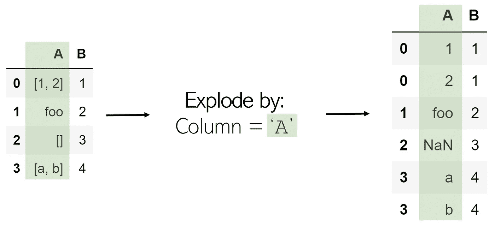
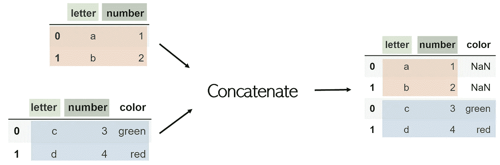

# 每一个复杂的数据帧操作，直观地解释和可视化

> 原文：<https://towardsdatascience.com/every-dataframe-manipulation-explained-visualized-intuitively-dbeea7a5529e?source=collection_archive---------13----------------------->


图片作者。

## 熔化、旋转、连接、爆炸等

Pandas 提供了各种各样的数据帧操作，但其中许多都很复杂，可能看起来不容易实现。本文将介绍 8 种基本的数据帧操作方法，几乎涵盖了数据科学家需要了解的所有操作功能。每种方法都包括解释、可视化、代码和记住它的技巧。

*所有图片由作者提供。*

## 在枢轴上转动

透视一个表会创建一个新的“透视表”,它将数据中的现有列作为新表的元素进行投影，即索引、列和值。将成为索引的初始数据帧中的列和列显示为唯一值，这两个列的组合将显示为值。这意味着透视不能处理重复值。


透视名为`df`的数据帧的代码如下:

```
df.pivot(index='foo', columns='bar', values='baz')
```

*记住*:轴心是——在数据处理领域之外——围绕某种对象的旋转。在运动中，一个人可以绕着他们的脚“旋转”:熊猫的枢轴是类似的。原始数据帧的状态围绕一个数据帧的中心元素旋转成一个新的数据帧。有些元素确实是旋转或变换的(如列'`bar`')。

## 熔化

熔化可以被认为是一种“逆透视”，因为它将基于矩阵的数据(有两个维度)转换为基于列表的数据(列表示值，行表示唯一的数据点)，而透视则相反。考虑一个二维矩阵，其中一个维度为“`B`”和“`C`”(列名)，另一个维度为“`a`”、“`b`”和“`c`”(行索引)。

我们选择一个 ID、一个维度和一列或多列来包含值。包含值的列被转换为两列:一列用于变量(值列的名称)，另一列用于值(其中包含的数字)。


结果是 ID 列的值(`a`、`b`、`c`)和值列(`B`、`C`)的每个组合，以及相应的值，以列表格式组织。

熔化操作可以在数据框`df`中这样执行:

```
df.melt(id_vars=['A'], value_vars=['B','C'])
```

*记忆*:熔化像蜡烛一样的东西，就是把一个固化的、复合的物体变成几个小得多的、单独的元素(蜡滴)。熔化一个二维数据帧解包它的固化结构，并将它的片段作为单个条目记录在一个列表中。

## 激增

分解是去除数据中列表的有用方法。当一列展开时，其中的所有列表都作为新行列在同一个索引下(为了避免这种情况，只需随后调用`.reset_index()`)。字符串或数字之类的非列表项不受影响，空列表是 NaN 值(您可以使用`.dropna()`清除这些值)。



在 DataFrame `df`中分解一列`‘A’`非常简单:

```
df.explode(‘A’)
```

*记住*:分解一个东西会释放它所有的内部内容——分解一个列表会分离它的元素。

## 堆

堆叠采用任意大小的数据帧，并将列“堆叠”为现有索引的子索引。因此，得到的数据帧只有一列和两级索引。


堆叠一个名为 df 的表就像`df.stack()`一样简单。

为了访问比如狗的身高，只需调用两次基于索引的检索，比如`df.loc[‘dog’].loc[‘height’]`。

*要记住*:从视觉上来说，stack 取一个表的二维度，可以将列堆叠成多级索引。

## 出栈

拆分采用多索引数据帧并将其拆分，将指定级别中的索引转换为新数据帧的列及其相应的值。在一个表上调用一个 stack 后跟一个 unstack 不会改变它(原谅一个'【T6]'的存在)。


拆分中的一个参数是它的级别。在列表索引中，索引为-1 将返回最后一个元素；关卡也是如此。级别-1 表示最后一个索引级别(最右边的一个)将被拆分。作为另一个例子，当级别被设置为 0(第一索引级别)时，其中的值变成列，并且随后的索引级别(第二索引级别)变成转换的数据帧的索引。


拆垛可以和堆垛一样进行，但是使用水平参数:`df.unstack(level=-1)`。

*记住* : Unstack 的意思是“撤销一个堆栈”。

## 合并

合并两个数据帧就是在一个共享的“键”中按列(水平)组合它们。这个键允许表的组合，即使它们的顺序不同。默认情况下，完成的合并数据帧会将后缀`_x`和`_y`添加到值列。


为了合并两个数据帧`df1`和`df2`(其中`df1`包含`leftkey`，`df2`包含`rightkey`)，调用:

```
df1.merge(df2, left_on='leftkey', right_on='rightkey')
```

合并不是 pandas 的功能，而是附属于数据帧。通常假设合并所附加到的数据帧是“左表”,而在函数中作为参数调用的数据帧是“右表”,并带有相应的键。

默认情况下，merge 函数执行所谓的内部连接:如果每个数据帧都有一个键没有在另一个数据帧中列出，则它不会包含在合并的数据帧中。另一方面，如果一个键在同一个数据帧中列出两次，则相同键的值的每个组合都会在合并的表中列出。例如，如果键`foo`的`df1`有 3 个值，而同一个键的`df2`有 2 个值，那么在最终的数据帧中将有 6 个带有`leftkey=foo`和`rightkey=foo`的条目。


*记住*:你合并数据帧就像你横向驾驶时合并车道一样。想象每根柱子都是高速公路上的一条车道；为了合并，它们必须水平合并。

## 加入

联接通常优于合并，因为它在水平联接两个数据帧时具有更清晰的语法和更广泛的可能性。联接的语法如下:

```
df1.join(other=df2, on='common_key', how='join_method')
```

使用联接时，公共键列(类似于 merge 中的`right_on`和`left_on`)必须命名为相同的名称。`how`参数是引用四种方法之一的字符串`join`可以组合两个数据帧:

*   `‘left’`:包含`df1`的所有元素，只有当`df2`的元素的键是`df1`的键时，才会伴随`df2`的元素。否则，`df2`的合并数据帧的缺失部分将被标记为 NaN。
*   `‘right’` : `‘left’,`但是在另一个数据框架上。包含`df2`的所有元素，只有当`df1`的元素的键是`df2`的键时，才会伴随`df1`的元素。
*   `‘outer’`:包含两个数据帧中的所有元素，即使一个键在另一个数据帧中不存在——缺少的元素标记为 NaN。
*   `‘inner’`:仅包括其键同时出现在两个数据帧键中的元素(交集)。默认为合并。

*记住*:如果你使用过 SQL，单词‘join’应该立即与列相加联系起来。如果没有，“加入”和“合并”在定义上有非常相似的含义。

## 串联

尽管合并和连接是水平工作的，但串联或简称为串联，是按行方式(垂直)附加数据帧。例如，考虑两个具有相同列名的数据帧`df1`和`df2`，用`pandas.concat([df1, df2])`连接起来:


虽然您可以通过将 axis 参数设置为`1`来使用 concat 进行列连接，但是使用 join 会更简单。

请注意，concat 是一个 pandas 函数，而不是 DataFrame 中的一个。因此，它接受一个要连接的数据帧列表。

如果一个 DataFrame 有一个列没有包含在另一个 data frame 中，默认情况下它将被包含在内，缺少的值列为 NaN。为了防止这种情况，添加一个额外的参数`join=’inner’`，它将只连接两个数据帧共有的列。



*记住*:在列表和字符串中，额外的条目可以连接起来。串联是对现有主体的附加元素，而不是新信息的添加(就像按列连接一样)。因为每个索引/行都是一个单独的项，所以串联会向数据帧添加额外的项，数据帧可以看作是一个行列表。

Append 是组合两个数据帧的另一种方法，但它执行的功能与 concat 相同，但效率较低且通用性较差。

# 有时候内置函数是不够的。

尽管这些函数涵盖了您可能需要操作数据的广泛内容，但有时所需的数据操作对于一个甚至一系列函数来说过于复杂。探索复杂的数据操作方法，如解析器函数、迭代投影、高效解析等，请点击此处:

[](https://medium.com/analytics-vidhya/tips-tricks-techniques-to-take-your-data-wrangling-skills-to-the-next-level-c912c23b20cb) [## 将您的数据辩论技能提升到一个新水平的提示、技巧和技术

### 带有图表、代码和示例

medium.com](https://medium.com/analytics-vidhya/tips-tricks-techniques-to-take-your-data-wrangling-skills-to-the-next-level-c912c23b20cb) 

# 感谢阅读！

如果你对最新的文章感兴趣，可以考虑订阅[。如果你想支持我的写作，通过我的推荐链接加入 Medium 是一个很好的方式。干杯！](https://andre-ye.medium.com/subscribe)