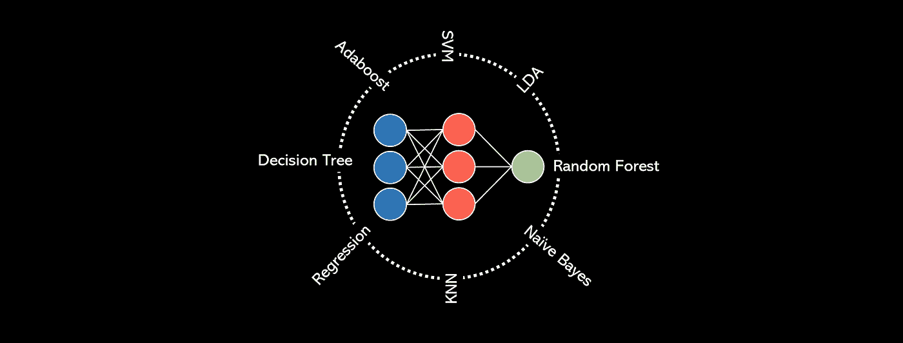
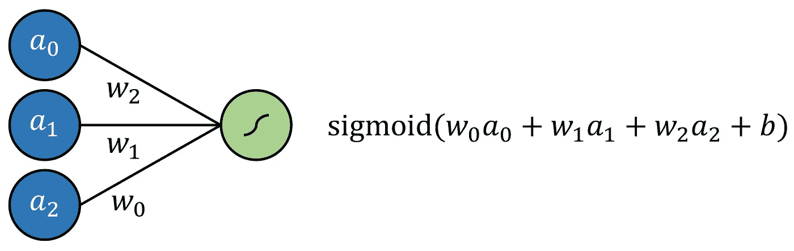
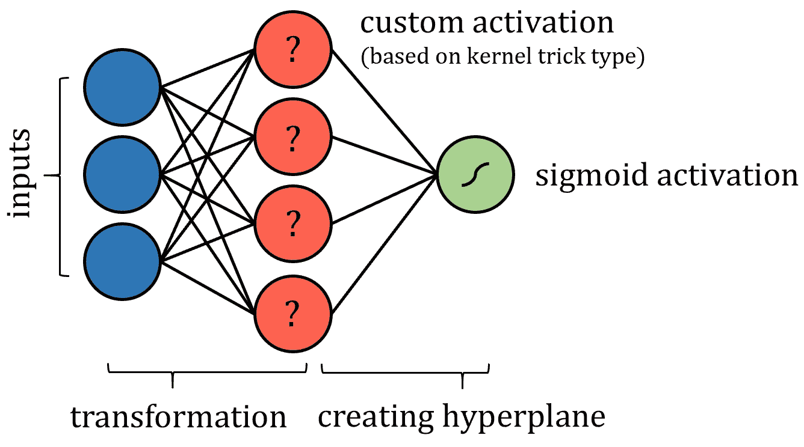
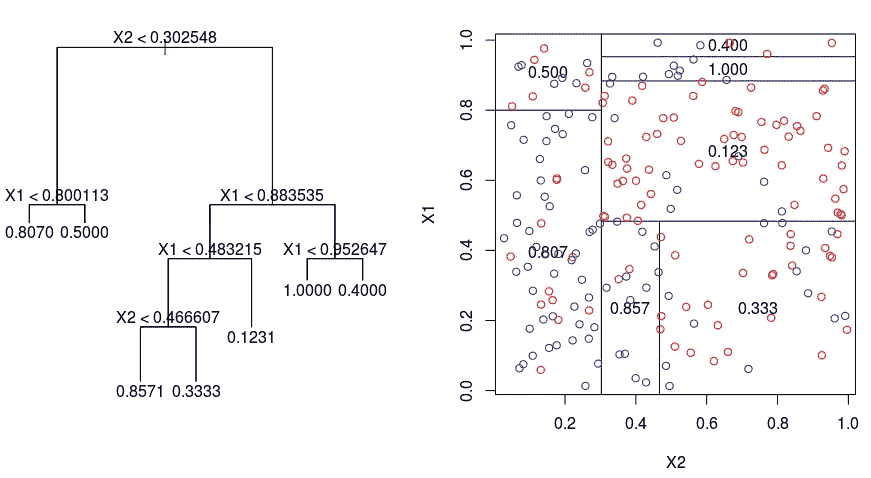
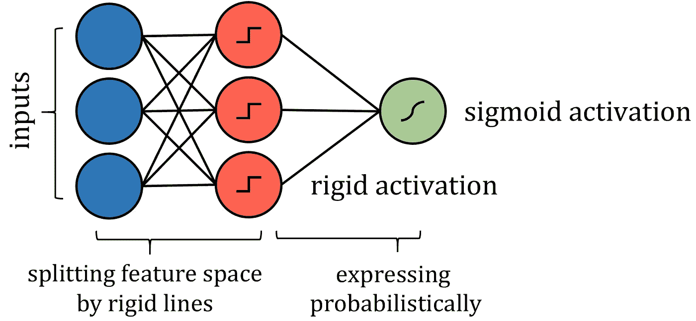
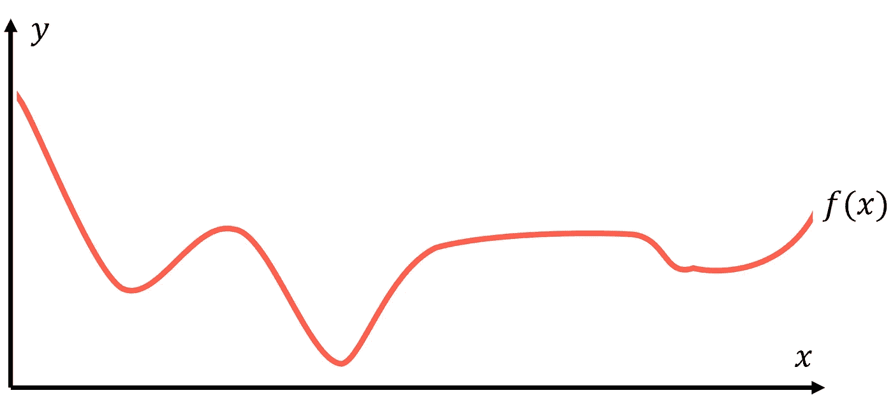
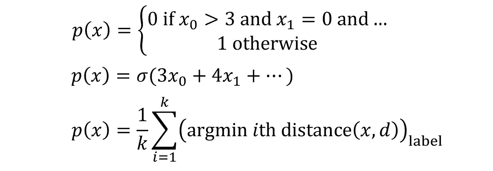
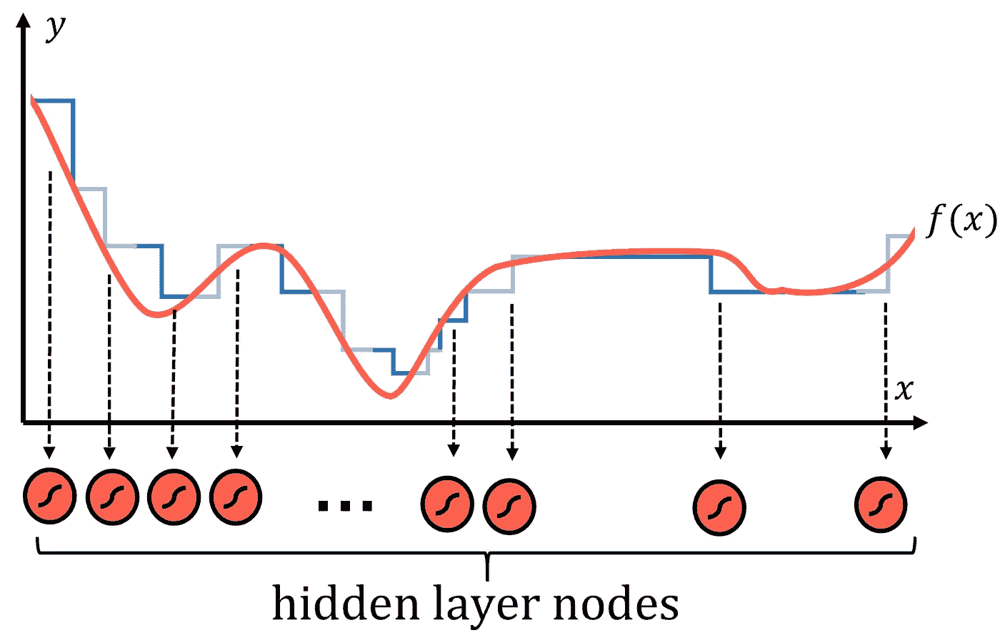

# 每个机器学习算法都可以表示为一个神经网络

> 原文：<https://towardsdatascience.com/every-machine-learning-algorithm-can-be-represented-as-a-neural-network-82dcdfb627e3?source=collection_archive---------13----------------------->

## 算法中的算法

似乎机器学习的所有工作——从 20 世纪 50 年代的早期研究开始——都是随着神经网络的创建而累积起来的。从逻辑回归到支持向量机，相继提出了一个又一个新的算法，但神经网络是算法中的算法，是机器学习的巅峰。这是对机器学习的普遍概括，而不是一次尝试。

从这个意义上说，它更像是一个框架和概念，而不仅仅是一个算法，这一点很明显，因为在构建神经网络时有很大的自由度——隐藏层和节点数、激活函数、优化器、损失函数、网络类型(卷积、递归等)。)，以及专业层(批次定额、退学等)。)，不一而足。

从神经网络是一个概念而不是一个严格的算法的角度来看，可以得出一个非常有趣的推论:任何机器学习算法，无论是决策树还是 k 近邻算法，都可以用神经网络来表示。虽然直觉上可以用几个例子来理解这一点，但这种说法可以用数学来证明。

让我们首先定义什么是神经网络:它是由输入层、隐藏层和输出层组成的体系结构，每层的节点之间有连接。信息通过线性变换(权重和偏差)以及非线性变换(激活函数)从输入层转换到输出层。有一些方法来更新模型的可训练参数，以便…

逻辑回归简单地定义为标准回归，每个输入都有乘法系数，并添加了一个额外的截距，所有这些都通过一个 sigmoid 函数。这可以通过没有隐藏层的神经网络来建模；结果是通过一个 sigmoid 输出神经元的多重回归。

通过用线性激活函数替换输出神经元激活函数，可以对线性回归进行同样的建模(它只是映射输出 *f* ( *x* ) *= x，*换句话说，它不做任何事情)。

支持向量机(SVM)算法试图利用所谓的“核技巧”将数据投影到新的空间中，从而优化数据的线性可分性。在数据被转换后，该算法绘制出沿着类边界最好地分离数据的超平面。超平面被简单地定义为现有维度的线性组合，很像二维中的一条线和三维中的一个平面。从这个意义上说，人们可以把 SVM 算法看作是把数据投影到一个新的空间，然后进行多元回归。神经网络的输出可以通过某种有界输出函数来实现概率输出。

当然，可能需要实施一些限制，例如限制节点之间的连接和固定某些参数——当然，这些变化不会损害“神经网络”标签的完整性。也许需要添加更多的层来确保支持向量机的这种表示能够像真实交易一样执行。

像决策树算法这样的基于树的算法要稍微复杂一些。如何构建这种神经网络的答案在于分析它如何划分其特征空间。当一个训练点遍历一系列分裂节点时，特征空间被分裂成若干超立方体；在二维示例中，垂直线和水平线创建了正方形。

来源:DataCamp 社区。图片免费分享。

因此，沿着这些线分割特征空间的类似方式可以用更严格的激活来模拟，如阶跃函数，其中输入是一个值或另一个值，本质上是分隔线。权重和偏差可能需要实现值限制，因此仅用于通过拉伸、收缩和定位来定向分割线。为了获得概率结果，结果可以通过激活函数传递。

虽然算法的神经网络表示和实际算法之间存在许多技术差异，但关键是网络表达了相同的思想，并且可以用与实际算法相同的策略和性能来处理问题。

但是，也许您不满足于将算法粗略地转换成神经网络形式，或者希望看到对 k-最近邻或朴素贝叶斯等更复杂的算法的普遍应用，而不是基于具体情况。答案在于通用逼近定理——这是神经网络取得巨大成功背后的数学解释——本质上是说，足够大的神经网络可以以任意精度模拟任何函数。说有某个函数 *f* ( *x* )表示数据；对于每个数据点( *x* ， *y* )， *f* ( *x* )总是返回一个等于或非常接近于 *y* 的值。

建模的目标是找到这个代表性的或基本事实函数 *f* ( *x* )，我们将它表示为 *p* ( *x* )用于预测。所有机器学习算法处理这项任务的方式都非常不同，将不同的假设视为有效，并给出它们的最佳结果， *p* ( *x* )作为结果。如果有人要写出算法接近创建 *p* ( *x* )的方式，你可能会得到从条件列表到纯数学运算的任何东西。描述函数如何将目标映射到输入的函数实际上可以采用任何形式。

有时，这些功能会起作用。其他时候，它们没有——它们有固定数量的参数，使用它们是一个要么接受要么放弃的问题。不过，神经网络在寻找 *f* ( *x* )的方式上略有不同。

任何函数都可以用许多类似台阶的部分来合理地近似，台阶越多，近似就越精确。

这些步骤中的每一个都在神经网络中表示为具有 sigmoid 激活函数的隐藏层中的节点，sigmoid 激活函数本质上是概率阶跃函数。本质上，每个节点被“分配”给功能的一部分， *f* ( *x* )。然后，通过权重和偏置系统，网络可以确定节点的存在，如果神经元应该为特定输入激活，则将 sigmoid 函数的输入吹向无穷大(输出为 1)，否则吹向负无穷大。这种委派节点来寻找数据函数的特定部分的模式不仅在数字数据中观察到，而且在图像中也观察到。

虽然通用近似定理已经扩展到适用于其他激活函数，如 ReLU 和神经网络类型，但该原理仍然成立:神经网络是为了完美而创建的。神经网络不再依赖于复杂的数学方程和关系系统，而是将自己的一部分委托给数据函数的一部分，并在指定的区域内强力记忆概括。当这些节点聚合成一个巨大的神经网络时，结果是一个看似智能的模型，而实际上它们是巧妙设计的近似器。

鉴于神经网络至少在理论上可以构建一个基本上和你想要的一样精确的函数(节点越多，逼近就越精确，当然不考虑过拟合的技术细节)，具有正确结构的神经网络可以模拟任何其他算法的预测函数*p*(*x*)*。这一点对于其他任何机器学习算法都不能说。*

*神经网络使用的方法不是优化现有模型中的几个参数，如多项式曲线或节点系统。神经网络是数据建模的一个特定视角，它不寻求充分利用任何独立系统，而是直接逼近数据函数；我们如此熟悉的神经网络架构仅仅是一个想法的模型表现。*

*随着神经网络的力量和对深度学习这一无底洞领域的不断研究，数据——无论是视频、声音、流行病学数据还是二者之间的任何数据——都将能够以前所未有的程度进行建模。神经网络确实是算法中的算法。*

> *除非另有说明，所有图片均由作者创作。*