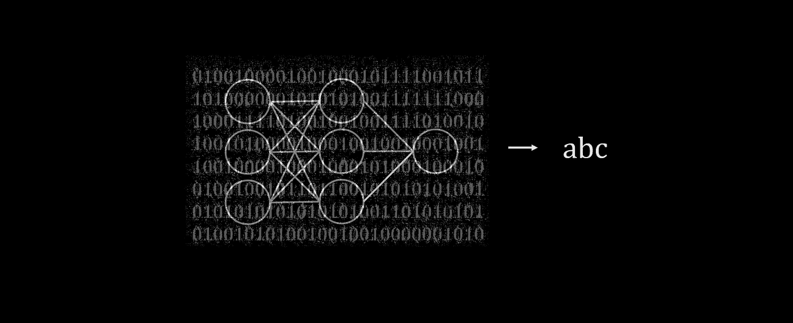
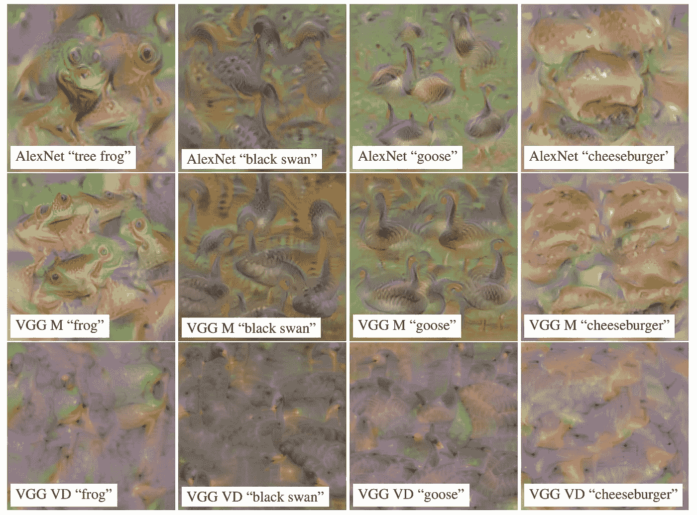
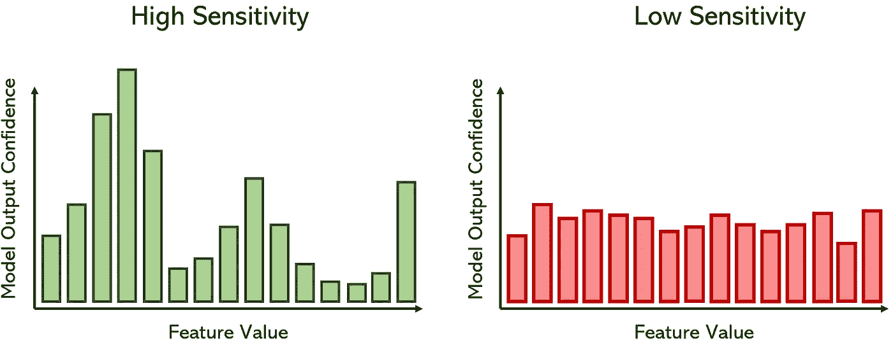
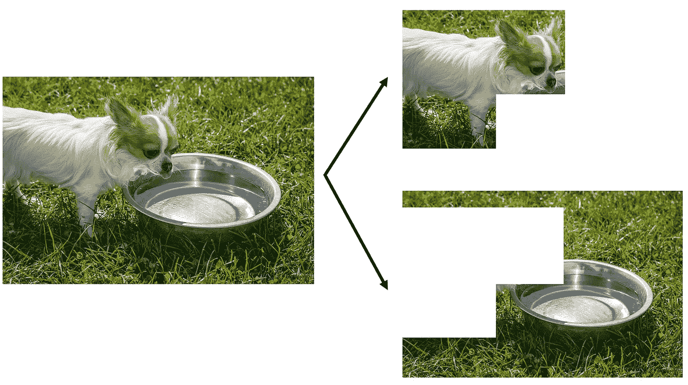
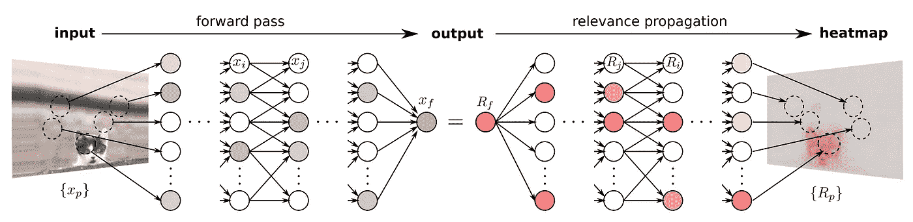
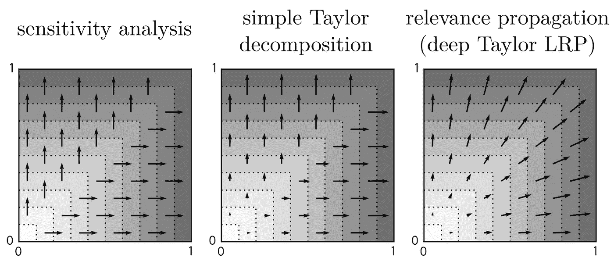

# 神经网络可解释性基础

> 原文：<https://towardsdatascience.com/every-ml-engineer-needs-to-know-neural-network-interpretability-afea2ac0824e?source=collection_archive---------21----------------------->

作者创建的图像

## 激活最大化、灵敏度分析等

神经网络是机器学习的巅峰:它们可以通过将极其复杂的功能与同样复杂的结构进行匹配来建模。充满了非线性和信息传播流，数据科学家的思维模式通常是“我们牺牲可解释性来获得能力。”的确——算法的黑盒性质已经被大多数人接受，但它不应该如此。

理解算法如何做出决策对于使用它们的应用程序来说至关重要。在世界各地的组织中，神经网络被用来决定某人是否应该获得贷款，他们是否有资格获得一份工作，甚至是否有人犯了罪——以“它在训练集上表现良好”的态度离开无法解释的算法来解决这些重要问题是危险和不道德的。

学习如何解释神经网络是每个深度学习工程师都应该学习的东西，但可悲的是大多数人都没有。通过能够解释这个强大的建模器，您将能够在数据中反映的严重问题变成更大的问题之前阻止它们，并获得人类可以理解的知识，比如肺癌的症状，这对于无法访问先进技术的应用程序和位置来说非常有价值。

神经网络的解释将人的因素带入了这种人工构造中。

本文将涵盖解释神经网络过程的三种方法和评估解释质量的一种方法。

## 激活最大化

激活最大化是一种可视化神经网络的方法，旨在最大化某些神经元的激活。在正常训练期间，人们将迭代地调整网络的权重和偏差，使得神经网络的误差或损失在数据集中的训练示例之间最小化。另一方面，激活最大化颠倒了这一点:在分类器被训练之后，我们想要迭代地找到模型认为属于一个类的数据部分。

例如，考虑识别从 0 到 9 的手写数字(MNIST 数据集)的神经网络的可视化:我们想要看到神经网络认为图像的哪些部分对于它决定哪个数字是重要的；也许是 8 的底圈或者 0 的洞。

网络的激活函数输出表示一个训练样本属于一个特定类的置信度，因此激活最大化构建了一个图像，该图像检查神经网络正在寻找的每一个框，从而产生最大的激活函数。这是通过梯度*上升*完成的，它试图最大化输出神经元。激活最大化的思想实际上就是找到返回最高置信度输出的输入。

各种 ImageNet 类别的 AlexNet、VGG M 和 VGG VD 模型的激活最大化图像。来源:[马亨德兰等人](https://arxiv.org/pdf/1512.02017.pdf)图片免费使用。

这些结果对于模型如何决策是一个非常有启发性的观点；较暗的区域表示“惩罚”,因为该区域中的较高值使得模型不太确定输入是那个数字，而较亮的值表示“奖励”,因为这些区域中的较高值增加了输出神经元的置信度。激活最大化也可以以一维非图像数据的分布或另一种分布表示的形式被可视化。

## 敏感性分析

敏感性分析是一种分析模型预测梯度的方法。如果神经网络由函数 *f* ( *x* )建模，其中 *x* 是表示输入值的变量( *x* [ *1* ] *，x* [ *2* ] *，…，x* [ *n* )， 然后灵敏度定义为 *f* ( *x* )相对于 *x* [ *i* ]的导数，其中 *x* [ *i* 是我们要建模的特征。 通俗地说，敏感性分析衡量一个特征的变化如何在模型对某个目标的置信度中产生相应的机会，或者模型对某个特征的敏感程度。

这项技术不仅适用于深度神经网络的解释——它在金融和医学领域有着强大的根基。

那么，问题是“是什么让这幅图像或多或少像一艘船？”而不是“是什么让这幅图像成为一辆车？”这可以通过例如激活最大化来回答。它可以被认为是特性重要性的度量，但更重要的是它向*展示了*改变特性的值如何影响输出置信度，而不是告诉我们这是真的。

由作者创建

## 层相关性传播

尽管先前讨论的测量仅利用神经网络模型的输入/输出流，并且因此可以被应用于分析任何算法的决策，但是相关性传播被明确地设计用于深度神经网络的前馈图结构。

假设我们有一张狗的图像，神经网络正在对它进行分类，但我们不确定它是否正确地识别了狗，或者使用水碗作为上下文线索。因此，我们可以将图像分成两部分，并分别通过神经网络进行处理；如果其中一只狗被归类为狗，而水盘不是，那么我们知道这个模型可以推广到其他狗的图像。

由作者创建

另一方面，如果两个图像都被分类为狗，则很少获得关于模型在完整图像的两个部分上放置的权重的信息。线索 LRP:分层相关性传播。

LRP 的目标是为输入向量 *d* 的每个元素定义相关性度量 *R* [ *d* ]，使得神经网络的输出是 *R* 的值的总和。换句话说，LRP 试图将神经网络发现的复杂关系压缩成加法问题；在戏剧性的信息浓缩中，每个输入元素(特征)的 *R* 的值既可解释又有价值。

为了执行这种分解，总相关性分数(相当于输出)开始集中在输出中。然后，本着反向传播的精神，相关性分数被分解并分布在各个节点中，穿过神经网络的每一层，直到它到达输入层。

来源:[蒙塔冯等人](https://arxiv.org/pdf/1512.02479.pdf)图片免费分享

输入层的相关性分数然后可以用热图或一些其他介质来可视化；当这些分数相加时，产生与结果相同的结果，但是在对结果的贡献中，告诉了很多关于一个输入节点的值如何在神经网络结构中传播的信息。

这类似于一个电路，某人在一个端点注入一定量的电流，并在其他端点评估随后的电流；电流较高的端点在电力如何在整个系统中分配方面具有更大的优先权和“重要性”。

这种独特的神经网络解释方法依赖于局部相关性守恒原理，该原理认为这种分解是可能的，因为网络中的信息可以保持固定，就像适用于电流的基尔霍夫守恒定律一样。

## 解释连续性

有多种方法可以解释神经网络的黑盒性质，每种方法都依赖于自己的直觉和展开结构的方法，但量化解释的质量也很重要。如果不能给出准确的解释，一个花哨的解释技巧是没有价值的。

解释连续性植根于公平性度量，并指出如果两个数据点几乎相等，那么对它们预测的解释也应该几乎相等。

虽然这似乎是显而易见的，但解释连续性是一个比人们想象的更棘手的问题。例如，考虑对函数`max(x1, x2)`的解释，该函数简单地基于较大的值设置坐标标签。三种解释方法:敏感性分析、简单泰勒分解(另一种寻找相关性分数的方法)和相关性传播都对函数有不同的解释。

来源:[蒙塔冯等人](https://arxiv.org/pdf/1706.07979.pdf)。图片免费分享。

只有相关性传播解释在`x1 = x2`处是连续的，并且产生平滑的、基于循环的解释过渡，这与灵敏度和简单的泰勒分解结果相反，在泰勒分解结果中，在`x1 = x2`线上移动点 0.001 会产生完全不同的解释。

如果一个解释是高质量的，稍微改变输入，比如移动框架，旋转它，或者添加一些噪声，不应该改变结果的解释。否则，解释技术可能无法正确理解输入产生输出的原因。

# 感谢阅读！

如果你对最新的文章感兴趣，可以考虑[订阅](https://andre-ye.medium.com/subscribe)。如果你想支持我的写作，通过我的推荐链接加入 Medium 是一个很好的方式。干杯！

> 除非另有说明，否则图片由作者创作。

 [## 每个机器学习算法都可以表示为一个神经网络

### 算法中的算法

towardsdatascience.com](/every-machine-learning-algorithm-can-be-represented-as-a-neural-network-82dcdfb627e3)  [## 机器学习算法比你想象的要脆弱得多

### 为什么恶意输入会起作用以及如何防止它们

towardsdatascience.com](/machine-learning-algorithms-are-much-more-fragile-than-you-think-25fdb3939fee)