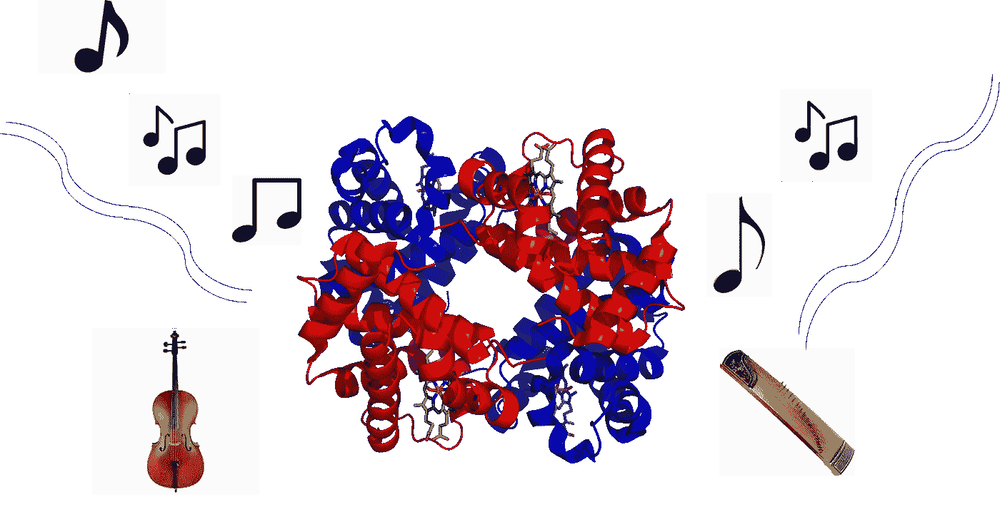
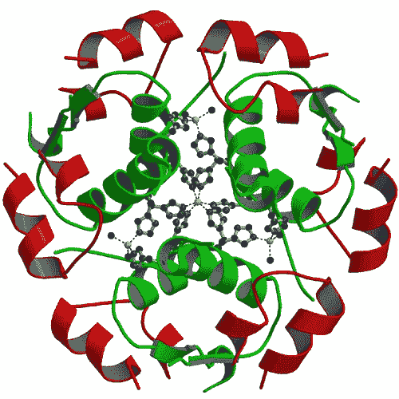
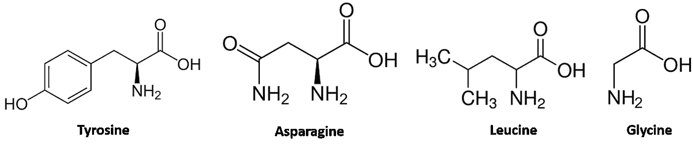
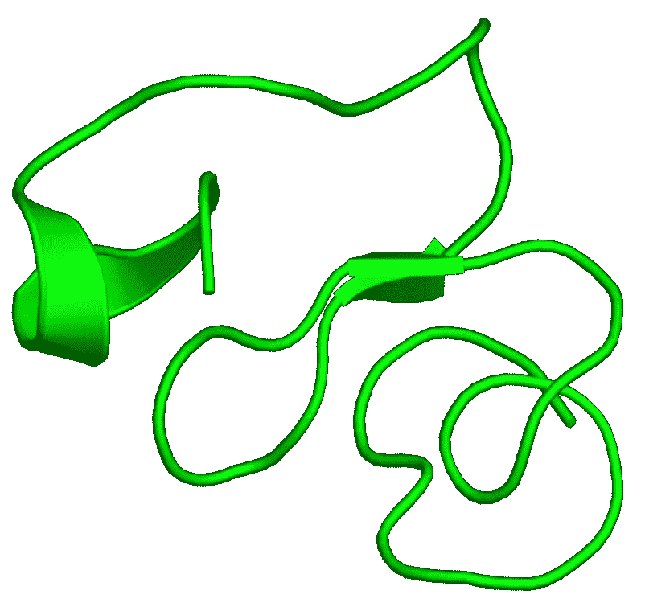
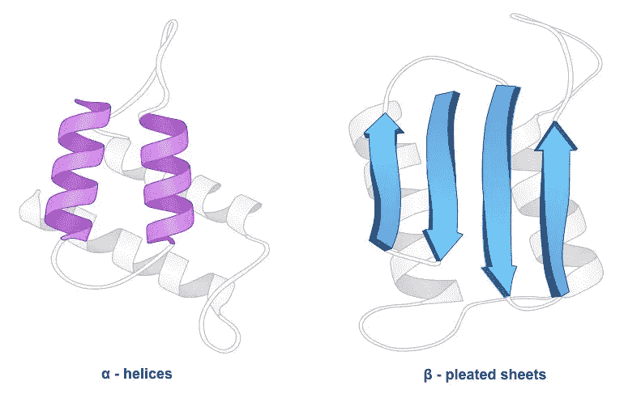
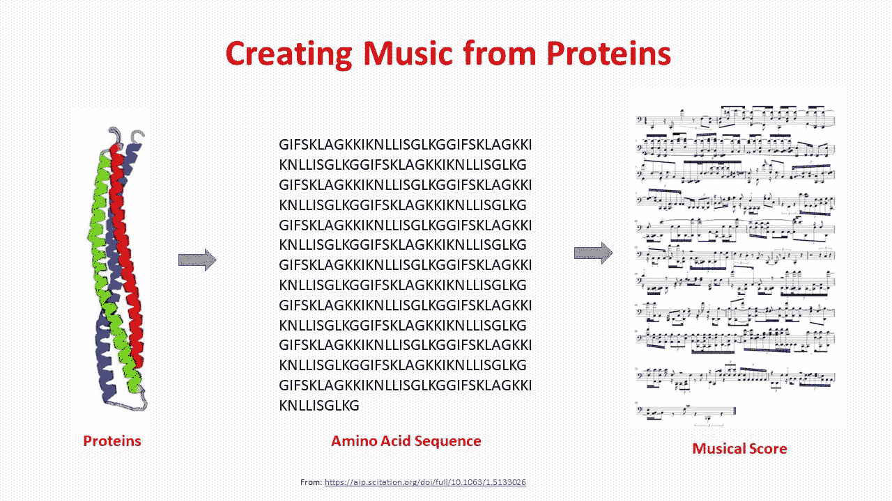
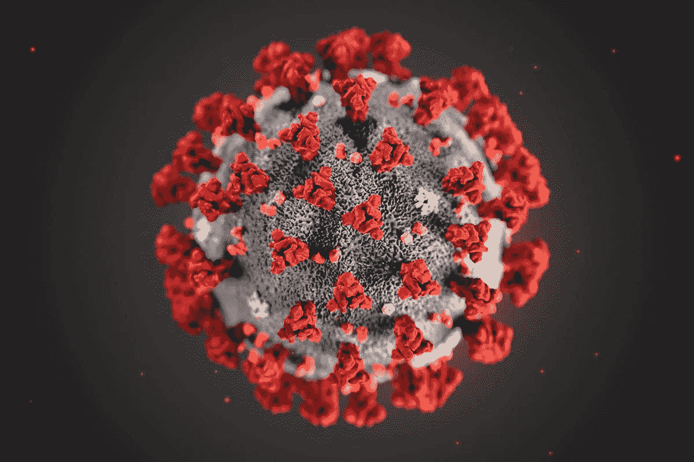
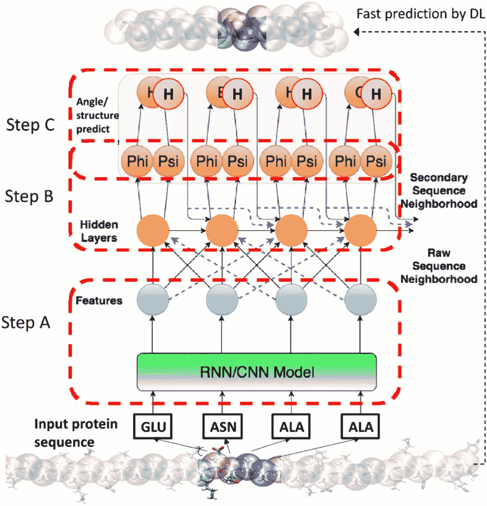

# 每一种蛋白质都是一首歌

> 原文：<https://towardsdatascience.com/every-protein-is-a-song-6d30ee9addd4?source=collection_archive---------28----------------------->

将蛋白质转化成音乐可能是一种创造新药和抗体的新方法

## 利用音乐设计药物和抗体的全新方法。

虽然不明显，但音乐和蛋白质之间有许多相似之处。

音乐是由一组音符组成的——通常不超过七个。蛋白质是由二十种氨基酸组成的。

像音乐一样，这些分子从有限的词汇中讲述深刻而令人印象深刻的故事。

我们现在知道，蛋白质中的氨基酸序列不是随机打乱或混乱的。更确切地说，它们似乎是由许多长弦组成的，这些长弦相互重复、相互扭打——就像交响乐的乐章一样。

不仅仅是蛋白质——DNA、RNA 和自然界中的许多其他分子都与音乐有着有趣的结构相似性。

事实上，原子和分子尺度的生物学似乎是由一位音乐家写的。

也许正是这种洞察力驱使像麻省理工学院的 T2·马库斯·布勒教授这样的科学家用蛋白质创作音乐。

虽然这看起来像是把一个比喻延伸得太远了，但他的工作是一种革命性的设计药物和抗体的新方法，同时揭示了自然界的蛋白质奥秘。

# 结构就是意义

胰岛素分子的结构。1951 年，它成为第一个被完全测序的蛋白质。来自欧洲的蛋白质数据库。

大多数生物是由蛋白质构成的。

头发是一种蛋白质。指甲、蚕丝、牛奶、蜘蛛网、皮肤、蛋清、荷尔蒙、眼球也是。

肌肉是蛋白质。这就是为什么有抱负的健美运动员消耗大量的乳清蛋白粉。事实上，我们知道的最大的蛋白质之一——*肌红蛋白*——是一种肌肉蛋白质。27000 个氨基酸组成一个肌联蛋白分子。移动一根肌肉纤维需要数百万个肌联蛋白分子。

身体的每一部分——无论是结构性的(指甲、头发、皮肤)还是功能性的(荷尔蒙、酶)——都有一些蛋白质在创造奇迹。

因此，蛋白质化学非常复杂。我们仍在学习它们是如何工作的。

我们所知道的是，所有的蛋白质都是由一些被称为氨基酸的精选分子组装而成的。

它们有相当好听的名字，如胱氨酸、甘氨酸、亮氨酸、丝氨酸、脯氨酸等。它们的共同点是一个“胺基”——一个简单的三个氮原子和两个氢原子(-NH2)——从它们的骨架结构中伸出来。试着看看你是否能找出下面分子中的胺基。

一些氨基酸的化学结构。请注意它们中的氨基。

为了制造蛋白质，氨基酸按照特定的顺序排列和连接。

例如， **5xdi** 是一种小的抗真菌蛋白，发现于一种名为牛罗勒的开花杂草中。

5xdi 只有 40 个氨基酸:

**fqcgrgaggarcsnglccsqfgycgstpycgacqgqsqc**

每个字母代表一种氨基酸。该序列定义了 5xdi。改变一个氨基酸——用 A 代替中间的 C——它就不再是 5xdi 了。

如你所见，蛋白质对拼写的准确性要求非常严格。

但是，这个序列只是 5xdi 的起点。

原来氨基酸并不总是合得来。这些分子中有些相互吸引，有些相互排斥。这些力使分子卷曲扭曲，直到它变得像下面的东西一样复杂。

蛋白质 5xdi 的三维结构。来自欧洲[蛋白质数据库](https://www.ebi.ac.uk/pdbe/entry/pdb/5xdi/analysis)

在蛋白质的世界里，结构就是意义。

分子中的一个弯曲可以决定一种蛋白质是否会结合到某种细胞上，或者它是否会成为一种有效的抗病毒抗体。

许多蛋白质是螺旋状的。一些形成长片。

蛋白质的二级结构。许多蛋白质形成螺旋或折叠

这不是魔法——事实证明，这些形状很好地平衡了吸引力和排斥力，足以让整个分子陷入微妙的稳定状态。

因此，蛋白质符合不同的结构层次。

底部是氨基酸序列。这就是所谓的***初级结构*** 。

这一系列的扭曲和盘绕——也许会变成螺旋状或片状。这是 ***的二级结构*** 。

螺旋或薄片可以进一步卷曲和折叠。这是 ***三级结构*** 。

许多蛋白质显示出更高水平的组织。但是你明白了:蛋白质被严重扭曲了！

一个真正复杂的蛋白质分子可以被认为是一堆杂乱的绳子——如果这些绳子是由氨基酸连接起来并通过量子化学扭曲而成的。

如果你认为这很复杂，它就是！

即使在今天，蛋白质结构的确定也是一项艰巨的任务。我们可能已经掌握了某一特定蛋白质的完整氨基酸序列，但仍然无法知道它的实际三维形状。

# 将蛋白质转化成音乐

蛋白质的三维结构通过一个叫做发音的过程被编码成音乐

正是蛋白质的分层结构让我们想起了音乐。

氨基酸就是音符。

二级结构——螺旋的线圈或平面——让我们想起节奏和音高。

挑战在于开发一个将蛋白质结构转化为声音的正式过程。

Markus Buehler 尝试了几种不同的方法将氨基酸转化为声音。

一种方法是捕捉分子振动的基本模式。

根据量子力学，分子可以被认为是一个有许多缠绕弦的仪器。就像任何弦乐器一样，它们往往有特定的振动频率。通过将这些转换成音频，我们可以真正听到氨基酸。

然而，第二种方法要简单得多。

有二十种氨基酸。为什么我们不把这些映射到一个确定的音阶中，比如多里安音阶？

关键是将每个氨基酸与音阶中的特定音符联系起来。你可以根据分子的大小或基本振动来排列分子，并将其带到天平上。

结果是每种氨基酸都有独特的音符。蛋白质的基本氨基酸序列现在已经成为一组随时间随意流动的音符。

下一步是捕捉二级结构。我们能让这些音符听起来像是螺旋盘绕的吗？或者可以把它们做成类似于一张纸的平面吗？

如果一种氨基酸位于曲线上，它们产生的音符会变得*更短*和*更响*。结合邻近氨基酸的影响，这给了声音一种紧迫感，让人想起掉进隧道或冲过过山车的感觉。

同样，所有复杂的结构成分都被映射成独特的声音。

把这些加在一起，你会发现——整个蛋白质都被翻译成了音乐！

选择演奏这些音符的乐器确实是一种艺术选择。马库斯倾向于在他的作品中经常使用吉他、大提琴、古筝、贝斯、打击乐器和长笛。

这个过程——将蛋白质结构忠实地翻译成音乐——被称为**发音**。

其中我最喜欢的是一种叫做 **4osd** 的病毒蛋白的发音。它由包括古筝、小提琴、大提琴、长笛和低音提琴在内的乐器合奏而成。音乐长 43 分钟(是大蛋白)。

虽然我不太确定这种蛋白质有什么作用，但我向你保证，这听起来很棒:

病毒蛋白 4osd 的超声处理。麻省理工学院马库斯·J·布勒

最奇怪的也许是他最近对冠状病毒刺突蛋白的研究。

冠状病毒的数字表示，显示其尖峰(红色)。从疾控中心/科学数据库。

冠状病毒得名于其外壳中伸出的刺突状蛋白质。这种病毒是致命的，但它的尖刺能奏出优雅的古典音乐:

由冠状病毒的刺突蛋白制成的音乐。麻省理工学院马库斯·J·布勒

氨基酸音符在日本古筝上演奏。许多其他工具提供公司和更高层次的结构信息。

这个上个月在网上疯传。据 [SoundCloud](https://soundcloud.com/user-275864738) 统计，至今已有 88.8 万人播放过这首音乐。

最后，听听这个:

你在这首曲子中听到的是一种新的蛋白质设计的音乐实现，这是来自不同病毒的蛋白质通过机器学习挤在一起，并自我组装成新形式的结果。这是一次进入新世界的旅程，在那里不同物种的蛋白质相互作用和重组，每一个都贡献出来自他们各自生命语言的模式和思想。

**用人工智能创造音乐(和蛋白质)**

使用复合神经网络，蛋白质结构可以转换成音乐。麻省理工学院马库斯·伯勒

马库斯最近更进一步。

首先，他教会了一个神经网络如何制作蛋白质音乐。

这些网络是人脑的数学抽象。他们从提供给他们的例子中学习做事——没有任何具体的指示。

这些方法可以将蛋白质结构快速转化为音乐，Markus 已经建立了一个超过 10，000 首蛋白质歌曲的数据库。

他已经听了很多遍，以至于他说他可以通过它的旋律来识别一种蛋白质。他可以通过声音辨别蛋白质是螺旋还是折叠。

第二，他使神经网络能够对音乐进行微小的改变。

神经网络现在可以在这里或那里改变一个音符。当翻译回氨基酸序列时，这就产生了一种略有变化的蛋白质。

网络能够在有约束的情况下工作。例如，他可以坚持认为蛋白质是螺旋。这种新蛋白质是它原来的突变体，但它将符合螺旋结构。

他成功地创造了新的蛋白质——以前从未在自然界发现过。

下一步是将这些蛋白质与其特性相匹配。例如，神经网络能否预测一种螺旋蛋白，它将像头发一样强壮，但颜色是绿色的？

它能合成一种对抗病毒感染的新药吗？

他指出，这种方法可能使我们能够找到冠状病毒刺突上另一种蛋白质容易附着的地方。我们或许还能让另一种蛋白质与音乐相匹配，这种蛋白质会像钥匙上的锁一样粘在这些尖峰上。

如果是这样的话，这将是使病毒变得无能的第一步。

最近，一家年轻的初创公司开始提供将个人基因信息转换成音乐的服务——只收取少量费用。 [GenM](http://thegenm.com/) 软件( *Music about you* )将获取任何生物信息，并将其调整为音乐。

你可以选择歌词和音调。想听鲍勃·马利或果阿·特兰斯的生活密码吗？搞定了。

但从根本上说，这是两种看似不相关的语言的结合——一种用氨基酸的语言书写，另一种用音符拼写。

它强调了自然界万物的终极统一。

与此同时，世界等待着来自蛋白质之歌的发现。