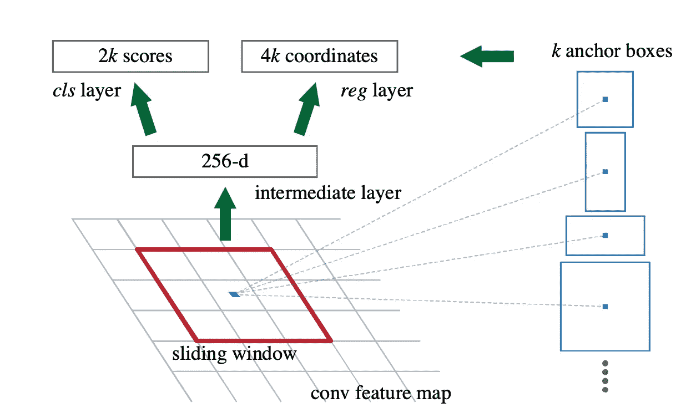
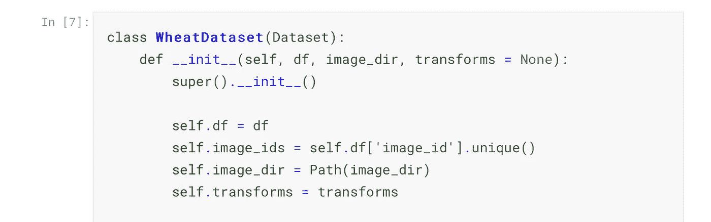

# PyTorch 关于 Fasterrcnn 的一切

> 原文：<https://towardsdatascience.com/everything-about-fasterrcnn-6d758f5a6d79?source=collection_archive---------9----------------------->

## 了解如何在 PyTorch 中实现 Fasterrcnn 并提取每幅图像的特征图

照片由[乔纳森派](https://unsplash.com/@r3dmax?utm_source=unsplash&utm_medium=referral&utm_content=creditCopyText)在 [Unsplash](https://unsplash.com/s/photos/scenery?utm_source=unsplash&utm_medium=referral&utm_content=creditCopyText)

## 介绍

目标检测是计算机视觉中的一项任务，我们试图对图像中存在的目标进行分类，而不是对图像进行分类。它有各种各样的应用，如检测空闲的停车位，跟踪闭路电视镜头中的物体，以及监控作物，这就是我们将要讨论的内容。

有许多方法来执行对象检测；Fasterrcnn 只是其中之一。许多其他技术，如 YOLO 和 SSD，同样工作良好。你应该了解 Fasterrcnn 的原因是，它在许多比赛中给出了最先进的结果，并在 Pinterest 应用程序等实际应用中使用。

本文简要介绍了 Fasterrcnn、与之相关的概念及其在 PyTorch 中的实现。

## 建筑:

Fasterrcnn 的架构如下所示:

来源:https://arxiv.org/abs/1506.01497

该网络首先从图像中提取特征。体系结构的这一部分被称为网络的主干。可以使用任何标准的图像分类架构。我们将使用带有[特征金字塔网络](https://arxiv.org/abs/1612.03144)的 ResNet50 作为我们的主干。

在第二步中， ***区域提议网络*** 用于生成可能包含对象的区域。与过去的方法相比，这个网络是一个真正的提升，比如在整个图像上滑动一个窗口来寻找潜在的区域，正如你可以想象的那样，这是一个非常缓慢和计算昂贵的过程。

在这个网络中，相对于过去的方法的另一个改进是使用锚盒来检测各种比例和纵横比的图像。

来源:[https://arxiv.org/abs/1506.01497](https://arxiv.org/abs/1506.01497)

最后，从体系结构中可以看出，相同的特征图用于检测区域和分类。重用特征地图的想法非常聪明，你会看到很多架构都在这么做。采取的功能图，并附上多个头部，它的多项任务。

现在让我们用 PyTorch 实现一个 Fasterrcnn，并在此过程中理解更多的术语。

## 在 PyTorch 中实现 Fasterrcnn

Kaggle 最近举办了一场识别麦穗的比赛。我用这次比赛的数据训练了一个模型。

数据以 csv 及其相应图像的形式提供。我们有左下角的坐标，也有每个盒子的宽度和高度。

如果我们打印边界框的类型，我们会看到它们是字符串类型，而不是我们所期望的列表。[这个错误很常见，可以使用](https://www.linkedin.com/posts/dvasani_python-oneabrssabrpython-activity-6673000959301455872-R0Ny)来解决。为了方便使用，我们还将边界框分成了四列。

我们现在创建一个定制的**小麦数据集。**faster CNN 期望我们的数据以图像和与之对应的字典的形式出现。字典至少应该包括边界框和标签。

我们用数据框和存放图像的文件夹初始化数据集。我们在 __getitem__()函数中完成剩余的计算。

我们将盒子从(x0，y0，w，h)格式转换为(x0，y0，x1，y1)格式。我们把我们的标签分配给所有的 1，因为在这个问题中我们只有一个类(我们用 1 作为我们的标签，因为在 PyTorch 中，0 代表背景。).最后，我们把所有东西都转换成 PyTorch 张量。

我们还定义了 __len__()函数，因为 PyTorch 数据加载器使用它来迭代我们的数据集。

> Pro 提示:如果你的数据在云上，不用下载到本地，可以直接拉图进行训练(考虑到这个过程不是超级慢)。这样，当您在线更新数据集(添加更多条目或对现有条目进行更改)时，您就不必更新本地副本。您只需要运行一个训练脚本，您的模型将根据新数据进行训练。

现在，我们可以从数据加载器中检索一个批处理，并可视化其中一个输入图像。

接下来，让我们定义我们的模型。我们正在为我们的 Fasterrcnn 使用带有功能金字塔网络的 ResNet50 主干网。主干很容易定制。我们需要传递的唯一参数是数据集中的类的数量。

在训练模式中，该模型将图像和目标字典作为输入，并产生 loss_dict 作为输出。

我们为 5 个时期训练我们的模型。然后，我们通过传递我们的图像来评估它，并获得一个边界框、标签及其各自分数的字典。然而，这不是最终的结果。如果我们看其中一个输出，

我们看到我们的模型为同一个对象生成了许多盒子。过滤掉不需要的盒子是我们的责任。这样做的一种技术叫做非最大抑制。

## 非最大抑制(NMS)

要在 PyTorch 中使用 NMS，我们可以简单地做

这一行代码给出了我们应该保留的所有边界框的索引。让我们来看看应用 NMS 后的相同图像。

看起来好多了，对吧？那么 NMS 是如何运作的呢？

要理解 NMS，我们首先需要理解 IoU(并集上的交集)。IoU 是衡量两个盒子相似程度的指标。IoU 越接近 1，方框越相似。记住这一点，让我们来看看 NMS 算法:

1.  根据分数(置信度)对所有边界框进行排序。
2.  选择可信度最高的框。该框将是输出的一部分。
3.  和其他箱子一起算欠条。
4.  将 IoU 超过阈值(本例中为 0.3)的框与所选框一起移除。这将删除包含相同对象或仅包含其一部分的所有重叠框。
5.  从左边的框中，选择下一个框(第二高的分数)并重复该过程。

这样做给了我们一个非常好的输出。我们可以尝试各种阈值，但 0.3 效果很好。

如果你也想提取特征图，你可以使用钩子来完成。查看内核中的相同内容。

这就是本文的全部内容。如果你想了解更多关于深度学习的知识，可以看看我在这方面的系列文章。

 [## 深度学习系列

### 我所有关于深度学习的文章的系统列表

medium.com](https://medium.com/@dipam44/deep-learning-series-30ad108fbe2b) 

## 参考资料:

[faster CNN 论文](https://arxiv.org/abs/1506.01497)

[特色金字塔网论文](https://arxiv.org/abs/1612.03144)

[PyTorch 启动器—快速启动](https://www.kaggle.com/pestipeti/pytorch-starter-fasterrcnn-train)

[非最大抑制](/non-maximum-suppression-nms-93ce178e177c)