# 关于用 Python 绘图的一切

> 原文：<https://towardsdatascience.com/everything-about-plotting-in-python-c12ccdc359bc?source=collection_archive---------28----------------------->

## 📚实践中的 Python

## 从 matplotlib 到 pandas.plot()


照片由 [h heyerlein](https://unsplash.com/@heyerlein?utm_source=unsplash&utm_medium=referral&utm_content=creditCopyText) 在 [Unsplash](https://unsplash.com/?utm_source=unsplash&utm_medium=referral&utm_content=creditCopyText) 上拍摄

***2020 年 11 月 4 日更新:*** *Seaborn 补充。*

atplotlib 是数据科学和许多科学绘图领域可视化的基石。然而，`*plt*` 函数看似简单，参数却让人应接不暇。根据底部显示的教程，我总结了一份 python 绘图格式:

```
import matplotlib as mpl
import matplotlib.pyplot as pltplt.style.use('seaborn')
mpl.rcParams['font.family'] = 'serif'
%matplotlib inline #1\. create a figure,like canvas
fig = plt.figure() #2\. add plots inside that figure you just created
ax = fig.add_subplot(111) 
#3\. set all the parameters for the plot inside that ax 
ax.set(xlim=[0.5, 4.5], ylim=[-2, 8], title='An Example Axes',
       ylabel='Y-Axis', xlabel='X-Axis')#4\. do the plotting
ax.plot(x,y)
plt.show()
```

您可以使用以下方法节省一行代码:

```
fig, axes = plt.subplots(ncols=2, figsize=plt.figaspect(1./2))
```

使用 ***轴*** 代替`***plt***`的好处不仅是使整个过程更像“客观绘图”，每个`***ax***`代表一个图形，而且使每个`ax`/图形的迭代更容易，如:

```
fig, axes = plt.subplots(nrows=2, ncols=2)
axes[0,0].set(title='Upper Left')
axes[0,1].set(title='Upper Right')
axes[1,0].set(title='Lower Left')
axes[1,1].set(title='Lower Right')

*# To iterate over all items in a multidimensional numpy array, use the `flat` attribute*
**for** ax **in** axes.flat:
    *# Remove all xticks and yticks...*
    ax.set(xticks=[], yticks=[])

plt.show()
```

`Figure`是这个层次结构中的顶级容器。它是整个窗口/页面，所有的东西都画在上面。您可以有多个独立的图形，并且`Figure` s 可以包含多个`Axes`。

大多数绘图发生在`Axes`上。轴实际上是我们绘制数据的区域，以及与之相关的任何记号/标签等。通常，我们将通过调用`subplot`来设置一个轴(它将轴放置在一个规则的网格上)，所以在大多数情况下，`Axes`和`Subplot`是同义的。

每个`Axes`都有一个`XAxis`和一个`YAxis`。这些包括`ticks`、刻度位置、标签等。在本教程中，我们将主要通过其他机制来控制分笔成交点、分笔成交点标签和数据限制，因此我们不会过多地触及事物的单个`Axis`部分。不过这里值得一提的是解释一下`Axes`这个术语的来源。

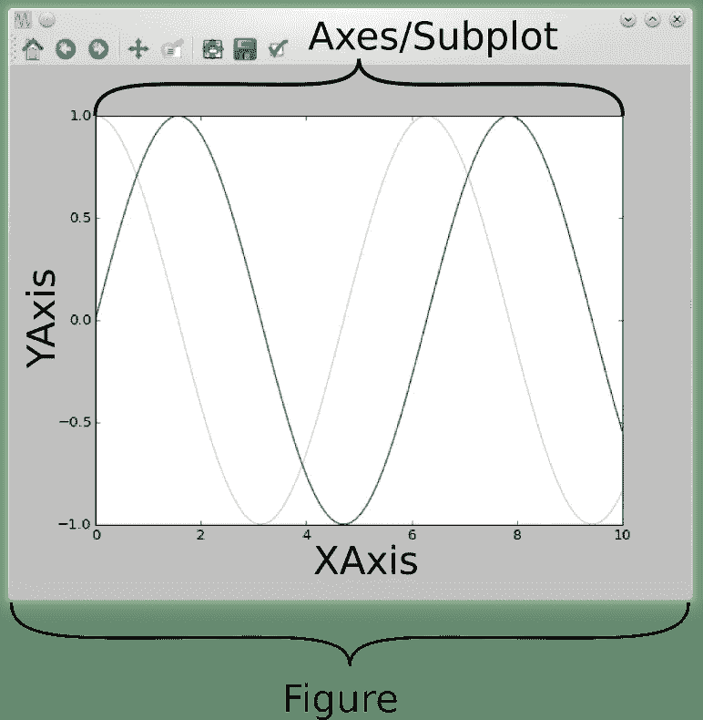

[Matplotlib 图的剖析](https://nbviewer.jupyter.org/github/matplotlib/AnatomyOfMatplotlib/tree/master)

我最喜欢的 python 导师科里·斯查费的 Matplotlib 最佳视频教程之一。

# 熊猫情节

至于熊猫的剧情功能，一切都打包在一个功能里:

```
pandas.DataFrame.plot()
```

该函数中有几个非常有用的参数，例如:

```
pd.DataFrame.plot(
                  ax = ax,
                  secondary_y="some_col",
                  subplots=True
                  )
```

`***ax***`允许您将绘图添加到当前绘图中；`***secondary_y***`在你的图的右边给你一个额外的轴，并设置`***subplots***`为真，就像`plt.subplots()`一样，这将给你每一列一个单独的图。

# 海生的

一旦你开始使用 Matplotlib 一段时间，很快你就会意识到 Matplotlib 有太多的参数和函数。我经常搞不清哪个参数属于哪个函数。另一次，我不记得参数的名称。

Seaborn 是 Matplotlib 之上的一个很好的包装器。除了美学优化，seaborn 还提供了一个解决方案，帮助用户以更简单的方式探索数据。

你可以直接使用 Seaborn

```
import seaborn as sns
```

默认设置对于日常数据可视化来说已经足够好了。如果你想对你的情节的风格和大小有一点额外的控制。最简单的方法就是一开始就设定好风格和语境。

```
sns.set(style="ticks", context='talk')
```

有五个预设的 seaborn 主题:`darkgrid`、`whitegrid`、`dark`、`white`和`ticks`。它们分别适合不同的应用和个人偏好。默认主题是`darkgrid`。四个预设上下文按照相对大小的顺序分别是`paper`、`notebook`、`talk`和`poster`。默认为`notebook`样式。顺便说一下，所有的参数都可以通过一个`set()`功能来设置。

```
sns.set({"xtick.major.size": 8, "ytick.major.size": 8},    style="ticks")
```

现在问题来了，我怎么知道那些参数是什么？

Seaborn 将所有复杂的参数归结为 2 组，只有 2 个函数需要记住。要控制风格，使用`[**axes_style()**](https://seaborn.pydata.org/generated/seaborn.axes_style.html#seaborn.axes_style)`和`[**set_style()**](https://seaborn.pydata.org/generated/seaborn.set_style.html#seaborn.set_style)`功能。要缩放图形，使用`[**plotting_context()**](https://seaborn.pydata.org/generated/seaborn.plotting_context.html#seaborn.plotting_context)`和`[**set_context()**](https://seaborn.pydata.org/generated/seaborn.set_context.html#seaborn.set_context)`功能。在这两种情况下，第一个函数返回一个参数字典，第二个函数设置 matplotlib 默认值。

```
sns.axes_style()
```

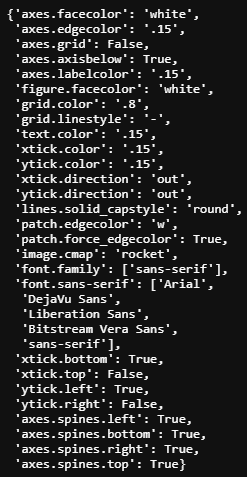

```
sns.plotting_context()
```

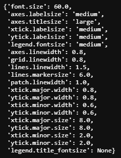

要设置任何参数，您只需简单地调用`set()`即可。例如，您可以一次性设置所有内容。

```
sns.set({'font.size': 60.0,
 'axes.labelsize': 'medium',
 'axes.titlesize': 'large',
 'xtick.labelsize': 'medium',
 'ytick.labelsize': 'medium',
 'legend.fontsize': 'medium',
 'axes.linewidth': 0.8,
 'grid.linewidth': 0.8,
 'lines.linewidth': 1.5,
 'lines.markersize': 6.0,
 'patch.linewidth': 1.0,
 'xtick.major.width': 0.8,
 'ytick.major.width': 0.8,
 'xtick.minor.width': 0.6,
 'ytick.minor.width': 0.6,
 'xtick.major.size': 8.0,
 'ytick.major.size': 8.0,
 'xtick.minor.size': 2.0,
 'ytick.minor.size': 2.0,
 'legend.title_fontsize': None})
```

基本上，大多数时候，你只需要改变预设的主题和背景。一旦完成数据探索，您可以使用`sns.set()`微调任何参数以满足您的要求。

这些就是你所需要了解的关于 Seaborn 的一切。我注意到一件事，它不在参数之内，是图形大小设置。简单的方法是在代码的开头声明一个图形画布，就像使用 matplotlib 一样。

```
fig, ax = plt.subplots(figsize=(18,9))
ax=sns.lineplot(data=data)
ax.set(title='title', ylabel='ylabel')
```

当然，强大的 set()函数可以接受所有订单:

```
sns.set(rc={'figure.figsize':(11,4)})
#or like this
sns.set({'figure.figsize':(20,8)})
```

请注意，如果你的数据是一个熊猫数据帧，Seaborn 将自动模仿你的数据帧结构，换句话说，你不需要担心标签和标题等。。

总之，你需要记住的只是 4 行代码

```
import seaborn as sns
sns.set(context='poster', style='ticks')
sns.axes_style()
sns.plotting_context()
```

我忘了说的一件事是颜色。默认调色板是

```
sns.color_palette()
```


对于离散变量，`‘Paired’`是一个很好的选项(记住大写 p)，

```
sns.color_palette('Paired')
```

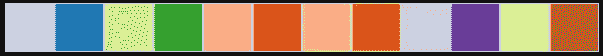

至于连续数据，`‘rocket’`还不错。

```
sns.color_palette('rocket')
```

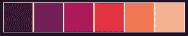

# 一会儿

警告:除非 ticklabels 已经被设置为一个字符串(通常是在*中的情况，例如*一个 boxplot)，否则这将不能用于任何比`1.1.0`新的 matplotlib 版本。

通常，您可以按照以下方式操作刻度标签:

```
import matplotlib.pyplot as pltfig, ax = plt.subplots()# We need to draw the canvas, otherwise the labels won't be positioned and 
# won't have values yet.
fig.canvas.draw()labels = [item.get_text() for item in ax.get_xticklabels()]
labels[1] = 'Testing'ax.set_xticklabels(labels)plt.show();
```

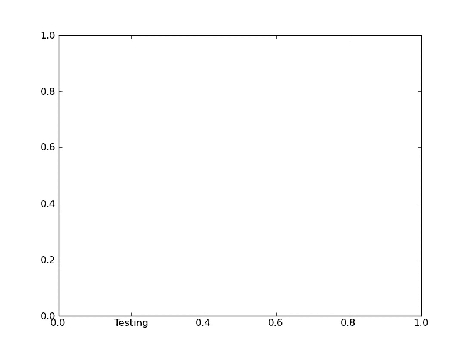

要理解为什么您需要经历这么多困难，您需要对 matplotlib 的结构有更多的了解。

Matplotlib 有意避免对记号等进行“静态”定位，除非明确要求这样做。假设您想要与图进行交互，因此图的边界、刻度、刻度标签等将动态变化。

因此，不能只设置给定刻度标签的文本。默认情况下，每次绘图时，axis 的定位器和格式化程序都会重置它。

然而，如果定位器和格式化器被设置为静态的(分别为`FixedLocator`和`FixedFormatter`，那么刻度标签保持不变。

这就是`set_*ticklabels`或`ax.*axis.set_ticklabels`所做的。

很多时候，你其实想做的只是注释某个位置。既然如此，那就去调查`annotate`吧。

我将介绍在 Matplotlib 中设置刻度标签字体大小的不同方法。它包括，

*   `plt.xticks(fontsize= )`
*   `ax.set_xticklabels(xlabels, fontsize= )`
*   `plt.setp(ax.get_xticklabels(), fontsize=)`
*   `ax.tick_params(axis='x', labelsize= )`

下面的代码示例将使用相同的数据集。

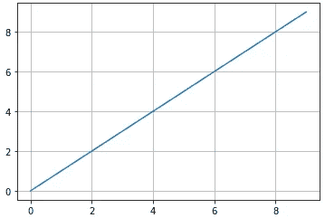

创建上图的代码是，

```
from matplotlib import pyplot as plt
xvalues = range(10)
yvalues = xvaluesfig,ax = plt.subplots()
plt.plot(xvalues, yvalues)
plt.grid(True)plt.show();
```

## plt.xticks(fontsize=)设置 Matplotlib 刻度标签的字体大小

```
from matplotlib import pyplot as plt
xvalues = range(10)
yvalues = xvaluesfig,ax = plt.subplots()
plt.plot(xvalues, yvalues)
plt.xticks(fontsize=16)
plt.grid(True)plt.show();
```

`plt.xticks`获取或设置 x 轴刻度位置和标签的属性。

`[fontsize](https://matplotlib.org/3.1.1/api/text_api.html#matplotlib.text.Text.set_fontsize)` [或](https://matplotlib.org/3.1.1/api/text_api.html#matplotlib.text.Text.set_fontsize) `[size](https://matplotlib.org/3.1.1/api/text_api.html#matplotlib.text.Text.set_fontsize)`是`Text`实例的属性，可以用来设置刻度标签的字体大小。

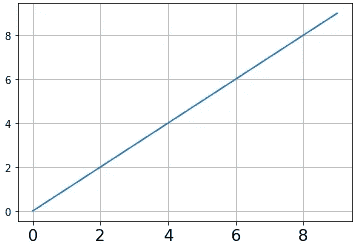

## ax.set_xticklabels(xlabels，Fontsize=)设置 Matplotlib 刻度标签的字体大小

`set_xticklabels`用字符串标签列表设置 x 刻度标签，用`Text`属性作为关键字参数。在这里，`fontsize`设置刻度标签的字体大小。

```
from matplotlib import pyplot as plt
import numpy as npxvalues = np.arange(10)
yvalues = xvaluesfig,ax = plt.subplots()
plt.plot(xvalues, yvalues)
plt.xticks(xvalues)
ax.set_xticklabels(xvalues, fontsize=16)
plt.grid(True)plt.show()
```

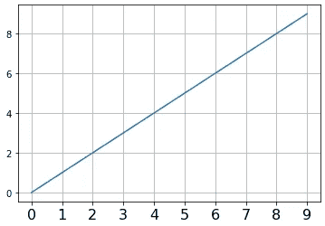

## plt.setp(ax.get_xticklabels()，Fontsize=)设置 Matplotlib 刻度标签的字体大小

`matplotlib.pyplot.setp`设置一个[艺术家对象](https://matplotlib.org/3.1.1/api/artist_api.html)的属性。`plt.setp(ax.get_xticklabels(), fontsize=)`设置 xtick labels 对象的`fontsize`属性。

```
from matplotlib import pyplot as plt
xvalues = np.arange(10)
yvalues = xvaluesfig,ax = plt.subplots()
plt.plot(xvalues, yvalues)
plt.setp(ax.get_xticklabels(), fontsize=16)plt.grid(True)plt.show()
```


## ax.tick_params(axis='x '，Labelsize=)设置 Matplotlib 刻度标签的字体大小

`tick_params`设置记号、记号标签和网格线的参数。

`ax.tick_params(axis='x', labelsize= )`设置`x`轴，也就是 X 轴的刻度标签的`labelsize`属性。

```
from matplotlib import pyplot as plt
xvalues = range(10)
yvalues = xvaluesfig,ax = plt.subplots()
plt.plot(xvalues, yvalues)
ax.tick_params(axis='x', labelsize=16)
plt.grid(True)plt.show()
```


# 颜色名称

*   蓝色
*   g:绿色
*   红色
*   c:青色
*   男:洋红色
*   y:黄色
*   凯西:黑色
*   w:白色的

但是，如何给 pandas/matplotlib 条形图自定义颜色呢？

我发现最简单的方法是使用`.plot()`中的`colormap`参数和一个预设的颜色渐变:

```
df.plot(kind='bar', stacked=True, colormap='Paired')
```

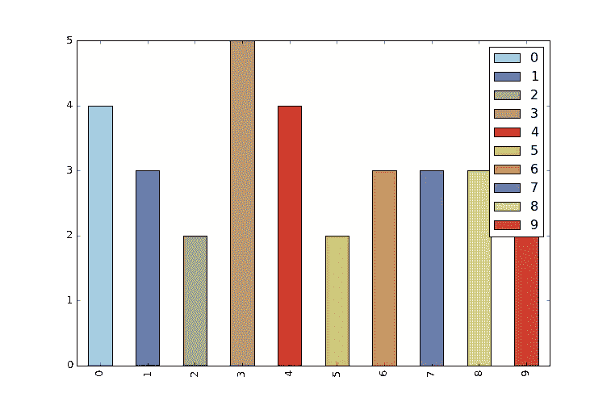

您可以在此找到一个大型[预设色彩映射表列表。](http://scipy.github.io/old-wiki/pages/Cookbook/Matplotlib/Show_colormaps)

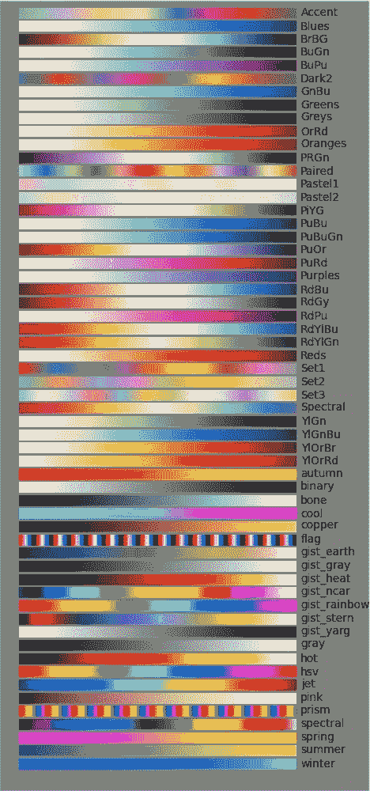

[来源](http://scipy.github.io/old-wiki/pages/Cookbook/Matplotlib/Show_colormaps)

# 标记

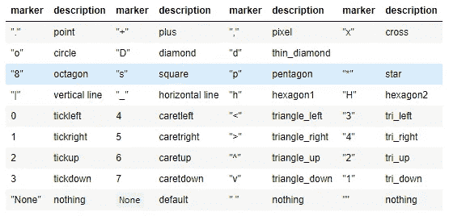

# 线型

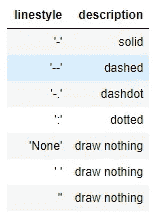

# 绘图属性

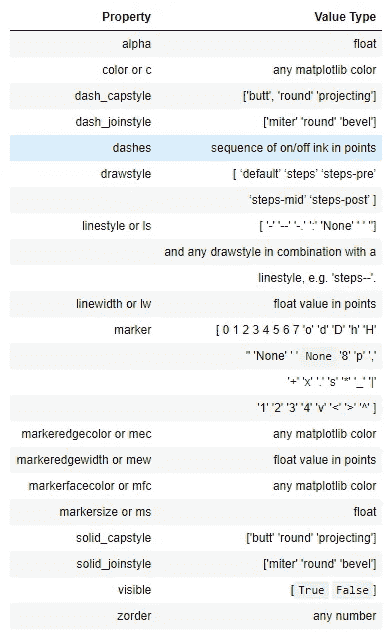

# 孵出

面片对象可以有为其定义的图案填充。

*   / —对角线阴影线
*   \ —后对角线
*   | —垂直
*   - —水平
*   + —交叉
*   x-交叉对角线
*   o-小圆圈
*   o-大圆(大写字母“o”)
*   。—圆点
*   * —星星

字母可以组合。

# 参考

1.  [解剖 Matplotlib](https://nbviewer.jupyter.org/github/matplotlib/AnatomyOfMatplotlib/tree/master) 最好的 Matplotlib 教程之一
2.  [定制剧情图例](https://jakevdp.github.io/PythonDataScienceHandbook/04.06-customizing-legends.html)摘自杰克·范德普拉斯的 [*Python 数据科学手册*](http://shop.oreilly.com/product/0636920034919.do)

***请查看我最近发表的文章:***

## *📈Python For Finance 系列*

1.  *[识别异常值](https://medium.com/python-in-plain-english/identifying-outliers-part-one-c0a31d9faefa)*
2.  *[识别异常值—第二部分](https://medium.com/better-programming/identifying-outliers-part-two-4c00b2523362)*
3.  *[识别异常值—第三部分](https://medium.com/swlh/identifying-outliers-part-three-257b09f5940b)*
4.  *[程式化的事实](/data-whispering-eebb77a422da)*
5.  *[特征工程&特征选择](https://medium.com/@kegui/feature-engineering-feature-selection-8c1d57af18d2)*
6.  *[数据转换](/data-transformation-e7b3b4268151)*
7.  *[细微差别特征](https://medium.com/swlh/fractionally-differentiated-features-9c1947ed2b55)*
8.  *[数据标签](/the-triple-barrier-method-251268419dcd)*
9.  *[元标签和堆叠](/meta-labeling-and-stacking-f17a7f9804ec)*