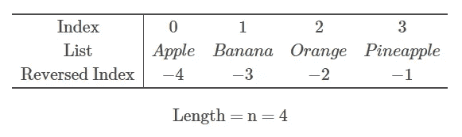

# 关于 Python 列表数据结构的一切:初学者指南

> 原文：<https://towardsdatascience.com/everything-about-python-list-data-structure-beginners-guide-pyshark-b956fb5f7a56?source=collection_archive---------60----------------------->

## 在本文中，我们将重点介绍 Python 列表数据结构的完整过程。


[https://unsplash.com/photos/eygpU6KfOBk](https://unsplash.com/photos/eygpU6KfOBk)

**目录:**

*   什么是 Python 列表？
*   如何创建 Python 列表
*   如何从 Python 列表中访问元素
*   如何分割 Python 列表
*   如何对 Python 列表进行排序
*   如何向 Python 列表添加项目
*   如何从 Python 列表中移除项目
*   如何更改 Python 列表中的项目
*   结论

# 什么是 Python 列表

Python 列表是一种序列数据类型，它允许我们在一个逗号分隔的数据实例中组合几个项目。列表可以包含相同或不同类型的数据，并且是可变的。这意味着我们可以在 Python 中改变列表对象的大小和内容。

# 如何创建 Python 列表

用 Python 创建列表非常简单。你需要把所有用逗号分隔的条目放入方括号中。请记住，您可以将不同的数据类型放在一起，例如整数、浮点、布尔甚至其他列表。这里有几个例子:

## 带有字符串元素的列表

我们应该得到:

```
['Apple', 'Banana', 'Orange', 'Pineapple']
```

## 带有整数元素的列表

我们应该得到:

```
[1, 2, 3, 4]
```

## 具有混合类型元素的列表

我们应该得到:

```
['Apple', 1, True, 2.4]
```

## 具有嵌套元素的列表

在上面的例子中，列表中的每一项只包含一个值。如果我们希望每个项目存储两个值呢？Python 列表也允许我们这样做！例如，您希望列出产品及其价格。您的数据如下:一个苹果的价格是 1 美元，一个香蕉的价格是 0.70 美元。为了给列表中的每个项目添加两个或更多的值，我们需要将它们放在方括号中，并用逗号分隔。它看起来像是一个嵌套的列表。

我们应该得到:

```
[['Apple', 1], ['Banana', 0.7]]
```

# 如何从 Python 列表中访问元素

Python 列表的一个重要且非常有用的属性是它是一个索引序列，这意味着对于一个有 **n** 个元素的列表，第一个元素的索引= 0，第二个元素的索引= 1，一直到 *n* -1。

## 使用索引访问列表中的元素

索引也可以反过来，这意味着第一个元素的索引= — *n* ，第二个元素的索引= — *n* +1，一直到-1。

为了便于展示，请看下面的视觉效果:



我们可以看到列表中的' Apple '元素有两个索引:0 和-4。

让我们用 Python 重新创建这个列表:

现在，我们想打印出列表中的第一个元素。从前面我们知道，它有两个索引:0 和-4，所以我们可以两个都尝试，看看输出是否相同。

我们应该得到:

```
AppleApple
```

在这两种情况下，输出是相同的。

## 在列表中查找元素

假设我们有以下字符串元素列表:

我们应该得到:

```
['Apple', 'Banana', 'Orange', 'Pineapple']
```

并且您想要查找“香蕉”元素的索引。

这可以通过使用**简单地找到。index()** 将某个值作为参数并在 Python 列表中查找其索引的方法:

我们应该得到:

```
1
```

我们很快发现“Banana”元素位于列表的索引 1。

# 如何分割 Python 列表

在前一节中，我们展示了如何使用精确的索引从 Python 列表中访问一个条目。在本节中，我们将展示当您想要访问某个范围内的项目时，例如，前两个或后两个项目，该如何操作。

回想一下，为了使用索引从列表中检索条目，我们将它放在方括号 **[]** 中。切片使用相同的方法，但是我们不是传递单个索引值，而是传递一个范围。Python 中的一个范围使用以下语法传递 **[** *从* **:** *到***。**

## **不指定 from 和 to 的切片**

**如果从到*到*你不放任何索引到*，默认情况下 python 会取整个列表。下面两行代码产生了相同的输出:***

**我们应该得到:**

```
['Apple', 'Banana', 'Orange', 'Pineapple']['Apple', 'Banana', 'Orange', 'Pineapple']
```

## **通过指定 from 进行切片**

**你可以通过从中指定*来分割一个列表，它将从你指定的索引中取出条目，直到列表结束。例如，您希望打印列表中的最后两项。请记住，您可以同时使用索引和反向索引。下面两行代码产生了相同的输出:***

**我们应该得到:**

```
['Orange', 'Pineapple']['Orange', 'Pineapple']
```

## **指定为的切片**

**你可以通过指定*到*来分割一个列表，它将从列表的开始直到你指定的索引项-1。例如，您希望打印列表中的前两项。请记住，您可以同时使用索引和反向索引。以下代码将产生所需的输出:**

**我们应该得到:**

```
['Apple', 'Banana']
```

**请注意，我们将*指定为* index = 2，需要记住的是，index = 3 实际上是第三个项目的位置。Python 中列表切片的工作方式是遍历条目，直到指定的*到*索引(在我们的例子中是 2)为止，并包括到该索引为止的所有条目，但不包括*到*索引下的条目。**

# **如何对 Python 列表进行排序**

**Python 中的列表有一个方法**。sort()** 它允许我们对列表中的项目进行排序。如果你的列表包含字符串，这个方法将按字母升序排序。如果你的列表包含数值(整数或浮点数)，它将按升序排序。请注意，如果你有一个列表会有多个数据类型，**。sort()** 方法不起作用，会产生错误。让我们来看几个例子:**

## **用字符串对列表进行排序**

**我们应该得到:**

```
['Apple', 'Banana', 'Orange', 'Pineapples']
```

## **用数值对列表进行排序**

**我们应该得到:**

```
[1, 2, 3, 4]
```

**在这两种情况下，我们都创建了无序列表，并在应用了**之后。sort()** 方法，当打印出列表时，它被排序。**

# **如何向 Python 列表添加项目**

**在本节中，我们将介绍如何向现有列表中添加新项目。有两个列表方法可以帮助我们:**。append()** 和**。插入()**。它们都可以向列表中添加新的条目，但是有一个主要的区别:**。append()** 通过“追加”的方式将项目添加到列表的末尾，而**。insert()** 允许我们在列表中选择一个特定的“位置”(索引)，新项目将被添加到这个位置。**

**让我们看一些例子:**

## **向列表追加项目**

**我们应该得到:**

```
['Apple', 'Banana', 'Orange', 'Pineapple', 'Mango']
```

**我们从我们的旧清单开始，有 4 个项目(水果)。现在我们想把“芒果”加入我们的清单。我们创建了一个变量 **new_item** 并为其赋值‘Mango’。然后我们把它添加到我们的主列表中，当我们把它打印出来时，我们会看到列表中的所有 5 个条目。**

## **将项目插入列表**

**与上述方法的根本区别在于，在这种情况下，我们能够在列表中选择我们想要插入新项目的确切位置。此列表方法具有以下语法:。**插入(** *索引* **，** *条目* **)** 。**

**例如，我们的新项目是“芒果”,我们希望将其添加到列表中的“苹果”之后。知道“苹果”项目的索引(位置)是 0，我们应该使用 index = 1 在它后面添加一个项目。**

**下面是将产生我们所期望的输出的代码:**

**我们应该得到:**

```
['Apple', 'Mango', 'Banana', 'Orange', 'Pineapple']
```

**完美！使用正确的索引将“芒果”添加/插入到“苹果”之后。**

# **如何从 Python 列表中移除项目**

**在本节中，我们将介绍如何从现有列表中删除新项目。有两个列表方法可以帮助我们做到这一点:**。拆下()**和**。pop()** 。它们都可以从列表中删除项目，但是有一个主要的区别:**。remove()** 删除您指定的项目(必须完全匹配)，而**。pop()** 允许我们在列表中选择一个特定的“位置”(索引)来删除你想要的项目。**

**让我们看一些例子:**

## **使用值从列表中移除项目**

**我们应该得到:**

```
['Apple', 'Orange', 'Pineapple']
```

**我们从我们的旧清单开始，有 4 个项目(水果)。现在我们想从列表中删除“香蕉”。我们创建一个变量**来移除**，并给它赋值“Banana”。然后我们将它从主列表中移除，当我们打印出来时，我们会看到剩余的 3 个项目。**

## **使用索引从列表中移除项目**

**与上述方法的不同之处在于，我们可以选择要从列表中删除的项目的确切位置，而不是指定项目的值。此列表方法具有以下语法:。**流行(** *指数* **)** 。例如，您想从列表中删除“香蕉”。知道‘Banana’项的索引(位置)是 1，我们应该使用 index = 1 将其从列表中删除。**

***索引*的默认值是-1，这意味着如果你不指定索引而只应用**。pop()** ，它将删除列表中的最后一项。**

**下面是将产生我们所期望的输出的代码:**

**我们应该得到:**

```
'Banana'
['Apple', 'Orange', 'Pineapple']
```

# **如何更改 Python 列表中的项目**

**在这一节中，我们将展示如何更改列表中的项目。例如，您有一个现有的项目列表，您想用一个新项目替换其中一个项目。我们怎么做呢？**

**在 Python 中，这真的很简单。我们所要做的就是在列表中指定一个我们想要改变的条目的索引，然后给它赋一个新的值。**

**回想一下我们的清单:苹果、香蕉、橘子、菠萝。现在，你想用甜瓜代替橘子(指数= 2)。下面是如何做到这一点:**

**我们应该得到:**

```
['Apple', 'Banana', 'Melon', 'Pineapple']
```

# **结论**

**这一项是对 [Python](https://www.python.org/) 中 list 方法的介绍性演练，学习这些方法很重要，因为它们在编程的许多领域和[机器学习](https://pyshark.com/category/machine-learning/)中使用。**

**如果你有任何问题或者对编辑有任何建议，请在下面留下你的评论。**

***原载于 2020 年 4 月 6 日 https://pyshark.com*[](https://pyshark.com/python-list-data-structure/)**。****