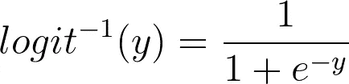

# 一切都是回归

> 原文：<https://towardsdatascience.com/everything-is-just-a-regression-5a3bf22c459c?source=collection_archive---------7----------------------->

## 寻找统计学的统一范例

## 序幕

我的记忆力很差。

在大学里，我的第一爱好是生物，但最终我对这些课程不感兴趣，因为它们强调记忆。我被数学作为一门学问所吸引，因为我不需要记忆任何东西。在数学中，要点是*我们如何知道某事*。如果你自己都不能证明一个结果，那你就是不懂。

出于某种原因，统计学仍然经常通过列出在各种情况下适用的测试来教授。复杂的流程图和更加具体的统计测试。

检验均值假设的统计流程图。

这导致了统计测试的混乱和误用。不过没关系，因为我有一些好消息。基本统计数据可以分为三个部分进行解释:

*   [采样](http://khannay.com/StatsBook/introduction-to-sampling-distributions.html)
*   [置信区间](http://khannay.com/StatsBook/confidence-intervals.html)
*   [回归](http://khannay.com/StatsBook/introduction-to-linear-regression.html)

对于有数据科学和/或机器学习背景的人来说，这是一个好消息。由于回归是大多数机器学习研究的起点，这意味着你已经在做统计假设检验了——也许你并不知道。在这篇文章中，我将通过给出一些如何从回归的角度考虑普通统计检验的例子来关注这一点的最后一步。

## 线性回归快速回顾

在线性回归中，我们为我们的特征 *x* 和我们的响应变量 *y.* 之间的关系建立一个线性模型

该模型是统计的，因为假设ε是随机的。

噪声项，假设正态分布在普通最小二乘法(OLS)中

这是一个数学模型。这是我们精确地指定我们对数据集的假设的一种方式。每当我们构建模型时，记住这句名言是很有用的:

> 所有的模型都是错的，但有些是有用的。—乔治·博克斯

模型是对现实世界复杂性的抽象和简化。因为它们是一种简化，所以它们总是错误的，但它们可能捕捉到一些重要的想法。

作为一个例子，让我们考虑一个从 1991 年到 2018 年的 NBA 选秀数据集(你可以从我的网站下载这个数据集)。我们可以看看选秀权和职业生涯场均得分之间的关系。这显示在下面的散点图中，以及数据的最佳拟合回归线。

对 1991 年至 2018 年的 737 名 NBA 选秀权和他们的职业生涯 PPG 平均水平进行线性回归。请注意，这些点是随机抖动的，以避免散点图上的重叠

这里的最佳拟合回归线由下式给出:

最佳拟合线性回归模型

线性回归的最佳拟合通常通过最小化残差平方项来找到。

N 个数据点的 LS 成本函数。

在这里，我不会深入探讨成本函数的实际最小化是如何工作的。可以说，使用线性代数中的一些技巧，我们可以很快找到这个成本函数的全局最小值。这给了我们一些最适合斜率和截距的参数。

## 分类变量回归

我们还可以对本质上是分类的特征进行回归。这里的诀窍是做一个所谓的 ***一个热编码*** 的分类变量。想法是将分类水平转换成指示变量(δ)。如果输入属于其指定电平，这些δ将为 1，否则为零。

例如，对于 NBA 选秀数据，让我们将选号列分为彩票选号(≤14)和非彩票选号(NL)。

然后我们可以寻找这两组球员平均每场得分的差异。

编码回归模型。如果不是彩票选号，δ为 0，否则为 1。

这是一张显示回归线的数据图。

现在，斜率项β给出了非彩票选号(x=0)和彩票选号(x=1)之间每场游戏的平均点数的差异。这里的轻微上升趋势表明，我们有一些证据表明，彩票选秀权往往在他们的职业生涯中平均得分更多。

当然，这种趋势是基于对玩家的随机抽样，所以如果我们收集新的样本，这种上升趋势可能会消失。为了说明随机采样引起的变化，我们可以为斜率形成一个**置信区间**。

对于上面的彩票选号示例，我们发现参数的 95%置信区间如下:

β ∈ (3.48, 4.78)

α ∈ (6.65,7.57)

这告诉我们，彩票选秀权减去非彩票选秀权的职业生涯 PPG 的平均差异可能在 3.48 到 4.78 之间。这让我们了解了影响方向(正面)和影响程度(3.5-4.8 分)。

我们可以看到这个斜率区间不包含零。这告诉我们，如果我们重新采样数据，我们不太可能看到这一趋势的逆转。如果我们将置信水平从 95%提高到 99%，我们将看到区间宽度会增加。为了减少错误，我们需要更大范围的值。

我们现在可以玩增大(100-p)%置信区间的游戏，直到区间在左侧刚好达到 0。这个值称为 *p 值*。

斜率为零的零假设的 p 值可以通过稳定地增加 CI 的宽度直到它接触零假设区域来找到。

> p 值给出 P(D|H₀)在假设零假设为真(即 H₀ : β=0)的情况下观察到数据的概率。

## 双样本 t 检验

在某些情况下，我们可能只关心效果的方向，而不关心效果的大小。这属于被称为*双样本 t 检验*的统计检验的范畴。在基础统计学课上，我们被教导使用双样本 t 检验来评估在两种条件下收集的数据，以寻找均值差异的证据。这是典型的控制组对实验组。

为了在 R 中执行这个测试，我首先要从我们相当大的草案数据集制作一个较小的数据集。下面的命令只是产生一个随机的 100 名玩家的子集，供我们比较。为了更好地衡量，我还在数据集中创建了一个彩票列。

为两个样本的 t 检验建立两组。使用种子，这样你就可以得到和我一样的值。

现在我们准备在 r 中运行 t 测试。

我们运行了一个双样本 t 检验来寻找 NBA 中彩票和非彩票选秀权之间的平均职业生涯得分的差异。

现在请注意我们结果中的 p 值。此处相对较小的值表明数据不太可能给出零假设。

现在让我们用一个分类特征来做线性回归。

在这里，我将展示我们简单的线性回归的 R 中的一个摘要命令的结果。

我已经强调了重要的一行。将此结果与我们使用双样本 t 检验发现的结果进行比较。*t 值(直到符号)和 p 值是相同的！*

此外，当我们查看 R 中的回归汇总时，请注意相同的 p 值在汇总的最后一行中重复出现。这是对我们整个回归模型进行的 [**F 检验**](https://en.wikipedia.org/wiki/F-test) 的结果。

这个测试告诉我们模型中的任何特征是否以统计上显著的方式偏离零。我们的课程，在这个简单的例子中，我们只有一个特征，因此模型的 f 检验和彩票特征的 t 检验是完全相同的。在多元回归(不止一个特征)中，这些将是不同的。

## 方差分析和多元回归

假设我们想评估球员的位置对他们职业生涯平均得分的影响。首先，我们应该清理数据集中 position 列的级别。

使用 R 中的 forcats 包来清理 Position(Pos)列的级别。这里我们将一些类别合并在一起，得到 C，F，G 作为位置。

然后，我们可以按职位绘制职位职业得分图:

nba 球员样本中位置对职业得分影响的箱线图。

我们可能想知道这些组的平均值是否真的不同，或者观察到的差异是否也可以用抽样误差来解释。在经典统计学中，我们会说我们想要进行*单向 ANOVA* (方差分析)。这可以在 R:

R 中的 ANOVA，注意 p 值在最右边给出 p=0.0813。

现在我们也可以把它看作回归。我们的回归模型具有以下形式:

alpha 截距值现在告诉我们中心的平均值，两个斜率告诉我们相对于中心值的点。

这些都是在 r 中完成的，输出如下:

将回归输出中的最后一行(f 检验)与 ANOVA 输出进行比较。我们再次看到相同的结果！

这告诉我们，单向方差分析只是一个具有分类特征的线性回归模型——具有两个以上的水平。使用的测试有一个无效假设，即所有的*斜率都为零。*

## 双向方差分析

在双向方差分析中，我们使用*两个*分类特征来预测一个连续的响应变量。

让我们使用 Tm(起草团队)和 Pos(职位)列对我们的草案数据集进行此操作。双向方差分析需要更多的数据来拟合模型，所以我们将使用完整的数据集，而不是我们的精简数据集。首先，我运行下面的两个命令来清理两个分类特征级别。

清理整个草稿数据集的团队和职位列。这些人使用了 forcats 软件包

在这种情况下，我们的线性模型采用以下形式:

第一个总和是虚拟编码团队变量，第二个总和是职位类别。所有这些都在 r 中很好地完成了。为了执行我们的分析，我们可以使用以下公式构建线性模型:

建立双向方差分析线性模型

这里唯一的变化是我们应该在我们的模型上使用 **anova()** 命令，而不是通常的 **summary()** 。这将显示以下结果:

这两条线告诉我们，我们有证据表明职位对职业积分很重要，但我们没有足够的证据得出团队很重要的结论。现在，您大概可以看到如何使用多元回归进行 N 向方差分析。

## 协方差分析

如果我们在回归中加入一个连续的特征，这就有了另一个名字(ANCOVA=协方差分析)。这里的动机可能是我们已经看到位置对 NBA 球员的 PPG 很重要，然而这可能只是因为一些位置比其他位置打更多的时间。

我们可以通过在我们的模型中包含这个特性来控制播放时间的效果。首先，我将重新调整上场时间列(MP ),使平均值为零，标准差设为 1。这样做的动机是，否则我们在线性模型中的截距是真的没用的——因为这会给一个场均 0 分钟的中锋带来职业生涯的 PPG。现在，截击将有一个平均每场比赛出场时间的中锋的平均 PPG 的解释。也许有点拗口，但更有意义。

缩放播放分钟数栏

这是一张每场比赛上场时间和得分之间的关系图，位置用颜色表示。

现在我们来建立线性模型:

这会产生以下结果:

第一行告诉我们，即使在控制上场时间后，这个位置对职业生涯 PPG 也有统计学上的显著影响。

## 比例和 GLMs

我们也可以把其他基本的统计程序表述为回归。然而，我们将需要利用所谓的*广义线性模型(GLM)* 走得更远。

首先，我将生成一个假数据集供我们使用。下面的命令创建了一个 R 数据帧，它存储了一场假想比赛的罚球结果和球员姓名，在这场比赛中，球员 A 和 B 各罚 100 次球。

玩家 B 只有 77%的命中率，玩家 A 只有 80%的命中率，虽然这是有抽样误差的。我们可以在 R:

在这里，我们可能要执行一个双样本比例测试，以检验两个玩家之间的百分比不同的假设。

这可以在 R 中使用 prop.test 命令来完成。

在 r 中运行双尾 prop 测试的结果。这里我们简单地使用两个比例相等的零假设进行测试。这也可以用相同的 p 值进行χ检验。

现在是回归方法。如上所述，由于我们的响应变量不再连续，我们需要调整我们的回归来处理二元输出。实际上，我们希望我们的模型能产生一个概率 pᵢ

这可以使用 [**逻辑回归**](/logistic-regression-detailed-overview-46c4da4303bc) 来完成。我们通常的回归采用以下形式:

在逻辑回归中，我们的输出 Yᵢ应该给出在给定 Xⱼ特征的情况下，Yᵢ取值 1 的概率。如前所述，我们有一个问题，上面模型的右边将产生ℝ=(-∞的值，∞)，而左边的*应该存在于[0，1]中。*

因此，要使用这样的模型，我们需要*将*我们的输出从[0，1]转换到整个实际ℝ.线 **logit** 函数对此很有用，因为它映射 logit: [0，1] → ℝ.

因此，如果将我们的输出视为由 logit 函数 Yᵢ=logit(pᵢ).产生，我们可以使用我们的多元回归技术这是逻辑回归的基本思想:

最后，我们可以反转 logit 函数来获得实际概率:

其中 logit⁻ : ℝ → [0，1]由下式给出:

逻辑回归是被称为**广义线性模型(GLM)** 的一系列技术中的一个例子。GLMs 包括线性预测函数α+ ∑ βⱼ Xᵢⱼ和将线性预测函数映射到响应变量的*链接函数* g()。

这在 r 中很容易做到。我们只需将 lm()函数改为 glm()，并指定我们想要使用的链接函数。

使用逻辑回归和模型比较进行双样本比例检验。请注意，p 值与上面的结果一致。

在上述情况下，我们实际上符合两个逻辑回归。第一个是我们实际想要建立的模型，第二个是两个样本比例检验的零假设的等价物。通过仅拟合截距(上面的~1)，我们说两个球员罚球的百分比必须相同。

然后，我们使用 anova()函数将我们的模型与零假设模型进行比较。我还指定方差分析应该使用 l [似然比检验(LRT)](https://en.wikipedia.org/wiki/Likelihood-ratio_test) 。当然，像往常一样，请注意 p 值与上面的比例测试相同。

此外，这个例子向我们展示了如何使用回归模型和 anova 命令来进行*模型选择*。实际上，我们一直在这么做，因为零假设一直是一个模型——我们只是以前没有在 anova 命令中指定它。这也向我们展示了如何开始将我们的模型与更复杂的空模型进行比较。

> 模型选择允许我们比较模型并超越琐碎的空模型。

## 为什么这很重要

一个数学模型的自然进程的超级奇妙的图表如下所示:

RIP 模型。让这成为你深度学习的一个警告！

当我们被迫承认统计测试是数学模型时，这就把假设推到了前沿。希望这能让我们在模型生命周期的前两个阶段停留得更久一点。同样，这意味着我们可以停止试图记忆一堆统计测试。

> 停止记忆，开始建立模型

如果你想继续了解这个话题，我强烈推荐你去看看乔纳斯·林德洛夫的网站。对于这方面的教科书，我[推荐《统计学再思考》](https://xcelab.net/rm/statistical-rethinking/)。对于基本的统计阅读，我喜欢[所有的统计](https://www.amazon.com/All-Statistics-Statistical-Inference-Springer/dp/1441923225)。对于一些更高级的回归分析，我推荐看一看 [Gelman 和 Hill](https://www.amazon.com/Analysis-Regression-Multilevel-Hierarchical-Models/dp/052168689X/ref=sr_1_1?crid=123S4MQDKXJO6&keywords=gelman+regression&qid=1578605925&sprefix=Gelman+regr%2Cstripbooks%2C179&sr=8-1) 。