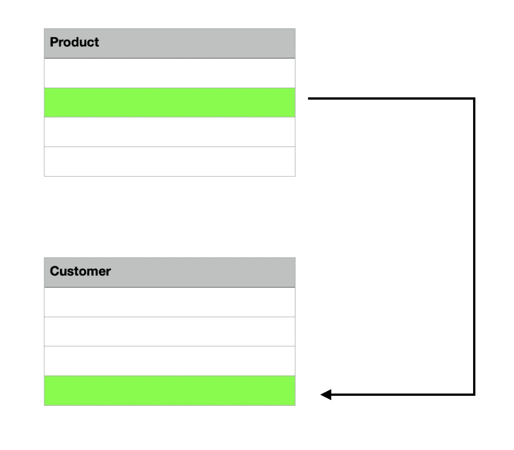

# 通过 TigerGraph 认证测试的所有知识

> 原文：<https://towardsdatascience.com/everything-to-know-to-pass-your-tigergraph-certification-test-6c3d313c0fce?source=collection_archive---------31----------------------->


Jon Herke 拍摄的照片

## 为什么每个数据科学家都应该获得认证，以及如何获得认证

# 什么是 TigerGraph，我为什么要获得认证？

被列为 Gartner 2019 年十大数据和分析趋势之一的图形技术是未来，允许用户对复杂的数据提出复杂的问题，TigerGraph 就是其中的一个例子。在这里，我们将介绍使用 TigerGraph 和学习图形技术所需的所有内容。如果你获得认证，你的可信度会增加，因此我强烈建议你试一试。此外，TigerGraph 是“企业唯一可扩展的图形数据库。”通过参加认证考试，你不仅会增加你的可信度，而且你还会学到一些几乎在任何地方都能帮到你的新东西。此外，参加考试是完全免费的，所以所需要的只是时间和愿意学习通过你的测试！

# 第一步:理论

你将看到的前四个模块由理论组成。什么是图形技术？你能说出一些流行版本之间的区别和它们不同的应用吗？

## 图形数据库和分析

一个图由通过**边**连接的**个顶点**(也称为节点)组成。所有的顶点和边组成一个**模式**。图表技术的强大之处在于数据是相互关联的，允许用户跨复杂的数据提出复杂的问题，而使用 SQL 有时是不可能的。节点和边可以有**属性**或属性，如年龄、位置、时间等。，它提供关于每个节点和边的细节；带有节点、顶点和属性的图称为**属性图**。


照片由 Shreya Chaudhary 拍摄。上面显示了一个基本的属性图和一个例子。每个顶点都与有向边或无向边(分别是一个箭头或一条线)相连，并且具有唯一的 primary_id。

通过搜索不同的实体，图可以被用作一个**参考网络**，这些实体具有多个共同的顶点，并且相距几个**跳**(或边)。你可以在日常生活中找到推荐网络，比如你推荐的 LinkedIn 联系人或推荐的医生。

属性图与**资源描述框架(RDF)图**形成对比，因为 RDF 上的每个节点都是**唯一资源标识符(URI)** ，它不能携带任何属性。它们有主语和宾语(节点)，用谓词(边)连接，但它们可能会变得冗长。


照片由 Shreya Chaudhary 拍摄。这是一个 RDF。请注意，属性是独立的节点，而不是节点的属性。


考试的时候一定要记住上面图表中的信息！

## 管理关系

接下来，我们将了解不同数据库存储关系的方法以及 graph 如何进行比较。**关系数据库**将每个实体存储在单独的表中，然后需要表连接来连接，这一操作可能需要几个小时，并且计算量很大。它可以用于索引和搜索一种类型的数据，并执行基本分析。关系数据库针对交易进行了优化，而不是深度分析。



照片由 Shreya Chaudhary 拍摄。这是一个在不同实体之间使用表连接的关系数据库的例子。

**图形数据库**，相比之下，是一个，单一的，预先连接的表。它们是为存储和分析关系而构建的自然存储模型。因为它的所有关系都是一级实体，针对深度分析优化的图形数据库往往比关系数据库快得多。

与 NoSQL 相比，图形数据库更适合深度分析。一个这样的例子是**键值**数据库，它将所有数据存储在一个表中。键值数据库允许数据灵活性和快速键查找，但它是低级的。**列族**是大规模的高效处理，但是对于事务和更新来说很慢。文档可以处理像 XML 和 JSON 这样的结构，但是它通常非常专业。所有这些都需要遍历和分析关系，对表进行多次扫描，这使得它不适合分析深层关系。最后，**图**有利于处理关系，是上述结构中唯一能很好管理关系的，但并不是所有的图都能提供大规模的实时速度。总的来说，虽然 NoSQL 图可以存储各种各样的数据，但图是处理关系和实体的最佳选择。


照片由 Shreya Chaudhary 拍摄。这显示了一个键值数据库，这是一个巨大的数据库，需要花费很多时间来迭代。

## 图的演变

目前有三种类型的图表:图表 1.0、图表 2.0 和图表 3.0。 **Graph 1.0** 使用单服务器和非并行架构的原生图形存储。 **Graph 2.0** 使用 NoSQL 基础进行存储扩展，并且可以支持两跳查询，但是它们不是为实时更新而设计的。**然而，Graph 3.0** 既是原生的又是并行的，支持超过十跳，运行跳和加载数据花费的时间更少。

由 TigerGraph 提供的图形 3.0(T1)支持 HTAP(混合事务和分析)。它还支持 OLTP 和 OLAP，具有实时性能，是一个事务图形，具有针对大规模数据集的可扩展性，可以使用深度链接多希望分析，易于开发和部署，并提供企业级安全性。TigerGraph 是世界上第一个本地并行和分布式图形，具有互操作性，与 MPP 并行，库中有许多图形算法，支持多重图形，使用 GSQL(类似于 SQL，便于转换)。图形工作室，一个图形用户界面，允许快速简单地创建图形和易于可视化。

## 数据科学能力

图形支持许多机器学习和数据科学算法。这是其中一些的演练。

**深度链接分析**支持查看三跳以上的数据。这可能会呈指数级增长。深度链接分析的一个例子是试图找到一个用户的欺诈历史。它不仅会查看浅层连接，还会查看深层连接，以检测用户的历史记录是否清晰。

**多维实体和模式匹配**将在图形中寻找模式。

**关系共性**寻找两个顶点的共同点，比如两个供应商的共同客户。

**中枢社区检测**搜索图中最有影响力的顶点，即边最多的顶点。这有助于发现社区中某个事物的相关性。

**地理空间图形分析**使用纬度和经度显示两个事物之间的距离。

**时态图分析**类似，但它着眼于实体和关系如何随时间变化。

**机器学习和可解释的 AI** 可以通过提取特征和使用 graph studio(GUI)为图表提供视觉帮助，供 graph 使用。

# 第二步:TigerGraph 云

要使用 TigerGraph Cloud，请前往[https://tgcloud.io/](https://tgcloud.io/)。登录，然后确保您对使用该资源感到满意。能够使用 GraphStudio 创建解决方案、上传数据、创建查询和构建图表。已经有几个很棒的关于这个的博客了，所以我在这里把它们链接起来。

这里有一个我推荐:[https://www . tiger graph . com/2020/01/20/taking-your-first-steps-in-learning-tiger graph-cloud/](https://www.tigergraph.com/2020/01/20/taking-your-first-steps-in-learning-tigergraph-cloud/)

# 第 3 步:选择语句

## 挑选

使用 Select 语句，可以从一组顶点遍历到另一组顶点。这是一般语法(必需的参数以粗体显示):

```
resultSet = **SELECT vSet FROM (edgeSet | vertexSet)** [whereClause] [accumClause] [havingClause] [orderClause] [limitClause] **;**
```

当运行这个命令时，算法从 FROM 开始，遍历所有其他子句来“过滤”或操作它们，然后 SELECT 返回所有合适的顶点。

以下是一个查询示例:

```
CREATE QUERY GetFriends(vertex<Users> inputUser) FOR GRAPH Social {
   Start = (inputUser);
   Friends = SELECT t FROM Start:s- (IsFriend:e)-User:t;
   PRINT Friends;
}
```

在示例中，s 是起始节点，e 是边，t 是目标或最终节点。

## 哪里和和

其中过滤掉不符合特定条件的顶点。可以使用 AND 语句连接这些条件。

```
CREATE QUERY GetFriends(vertex<Users> inputUser) FOR GRAPH Social {
   Start = (inputUser);
   Friends = SELECT t FROM Start:s- (IsFriend:e)-User:t
             WHERE e.connectDt BETWEEN to_datetime("2019-01-01")
             AND to_datetime("2020-01-01")
             AND t.gender == "F";
   PRINT Friends;
}
```

在本例中，它使用 connectDt 过滤 2019–01–01 和 2020–01–01 之间的所有边。接下来，它过滤掉所有性别属性为“F”的目标节点。最终，Friends 打印出 2019 年所有连接的女性朋友。

## 累加器

累加器可以是**本地**(用一个@表示)或**全局**(用两个@@表示)。局部累加器专用于每个顶点，全局累加器用于整个图形。

其次，累加器有更具体的类型:

1.  **suma ccum<int>存储所有通过的数字的累计。**
2.  **MaxAccum<int>存储通过的最大数。**
3.  **MinAccum < int >** 存储通过的最小数。
4.  **AvgAccum < int >** 存储所有传递的数字的移动平均值。
5.  **SetAccum < int >** 要求所有元素都是唯一的。
6.  **ListAccum < int >** 有一个按传入顺序排列的元素列表。
7.  **MapAccum < int，SumAccum < int > >** 使用键值对像映射一样存储数据。
8.  **HeapAccum<Tuple>**将数据按升序或降序存储在元组中。还可以设置容量限制；当达到限制时，它将删除最高值或最低值。

这里有两个例子。第一个具有一跳全局 MinAccum:

```
CREATE QUERY GetFriends(vertex<Users> inputUser) FOR GRAPH Social {
   MinAccum<uint> @@youngFriend;
   Start = (inputUser);
   Friends = SELECT t FROM Start:s- (IsFriend:e)-User:t
             WHERE e.connectDt BETWEEN to_datetime("2019-01-01")
             AND to_datetime("2020-01-01")
             AND t.gender == "F";
             ACCUM @@youngFriend += t.age;
   PRINT Friends;
}
```

第二个具有两跳本地 AvgAccums:

```
CREATE QUERY GetFriends(vertex<Users> inputUser) FOR GRAPH Social {
   AvgAccum @avgAge;
   Start = (inputUser);
   Friends1Hop = SELECT t FROM Start:s- (IsFriend:e)-:t;
   Friends2Hop = SELECT t 
                 FROM Friends1Hop:s- (IsFriend:e)-:t
                 ACCUM t.@avgAge += s.age;
   PRINT Friends2Hop;
}
```

## 累积后

POST-ACCUM 独立于 ACCUM 子句。他们可以访问起始顶点或目标顶点(s 或 t 别名)。如果是全局累加器，工作会排队，在离开 POST-ACCUM 子句后生效。

查看使用全局最大累加器和求和累加器进行规格化的示例:

```
CREATE QUERY GetFriends(vertex<Users> inputUser) FOR GRAPH Social {
   SumAccum<uint> @sumAge;
   SumAccum<float> @normCNum;
   MaxAccum<float> @@maxCNum;
   Start = (inputUser);
   Friends1Hop = SELECT t FROM Start:s- (IsFriend:e)-:t;
   Friends2Hop = SELECT t 
                 FROM Friends1Hop:s- (IsFriend:e)-:t
                 ACCUM t.@cNum += 1
                 POST-ACCUM @@maxCNum += t.@cNum;
   Friends2Hop = select s FROM Freinds2Hop:s
                 POST-ACCUM s.@normCNum += s.@cNum/@@maxCNum;
   PRINT Friends2Hop;
}
```

## 拥有

HAVING 子句是过滤数据的另一种方式。它类似于 WHERE 子句，但是 HAVING 子句只能访问选定的顶点和属性，而 WHERE 子句可以访问起始顶点和目标顶点。

```
CREATE QUERY GetFriends(vertex<Users> inputUser) FOR GRAPH Social {
   AvgAccum @avgAge;
   Start = (inputUser);
   Friends1Hop = SELECT t FROM Start:s- (IsFriend:e)-:t;
   Friends2Hop = SELECT t 
                 FROM Friends1Hop:s- (IsFriend:e)-:t
                 ACCUM t.@avgAge += s.age
                 HAVING t.@avgAge > 30;
   PRINT Friends2Hop;
}
```

## 排序依据和限制

最后，ORDER BY 可以对结果进行升序或降序排序。限制设置累加器中值的最大数量。

```
CREATE QUERY GetFriends(vertex<Users> inputUser) FOR GRAPH Social {
   AvgAccum @avgAge;
   Start = (inputUser);
   Friends1Hop = SELECT t FROM Start:s- (IsFriend:e)-:t;
   Friends2Hop = SELECT t 
                 FROM Friends1Hop:s- (IsFriend:e)-:t
                 ACCUM t.@avgAge += s.age
                 ORDER BY t.@avgAge ASC
                 LIMIT 2;
   PRINT Friends2Hop;
}
```

上面的例子将结果排序为升序，然后获取前两个，也就是最小的两个。

# 步骤 4: GSQL 演示

## 图表模式

对于模式中的每个顶点，您需要有一个主 ID。另外，对于每个顶点，你需要指定一个 FROM 和 to。请遵循以下语法:

```
CREATE VERTEX Test(PRIMARY_ID test_id STRING)
CREATE VERTEX Test2(PRIMARY_ID test2_id STRING)
CREATE DIRECTED EDGE TEST_TO_TEST2(FROM Test, To Test2)
CREATE UNDIRECTED EDGE TEST2_TO_TEST(FROM Test2, To Test)
```

## 加载数据

要加载数据，您需要定义一个加载作业。为此，您需要创建文件名变量并使用加载语句:

```
DEFINE FILENAME f1 = “/path”
LOAD f1 TO VERTEX person($”name”)
```

## 图形检查

对于本模块，您需要熟悉如何使用终端或控制台来检查图表。您可以使用以下选项选择要使用的图表:

```
use graph social
```

然后，您可以使用各种其他命令。列出的命令包括 from、to、directed、to、attributes、e_type。这里有一个例子:

```
SELECT * FROM person WHERE var=”Val”
```

## 基本 GSQL

您将创建的查询将返回 JSON。你也可以使用 curl 来运行这个图表。知道如何创建查询和结果。

```
CREATE QUERY name(VERTEX=person p) FOR GRAPH social;
Start = ()
Result = SELECT tgt from Start:src -{friendship x} -person-tgt
```

## 高级 GSQL

本模块回顾了**累加器**，如 OrAccum 和 AvgAccum 以及本地和全局累加器。这些是累积变量的不同方法。请记住，要创建全局变量，请使用两个@@，否则只需使用一个@符号。

## GSQL 中的深度查询

对于深度查询，模块检查了`khop`和`run query name(parameters)`。

# 其他来源

在本文中，我回顾了每个视频系列，并对每个视频系列进行了总结或描述。此外，考试中还有一些杂七杂八的题目，比如如何使用 gadmin。如果您有时间，我建议您也查看一下 TigerGraph 的文档。

**gad min**:[https://www . tiger graph . com/managing-tiger graph-servers-with-gad min/](https://www.tigergraph.com/managing-tigergraph-servers-with-gadmin/)

**TigerGraph 文档**:[https://www.tigergraph.com/tigergraph-docs-gsql-101/](https://www.tigergraph.com/tigergraph-docs-gsql-101/)

**视频系列原文链接**:[https://community . tiger graph . com/t/tiger graph-getting-started-guide/11](https://community.tigergraph.com/t/tigergraph-getting-started-guide/11)

# 你现在准备好了

这是 TigerGraph 认证考试的文本版本。现在，去[这里](https://community.tigergraph.com/t/tigergraph-getting-started-guide/11)获得认证并了解本文之外的更多内容。祝好运，学习愉快！