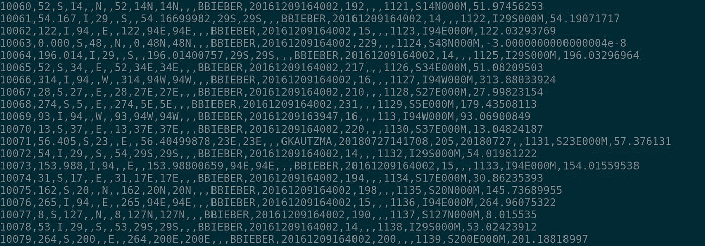

# 你不想知道的关于 CSV 的一切

> 原文：<https://towardsdatascience.com/everything-you-didnt-want-to-have-to-know-about-csv-665d0755e28?source=collection_archive---------33----------------------->

## 揭开 CSV 的神秘面纱，介绍使用 CSV 文件的工具和策略



CSV 是用于存储数据的更常见的文件格式之一，但是，它也充满了许多问题，这些问题会使使用它变得很痛苦。不像其他格式，如 [JSON](http://www.json.org/) ，CSV 不是形式化或标准化的。这意味着有些东西可能被称为 CSV，但不一定能被您正在使用的 CSV 解析器正确读取。

我希望这篇文章能让你更好地理解使用 CSV 文件的挑战，以及一些转换和分析 CSV 格式数据的方法。我假设你有一定程度的技术经验，但不一定是你写代码。

# 什么是 CSV？

[维基百科条目](https://en.wikipedia.org/wiki/Comma-separated_values)的第一句话提供了一个简单的(但已经有问题的)CSV 定义:

> *逗号分隔值(CSV)文件是使用逗号分隔值的分隔文本文件。CSV 文件以纯文本格式存储表格数据(数字和文本)。文件的每一行都是一条数据记录。每个记录由一个或多个字段组成，用逗号分隔。*

根据这个定义，CSV 文件看起来应该是这样的(本例中的第一行代表列标题):

```
id,name,title
1,Alex Wennerberg,Cloud Data Engineer
```

这看起来相对简单，但是很快，问题就出现了。比如一个值里面有逗号怎么办？您可以将该值封装在双引号中，但是如果引号字符也包含在该值中呢？如果用于描述记录的字符(即换行符)出现在数据中会怎样？如果您的文件使用逗号以外的字符来描述值，该怎么办？诸如此类。这些问题的答案通常是特定的，并且依赖于系统，因此，根据您正在处理的 CSV 数据的来源，您需要应用一组不同的规则来正确解释该数据。如果幸运的话，您的源代码系统会提供完整的文档。如果不是，那么您必须猜测和/或逆向工程您的 CSV 文件遵循的任何规则集。

CSV 从 20 世纪 70 年代就开始使用了，但是[没有标准化](https://en.wikipedia.org/wiki/Comma-separated_values#Specification)。最接近 CSV 标准的是 2005 年发布的 [RFC 4180](https://tools.ietf.org/html/rfc4180) 。虽然这可能是一个有用的参考，但不能保证您正在使用的系统称为“CSV”文件的文件遵循这个 RFC。比如[微软 Excel](https://answers.microsoft.com/en-us/msoffice/forum/all/why-excel-does-not-support-rfc-4180-standard-for/d0e379b1-ec3e-40d0-ad4f-33b20693c030) 明确没有。RFC 本身声明如下:

它没有规定任何类型的互联网标准。

[美国国会图书馆](https://www.loc.gov/preservation/digital/formats/fdd/fdd000323.shtml#notes)提供了一个更加“真实”的 CSV 定义，并描述了许多常见的偏差:

> *在使用逗号字符代替数字中的小数点的语言环境中，字段/列之间的分隔符通常是分号。*
> 
> *换行符可以是 CR 或 LF，不一定是 CRLF。*
> 
> *一些基于 Unix 的应用程序可能使用不同的转义机制来指示某个分隔符出现在文本值中。单个字符前面有一个反斜杠字符，而不是用双引号将整个字符串括起来。单引号可能被视为等同于转义的双引号(也称为“文本限定”)。其他几个警告值得注意:*
> 
> *文件中的最后一条记录可能以换行符结尾，也可能不以换行符结尾。*
> 
> *通过使用几种 c 样式字符转义序列中的一种，不可打印的字符可以包含在文本字段中:###或\ o # # # Octal\x##十六进制；\d###十进制；和\u#### Unicode。*
> 
> *对字段和记录分隔符附近空白的处理因应用程序而异。如果文本字段值开头和结尾的空格很重要，则文本字符串应该是文本限定的，即用引号括起来。*
> 
> *在某些应用中，存在强数据类型的假设，未加引号的字段被认为是数字，加引号的字段被认为是文本数据。*

我在实践中见过大部分或所有这些偏差。在某些情况下，工具会通过在记录之间拼接一个逗号来导出“CSV”，这很容易被打断(例如 [SQL Server 的“CSV”格式](https://www.sqlservercentral.com/editorials/comedy-limited-with-sql-server))。

如果您有兴趣进一步阅读，LOC 页面有很多其他的细节，但是我不建议您假设任何 CSV 数据都符合 RFC 4180，或者您正在与之交互的任何解析器都实现了 RFC 4180。您可能想要查看您正在使用的特定 CSV 编写器或解析器的文档，如果它存在的话，以了解那个单独的系统如何处理 CSV。一些系统将相对较好地处理 CSV，而其他系统可能会以不可预测的方式失败。

# CSV 工具

如果您正在处理 CSV 格式的数据，您可能希望转换您的 CSV 数据并将其加载到对 CSV 格式有不同期望的不同系统中。您可能还想从 CSV 加载数据，并对其执行转换和分析。这里有一些我觉得在处理 CSV 文件时有用的工具。这些工具中的大多数都假设您有一些使用命令行和从二进制或软件包仓库安装软件的经验。

[**xsv**](https://github.com/BurntSushi/xsv)

这个命令行工具是我执行大多数与 CSV 相关的任务的首选工具——它可靠且速度极快，如果您正在处理大文件(> 1GB ),它没有太大的竞争力。它可以做许多简单的操作，包括切片数据、排序数据、执行基本分析、重新格式化 CSV 数据、修复不匹配的行等。查看文档以获取更多信息。如果您正在对数据进行更复杂的分析或转换，xsv 可能不合适，您可能想看看下面的一些其他工具。

[T5【CSV kit】T6](https://csvkit.readthedocs.io/en/latest/)

另一个命令行工具，我在发现 XSV 之前使用 CSVkit。它起着类似的作用，但速度远不及前者。CSVkit 还有很多附加功能，例如在 CSV 和其他格式之间转换。如果你需要做一些 XSV 做不到的事情，或者如果你处理的文件比较小，性能不是很重要，那么这是一个很好的库。

[](https://www.sqlite.org/index.html)****(或其他关系数据库)****

**大多数关系数据库都能够从 CSV 导入或导出。对于在大型数据集上进行复杂分析，这是一个非常好的策略，性能相对较好。如果您已经熟悉 SQL，这也很容易。我推荐 SQLite 来做这样的分析，因为它不需要服务器，可以直接写到磁盘，甚至可以在内存中运行，但是您也可以使用您更熟悉的另一个关系数据库。**

**一个相对较新的工具是 [DuckDB](https://www.duckdb.org/) ，一个嵌入式列数据库，它也可以[读取 CSV](https://www.duckdb.org/docs/current/sql/copy.html)。我还没有使用过这个，但如果您正在为分析工作流寻找一个更高性能的嵌入式数据库，这可能是一个很好的选择！**

**[**熊猫**](https://pandas.pydata.org/)**

**如果您熟悉 Pandas(Python 数据操作和分析库),它可能是处理 CSV 数据的一种有用方式，但在大型(几 GB)数据集上可能会遇到性能问题，具体取决于您的计算机规格。数据科学家经常结合使用 Pandas 和 Jupyter 进行数据分析，这两种工具都有一个广泛的社区。Pandas 非常适合在从 CSV 加载数据后对其进行更复杂的转换和分析。你也可以将数据从 Pandas 导出为多种不同的格式。**

**[**big query**](https://cloud.google.com/bigquery/)**，** [**红移**](https://aws.amazon.com/redshift/) **，或者其他托管的柱状数据库****

**如果您正在处理非常大量的数据(数十或数百 GB)，您的计算机可能无法通过 SQLite 或 Pandas 处理本地运行的分析。您可能想要将您的 CSV 文件移动到[列数据库](https://en.wikipedia.org/wiki/Column-oriented_DBMS)中，这些托管工具让您不必担心设置数据库服务器。**

****用你选择的编程语言编写代码****

**如果你喜欢写代码，你的编程语言可能有一个 CSV 解析库。例如，我经常使用标准 Python 库的一部分 [Python](https://docs.python.org/3/library/csv.html) CSV 库。如果您正在处理大量数据并且对性能非常敏感，或者如果您想要执行上述工具无法处理的任务，这是一个有用的策略。在某些情况下，使用 Unix 工具如 [awk](https://www.gnu.org/software/gawk/manual/gawk.html) 或 [sed](https://www.gnu.org/software/sed/manual/sed.html) 可能对处理 CSV 有意义，但我通常会使用专门编写的命令行工具来处理 CSV。编写自己的代码对于修复格式错误的 CSV 可能特别有帮助，这样它就可以被不同的解析器读取。**

# **提示和技巧**

**我确信这一点是显而易见的，但是在几乎所有情况下，您都不希望通过简单地用逗号分割文件或用逗号连接一系列值来编写自己的 CSV 解析器。如果您正在编写代码，几乎可以肯定存在一个 CSV 解析库，它可以处理尽可能多的我们已经讨论过的问题。但是，在某些情况下，您可能希望查看您的语言的 CSV 解析器的细节，以便更彻底地理解“CSV”的确切含义。**

**如果您的 CSV 文件来自机器导出，请查看该系统的文档以了解它是如何导出 CSV 的。例如，Excel、MySQL、PostgreSQL 等都在如何格式化 CSV 文件方面做出不同的决定。您正在使用的另一个专有或遗留系统可能会做出不同的决策。看看你正在使用的系统是否记录了它的 CSV 格式。在某些情况下，可能不会。**

**注意数据类型。CSV 是非类型化的，不同的系统可能有不同的方式来区分整数(1)和字符串(例如，邮政编码，01234)。确保您的系统不会将字符串 id(可以从零开始)转换成整数。请注意不同系统处理 NULL 值的方式之间的差异，以及 NULL 和空字符串之间的差异，空字符串在 CSV 文件中可能是相同的值，也可能不是相同的值。**

**如果您决定使用除 CSV 之外的任何其他开放格式，您可能希望考虑使用该格式而不是 CSV。**

**有时问题可以通过使用像 XSV 这样的工具来解决，使 CSV 中的所有字段都被引用，或者改变分隔符以便系统可以正确解析它。**

**如果您继续努力将您的 CSV 加载到某个系统中，而该系统可以加载另一种格式，如 JSON，那么可以尝试在加载之前将您的 CSV 转换为 JSON。JSON 是正式指定的，可能会导致较少的问题。**

# **最终注释**

**在命令行查看[Data Science](https://github.com/jeroenjanssens/data-science-at-the-command-line)以更全面地了解如何通过命令行处理数据，而不仅仅是 CSV 文件。**

**CSV 可能会令人沮丧，但请注意，你并不孤单，其他人可能也遇到了类似的问题。如果遇到问题，可以自由使用 Google 和 StackOverflow。CSV 的存在是有充分理由的——它简单、轻量级、可读，但是它表面上的简单隐藏了许多常见问题。当这些问题发生时，做好处理它们的准备。**

# **链接和参考**

*   **[RFC 4180 —逗号分隔值(CSV)文件的通用格式和 MIME 类型](https://tools.ietf.org/html/rfc4180)**
*   **[CSV，逗号分隔值(国会图书馆)](https://www.loc.gov/preservation/digital/formats/fdd/fdd000323.shtml)**
*   **[CSV 不是标准的](https://chriswarrick.com/blog/2017/04/07/csv-is-not-a-standard/)**
*   **[为什么(Ruby) CSV 标准库被破坏](https://github.com/csvreader/docs/blob/master/why-the-csv-stdlib-is-broken.md)**
*   **[PEP 305 —用 Python 描述 CSV](https://www.python.org/dev/peps/pep-0305/)**

***原载于*[*https://www.cloudbakers.com*](https://www.cloudbakers.com/blog/everything-you-didnt-want-to-have-to-know-about-csv)*。***