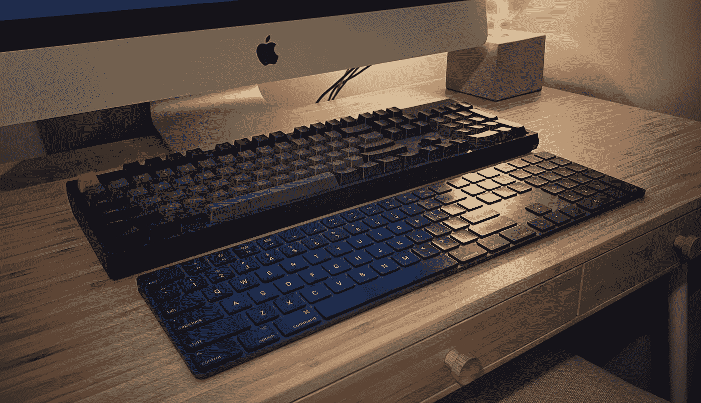
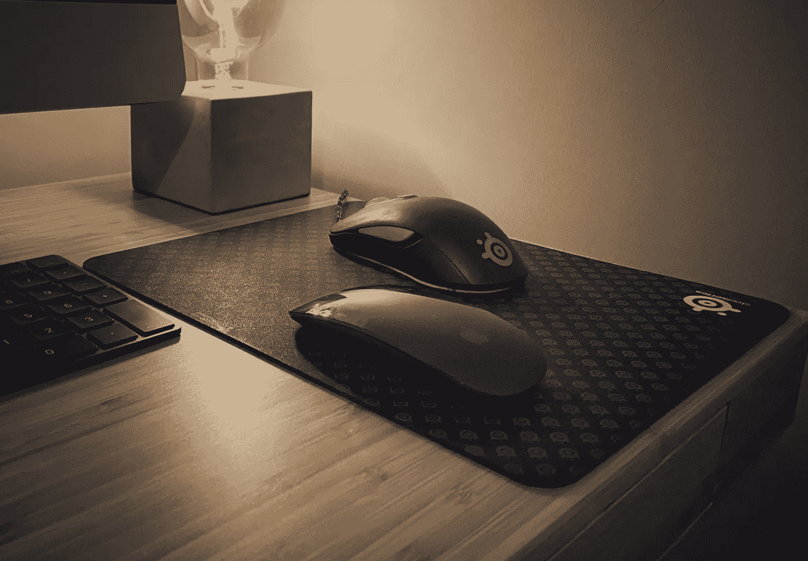
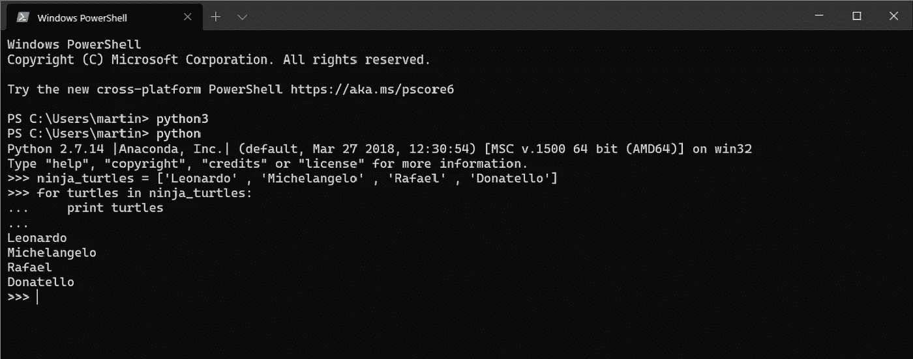
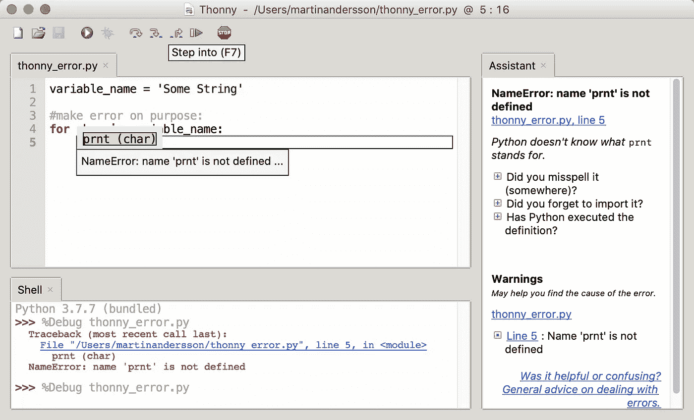
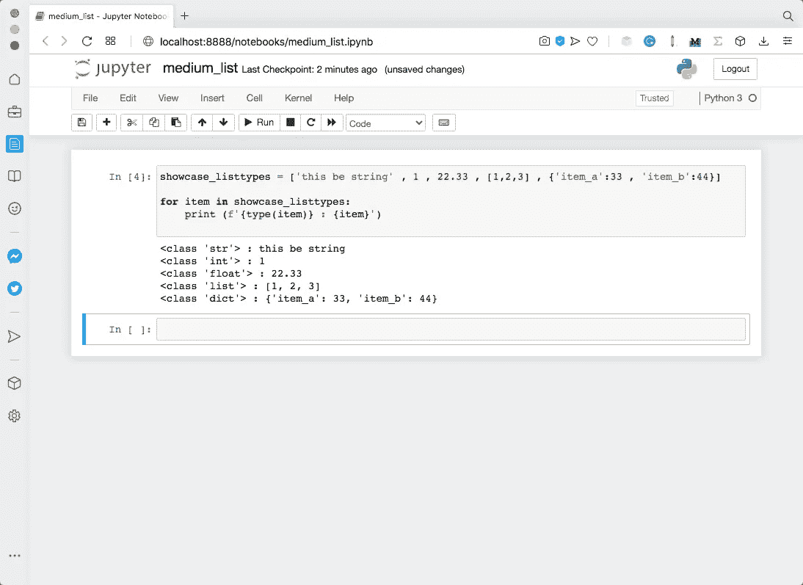
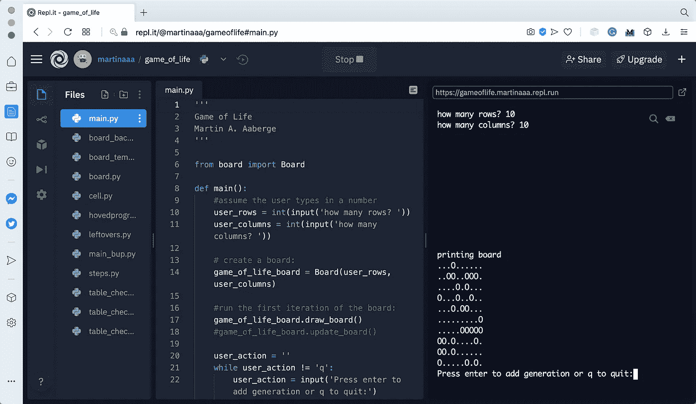
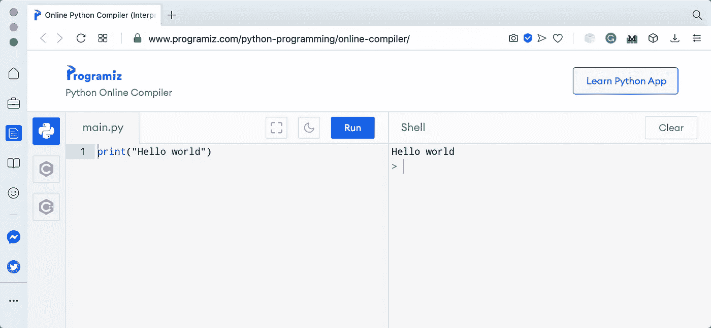

# 深入 Python 编程所需的一切

> 原文：<https://towardsdatascience.com/everything-you-need-to-get-started-with-python-programming-4a37a46e427b?source=collection_archive---------5----------------------->

## 你很可能已经被覆盖了

来自 [Pexels](https://www.pexels.com/photo/man-in-blue-and-white-striped-polo-shirt-sitting-beside-woman-in-brown-shirt-4842488/?utm_content=attributionCopyText&utm_medium=referral&utm_source=pexels) 的 [cottonbro](https://www.pexels.com/@cottonbro?utm_content=attributionCopyText&utm_medium=referral&utm_source=pexels) 摄影

A 你准备好用 Python 编程了吗？对于一个初学者来说，跳入水中可能会很害怕，但是相信我，你只需要一条游泳裤就可以了。而我说的泳裤，是指一些基本的硬件和软件。

一个常见的问题是“Python 编程应该买哪台笔记本电脑？”好消息是 Python 不需要太多。在本文中，我将介绍一些基本知识来帮助您进行设置。

穿上裤子，让我们开始您的 Python 之旅。

*   **硬件** —您的需求以及台式机和笔记本电脑的区别
*   **软件** —选择适合您的操作系统
*   **在手机上编程？** —是啊，毕竟是 2020 年了
*   **文本编辑器**和 **IDE** s
*   **在线** —使用在线编码环境

*免责声明:本文中没有附属链接。*

# 五金器具

我很想说任何机器都可以。如果你买了一个不到 5-10 年的带有现代操作系统的，它很可能会运行。我不是说这将是一个平稳的经历，但它会工作。您需要什么样的硬件取决于您打算编写什么样的代码。

说到硬件，你要么看台式电脑，要么看笔记本电脑。(除非你想在手机上开发。稍后将详细介绍)您的选择基于多种需求。这往往归结于功率与便携性。

# 桌面

Python 代码只是文本，所以代码本身非常简单。在决定购买什么样的硬件时，您还需要考虑其他因素。由于 CPU、RAM 和 GPU 不是那么重要，我将从您将与之交互的其他部分开始。

照片由[乔希·索伦森](https://www.pexels.com/@joshsorenson?utm_content=attributionCopyText&utm_medium=referral&utm_source=pexels)从[派克斯](https://www.pexels.com/photo/black-flat-screen-computer-monitor-1714208/?utm_content=attributionCopyText&utm_medium=referral&utm_source=pexels)拍摄

## 屏幕:

你的主要工具之一是你的屏幕。屏幕分辨率越高，可以显示的代码就越多。在高分辨率屏幕上，文本可能会显得很小，会让您的眼睛感到紧张，因此，请调整设置，以获得您可以使用几个小时的最佳设置。

对于您的桌面，您希望找到一个可以旋转 90 度的屏幕，这样您就可以显示更多行代码。4k 分辨率的屏幕现在越来越便宜，所以如果你负担得起，我建议你看看 27 英寸及以上支持 4k 的屏幕。如果你正在寻找一个预算屏幕，跳过 4k 选项，选择一个适合你桌子的。你可以在更小的屏幕上编码，但是我会在我的预算范围内得到最大的屏幕。

如果你发现自己经常在软件之间切换，你应该考虑超宽选项。有了这些显示器，您可以让您的应用程序并排排列。在 38 英寸超宽屏幕上工作了几年后，我发现很难回到双显示器设置。

## 键盘

你在键盘上打字的时间和看屏幕的时间差不多。毕竟你是*写*代码。对你有用的键盘，对另一个人来说可能是最糟糕的。选择合适的键盘是个人的事，只要记住你会用上几个小时，所以使用起来舒服很重要。

我过去用过各种键盘，最近扔掉了我定制的 [WASD](https://www.wasdkeyboards.com) 键盘，换上了一个[苹果魔法键盘](https://www.apple.com/shop/product/MQ052LL/A/magic-keyboard-with-numeric-keypad-us-english-silver?fnode=b49659f91c9f7729af62a9f7083c21fe17b4127269e75f09377db663a16fb948d94b0eb1ecbf921523a6b857cde84a76cb98a6210c298c0e65a785290b1094c434bd2d4e666736543ce20e3f53e24fa7674fb6c09799ffa8c729d7ae8b62cbf8)。

上图:WASD 键盘，下图:苹果魔法键盘。两种截然不同的体验。作者图片

WASD 键盘有机械键(这是许多程序员的首选)，移动距离很好。这是一个沉重的设备，使它显得坚实。对我来说，高度让我分心，因为长时间打字会让我的手腕疼痛。你可以通过获得手腕支撑来避免这一点，但超扁平的苹果 Magic keyboard 对我来说更舒适。苹果魔键的行程更短，但键盘的手感非常舒适，我可以输入几天。

在你下定决心之前，你应该试着弹奏几次键盘。如果每天工作 10 个小时后感觉良好，你可能已经找到了你的打字伴侣。如果你住的地方有很好的退货选择，试一试，如果不适合你的手指，就把它送回去。

如果一个普通的平面键盘会疼，你可以寻找键盘分离和倾斜的选项。我姐夫最近向我介绍了 ergo DOX EZ T1 键盘，这看起来是一个非常有趣的选择。

我建议你买一个美式布局的键盘。这种布局非常适合编写代码。我是挪威人，但是因为这个原因，我所有的键盘都是美式布局。如果你需要你的母语字母，你可以在软件中切换语言。我看着你“啊，啊，啊”。

你可能不会经常使用数字小键盘。在这种情况下，你可以看看紧凑型键盘。一些制造商创造了他们键盘的紧凑版本。确保他们没有把箭头键放在奇怪的位置。

## 老鼠

很容易说你用什么鼠标都没关系，因为毕竟你不会经常用你的鼠标。即使打字是你的主要活动，你也会浏览网页(主要是 StackOverflow)和用鼠标做很多其他的操作。当谈到偏好时，这就像键盘一样个人化，但是要确保你得到的鼠标不会伤到你的手。你的手是你的工具，好好保管它！

虽然我很喜欢苹果的神奇键盘，但神奇鼠标并没有那么棒。在我看来，苹果从来就不擅长鼠标，而[苹果神奇鼠标](https://www.apple.com/shop/product/MRME2/magic-mouse-2-space-gray?fnode=7211309b4a68c673a35f78d425d260a1cefa0de8eb7df008dbbd77739061dbb9587e4ef4e681acf2ec9e3ed208ca52fa9f50d38cafa5289038df4a78ac4b3ccd9d32bc03abf4209bd2b5d7b92179aadbf017bda748335bfdf157db82b23c40c2)的人机工程学外形非常糟糕。我最近使用它的唯一原因是因为它上面集成了触控板。它非常适合浏览，但当我需要做一些更繁重的工作时，我旁边有一个 Steelseries Kana，因为握起来更舒服。

苹果魔术鼠标与支持钢系列假名。作者图片

购买鼠标时，您应该考虑外形因素。使用普通键盘已经让你的手腕扭曲到不自然的位置。你可以考虑用一个稍微垂直的鼠标来减轻你手腕的压力。[罗技 MX Master 3](https://www.logitech.com/en-us/products/mice/mx-master-3.910-005620.html) 目前是一个受欢迎的选择，并略有倾斜。我目前有这个订单，并希望它像所有评论说的那样好。如果效果更好的话，你可以得到全垂直布局或操纵杆布局的鼠标。

## CPU 和内存

关于 CPU 就不多说了，因为大多数 CPU 都会运行 Python。一个更强的 CPU 总是比一个弱的更快，所以购买你能负担得起的 CPU。Python 已经是慢语言了。没有必要用一个糟糕的 CPU 使它更慢。

注意 Python 也是单线程的。

来自 [Python 文档](https://docs.python.org/3.8/library/threading.html):

> 在 CPython 中，由于[全局解释器锁](https://docs.python.org/3.8/glossary.html#term-global-interpreter-lock)，一次只有一个线程可以执行 Python 代码(尽管某些面向性能的库可能会克服这个限制)。如果你想让你的应用更好的利用多核机器的计算资源，建议你使用`[multiprocessing](https://docs.python.org/3.8/library/multiprocessing.html#module-multiprocessing)`或者`[concurrent.futures.ProcessPoolExecutor](https://docs.python.org/3.8/library/concurrent.futures.html#concurrent.futures.ProcessPoolExecutor)`。但是，如果您想要同时运行多个 I/O 绑定的任务，线程仍然是一个合适的模型。

如果你发现自己在进行繁重的计算，你可能需要更多的内存，但是对于大多数任务，你不需要太多。有些任务需要在处理时将结果存储在内存中，但是对于大多数任务来说，使用少量 RAM 应该没问题。

请记住，像浏览器和 IDE 这样的应用程序将会使用大量的 RAM，所以如果您的预算不紧张，一般来说就使用更多的 RAM。4GB 可能可以，但这是最低端的容量，您会看到大部分容量可能会在一天中使用。今天，大多数桌面都配备了 8GB-64GB 的 RAM——这对于 Python 来说当然没有问题。

## 国家政治保卫局。参见 OGPU

你可能已经猜到了，Python 也不是 GPU 的重地。几乎任何显卡都可以。你可以考虑的一件事是，你可以使用 GPU 进行机器学习，所以如果你打算走这条路，你可以投资一个更好的显卡，只是为了做好准备。

## 硬盘驱动器

Python 代码只是文本，如果你看看你的 python 程序，你会发现我们谈论的是 kB 而不是 MB。这意味着代码本身不需要太多的硬盘空间。另一方面，您用代码创建的数据可能需要空间，所以这是您必须添加到等式中的内容。另一个会消耗硬盘空间的是你的操作系统和其他安装的软件。

有两种硬盘:固态硬盘 SSD 和硬盘 HDD。固态硬盘比硬盘快得多，所以一般来说，你会喜欢使用固态硬盘。与硬盘相比，它们的价格很高，所以还是要看预算。您可以考虑将 SSD 用于您的操作系统，将 HDD 用作第二个硬盘，以最大化大小。

我们在云中存储越来越多的内容，大多数情况下你的代码会被上传到 Github。这意味着对硬盘的需求不像 10-20 年前那么重要了。我用 iCloud 储存大部分工作文件。它既可以作为备份，也很容易在设备之间同步文件。

## 网络摄像机

我猜你没想到会这样。当你购买一台笔记本电脑时，一个网络摄像头几乎总是包含在屏幕框中。当你买台式机时，你必须单独购买(除非你买 iMac 或类似的产品)。如果你从初级爱好者变成初级开发人员，你很可能会看到自己与团队进行数字会议。你不想成为那个没有相机的人。作为奖励，它迫使你保持房间整洁。

# 笔记本电脑

好了，说到便携小兄弟。

你总是可以带额外的设备，比如键盘和鼠标，但是让我们来关注是什么让笔记本电脑成为笔记本电脑。我们在这里看到的例子有点贵，但请记住，你可以用二手笔记本电脑，我也会告诉你一个秘密。你可以带着你能找到的最便宜的笔记本电脑离开。关键是在线编码环境。

来自 [Pexels](https://www.pexels.com/photo/man-in-gray-crew-neck-t-shirt-sitting-at-the-table-4827507/?utm_content=attributionCopyText&utm_medium=referral&utm_source=pexels) 的 [cottonbro](https://www.pexels.com/@cottonbro?utm_content=attributionCopyText&utm_medium=referral&utm_source=pexels) 摄影

## 屏幕

你将整天看着你的屏幕。11 英寸或 13 英寸会给你带来很大的便携性，但 15 英寸- 17 英寸会给你更多的空间。配备 retina 显示屏(3072×1920)的 Macbook Pro 16 英寸 2019 型号的尺寸与旧的 15 英寸相同。戴尔 XPS、联想 X1 Carbon 和 Razer Blade 都拥有 3840 x 2160 的出色分辨率。使用更大的屏幕，你可以获得更好的分辨率，但是你放弃了一些便携性。在我看来，它们是如此轻，无论如何，这是一个明显的优势去有点大。

根据 [Just Josh](https://www.youtube.com/watch?v=WutBn_mm0c8) 的说法，与他的 Surface Book 2 15 英寸和 Aero 17 英寸笔记本电脑相比，他可以在 Macbook Pro 16 英寸上查看多 30%的代码行。它们都具有相同的 8.5 英寸垂直屏幕高度。

## 键盘

如果你想买 MacBook Pro，你必须知道在 2015 年至 2019 年期间，苹果公司为它们配备了蝴蝶键盘。这种键盘因故障而臭名昭著，键程几乎不存在。2019 年，他们开始发运配备新苹果魔法键盘的型号，这些是打字的乐趣。它们不是机械的，但感觉就像独立版的魔法键盘。如果你买了一台蝴蝶键盘的 MacBook，苹果有一个保修计划，如果你有问题，你可以换一台。

不管你喜不喜欢，苹果的产品都有触控条而不是 F 键。我喜欢这一点，因为它提供了很大的灵活性，但也有很多人讨厌它们。如果您依赖功能键，请确保尝试 touch bar 来下定决心。

一些游戏笔记本电脑已经开始包括机械键盘，所以如果你正在寻找那种触感，你也可以在旅途中得到它。

当心！拿到笔记本电脑需要注意的一点是，厂商需要做一些妥协，让这些机器变得轻薄小巧。你必须检查键盘的布局。在 MacBook Pros 的最新阵容中，ESC 键以其物理形式回归。对程序员来说是个好消息。Razer Blade 有一个荒谬的箭头键位置，但看起来他们在最新的阵容中改变了这一点。确保你做了一些研究，这样你就不会讨厌每一次按键。

## 轨迹板

一些制造商还不如*不*包括触控板。以我的经验来看，没有人能与 MacBook 触控板相媲美。也许是 Razer，但我自己没有试过，只听同事说它很棒。如果你不想带鼠标，确保你对触控板满意。

如果触控板很糟糕，你可能会更好地使用键盘导航。至少不是完全的损失。

# 软件

希望你现在已经拿到了一台机器。但是软件呢。你需要软件来运行代码，对吗？根据您正在编程的内容，您可以对您的编程机器进行最小的设置。

我们首先要看的是操作系统。

# 操作系统

要开始编程，你需要一个操作系统(OS)。Python 是跨平台的，可以在 Windows、macOS 和 Linux 上工作。选择操作系统主要是个人喜好的问题。

根据 [Stack Overflow 的 2020 年调查](https://insights.stackoverflow.com/survey/2020#development-environments-and-tools)，45.8%使用 Windows 开发，27.5%在 macOS 上工作，26.6%在 Linux 上工作。

## Windows 操作系统

你可能对视窗很熟悉，因为它们在全世界被广泛使用。Windows 的最新版本是 Windows 10。一般来说，你应该使用最新版本的操作系统，但如果你有一台旧机器或其他软件需要它，你可能会被困在 Windows 7 或更旧的版本。这两个你都应该没问题，但是要注意如果你想用 Python 3.5 或者更高版本的话， **Windows XP 是不支持的**。

如果您使用 Windows，有一些 shell 选项适合您。Windows 自带命令行，也有 Powershell。Powershell 感觉更像是一个普通的终端，你可以从 Linux 或者 Mac 世界中了解到。

更好的新来者是 [Windows 终端](https://github.com/microsoft/terminal)。这款高度可定制的终端非常好用。

运行中的新 Windows 终端。作者图片

在过去，人们对某些库在 Windows 上不被支持有疑问。您可能不知道将来会使用什么库，但是如果您最终在安装任何库时遇到问题，这可能就是原因。

Windows 许可证通常与您购买的机器捆绑在一起。如果不是，你看到的费用在 139-309 美元之间。

## 马科斯

Mac 和 Linux 都属于 UNIX 家族。你可以把它们看作两个不同的分支。这两种操作系统的开发感觉是相似的。

Mac 有一个开箱即用的内置终端。如果您喜欢更大的灵活性，您可以安装各种版本，比如 iTerm，但是原始版本可以完美地完成它的工作。Python 预装在 macOS 中，但请确保检查版本，以便保持最新。

大多数文本编辑器和 ide 都在 macOS 上工作。

macOS 和 Windows 一样，不是开源的，但它是机器自带的。macOS 只能在 Mac 上运行(官方)，所以你只能依赖苹果的硬件。

## Linux 操作系统

Linux 并不是真正的操作系统，它是一个内核。你所认为的操作系统是发行版。使用 Linux 的一个好处是这些发行版是轻量级的，并且是高度可定制的。你可以货比三家，找到最适合你的。一些流行的发行版有 Ubuntu、Mint、Fedora 和 CentOS。

Linux 非常适合开发。它还带有一个终端，许多文本编辑器和 ide 都在 Linux 上工作。Linux 是开源的，所以它是一个预算友好的选择。

# 计算机编程语言

当然，你需要 Python。前往 python.org，下载安装程序，并运行它。如果您在终端中编写“python3”(如果您下载了 python3 版本)，您应该看到它执行并打印您运行的 python 版本。

# 文本编辑器和 ide

有很多文本编辑器，但是请不要成为那个说你可以在记事本中写代码的人。至少知道如何通过说“哦，我指的是 Notepad++”来拯救自己，以防你受到邪恶的盯视…

你在文本编辑器中寻找的一些东西是:

*   语法突出显示。Python 是一种流行的语言，所以大多数文本编辑器都将它作为标准或可下载的扩展。
*   代码预测。如果你已经创建了一个名为`ninja_turtles`的变量，在你开始输入 ninj 之后，编辑器会预测你的变量名，这很好……让软件在你输入的时候寻找模块可以用于快速编码和学习。
*   制表符缩进。大多数编辑器允许你选择你想要在一个标签中有多少空格。Python 的 PEP8(圣经)指出你应该使用 [4 个空格](https://www.python.org/dev/peps/pep-0008/#indentation)。Python 3 甚至不允许混合制表符和空格。

我们只看精选的几个。确保你浏览网页寻找你最喜欢的。

## 原子

Atom 是一个轻量级的文本编辑器，可以在所有操作系统上运行。它是高度可定制的，有主题和 CSS/Less 定制。包管理器、文件系统浏览器、git 集成，以及最后但同样重要的“Teletype ”,它让您可以实时地对同一代码进行协作，这是文本编辑器的最佳选择。

感觉大胆运行一个轻的主题。左边是浏览器，中间是代码，右边是设置。使用安装的社区制作的脚本在底层执行代码。作者图片

## 托尼

Thonny 是一个极简的 IDE，非常适合初学者。借助强大的调试器，您可以确保理解您的代码。我过去从未使用过 Thonny，但很快就喜欢上了这个工具。

Thonny 及其出色的调试器。作者图片

## 崇高

崇高出现在游戏中已经有一段时间了，被很多人使用。它有一些漂亮的特性，比如允许你一次重命名多个变量的“多重选择”和定制。

## 朱皮特

> Jupyter 是一个开源的 web 应用程序，允许你创建和共享包含实时代码、等式、可视化和叙述性文本的文档。用途包括:数据清理和转换、数值模拟、统计建模、数据可视化、机器学习等等。

你可能以前见过使用 Jupyter[的漂亮的图形数据展示。可以安装 Jupyter 笔记本，也可以使用浏览器版本。如果你想处理数据，Jupyter 是你的工具。](https://jupyter.org/index.html)

Jupyter 进行中。作者图片

## Visual Studio IDE

由微软开发，受到许多人的喜爱。这个广泛的工具允许你写代码，调试，安装库，使用 Git 进行源代码控制和单元测试你的代码。

要找到适合你的版本，去他们的[比较页面](https://visualstudio.microsoft.com/vs/compare/)看看，并确保你看了他们的 [python 特定页面](https://visualstudio.microsoft.com/vs/features/python/)。

# 在手机上编程

给你一个小惊喜。你可能没有意识到，你信任的旧手机可以用来实现伟大的事情。我必须承认，我从来没有在我的手机上做过任何适当的编码(只有当我在度假时迫切需要时)，但从我在网上看到的情况来看，有几个应用程序可以完成这项工作。

## ios

[Pythonista](http://omz-software.com/pythonista/) 是一款流行的软件，是一款面向手机开发的完整 IDE。

Koder 是另一种选择。这是一个代码编辑器，不是一个完整的 IDE，但它有语法高亮显示和对 Dropbox 等云服务的支持。

[Buffer Editor](https://buffereditor.com) 看起来圆滑简约。它支持 Git 和 Dropbox。

## 机器人

Pydroid 遍布脸书的 Python 团体，有了 pip 支持、GUI 支持，比如 PyQT、离线解释器、语法高亮和代码预测，它成为流行的选择并不奇怪。

# 在线编程

如果你喜欢最大的可移植性，你可以考虑使用在线编辑器。你可能会在安装库或类似的东西时遇到一些困难，但是你也可以在网上完成很多工作。去年，我在大学为我们的 python 课程使用了 6 个月的在线编辑器。用浏览器登录任何一台电脑的好处都是很大的。

这里是一些你可以尝试的概述。记住，总有比我发现的更多的选择，所以一定要做一些研究。也许你会找到另一个你喜欢的服务。

## 回复它

它拥有多种语言，其中包括 python。您可以与其他程序员合作，连接到您的 Git 存储库，并且它有插件支持。免费版将带你走得更远，还有团队定价选项。

repl.it 运行“生命的游戏”。作者图片

## Pythonanywhere

顾名思义， [pythonanywhere](http://pythonanywhere.org) 让你无论身在何处都可以编码。这项服务是 python 独有的，在免费版本中你可以同时运行两个控制台。

pythonanywhere 玩 Yahtzee。作者图片

## 编程

Programiz 有一个简单易用的在线编辑器。据我所知，它只是一个供你测试代码的编辑器，而不是你存储文件的环境。如果我错了，请纠正我。

运行非常著名的“Hello World”程序。作者图片

## 最后

我希望 Python 入门看起来不再可怕，如果它更早的话。如你所见，开始学习 Python 并不需要太多。如果你有浏览器，你可以开始学习。当你对 Python 有了更多的了解，并意识到这是你喜欢做的事情时，你可以考虑升级。当你这样做的时候，你仍然不需要太多的继续。这就是这种轻量级编程语言的美妙之处。

当然，买你买得起的。你必须时刻考虑你采购的东西是否*需要*，但是硬件永远不可能*太好*。

我希望你会喜欢这个奇妙的旅程，现在我们已经讨论了各种替代方案，有些选择是明确的。

M