# 关于相关性你需要知道的一切

> 原文：<https://towardsdatascience.com/everything-you-need-to-know-about-correlation-3ef78f22fcad?source=collection_archive---------14----------------------->

上海崇明岛上的一群白鹭

## 皮尔森、斯皮尔曼、肯德尔*、B* iserial、Tetrachoric 等等

相关性是几乎所有部门都使用的最基本的统计概念之一。

例如，在[投资组合管理](https://www.investopedia.com/terms/p/portfoliomanagement.asp)中，相关性经常被用来衡量投资组合中包含的资产的多样化程度。选择彼此相关性低或负相关的资产有助于降低投资组合的风险。此外，在[营销研究](https://en.wikipedia.org/wiki/Marketing_research)中，相关性提供了关于营销策略和业务成果的见解，这进一步帮助营销人员做出可操作的决策，并最终发展业务。

简而言之，当一组变量中的测量值与另一组变量中的测量值以一种并非偶然的方式相关时，我们使用相关性来以定量的方式陈述两组变量之间关系的强度和方向**。**

**或许，你可能和我有相似的经历，纠结于许多不同类型的相关性(例如*皮尔森、斯皮尔曼、肯德尔、比瑟里尔、四分位数等等*)。**有什么区别？我们应该使用哪一个？我们如何在 Python 中计算它们？****

**在本帖中，我将与你分享我回答这些问题的笔记。像往常一样，我提供一个笔记本给你练习，可以从 [my Github](https://github.com/Perishleaf/data-visualisation-scripts/tree/master/correlation_explained) 访问。**

## ****几个关键术语****

**在我们深入研究相关性之前，如果能列出一些关键术语并放在手边就更好了。**

****1。标准差**:它是一组值的变化量或离差的度量(*它只是方差σ* 的平方根)。**

*   ****总体**标准差: ***N*** 为总体大小，为总体均值。**

**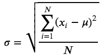**

*   ****样本**标准差: ***n*** 为样本大小， ***x̄*** 为样本均值。**

**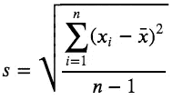**

****2。协方差**:它是两个变量从它们的平均值前后变化的程度的度量。**

*   ****人口**协方差: ***N*** 为人口规模，为人口均值。**

**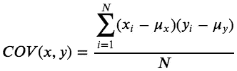**

*   ****样本**协方差: ***n*** 为样本大小， ***x̅/y̅*** 为样本均值。**

**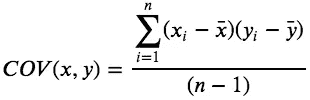**

****3。参数检验:**它假设数据中潜在的统计分布。必须满足有效性条件，以便参数测试的结果是可靠的。**

****4。非参数检验:**它不依赖于任何分布，因此可以在有效性的参数条件不满足时应用。**

****5。效应大小/强度:**相关系数在. 10 到. 29 之间代表小关联，系数在. 30 到. 49 之间代表中等关联，系数在. 50 及以上代表大关联或关系。**

**6。分类变量:又称离散变量或定性变量。分类变量可进一步分为名义变量**，二分变量**或序数变量**。****

*   ******名义**变量是指有两个或两个以上类别，但没有内在顺序的变量。例如，财产类型(房屋、单元和公寓)、公司名称、宗教、颜色偏好和邮政编码。****
*   ******二分变量**是名义变量，但只有两个类别或级别。比如性别(男女)，是/否问题，电信流失数据(流失或停留)。****
*   ******序数**变量是和名义变量一样有两个或两个以上类别的变量，但也可以排序或排名。例如，汽车尺寸(超小型、紧凑型、中型、豪华型)、经济地位(下层、中层或上层)、排名 5 种啤酒、满意度(非常不满意、有些不满意、有些不满意、不满意)。****

******7。连续变量:**又称数量变量。这种类型的数据具有相邻单元之间的有序和等间隔的性质。连续变量可进一步分类为**区间**或**比率**变量。****

*   ******区间变量:**可以沿连续统测量的，有数值的数据。例如，温度、出生年份、满意度(分值单位，1-10)和鞋码。****
*   ******比率变量**:它们是区间变量，但是有明确的定义 0，表示没有该变量。比如收入，价格，距离，一个家庭的孩子数，开车时间，剂量等等。****

****“比率”这个名称反映了这样一个事实，即可以对比率变量的值执行乘法和除法运算。因此，我们可以说 15 美元的价格比 5 美元的价格贵三倍。然而，10°C 的温度不应被视为 5°C 的两倍。它仅高出 5°C(即，只能对区间变量的值应用加法和减法运算)。****

****这里有一个取自 [GraphPad](https://www.graphpad.com/) 的图表(图 1)可以帮助你理解这些不同的变量****

****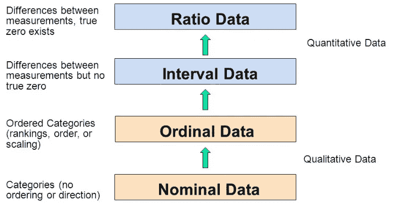****

****图 1 | [可变刻度](https://www.graphpad.com/support/faq/what-is-the-difference-between-ordinal-interval-and-ratio-variables-why-should-i-care/)****

******8。单调关系:**在单调关系中，两个变量趋向于以下之一:(1)随着一个变量的值增加，另一个变量的值也增加；或者(2)随着一个变量值的增加，另一个变量值减少。，但不一定以恒定的速率(图 2)。****

******9。线性关系:**线性关系中，两个变量的作用与单调关系相同，但速率不变。趋势可以用直线来模拟。线性关系都是单调的，但不是所有的单调关系都是线性的。****

****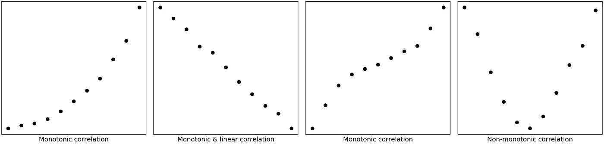****

****图 2 |单调关系的图示****

******10。并列等级:**在计算 Spearman 相关系数时，这是一列中具有相同等级的两个项目。****

******11。一致/不一致:**描述两个样本的排序是否相同(图 3)。****

****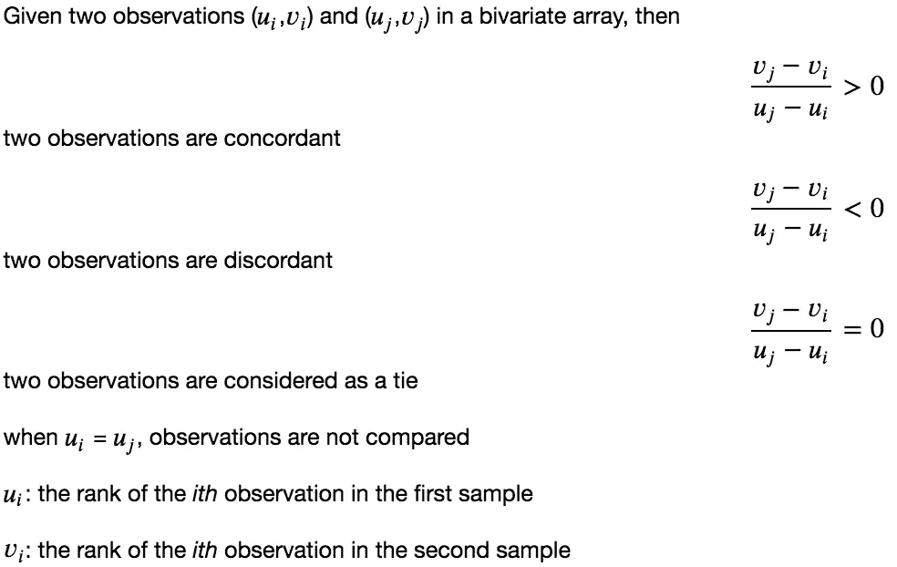****

****图 3 |和谐与不和谐的定义****

## ****理解**c**或关系的强度、方向和意义****

****两个变量之间的相关性用一个数字**相关系数**来量化，通常在 1 到+1 之间变化。零表示没有相关性，1 表示完全或完美的相关性。相关强度从 0 增加到+1，从 0 增加到 1。符号表示相关的方向。负相关意味着这两个变量是反向相关的。****

****一般来说，除了相关性的强弱，我们还需要报告其统计显著性，即 **p 值**。p 值表示这种相关强度可能偶然出现的概率。统计上显著的相关性不一定意味着相关性的强度很强。****

****比如两个相关系数 0.32 ( *p < 0.01* )和 0.93 ( *p < 0.05* )。即使 0.32 的相关性具有更显著的水平( *p < 0.01* )，与 0.93 的相关性相比，它仍然是较弱的相关性。 *p < 0.01* 仅确保 99%的时间相关性为 0.32。****

## ****皮尔逊相关(参数检验)****

****皮尔逊相关系数(*皮尔逊积差相关系数*)是**线性相关变量**之间关系程度的最广泛使用的统计度量。用字母 ***r*** 表示。****

****Pearson 的 *r* 是通过将这两个变量的协方差除以它们的标准差的乘积来计算的。****

****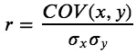****

****其计算要求以下数据假设有效:****

*   ******区间**或**比率变量******
*   ****线性相关****

****在实践中，第二个假设是通过用测试的两个变量制作散点图来直观检查的(图 4)。****

****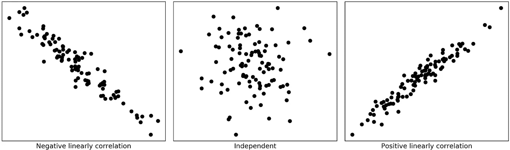****

****图 4 |用于目视检查的散点图****

> ****“皮尔逊 r 并没有假设正态性。许多人认为，为了证明 r 的计算是正确的，这两个变量必须是正态分布的。但许多人也认为，他们在喝酒后可以更好地驾驶。”****
> 
> ****艾伯特·库尔茨和塞缪尔·梅奥****

****皮尔森 *r* 本身[并不假设正态性](https://stats.stackexchange.com/questions/3730/pearsons-or-spearmans-correlation-with-non-normal-data)！实际上，我们仍然需要检查二元正态性的原因是为了满足显著性统计检验的假设。****

****Python 中有几种不同的检验正态性的方法，包括直方图(`**pyplot.hist**()`)，[正态 Q-Q 图](https://data.library.virginia.edu/understanding-q-q-plots/) ( `[**statsmodels.qqplot**()](https://www.statsmodels.org/stable/generated/statsmodels.graphics.gofplots.qqplot.html)`)，夏皮罗-维尔克检验(`**scipy.stats.shapiro**()`)，达戈斯蒂诺检验(`**scipy.stats.normaltest**()`，安德森-达令检验(`**scipy.stats.anderson**()`)。****

****我们需要注意的另一件事是，正如其公式中的标准差所表明的那样，皮尔逊相关系数自然对偏斜分布和异常值敏感。****

****如果我们的数据满足上述假设和先决条件，我们可以通过调用`**scipy.stats.pearsonr**(*x***,** *y*)`在 Python 中轻松计算 Pearson 的 r，这将返回 Pearson 相关系数和*p*-值。或者我们可以使用`**pandas.dataframe.corr**(method=’pearson’)`来寻找数据帧中所有列的成对相关性。****

## ****斯皮尔曼相关(非参数检验)****

****在大多数情况下，如果我们的数据满足所有要求，Pearson 的 *r* 是关系的最佳度量，应该使用。然而，并不是一切都能如人所愿。幸运的是，当我们得到不理想的数据时，仍然有几个选项使我们能够得到相关系数。****

****Spearman 秩相关系数通常表示为 ***ρ*** (rho)或 ***r* s** ，是 Pearson 相关系数的非参数版本。对于**单调关系**，可以处理序数、区间或比率变量。****

****顾名思义，斯皮尔曼的 *ρ* 依赖于给定的两个变量的秩而不是它们的值。其简单形式公式如下:****

****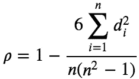****

****其中 ***n*** 为样本大小， ***di*** 为 ***与*** 样本的秩差。请看图 5 中的一个例子，计算距离机场的距离和瓶装水的价格之间的相关性，我相信这将有助于你立即理解公式。****

****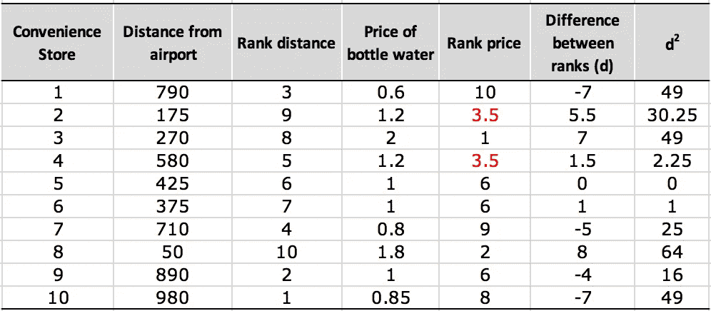****

****图 5 | Spearman 等级相关系数的计算****

****正如我们从图 5 中看到的，Spearman 相关性对强异常值的敏感度低于 Pearson 相关性，因为 Spearman 的 *ρ* 将异常值限制在其等级值内。****

****另一件应该注意的事情是并列的等级(图 5 中的商店#2 和#4)。当这种情况发生时，我们可以取他们本来会占据的等级的平均值。当联系数相对于 *n* 较小(1 或 2)时，仍然可以使用简单形式的公式。****

****否则，我们需要使用 Spearman 公式的完整版本，它将处理并列的等级:****

****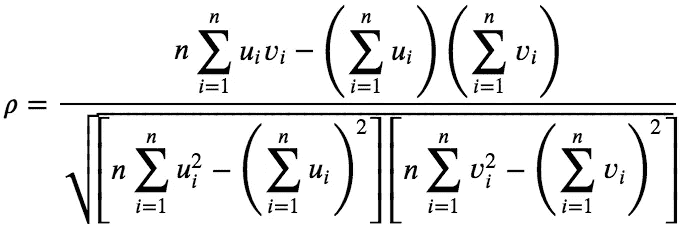****

****其中 ***ui*** 是第一个样本中第*个观测值的秩，第 ***vi*** 是第二个样本中第*个观测值的秩。******

******在 Python 中，我们可以调用`**scipy.stats.spearmanr**()`，它返回我们两个值 *ρ* 和 *p-* 。或者我们可以使用`**pandas.dataframe.corr**(method=’spearman’)`来查找数据帧中所有列的成对相关性。******

## ******肯德尔相关性(非参数检验)******

******一般来说，当样本量很小且有很多并列秩时，肯德尔相关常表示为***τ***(Tau)(*Tau 有三个版本，即 Tau-a、Tau-b、Tau-c* ，是 Spearman 相关的最佳替代。******

******肯德尔相关性要求与斯皮尔曼相关性相同的数据假设，即 1)序数、区间或比率变量和 2) **两个变量之间的单调关系**。******

******这里只介绍 Tau-b(这是`**scipy.stats.kendalltau**(x, y)`中使用的方法)，定义为:******

******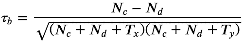******

******其中𝑁𝑐和𝑁𝑑分别表示样本中**一致对**的数量和**不一致对**的数量。𝑇𝑥表示仅与第一个响应变量相关的配对数量，𝑇𝑦表示仅与第二个变量相关的配对数量。如果同一对在 *x* 和 *y* 中出现平局，则不会添加到𝑇𝑥或𝑇𝑦.******

******在 Python 中，我们可以调用`**scipy.stats.kendalltau**(x, y)`，它返回给我们 *Tau* 和 *p-* 值。或者我们可以使用`**pandas.dataframe.corr**(method=’kendall’)`来查找数据帧中所有列的成对相关性。******

******总的来说，关于数据中异常值和差异的容忍度，Kendall 相关性是最稳健的度量，其次是 Spearman 相关性，而 Pearson 相关性是最敏感的。******

## ******点双列相关******

******当我们需要将一个连续变量与另一个**二分变量**相关时，我们可以使用点双列相关。******

******点双列的相关性通常用符号 *rpb 表示，*计算如下:******

******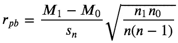******

******其中 *𝑀1* 是变量 y 的第 1 组中所有数据点在连续变量 x 上的平均值， *𝑀0* 是变量 y 的第 2 组中所有数据点在连续变量 x 上的平均值， *𝑛1* 是第 1 组中的数据点数， *𝑛0* 是第 2 组中的数据点数，𝑛是总样本量。******

******在 Python 中，这可以通过调用`**scipy.stats.pointbiserialr(***x***,** *y***)**`来计算，它再次返回给我们一个点双列相关系数和它的*p*-值。******

******我们应该注意到有一个 [**双列的相关**](https://ncss-wpengine.netdna-ssl.com/wp-content/themes/ncss/pdf/Procedures/NCSS/Point-Biserial_and_Biserial_Correlations.pdf) ，它也是一个连续变量与另一个**二分变量**的相关系数。但是，这里的二分变量应该是基本连续且正态分布的。******

******换句话说，这种类型的二分变量，在现实中是连续的，正态分布的，但只记录了两类。因此可称为**连续二分法。********

******与**分类二分法**相比，**连续二分法**可以被认为是一个正态分布的连续变量，它被人为地分为两类。例如，通过使用某个阈值，测试分数可以分为通过和失败。销售可以分为不好的和好的等等。******

******然而，你可能会问，为什么我要通过把连续变量转换成二分变量来丢失信息呢？说实话，我也不知道。也许统计学家只是喜欢发明公式**。无论如何，在这种情况下，我只是使用皮尔逊相关性。********

## ******四分相关******

******当我们希望将两个二分变量相互关联时，Tetrachoric 相关性旨在估计 Pearson *r* 。实际上，这些变量中的每一个都可能是连续的和正态分布的，但只记录在两个类别中。******

******正如它的定义所显示的，Tetrachoric 关联的适用性并不十分普遍。本质上，它根本不适用于分类变量。对于这样的情况，我们要用[φ的关联](https://en.wikipedia.org/wiki/Phi_coefficient) ( ***φ，*** AKA。马修斯相关系数(MCC)) **改为**。******

******在 python 中，我们可以使用`**sklearn.metrics.matthews_corrcoef()**`得到 *φ* 。******

******最后，我们应该注意到，还有更多用于相关性计算的技术，本文没有涉及。我们一定要根据我们的数据和目的来选择合适的方法。我希望你能从这篇文章中学到一些有用的东西。******

******感谢阅读！******

******以下是一些有用的链接:******

*   ******[名词性、序数、区间&比率变量+【例题】](https://www.formpl.us/blog/nominal-ordinal-interval-ratio-variable-example)******
*   ******[什么是区间数据？+【例题、变量&分析】](https://www.formpl.us/blog/interval-data)******
*   ******[名义变量、序数变量、区间变量和比率变量的测量标度](http://users.monash.edu/~smarkham/resources/scaling.htm#nominal)******
*   ******[肯德尔τ(肯德尔等级相关系数)](https://www.statisticshowto.datasciencecentral.com/kendalls-tau/)******
*   ******[点-双列和双列相关性](https://ncss-wpengine.netdna-ssl.com/wp-content/themes/ncss/pdf/Procedures/NCSS/Point-Biserial_and_Biserial_Correlations.pdf)******
*   ******[phi、Matthews 和 Pearson 相关系数之间的关系](https://stats.stackexchange.com/questions/59343/relationship-between-the-phi-matthews-and-pearson-correlation-coefficients)******

******和往常一样，我欢迎反馈、建设性的批评以及听到关于您的数据科学项目的信息。可以通过 [Linkedin](https://www.linkedin.com/in/jun-ye-29aaa769/) 和[我的网站](https://junye0798.com/)找到我。******