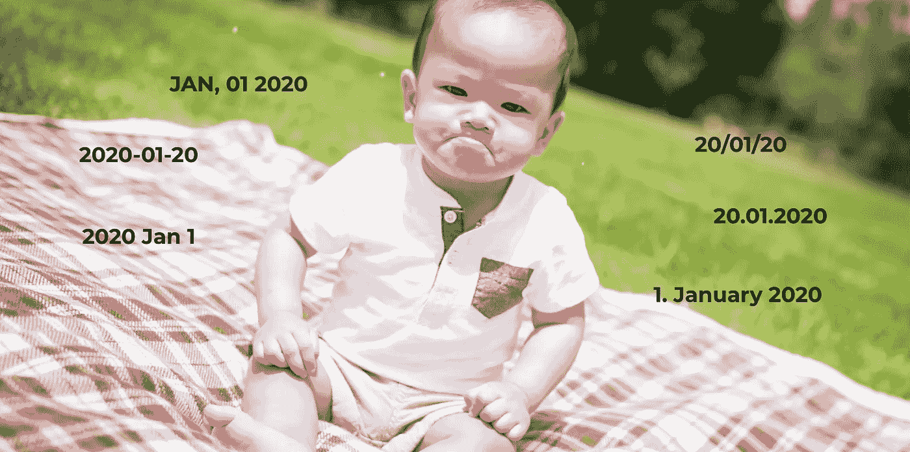

# 在 3 分钟内你需要知道的关于日期格式的一切

> 原文：<https://towardsdatascience.com/everything-you-need-to-know-about-date-formatting-in-3-minutes-d7f3d53beea?source=collection_archive---------22----------------------->

## 每个分析师都知道。你必须合并十个文件，每个文件都有不同的日期格式。我将向您展示如何转换日期以便进一步处理。



假设您收到了十个不同的文件，您的工作是匹配这些数据以获得新的见解。不管您是通过 csv 还是 api 获得数据，**您至少会收到五种不同的日期格式**。这可能具有挑战性。Python 的 *datetime* 提供了一些非常有趣的函数来处理这类问题。

```
[In]
import datetime
now = datetime.datetime.now()
now
[Out]
datetime.datetime(2020, 1, 30, 21, 4, 11, 887948)
```

变量**现在**包含年、月、日和当前时间。在许多情况下，获得年、月和日就足够了。*日期时间*对象的每一部分都可以单独访问。

```
[In]
print(now.year)
print(now.month)
print(now.day)
[Out]
2020
1
30
```

但是它如何帮助转换数据呢？ *Datetime* 对象提供了函数 *strftime* ，使得在 Python 中处理日期变得如此简单。

```
[In]
now.strftime('%Y-%m-%d')
[Out]
'2020-01-30'
```

表达式 **%Y** 是一个已定义的指令，它从*日期时间*对象中提取年份。这同样适用于其他对象。有趣的是，您可以以任何想要的方式格式化结果字符串。在本例中，我们在年、月和日之间添加了“ **-** ”。我们还可以添加任何其他字符:

```
[In]
now.strftime('%Y/%m/%d')
[Out]
'2020/01/30'
```

通常，您会收到一个需要首先转换的字符串:

```
delivered_date = 'Sep, 26 2019'
```

您可以使用 *strptime* 将我们的变量 **delivered_date** 转换为 *datetime* 对象:

```
[In]
datetime.datetime.strptime(delivered_date, '%b, %d %Y')
[Out]
datetime.datetime(2019, 9, 26, 0, 0)
```

strptime 需要两个参数。第一个是字符串，第二个是给定表达式的结构。在这种情况下，我们有一个月的短版本，带有一个逗号 **%b，**，后面是日期 **%x** 和年份 **%Y** 。

让我们看一下标题图片中的例子。我们总是希望格式 **YYYY-MM-DD** 最后:

我们从 2020 年 1 月 1 日**开始**

```
[In]
date_1 = 'Jan, 01 2020'
datetime.datetime.strptime(date_1, '%b, %d %Y').strftime('%Y-%m-%d')[Out]
'2020-01-01'
```

**2020 年 1 月 1 日**

```
[In]
date_2 = '2020 Jan 01'
datetime.datetime.strptime(date_3, '%Y %b %d').strftime('%Y-%m-%d)[Out]
'2020-01-20'
```

**20/01/20**

```
[In]
date_3 = '20/01/20'
datetime.datetime.strptime(date_4, '%y/%m/%d').strftime('%Y-%m-%d')[Out]
'2020-01-20'
```

**2020 年 1 月 20 日**

```
[In]
date_4 = '20.01.2020'
datetime.datetime.strptime(date_4, '%d.%m.%Y').strftime('%Y-%m-%d')
[Out]
'2020-01-20'
```

1.  **2020 年 1 月**

```
[In]
date_5 = '1\. January 2020'
datetime.datetime.strptime(date_6, '%d. %B %Y').strftime('%Y-%m-%d')
[Out]
'2020-01-20'
```

## 结论

Python 的 *datetime* 提供了一个非常简单的框架来处理日期格式。格式化数据以便进一步处理也非常有用。例如，无论是 Excel 还是 CSV 文件都没关系。所有格式都可以转换。我希望你喜欢阅读，并且可以带走一些有用的东西。

[如果您喜欢中级数据科学，并且还没有注册，请随时使用我的推荐链接加入社区。](https://medium.com/@droste.benedikt/membership)