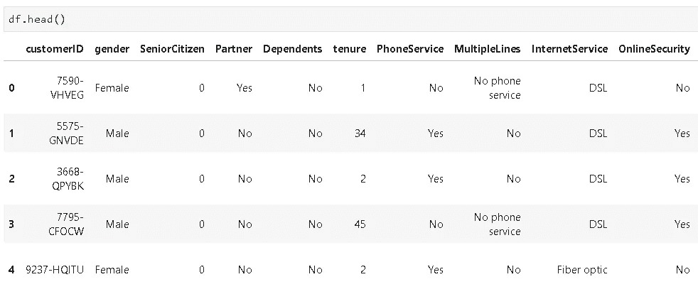
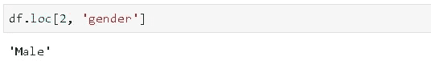
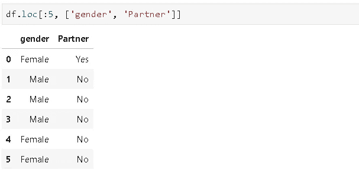
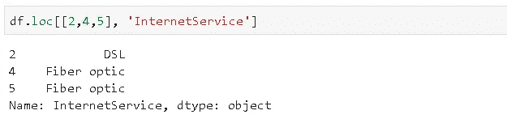
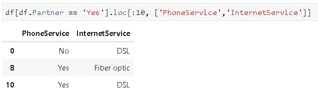
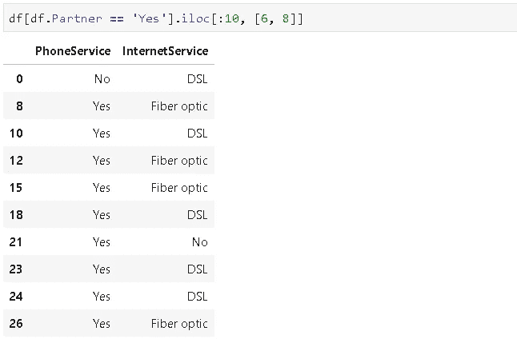
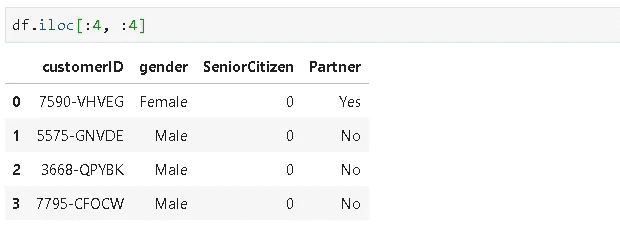
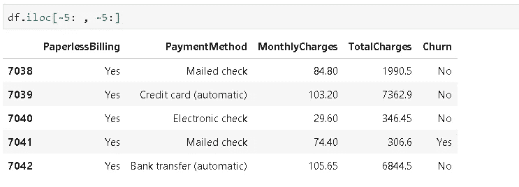
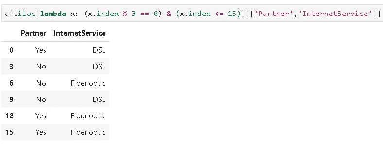
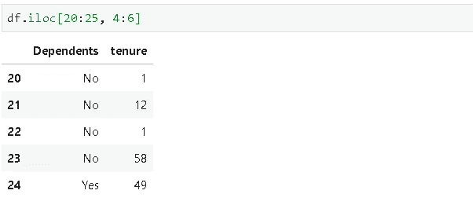

# 关于熊猫的“loc”和“iloc”你需要知道的一切

> 原文：<https://towardsdatascience.com/everything-you-need-to-know-about-loc-and-iloc-of-pandas-79b386cac776?source=collection_archive---------25----------------------->

## 明确区分 loc 和 iloc


Javier Allegue Barros 在 [Unsplash](https://unsplash.com/s/photos/choice?utm_source=unsplash&utm_medium=referral&utm_content=creditCopyText) 上拍摄的照片

Pandas 是使用最广泛的数据分析和操作库，它提供了许多灵活方便的功能，可以简化和加快数据分析过程。在这篇文章中，我将介绍两个重要的工具，它们用于根据指定的行和列从数据帧中选择数据。让我们先介绍它们，并通过不同种类的例子来建立一个全面的理解。

*   位置:按行和列的标签选择
*   iloc:按行和列的位置选择

随着我们对例子的研究，这种区别变得很明显。一如既往，我们从进口熊猫开始。

```
import pandas as pd
import numpy as np
```

我们将在 kaggle 上的电信客户流失数据集上做例子。让我们将数据集读入熊猫数据帧。

```
df = pd.read_csv("Projects/churn_prediction/Telco-Customer-Churn.csv")
```



数据集包括 21 列，但我们只能看到适合屏幕的列。

**loc** 用于通过标签选择数据。列的标签是列名。例如，customerID、gender、SeniorCitizen 是前三个列名(即标签)。我们需要小心行标签。由于我们没有分配任何特定的索引，pandas 默认创建整数索引。因此，行标签是从 0 开始向上的整数。与 **iloc** 一起使用的行位置也是从 0 开始的整数。我们将通过例子来看熊猫如何用 loc 和 iloc 不同地处理行。

*   选择行“2”和列“性别”



它返回行“2”的“性别”列中的值

*   选择最多“5”的行标签以及“性别”和“伴侣”列



*   选择行标签“2”、“4”、“5”和“InternetService”列



> 我们还可以过滤数据帧，然后应用 loc 或 iloc

*   选择带有合作伙伴的客户的行标签“10”、“InternetService”和“PhoneService”列(Partner == 'Yes ')



我们过滤数据帧，但不改变索引。因此，所得数据帧的索引仅包含未被省略的行的标签。因此，当使用 loc[:10]时，我们可以选择标签达到“10”的行。o 另一方面，如果我们在应用过滤器后使用 iloc[:10]，我们会得到 10 行，因为 **iloc 按位置**选择，而不考虑标签。



正如您所注意到的，我们还需要改变选择列的方式。我们还需要将列的位置传递给 iloc。

*   选择前 5 行和前 5 列



*   选择最后 5 行和最后 5 列。

> 这些位置从 0 开始。如果我们从末尾开始定位，我们从-1 开始，所以我们使用“-5:”来选择最后五个。



我们也可以应用 lambda 函数。

*   选择第三行到第 15 行，仅显示“合作伙伴”和“互联网服务”列。



我们可以在两者之间选择位置或标签。

*   选择 20 到 25 之间的行位置，4 到 6 之间的列位置。



如果您试图将标签传递给 iloc，Pandas 会友好地返回如下信息反馈:

```
**ValueError**: Location based indexing can only have [integer, integer slice (START point is INCLUDED, END point is EXCLUDED), listlike of integers, boolean array] types
```

当我们将位置传递给 loc 时，会返回类似的错误。

我希望 loc 和 iloc 之间的区别现在已经非常清楚了。要掌握知识，真正“学”，我建议大量练习。只是尝试不同的例子，你会在很短的时间内习惯它们。

感谢您的阅读。如果您有任何反馈，请告诉我。