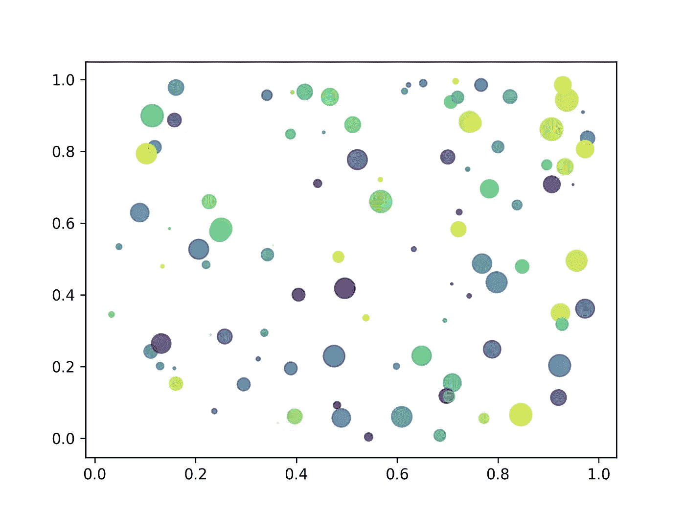
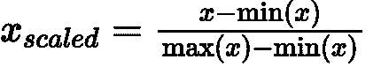
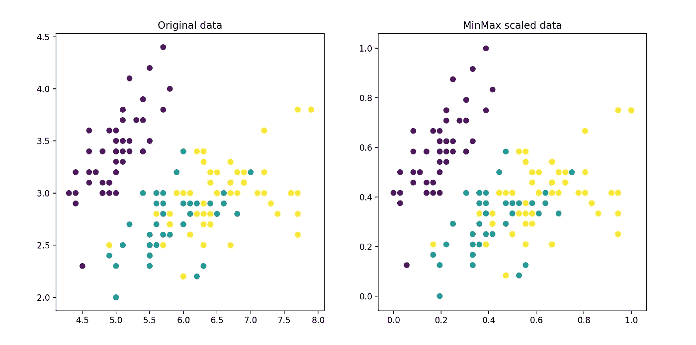
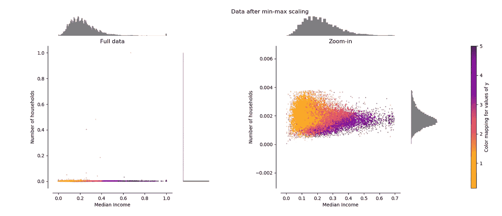

# 关于最小-最大归一化，您需要知道的一切:Python 教程

> 原文：<https://towardsdatascience.com/everything-you-need-to-know-about-min-max-normalization-in-python-b79592732b79?source=collection_archive---------2----------------------->

## 在这篇文章中，我解释了什么是最小-最大缩放，何时使用它，以及如何使用 scikit-learn 在 Python 中实现它，但也可以从**scratch**手动实现。



作者用 Python 创建的图。

# 介绍

这是我关于在机器学习(ML)模型拟合之前经常使用的**标准化**技术的第二篇文章。在我的第一篇[文章](https://medium.com/@seralouk/how-scikit-learns-standardscaler-works-996926c2c832)中，我使用 scikit-learn 的`StandardScaler`函数介绍了标准化技术。如果您不熟悉标准化技术，只需点击[这里](/how-scikit-learns-standardscaler-works-996926c2c832)即可在 3 分钟内学会要领。

在**现在的**帖子中，我将使用 scikit-learn(函数名:`[MinMaxScaler](https://scikit-learn.org/stable/modules/generated/sklearn.preprocessing.MinMaxScaler.html)`)解释第二个最著名的**归一化**方法，即 ***最小-最大缩放*** 。

# 方法的核心

另一种标准化输入特征/变量的方法是**最小-最大**缩放器(除了*标准化*缩放特征使其具有`μ=0`和`σ=1`)。通过这样做，所有特征将被转换到**范围****【0，1】**中，这意味着**特征** / **变量**的**最小值**和**最大值**将分别为 **0** 和 **1** 。

如果你想在交互式路线图和活跃的学习社区的支持下自学数据科学，看看这个资源:【https://aigents.co/learn

# 为什么要在模型拟合之前进行归一化？

规范化/标准化背后的主要思想总是相同的。在**不同的******尺度下**测量的**变量**对模型拟合** &模型学习函数的贡献不相等，可能最终产生**偏差**。因此，为了处理这个潜在的问题，通常在模型拟合之前使用特征标准化，例如**最小最大**缩放。****

*这个可以* ***非常有用*** *对于一些 ML 模型像多层感知器(****【MLP】****)，其中***可以更***甚至* ***更快*****

*****注*** :基于树的模型通常不依赖于缩放，但非树模型模型如 SVM、LDA 等。往往非常依赖它。**

# **数学公式**

****

**最小-最大缩放的数学公式。作者创造的形象。这里，x 表示单个特征/变量向量。**

# **Python 工作示例**

**这里我们将使用通过 scikit-learn 获得的著名的`iris`数据集。**

*****提醒*** : scikit-learn 函数期望输入一个 numpy 数组`X`，其维数为`[samples, features/variables]`。**

```
**from sklearn.datasets import load_iris
from sklearn.preprocessing import MinMaxScaler
import numpy as np# use the iris dataset
X, y = load_iris(return_X_y=True)
print(X.shape)
# (150, 4) # 150 samples (rows) with 4 features/variables (columns)# build the scaler model
scaler = MinMaxScaler()# fit using the train set
scaler.fit(X)# transform the test test
X_scaled = scaler.transform(X)# Verify minimum value of all features
X_scaled.min(axis=0)
# array([0., 0., 0., 0.])# Verify maximum value of all features
X_scaled.max(axis=0)
# array([1., 1., 1., 1.])# Manually normalise without using scikit-learn
X_manual_scaled = (X — X.min(axis=0)) / (X.max(axis=0) — X.min(axis=0))# Verify manually VS scikit-learn estimation
print(np.allclose(X_scaled, X_manual_scaled))
#True**
```

# **视觉示例中的变换效果**

```
**import matplotlib.pyplot as pltfig, axes = plt.subplots(1,2)axes[0].scatter(X[:,0], X[:,1], c=y)
axes[0].set_title("Original data")axes[1].scatter(X_scaled[:,0], X_scaled[:,1], c=y)
axes[1].set_title("MinMax scaled data")plt.show()**
```

****

**Iris 数据集前两个特征的最小最大缩放效果。图由作者用 Python 制作。**

**很明显，在**最小-最大缩放**(右图)之后，特性值在和**范围【0，1】**内**。****

# **scikit-learn 网站的另一个可视化示例**

****

**最小最大缩放效果。图摘自 scikit-learn [文档](https://scikit-learn.org/stable/auto_examples/preprocessing/plot_all_scaling.html):[https://scikit-learn . org/stable/auto _ examples/preprocessing/plot _ all _ scaling . html](https://scikit-learn.org/stable/auto_examples/preprocessing/plot_all_scaling.html)**

# **摘要**

*   **使用最小最大值缩放时要记住的一件重要事情是，它受到我们数据中最大值和最小值的**高度影响**，因此如果我们的数据包含**异常值**，它就会有**偏差**。**
*   **`MinMaxScaler`重新调整数据集，使所有特征值都在范围[0，1]内。**这是以独立的方式按功能完成的**。**
*   **`MinMaxScaler`缩放可能**在一个**窄的**范围内压缩**所有**内联者**。**

# **如何处理异常值**

*   **手动方式(不推荐):目视检查数据，并使用异常值剔除统计方法剔除异常值。**
*   **推荐方法:使用`[RobustScaler](https://scikit-learn.org/stable/modules/generated/sklearn.preprocessing.RobustScaler.html)`来缩放特征，但在这种情况下，使用对异常值稳健的**统计。该缩放器根据**分位数**范围**范围**(默认为 **IQR** :四分位间距)移除**中值**和**缩放**数据。*IQR 是第一个四分位数(第 25 个四分位数)和第三个四分位数(第 75 个四分位数)之间的范围。*****

**今天就到这里吧！希望你喜欢这第一个帖子！下一个故事下周开始。敬请关注&注意安全。**

> **——我的邮件列表只需 5 秒:[https://seralouk.medium.com/subscribe](https://seralouk.medium.com/subscribe)**
> 
> **-成为会员支持我:[https://seralouk.medium.com/membership](https://seralouk.medium.com/membership)**

# ****最新帖子****

**[](/roc-curve-explained-using-a-covid-19-hypothetical-example-binary-multi-class-classification-bab188ea869c) [## 用新冠肺炎假设的例子解释 ROC 曲线:二分类和多分类…

### 在这篇文章中，我清楚地解释了什么是 ROC 曲线以及如何阅读它。我用一个新冠肺炎的例子来说明我的观点，我…

towardsdatascience.com](/roc-curve-explained-using-a-covid-19-hypothetical-example-binary-multi-class-classification-bab188ea869c) [](/support-vector-machines-svm-clearly-explained-a-python-tutorial-for-classification-problems-29c539f3ad8) [## 支持向量机(SVM)解释清楚:分类问题的 python 教程…

### 在这篇文章中，我解释了支持向量机的核心，为什么以及如何使用它们。此外，我还展示了如何绘制支持…

towardsdatascience.com](/support-vector-machines-svm-clearly-explained-a-python-tutorial-for-classification-problems-29c539f3ad8) [](/pca-clearly-explained-how-when-why-to-use-it-and-feature-importance-a-guide-in-python-7c274582c37e) [## PCA 清楚地解释了——如何、何时、为什么使用它以及特性的重要性:Python 指南

### 在这篇文章中，我解释了什么是 PCA，何时以及为什么使用它，以及如何使用 scikit-learn 在 Python 中实现它。还有…

towardsdatascience.com](/pca-clearly-explained-how-when-why-to-use-it-and-feature-importance-a-guide-in-python-7c274582c37e) [](/how-and-why-to-standardize-your-data-996926c2c832) [## Scikit-Learn 的标准定标器如何工作

### 在这篇文章中，我将解释为什么以及如何使用 scikit-learn 应用标准化

towardsdatascience.com](/how-and-why-to-standardize-your-data-996926c2c832) 

# 请继续关注并支持我

如果你喜欢这篇文章并且觉得它有用，请**关注**我和**为**我的故事鼓掌支持我！

# 资源

在这里并排查看所有 scikit-learn 规范化方法:[https://sci kit-learn . org/stable/auto _ examples/preprocessing/plot _ all _ scaling . html](https://scikit-learn.org/stable/auto_examples/preprocessing/plot_all_scaling.html)

# 参考

[1][https://sci kit-learn . org/stable/modules/generated/sk learn . preprocessing . minmax scaler . html](https://scikit-learn.org/stable/modules/generated/sklearn.preprocessing.MinMaxScaler.html)

[2][https://sci kit-learn . org/stable/auto _ examples/preprocessing/plot _ all _ scaling . html](https://scikit-learn.org/stable/auto_examples/preprocessing/plot_all_scaling.html)

[3][https://sci kit-learn . org/stable/modules/generated/sk learn . preprocessing . robust scaler . html](https://scikit-learn.org/stable/modules/generated/sklearn.preprocessing.RobustScaler.html)

# 和我联系

*   **领英**:[https://www.linkedin.com/in/serafeim-loukas/](https://www.linkedin.com/in/serafeim-loukas/)
*   **研究之门**:[https://www.researchgate.net/profile/Serafeim_Loukas](https://www.researchgate.net/profile/Serafeim_Loukas)
*   **EPFL**简介:[https://people.epfl.ch/serafeim.loukas](https://people.epfl.ch/serafeim.loukas)
*   **堆栈**溢出:[https://stackoverflow.com/users/5025009/seralouk](https://stackoverflow.com/users/5025009/seralouk)**