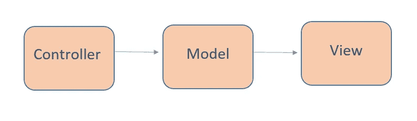
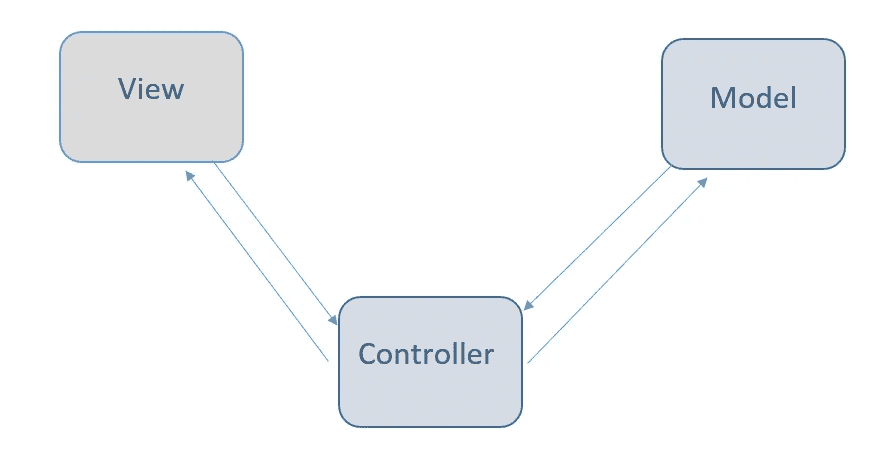

# 关于 MVC 架构你需要知道的一切

> 原文：<https://towardsdatascience.com/everything-you-need-to-know-about-mvc-architecture-3c827930b4c1?source=collection_archive---------1----------------------->

## MVC 如何工作的一般解释。

MVC 被认为是一种架构模式，它包含三个部分模型、视图和控制器，或者更准确地说，它将应用程序分成三个逻辑部分:模型部分、视图和控制器。它曾用于桌面图形用户界面，但现在用于设计移动应用和网络应用。

## 历史

Trygve Reenskaug 发明了 MVC。关于 MVC 的第一份报告是他在 1978/79 年拜访施乐帕洛阿尔托研究实验室(PARC)的一位科学家时写的。起初，MVC 被称为“事物模型视图编辑器”,但很快就变成了“模型视图控制器”。

Tygrve 的目标是解决用户控制大型复杂数据集的问题。多年来，MVC 的实践已经发生了变化。由于 MVC 模式是在 web 浏览器之前发明的，最初被用作图形用户界面(GUI)的架构模式。

最初的 MVC

目前，MVC 被用于设计 web 应用程序。一些使用 MVC 概念的 web 框架:Ruby on Rails、Laravel、Zend framework、CherryPy、Symphony 等

# MVC 架构

MVC 是一种架构模式，这意味着它控制着应用程序的整个架构。即使它通常被称为设计模式，但如果我们只将其称为设计模式，我们可能是错误的，因为设计模式用于解决特定的技术问题，而架构模式用于解决架构问题，所以它影响我们应用程序的整个架构。

它有三个主要组件:
-模型
-视图
-控制器
，每个组件都有特定的职责

MVC 架构

使用 MVC 的主要原因是:首先，它不允许我们重复自己，其次，它有助于创建我们的 web 应用程序的坚实结构。

## 模型

它被称为最低级别，这意味着它负责维护数据。逻辑地处理数据，所以它基本上是处理数据。模型实际上是与数据库相连的，所以你对数据做的任何事情。添加或检索数据是在模型组件中完成的。它响应控制器的请求，因为控制器从不自己与数据库对话。该模型与数据库来回对话，然后将所需的数据提供给控制器。注意:模型从不与视图直接交流。

## 视角

数据表示由视图组件完成。它实际上为用户生成 UI 或用户界面。因此，在 web 应用程序中，当您想到视图组件时，只需想到 Html/CSS 部分。视图是由模型组件收集的数据创建的，但这些数据不是直接获取的，而是通过控制器获取的，因此视图只与控制器对话。

## 控制器

它被称为主要人员，因为控制器是实现视图和模型之间的互连的组件，所以它充当中介。控制器不必担心处理数据逻辑，它只是告诉模型做什么。从模型接收数据后，它对数据进行处理，然后将所有信息发送给视图，并向用户解释如何表示。注意:视图和模型不能直接对话。

## MVC 的优势

- MVC 架构将用户界面从业务逻辑和业务逻辑中分离出来
-组件是可重用的。
-易于维护。
-MVC 中应用程序的不同组件可以独立部署和维护。
-这种架构有助于独立测试组件。

## MVC 的缺点

——复杂度高。
-不适合小型应用。
-针对数据访问的低效率。

## 结论

所以 MVC 不是那么容易理解，实际上它真的很难，但不是不可能学会，每个开发人员在开发应用程序时都需要记住它。请记住，MVC 是一种将你的软件分成更小的组件的架构。模型处理数据和系统的逻辑。视图只显示数据，控制器维护模型和视图之间的连接。这种“划分”使可读性和模块化，以及它更容易测试部分。

只要记住这些要点:
-MVC 是一种架构模式，由三部分组成:模型、视图、控制器。模型:处理数据逻辑。
视图:向用户显示来自模型的信息。
控制器:控制数据流向模型对象，并在数据变化时更新视图。
——是 Trygve Reenskau 发明的。
-尽管它非常受欢迎，也确实有一些缺点，但主要的缺点是复杂。