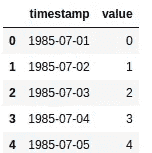
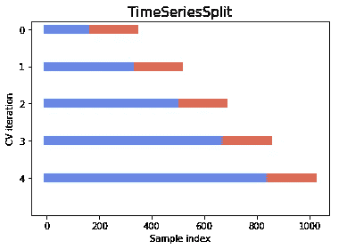
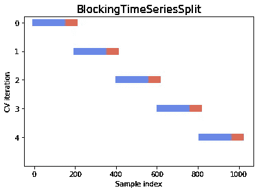

# 关于时间序列你需要知道的一切

> 原文：<https://towardsdatascience.com/everything-you-need-to-know-about-time-series-5fa1834d5b18?source=collection_archive---------13----------------------->

## 你能找到的最完整的时间序列分析介绍

在 [Unsplash](https://unsplash.com/s/photos/time?utm_source=unsplash&utm_medium=referral&utm_content=creditCopyText) 上由[智妍公园](https://unsplash.com/@greenpjy123?utm_source=unsplash&utm_medium=referral&utm_content=creditCopyText)拍摄的照片

> 很明显，我们拥有的最宝贵的资源是时间。—史蒂夫·乔布斯

# 介绍

收集的大多数数据都有时间结构。有时，这种结构是隐藏的，或者我们可以忽略它，但是，有一些方法可以使用这种时间结构从可用数据中提取相关信息。

知道如何对时间序列建模是数据科学中的一项基本技能，因为这种类型的数据有特定的结构，可以在所有情况下进行探索。

我放在本指南中的所有内容都可以在任何时间尺度上使用。请记住:每当我说天、周、小时或任何时间单位，你都可以理解为“周期”。那么，我们开始吧。

# 时间序列的结构

你如何知道你正在处理一个时间序列？一个**时间序列**是一系列按时间顺序索引的数据点。最简单的时间序列是这样的:

简单时间序列

其中的元素是:

*   时间戳:事件被注册时的时间标记。其准确性将取决于测量的事件。
*   价值:这种现象在那一刻的价值是什么？
    可以只是一个或多个值。当每个时间戳有多个值时，我们有一个多变量时间序列。

# 时间序列的类型

此外，知道时间序列有两种类型也很重要:

*   **有规律的时间序列**:在每个统一的时间段内都有记录的时间序列。一个每日的温度序列可以被认为是一个常规序列，因为我们期望每天一个记录，每单位时间一个记录。
*   **不规则时间序列**:没有规定频率的时间序列。一个例子是网站的访问日志。人们不是每隔 N 分钟就统一访问一次。在这种情况下，我们将拥有不同时间间隔的记录。

# 时间序列数据准备

## 特征工程

为了创建机器学习模型，我们需要输入变量(特征— X)和一个或多个输出变量(目标— y)。有四个基本特征，应该在任何时间序列问题上进行测试:

*   **滞后**:滞后特性就是简单地使用以前的目标值作为预测当前目标值的特性。例如，如果你想预测明天苹果股票的价格，今天的价格是一个非常强大的功能，这个案例是一个 lag 1 功能。或者，如果您的问题具有每周季节性，滞后七功能可能会非常有用。
*   **差异**:这个特性和 Lag 很相似。只是这里不用具体的数值，而是用上一期和上一期的差。例如，计算昨天售出的商品数量和上周同一天售出的商品数量之间的差异。最常见的运算是差(减)，但我们也可以使用和、比和乘法。
*   **统计特性**:除了对特定的值和算术运算，我们还可以计算平均值、标准差、最大值、最小值、分位数等统计量。在我们的销售示例中，我们可以计算在过去的七天中，该产品在一天中的最大销售量。这个想法很简单，取一个时间段的窗口，对各自的值应用一个函数。通常，这个函数应该为每个时间戳只返回一个数字。
*   **时间戳分解**:我们也可以提取时间戳的相关部分，通常是与它的季节性相关的东西。一些时期有特定于那个时刻的不同模式。一些经典的例子是圣诞节，黑色星期五，母亲节，父母，情人节。在这些日期之前的日子里，贸易中的销售有显著的增加。换句话说，在一年中的这个时候，总会有销售增长，模型需要知道这一点。我们可以创建诸如星期几、一个月中的某一天、一年中的某个月、一天中的某个时间等特征。

# 系统模型化

传统上，统计时间序列模型一次应用于一个序列。也就是说，您只有一系列的值，并应用期望的方法来建模生成它的过程。在 Data Science，我们也可以一次对一个序列建模，只需创建仅依赖于我们试图预测的序列值的特征。但是，我们也可以将时间序列堆叠起来，制作一个堆叠模型。这样，我们可以有单独的模型和堆叠的模型，因为单独的模型是传统的方法，我将详细解释堆叠方法。

## 堆叠建模

在这种情况下，我们不是为每个系列创建一个模型，而是将它们“堆叠”在一起，创建一个全局模型。我说的堆叠是什么意思？

假设我们有一系列 10 家公司一年的股票价格，每天一个记录。让我们把所有这些系列连接成一个。那么我们将有 10 家公司 x 365 天= 3650 行。“新系列”的每一行都有时间戳、公司标识和当时的销售额。

> 我们为什么要这样做？

*   **更多数据**:机器学习模型往往在数据量较大的情况下工作得更好。我们不是基于一些记录(在我们的例子中是 365 行)来建立模型，而是建立更多的行，让模型更健壮地捕捉模式。
*   **复杂性**:对于生产、监控模型、保持模型运行来说，维护一个模型比维护 10 个模型要简单得多。这降低了我们解决方案的复杂性，并避免了实现错误。
*   全球效应:同时使用几个系列，模型有机会捕捉它们之间的共同事件。全球效应，发生在几个系列，将更清楚，更容易捕捉。

# 确认

当我们处理时间序列模型时，我们不能进行错误的验证，而严重错误的验证是很常见的。如果你只是简单地随机划分你的数据，就像我们在很多课程中学到的那样，你会得到一个看起来非常好的结果，但它实际上不会在生产中重现。这是因为你将混合过去和未来的线，让你的模型知道未来的信息来预测过去！这样，在生产中，就没有办法得到时间机器，得到这些信息。

另外，整个过程受时间影响。有些更快，有些更慢，因此我们需要了解我们的模型将如何应对将要发生的变化。

> 你可能想知道:整个过程真的会随着时间而改变吗？

即使是图像分类器也会受到影响，因为用于拍照的设备总是在变化。

通常，与人类行为直接或间接相关的模型往往变化更快，需要以一定的频率更新(重新训练)。正确的频率取决于具体情况。一般来说，时间序列打破了线独立性的假设。也就是说，来自邻近线的信息倾向于给出关于我们选择的线的目标的提示。

因此，在训练和测试之间划分时间数据的最简单但已经相当健壮的方法是按日期划分。你可以选择一个特定的日期或一部分数据，通常前 70%用于训练，30%用于验证。甚至，我们可以做一个时间序列交叉验证吗？

## 时间序列交叉验证

不要只使用一个分割来验证我们的模型，最好使用至少三个交叉验证折叠来这样做，总是按照时间戳来分割数据。

通常，越新的数据对模型越重要。我们可以使用两种类型的“窗口”来验证我们的模型:

*   **可扩展窗口:**这意味着久而久之，我们的训练数据将会增加。下图可以很好的说明这个过程。

*   **滑动窗口:**在这个格式中，以及在特征的计算中，我们将滑动一个固定的窗口，由数据预先定义。滑动窗口让您对将要使用的数据有更多的控制，使您的管道在重新训练时更加健壮。即使你有很多年的数据，也不代表你需要用所有的东西来训练模型。

简单交叉验证的一个缺点是，我们正在验证未来的“某个版本”,那些真正发生过的版本，在一个小时间的变化后迭代每个版本。但在某些情况下，未来可能会有所不同。

在金融市场建模的案例中，这种情况经常发生。总的来说，你需要寻找不同金融体系(高、低和停滞)的时间段来验证你的模型。

越来越受欢迎的一种方法是跨块验证。一般而言，在验证中重复使用数据样本的重采样方法往往更加稳健。

在时间序列的情况下，由于我们希望保留结构，但模拟不同的场景，我们需要在不进行随机混合的情况下获取数据块，并且这些数据块在交叉验证折叠之间不能有交集。最重要的是，随着时间的推移，一起生成的线保持在一起。这些可以在下图中看到:

# 模型

一些机器学习模型似乎更适合时间序列数据。

## 树形系综

这里我们讨论的是任何结合几个决策树进行预测的模型。最流行的是随机森林和梯度提升决策树。

在竞赛和行业项目中，我们看到这些模型很容易发现时间序列中的模式，对噪声具有鲁棒性，并且由于其捕捉非线性模式的高能力，能够提取与目标几乎不相关的特征值。

## 神经网络

多层感知器(MLP)神经网络是最传统的，可以用来创建基本上任何性质的模型。但是有一些类型可以直接处理字符串。

## **卷积神经网络**

最初是为了处理图像而创建的，但是它们在时间序列案例中的使用越来越普遍。基本上，他们最终会学习在卷积窗口内乘以原始特征的滤波器。这意味着我们可以使用学习表示的能力来建模时间序列。

与递归网络相比，它们训练速度更快，需要调整的参数(权重)更少。尽管如此，在大多数神经网络的情况下，随着数据量的增长，它们往往会工作得更好。小样本值得一试，但不要指望它能创造奇迹。

## **递归神经网络(RNN)**

今天最流行的是长-短时记忆(LSTM ),是专门针对顺序数据的，时间序列也是如此。这个想法是，不仅当前的例子可以影响结果，过去例子的“记忆”也可以帮助预测。

这些网络往往相当复杂，有大量的参数需要调整，这使得它们需要大量的样本才能达到良好的效果。同时，它们非常灵活，允许在进入和退出期间的数量之间有多种架构组合。

## 衰减时间

每个时间序列预测都试图理解人类的相互作用。如果建模的系统改变了任何逻辑，则训练的模型将随着时间的推移而出现性能衰减。有些模型会衰减很快，有些则很慢。

要测量您的模型随着时间的推移表现如何，请尝试监控其性能，并在性能下降到阈值以下时重新训练它。

衰减的速度会因您处理的问题类型而异，例如，金融模型可能需要在短时间内重新训练，而预测天气的模型可以在较长时间后重新训练。

有一些更可靠的方法来判断何时重新训练时间序列模型，然而，这篇文章已经足够长了。总有一天我会在这里写一篇关于它的文章。

# 结论

最常见的数据之一与时间有关。对于数据科学家来说，它们是理解如何正确探索、准备、提取好的特征、验证和建模这类数据的基础。

有了这里提出的想法，你一定能够使用时间序列的机器学习来创建高性能和稳健的模型。

我希望这个概述可以帮助一些人，因为现在我只会留下一本书的推荐和一个好的报价。

# 读时间系列的书很好:

时间序列预测(Francesca Lazzeri):【https://amzn.to/2R7qGko T2

Python 速成班(Eric Matthes):【https://amzn.to/38gJtPI 

用于数据分析的 Python(韦斯·麦金尼):[https://amzn.to/2tpgevz](https://amzn.to/2tpgevz)

> 很明显，我们拥有的最宝贵的资源是时间。—史蒂夫·乔布斯

# 参考资料:

时间序列 CV 数字来自:[https://hub . packtpub . com/cross-validation-strategies-for-time-Series-forecasting-tutorial/](https://hub.packtpub.com/cross-validation-strategies-for-time-series-forecasting-tutorial/)