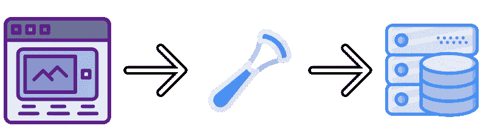
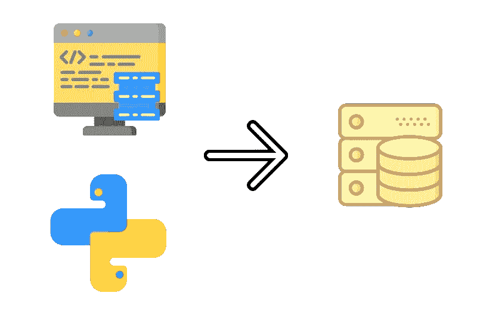
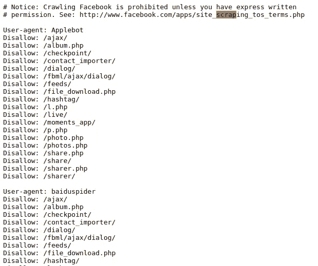
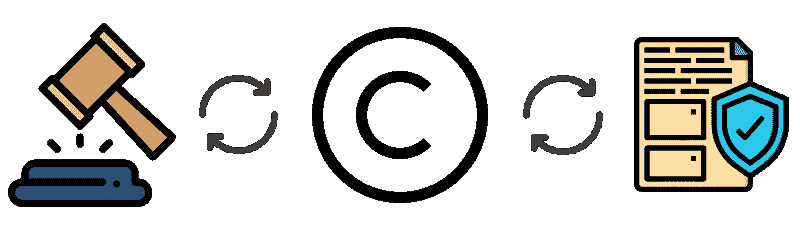
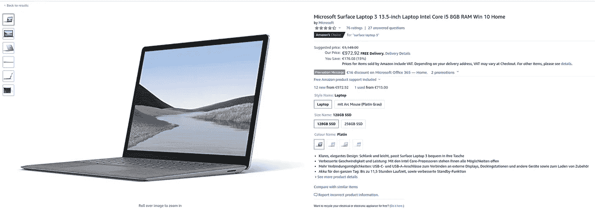
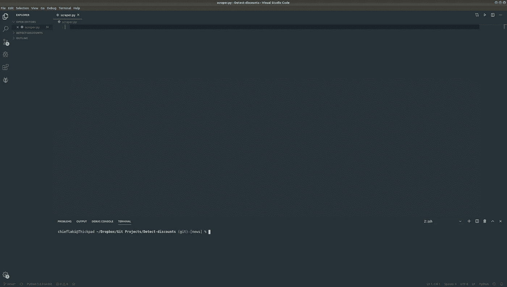
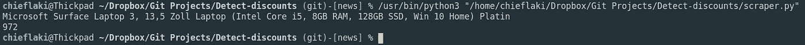

# 关于网络抓取，你需要知道的一切

> 原文：<https://towardsdatascience.com/everything-you-need-to-know-about-web-scraping-6541b241f27e?source=collection_archive---------4----------------------->


如今，无论你走到哪里，都有机器在为人类做事。随着技术和生产的发展，许多事情很容易实现自动化。我们现在正需要这些，为什么你不能让自己也轻松一点呢？

这正是**网页抓取**的目的。这是一个用来从网上网页获取数据的术语。
一旦你得到了你想要的数据，你可以用它做很多事情，这取决于你，但在这篇文章中，我想回顾一下网络抓取的一些最佳用法，并回答一些关于这个话题的一般性问题。

## 什么是网页抓取？

Web 抓取是一种从网站上获取大量数据的方法，这些数据可以用于任何类型的数据处理和操作。

对于这项技术，我们使用 web 浏览器。您通常没有获得所需数据的内置选项。这就是为什么我们使用 Web 抓取来自动获取数据，而不必手动操作。网络抓取是一种自动化这一过程的技术，这样就不用手动从网站上复制数据。



## 网络搜集的好处和用途

如前所述，用这种方法你可以一次获得大量数据，但这不是它的唯一用途。

如果你能从网站上获得数据，想象一下你能做什么。数据操作是这里的关键。

以下是一些例子:

**分析**:收集数据，做一个分析工具，跟踪你的数据。你可以用这个方法进行研究。甚至可能用机器学习或更复杂的想法来预测行为([如何用 Python 制作分析工具](/how-to-make-an-analysis-tool-using-python-c3e4477b6d8) ) **价格比较**:从不同的网站获取价格并进行比较，以了解市场概况，这样您就可以省钱！([如何用 Python 省钱](/how-to-save-money-with-python-8bfd7e627d13) )
**邮件列表**:收集邮件地址，用于营销和促销目的。你每天都会收到很多来自你从未听说过的公司的电子邮件，这就是原因。
**工作**:找工作真的很难，因为招聘信息分散在不同的网站上，令人困惑
**社交媒体**:从脸书、Instagram 或 Twitter 等网站搜集数据。为了获得关注者/不关注者的数量或当时的趋势。

这些是网络抓取的一些最常见的用法，这些是我的想法，但是根据你的工作和网站的使用情况，你可能会有一些关于如何实现它的其他想法！关键是你的工作流程中自动化程度越多(T2)，对你就越好。


## 网页抓取的最佳编程语言

显然**巨蟒**。你可以使用很多不同的库来抓取网页。其中一些是:

**Selenium** :这个库使用 [Web Driver for Chrome](https://chromedriver.chromium.org/) 来测试命令和处理网页以获得你需要的数据。(使用示例:[如何使用 Python 制作分析工具](/how-to-make-an-analysis-tool-using-python-c3e4477b6d8)如果您想了解更多信息[25 个 Selenium 函数，让您成为 Web 抓取专家](/top-25-selenium-functions-that-will-make-you-pro-in-web-scraping-5c937e027244))
**beautiful soup**:用于从 HTML 和 XML 文件中提取数据的 Python 库。它创建了数据解析树以便于获取数据。(用法举例:[如何用 Python 省钱](/how-to-save-money-with-python-8bfd7e627d13) )
**熊猫**:用于数据提取和操纵。通常，对于数据库，它将数据保存为某种格式。

这不仅仅是因为 Python 有库，而且 Python 是最容易使用的语言之一，也是最强大的语言之一。



## 法律问题

有些网站允许刮痧，有些不允许。

为了检查网站是否支持网页抓取，您应该在目标网站的 URL 末尾添加“/robots.txt”。

它会告诉你关于网站的所有细节，包括关于刮擦的信息，这里有一个例子:

> [https://www.facebook.com/robots.txt](https://www.facebook.com/robots.txt)



在这种情况下，你必须查看专门的网页抓取网站。

始终注意**版权**并仔细阅读 [**合理使用**](https://policy.medium.com/medium-terms-of-service-9db0094a1e0f) 。



## 简单的例子

现在我们已经基本上涵盖了网络抓取的所有要点，让我们创建一个简单的网络抓取使用示例。

如果你想要一些具体的东西，可以看看这方面的高级例子:[如何用 Python 制作分析工具](/how-to-make-an-analysis-tool-using-python-c3e4477b6d8)和[如何用 Python 省钱](/how-to-save-money-with-python-8bfd7e627d13)。

相反，我们将制作一个简单的脚本来从一个网站获取一些数据！类似于这篇[文章](/how-to-save-money-with-python-8bfd7e627d13)，我们会从网站上得到价格和标题。

让我们直接开始吧！

# 编码

## 规划流程

首先，我们必须找到我们想要跟踪的项目。我发现这台[笔记本电脑](https://www.amazon.de/dp/B07XVWXW1Q/ref=as_li_ss_tl?keywords=laptop&qid=1581888312&sr=8-10&linkCode=ll1&tag=idk01e-21&linkId=ad48d5399e4ea9900aaf7ad0c7d18066&language=en_GB)很贵。

[](https://www.amazon.de/dp/B07XVWXW1Q/ref=as_li_ss_tl?keywords=laptop&qid=1581888312&sr=8-10&linkCode=ll1&tag=idk01e-21&linkId=d10b42ed1a55732865ceed01edc0e898&language=en_GB)

我的代销商产品链接

为此，我们需要几个库，所以让我们来设置环境。

## 设置环境

一旦我们完成了一个项目搜索，我们打开编辑器。我个人选择的是 [Visual Studio 代码](https://code.visualstudio.com/)。它简单易用，可定制，并且对你的计算机来说很轻。

打开一个新的**项目**，创建一个新文件。这是一个我的看起来能帮助你的例子:



在 VS 代码中，有一个“Terminal”选项卡，您可以使用它打开 VS 代码中的内部终端，这对于将所有内容放在一个地方非常有用。

在终端中，您应该安装库:

```
*pip3 install requests*
```

**可以使用请求**,这样您就可以通过简单的 Python 库添加内容，如标题、表单数据、多部分文件和参数。它还允许您以同样的方式访问 Python 的响应数据。

```
sudo pip3 install beautifulsoup4
```

**Beautiful Soup** 是一个 Python 库，用于从 HTML、XML 和其他标记语言中获取数据。

```
pip3 install smtplib
```

**smtplib** 模块定义了一个 SMTP 客户端会话对象，该对象可用于向任何带有 SMTP 或 ESMTP 监听器守护进程的互联网机器发送邮件。

## 创建工具

我们已经设置好了一切，现在我们要编码了！

首先，如前所述，我们必须导入已安装的**库**。

```
*import* requests*from* bs4 *import* BeautifulSoup*import* smtplib
```

在这种情况下，我们需要使用两个变量，即 **URL** 和**标题**。
URL 将是我们产品的链接，标题将是用户代理，我们将使用它来访问正确版本的浏览器和机器。要找出你的浏览器用户代理，你可以在这里做。只需替换“用户代理”部分之后的链接，并像我一样用单引号括起来。

```
URL = '[https://www.amazon.de/dp/B07XVWXW1Q/ref=sr_1_10?keywords=laptop&qid=1581888312&sr=8-10](https://www.amazon.de/dp/B07XVWXW1Q/ref=sr_1_10?keywords=laptop&qid=1581888312&sr=8-10)'In order to fix that we are going to do some text permutations or parsing.For title we are going to use .split() function:print(title.strip())
And for our price:sep = ','
con_price = price.split(sep, 1)[0]
converted_price = int(con_price.replace('.', ''))
We use sep as the separator in our string for price and convert it to integer (whole number).headers = {"User-agent": 'Mozilla/5.0 (X11; Linux x86_64) AppleWebKit/537.36 (KHTML, like Gecko) Chrome/79.0.3945.130 Safari/537.36'}
```

接下来，我们将使用 URL 和请求库的标题来定义页面。

```
page = requests.get(URL, headers=headers)soup = BeautifulSoup(page.content, 'html.parser')
```

这将得到我们想要的链接，现在我们只需找到页面上的元素，以便将它们与希望的价格进行比较。

```
title = soup.find(id="productTitle").get_text()price = soup.find(id="priceblock_ourprice").get_text()
```

为了找到页面上的元素，我们使用 soup。**找到**()函数，用。get_text()。
**标题**和**价格**我们要为程序的输出进行节省，让它看起来很好看。

现在，元素看起来很奇怪，因为在我们需要的文本前后有太多的空格。

为了解决这个问题，我们将进行一些文本置换或**解析**。

对于**标题**我们将使用。**拆分**()功能:

```
print(title.strip())
```

而对于我们的**价格**:

```
sep = ','con_price = price.split(sep, 1)[0]converted_price = int(con_price.replace('.', ''))
```

我们使用 **sep** 作为价格字符串中的分隔符，并将其转换为整数。



下面是完整的代码:

> 我们完了！


如果你想了解更多关于硒功能的知识，试试这里的！

我希望你喜欢这个小教程，并关注我更多！

感谢阅读！

[](https://medium.com/@lazar.gugleta)

跟着我上[媒](https://medium.com/@lazar.gugleta)

[](https://twitter.com/intent/user?screen_name=LazarGugleta)

在推特上关注我