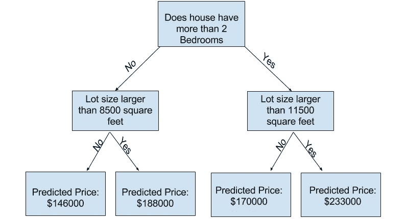
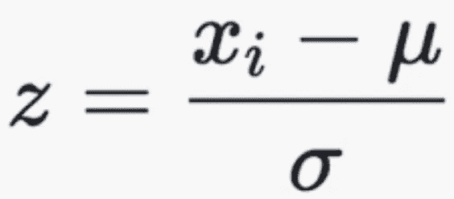
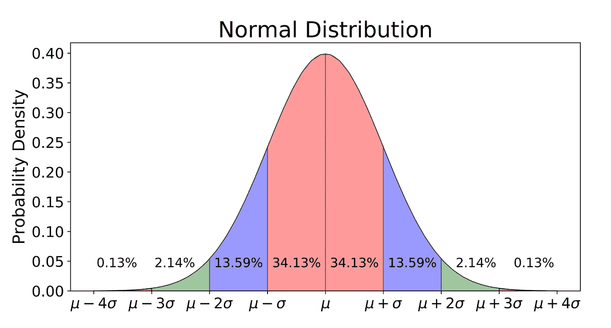
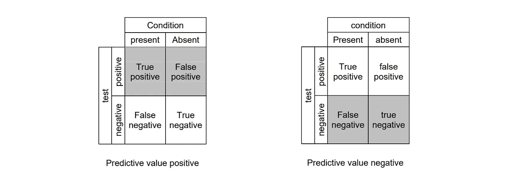
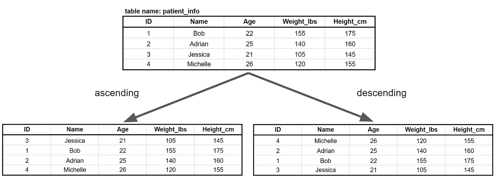

# 在 20 分钟内成为一名数据科学家需要了解的基础知识

> 原文：<https://towardsdatascience.com/everything-you-need-to-know-to-be-a-data-scientist-explained-in-20-minutes-2738ecbc6829?source=collection_archive---------20----------------------->

## 关于成为数据科学家所需了解的广泛速成课程


图片由[皮克斯拜](https://pixabay.com/?utm_source=link-attribution&utm_medium=referral&utm_campaign=image&utm_content=3706562)的 Gerd Altmann 提供

这篇文章是一个广泛的速成班，我认为这是成为一名数据科学家需要知道的一些最基本和最有用的概念。我已经把它分成了不同的部分，这样你就可以一点一点地看了。

好吧，这并没有涵盖**与数据科学相关的一切**(那是不可能的),不，这应该是**而不是**你用来发展知识和技能的唯一资源…

然而，如果你一无所知，那么这将有助于你很好地理解数据科学的基础知识。如果您对数据科学有所了解，这可以作为一门紧凑的速成课程，用于复习、磨练您的知识和/或找出您知识中的差距。

一如既往，我希望这能对您有所帮助，并祝您在数据科学事业中好运！

# 目录

1.  [机器学习模型](#d0a6)
2.  [统计数据](#be81)
3.  [概率](#9411)
4.  熊猫
5.  [SQL &查询](#1886)
6.  [奖金内容](#723f)

# 1.机器学习模型


机器学习模型的基本分段

所有的机器学习模型被分类为**监督的**或**非监督的**。如果模型是监督模型，那么它被细分为**回归**或**分类**模型。我们将讨论这些术语的含义以及下面每个类别中对应的模型。

# 监督学习

**监督学习**涉及学习基于示例输入-输出对将输入映射到输出的函数。

例如，如果我有一个包含两个变量的数据集，年龄(输入)和身高(输出)，我可以实现一个监督学习模型，根据年龄预测一个人的身高。


监督学习的例子

重复一下，在监督学习中，有两个子类别:回归和分类。

# 回归

在**回归**模型中，输出是连续的。下面是一些最常见的回归模型。

## 线性回归


线性回归的例子

线性回归的概念就是找到一条最符合数据的直线。线性回归的扩展包括多元线性回归(例如，找到最佳拟合的平面)和多项式回归(例如，找到最佳拟合的曲线)。你可以在我的[上一篇文章](https://medium.com/swlh/predicting-life-expectancy-w-regression-b794ca457cd4)中了解更多关于线性回归的知识。

## 决策图表



图片来自 Kaggle

**决策树**是一种流行的模型，用于运筹学、战略规划和机器学习。上面的每个方块被称为一个**节点**，节点越多，你的决策树就越精确(一般来说)。决策树中做出决策的最后节点称为树的**叶**。决策树直观且易于构建，但在准确性方面有所欠缺。

## 随机森林

**随机森林**是一种基于决策树的[集成学习](https://en.wikipedia.org/wiki/Ensemble_learning)技术。随机森林包括使用原始数据的[自举数据集](https://machinelearningmastery.com/a-gentle-introduction-to-the-bootstrap-method/)创建多个决策树，并在决策树的每一步随机选择一个变量子集。然后，该模型选择每个决策树的所有预测的模式。这有什么意义？依靠“多数获胜”模型，它降低了单个树出错的风险。


例如，如果我们创建一个决策树，第三个，它会预测 0。但是如果我们依赖所有 4 个决策树的模式，预测值将是 1。这就是随机森林的力量。

StatQuest 做了一项了不起的工作，更详细地说明了这一点。见[此处](https://www.youtube.com/watch?v=J4Wdy0Wc_xQ&vl=en)。

## 神经网络


神经网络的可视化表示

一个**神经网络**是一个受人脑启发的多层模型。就像我们大脑中的神经元一样，上面的圆圈代表一个节点。蓝色圆圈代表**输入层，**黑色圆圈代表**隐藏层，**绿色圆圈代表**输出层。隐藏层中的每个节点代表一个输入经过的函数，最终导致绿色圆圈中的输出。**

神经网络实际上是非常复杂和非常数学化的，所以我不会进入它的细节，但…

饶彤彤的文章对神经网络背后的过程给出了直观的解释(见[此处](/understanding-neural-networks-19020b758230))。

如果你想更进一步，理解神经网络背后的数学，请点击这里查看这本免费的在线书籍。

如果你是一名视觉/音频学习者，3Blue1Brown 在 YouTube 上有一个关于神经网络和深度学习的惊人系列[这里](https://www.youtube.com/watch?v=aircAruvnKk)。

# 分类

在分类模型中，输出是离散的。下面是一些最常见的分类模型。

## 逻辑回归

逻辑回归类似于线性回归，但用于模拟有限数量结果的概率，通常为两个。在对结果的概率建模时，逻辑回归比线性回归更常用，原因有很多(见[此处](https://stackoverflow.com/questions/12146914/what-is-the-difference-between-linear-regression-and-logistic-regression))。实质上，逻辑方程是以这样一种方式创建的，即输出值只能在 0 和 1 之间(见下文)。


## 支持向量机

一个**支持向量机**是一种监督分类技术，它实际上可以变得非常复杂，但在最基本的层面上是非常直观的。

让我们假设有两类数据。支持向量机将找到一个**超平面**或两类数据之间的边界，该边界使两类数据之间的间隔最大化(见下文)。有许多平面可以分隔这两个类别，但只有一个平面可以最大化类别之间的边距或距离。


如果你想了解更多细节，Savan 在这里写了一篇关于支持向量机的文章。

## 朴素贝叶斯

朴素贝叶斯是数据科学中使用的另一种流行的分类器。背后的想法是由贝叶斯定理驱动的:


虽然有许多关于朴素贝叶斯的不切实际的假设(这就是为什么它被称为‘朴素’)，但它已经被证明在大多数情况下都是有效的，而且构建起来也相对较快。

如果你想了解更多，请点击[这里](/naive-bayes-classifier-81d512f50a7c)。

## 决策树，随机森林，神经网络

这些模型遵循与前面解释的相同的逻辑。唯一区别是输出是离散的而不是连续的。

# 无监督学习


与监督学习不同，**非监督学习**用于从输入数据中进行推断和发现模式，而不参考标记的结果。无监督学习中使用的两种主要方法包括聚类和降维。

# 使聚集


摘自 GeeksforGeeks

聚类是一种无监督的技术，涉及数据点的分组，或**聚类**。它经常用于客户细分、欺诈检测和文档分类。

常见的聚类技术有 **k-means** 聚类、**分层**聚类、**均值漂移**聚类、**基于密度的**聚类。虽然每种技术在寻找聚类时有不同的方法，但它们的目标都是一样的。

# 降维

降维是通过获得一组主变量来减少所考虑的随机变量的数量的过程。简单来说，就是减少特性集的维数的过程(更简单来说，就是减少特性的数量)。大多数降维技术可以分为**特征消除**或**特征提取。**

一种流行的降维方法叫做**主成分分析。**

## 主成分分析

从最简单的意义上来说， **PCA** 涉及到将高维数据(如 3 维)投影到更小的空间(如 2 维)。这导致数据的维度降低(2 维而不是 3 维)，同时保持模型中的所有原始变量。

这涉及到相当多的数学问题。如果你想了解更多…

点击查看这篇关于 PCA [的精彩文章。](/a-one-stop-shop-for-principal-component-analysis-5582fb7e0a9c)

如果你宁愿看视频，StatQuest 在 5 分钟内解释 PCA[这里](https://www.youtube.com/watch?v=HMOI_lkzW08&vl=en)。

# 2.统计数字

# 数据类型

**数值:**用数字表示的数据；是可以衡量的。既可以是**离散**也可以是**连续**。

**分类:**定性数据分类成类别。可以是**名义**(未排序)或**序数**(排序数据)。

# 集中趋势测量

**均值:**一个数据集的平均值。
**中位数:**有序数据集的中间；不易受离群值的影响。
**模式:**一个数据集中最常见的值；仅与离散数据相关。


# 差异量数

**范围:**数据集中最高值和最低值之差。

**方差(σ2):** 测量一组数据相对于平均值的分布程度。


**标准差(σ):** 数据集中数字分布的另一种度量；它是方差的平方根。

**Z 值:**确定数据点偏离平均值的标准偏差数。



**R 平方:**拟合的统计度量，表明自变量解释了因变量的多少变化；仅对简单线性回归有用。


**调整后的 R 平方:**已针对模型中预测器的数量进行调整的 R 平方的修改版本；如果新项对模型的改进超过偶然的预期，那么它就会增加，反之亦然。

# 变量之间关系的度量

**协方差:**测量两个(或更多)变量之间的方差。如果是正的，那么它们倾向于向同一个方向移动，如果是负的，那么它们倾向于向相反的方向移动，如果它们是零，那么它们彼此没有关系。


样本的分母变为(n-1)

**相关性:**衡量两个变量之间的关系强度，范围从-1 到 1；协方差的标准化版本。一般来说，+/- 0.7 的相关性代表两个变量之间的密切关系。另一方面，介于-0.3 和 0.3 之间的相关性表明变量之间几乎没有关系。


# 概率分布函数

**概率密度函数(PDF):** 连续数据的函数，其中任意点的值可以被解释为提供随机变量的值等于该样本的*相对*可能性。([维基](https://en.wikipedia.org/wiki/Probability_density_function))

**概率质量函数(PMF):** 离散数据的函数，给出给定值出现的概率。

**累积密度函数(CDF):** 告诉我们一个随机变量小于某个值的概率的函数；PDF 的积分。

# 连续数据分布

**均匀分布:**所有结果可能性相等的概率分布。

**正态/高斯分布:**通常称为钟形曲线，与 [**中心极限定理**](https://en.wikipedia.org/wiki/Central_limit_theorem) 有关；平均值为 0，标准偏差为 1。



**T-分布:**在样本量较小和/或总体方差未知时用于估计总体参数的概率分布(*参见更多* [*此处*](https://stattrek.com/probability-distributions/t-distribution.aspx) *)。*

**卡方分布:**卡方分布统计量(*见* [*此处*](https://stattrek.com/probability-distributions/chi-square.aspx) *)。*

# 离散数据分布

**泊松分布:**概率分布，表示给定数量的事件在固定时间段内发生的概率。

**二项式分布:**一系列 n 次独立经历中成功次数的概率分布，每次经历都有自己的布尔值结果(p，1-p)。

# 朋友圈

**矩**描述了分布的性质和形状的不同方面。一阶矩是均值**，二阶矩是方差**，三阶矩是偏度**，四阶矩是峰度**。********

# 准确(性)

**真阳性:**检测条件出现时的条件。

**真否定:**不检测条件不存在时的条件。

**假阳性:**检测条件不存在时的条件。

**假阴性:**在条件存在时不检测条件。

**灵敏度:**又称**召回**；当条件存在时，测量测试检测条件的能力；灵敏度= TP/(TP+FN)

**特异性:**测量当条件不存在时，测试正确排除条件的能力；特异性= TN/(TN+FP)


**预测值正:**又称**精度**；对应于条件存在的阳性比例；PVP = TP/(TP+FP)

**预测值阴性:**对应于条件不存在的阴性比例；PVN = TN/(TN+FN)



# 假设检验和统计显著性

*查看我的文章《尽可能简单地解释假设检验》获得更深入的解释* [*这里*](/hypothesis-testing-explained-as-simply-as-possible-6e0a256293cf) *。*

**零假设:**样本观察值纯属偶然的假设。

**备选假设:**样本观测值受某种非随机原因影响的假设。

**P 值:**假设零假设正确，获得某个检验的观测结果的概率；较小的 p 值意味着有更强的证据支持替代假设。

**α:**显著性水平；当零假设为真时拒绝零假设的概率—也称为**1 型错误。**

**贝塔:**2 型错误；未能拒绝虚假的零假设。

假设检验的步骤:
1。陈述无效假设和替代假设。确定测试规模；是单尾还是双尾检验？
3。计算测试统计和概率值
4。分析结果，拒绝或不拒绝零假设(*如果 p 值大于α，不拒绝零假设！)*

# 3.可能性

概率是事件发生的可能性。

**条件概率【P(A | B)】**是一个事件发生的可能性，基于前一个事件的发生。

**独立事件**是其结果不影响另一事件结果概率的事件；P(A|B) = P(A)。

**互斥事件**是不能同时发生的事件；P(A|B) = 0。

**贝叶斯定理:**确定条件概率的数学公式。*“给定 B 的概率等于给定 A 的 B 的概率乘以 A 的概率超过 B 的概率”。*


## **概率的八大法则**

*   规则#1:对于任何事件 A，**0≤P(A)≤1**；*换句话说，一个事件发生的概率范围可以从 0 到 1。*
*   规则 2:所有可能结果的概率总和总是等于 1。
*   规则#3: **P(非 A)= 1—P(A)**；*这个规则解释了一个事件的概率和它的补事件之间的关系。补充事件是指包含 a 中没有的所有可能结果的事件。*
*   规则#4:如果 A 和 B 是不相交事件(互斥)，那么 **P(A 或 B)= P(A)+P(B)**；*这被称为不相交事件的加法规则*
*   规则#5: **P(A 或 B) = P(A) + P(B) — P(A 和 B)**；这就是所谓的一般加法法则。
*   规则#6:如果 A 和 B 是两个独立事件，那么 **P(A 和 B)= P(A)* P(B)**；*这叫做独立事件的乘法法则。*
*   规则#7:给定事件 A，事件 B 的条件概率为 **P(B|A) = P(A 和 B) / P(A)**
*   规则#8:对于任意两个事件 A 和 B， **P(A 和 B)= P(A)* P(B | A)**；*这被称为通用乘法法则*

## **计数方法**


**阶乘公式:n！= n x(n-1)x(n-2)x…x 2 x 1** 当项目数等于可用的位置数时使用。找出 5 个人可以坐在 5 个空座位上的总数。
= 5×4×3×2×1 = 120

**基本计数原理(乘法)** 当允许重复且填充空位的方式数不受之前填充的影响时，应使用此方法。早餐有 3 种，午餐有 4 种，甜点有 5 种。组合总数= 5 x 4 x 3 = 60

**排列:P(n，r)= n！/(n r)！** 此方法用于不允许替换且项目排序重要的情况。 *例如，一个代码有 4 个数字，按特定顺序排列，数字范围从 0 到 9。如果一个数字只能用一次，有多少种排列？
P(n，r) = 10！/(10–4)!=(10 x 9 x 8 x 7 x 6 x 5 x 4 x 3 x2 x 1)/(6x 5 x 4 x 3 x2 x 1)= 5040*

**组合公式:C(n，r)=(n！)/[(n r)！r！]** 当不允许替换并且项目的排列顺序不重要时使用。要赢得彩票，你必须以从 1 到 52 的任何顺序选择 5 个正确的数字。有多少种可能的组合？
C(n，r) = 52！/ (52–5)!5!= 2598960

# 4.熊猫

**Pandas** 是 Python 中的一个软件库，用于数据操作和分析。这在数据科学领域是普遍现象，必须了解！下面是学习熊猫基本功能的指南。

# 设置

## 导入熊猫库

```
import pandas as pd
```

# 创建和读取数据

## 创建数据框架

数据帧只是一个由多个数组组成的表。在下面的示例中，代码将创建一个包含 ABC 和 DEF 两列的表。

```
pd**.DataFrame**({'ABC':[1,2,3],'DEF':[4,5,6]},index=[1,2,3])
```

## 创建一个系列

系列是一系列值，也称为列表。从视觉角度来看，想象它是表格中的一列。

```
pd**.Series**([1,2,3],index=[], name ='ABC')
```

## 将 CSV 文件读入数据帧

获取数据的最常见方式。这将 CSV 文件转换为数据帧。

```
# example
df = pd**.read_csv**("filename.csv", index_col=0)
```

## 将数据帧转换为 CSV 文件

反之亦然，如果您想将 DataFrame 转换成 CSV，可以使用下面的代码:

```
# example
df**.to_csv**("filename.csv", index_col=0)
```

## 确定数据帧的形状

这将告诉您数据帧有多大，格式是什么(行，列)。

```
df**.shape()**
```

## 查看数据帧的前 5 行

如果你想直观地了解数据帧的样子。head() 返回给定数据帧的前 5 行。

```
df**.head()**
```

## 查看一列或多列的数据类型

```
# For one column
df.variable**.dtype**# For all columns
df**.dtypes**
```

## 将列转换为另一种数据类型

如果您想将整数转换成浮点数(反之亦然)，这是很有用的。

```
df.variable**.astype()**
```

# 操作数据帧

## 从数据帧中选择系列

```
# a) Method 1
df.property_name# b) Method 2
df['property_name']
```

## 索引系列

```
# if you want to get the first value in a series
df['property_name'][0]
```

## 基于索引的选择

基于索引的选择根据数据在数据帧中的数字位置检索数据。它遵循行优先，列第二的格式。Iloc 的索引方案是这样的:**的第一个数字是包含性的**，而**的最后一个数字是排他性的**。

```
df**.iloc[]**
```

## 基于标签的选择

基于标签的选择是索引数据帧的另一种方式，但它基于实际数据值而不是数字位置来检索数据。Loc 的索引方案使得**的第一个和最后一个值都包含在内。**

```
df**.loc[]**
```

## 使用现有列设置索引

因为基于标签的选择依赖于数据帧的索引，所以可以使用**。set_index()** 将一列分配给索引。

```
df.**set_index**("variable")
```

## 基于条件标签的选择

我们也可以使用基于标签的选择来过滤出数据帧。

```
# a) Single Condition 
df.loc[df.property_name == 'ABC']# b) Multiple conditions using AND
df.loc[df.property_name == 'ABC' & df.property_name == 'DEF']# c) Multiple conditions using OR
df.loc[df.property_name == 'ABC' | df.property_name == 'DEF']
```

## 选择值在值列表中的位置

我们也可以使用 **isin()** 来过滤数据帧。如果你懂 SQL，它类似于 WHERE ___ IN()语句。

```
df.loc[df.property_name **isin**(['ABC','DEF'])
```

## 选择值为空/不为空的位置

第一行代码将过滤 DataFrame，只显示属性名为 null 的行。
反之亦然，第二行代码用 filter it 使属性名不为空。

```
df.loc[df.property_name**.isnull**()]df.loc[df.property_name**.notnull()**]
```

## 添加新列

```
df['new_column'] = 'ABC'
```

## 重命名列

您通常会希望将列重命名为更容易引用的名称。使用下面的代码，列 ABC 将被重命名为 DEF。

```
df.**rename**(columns={'ABC': 'DEF'})
```

# 汇总函数

## 。描述()

这给出了数据帧或变量的高级摘要。它是类型敏感的，这意味着与字符串变量相比，数字变量的输出是不同的。

```
df**.describe()**
df.variable**.describe()**
```

## 。平均值()

这将返回变量的平均值。

```
df.variable**.mean()**
```

## 。唯一()

这将返回变量的所有唯一值。

```
df.variable**.unique()**
```

## 。值计数()

这显示了唯一值的列表以及数据帧中出现的频率。

```
df.variable.**value_counts()**
```

# 映射函数

## 。地图()

映射用于通过函数将一组初始值转换为另一组值。例如，我们可以使用映射将列的值从米转换为厘米，或者我们可以将这些值标准化。

。map()用于转换一个序列。

```
df.numerical_variable**.map()**
```

## 。应用()

。apply()类似于。map()，只是它转换整个数据帧。

```
df.numerical_variable**.apply()**
```

# 分组和排序

## 。groupby()

**获取变量的每个值的计数(*与 value_counts* 相同)**

```
df**.groupby**('variable').variable**.count()**
```

**获取变量的每个值的最小值**

```
df**.groupby**('variable').variable**.min()**
```

**获取变量**的每个值的汇总(长度、最小值、最大值)

```
df**.groupby**(['variable']).variable.**agg([len, min, max])**
```

**多重索引**

```
df.groupby(['variable_one', 'variable_two'])
```

## 对数据帧排序

**按一个变量排序**

```
df.**sort_values**(by='variable', ascending=False)
```

**多变量排序**

```
df.sort_values(by=['variable_one', 'variable_two'])
```

**按索引排序**

```
df**.sort_index()**
```

# 处理缺失数据

处理缺失数据是 EDA 中最重要的步骤之一。下面是一些处理缺失数据的方法。

## 删除包含空值的行

如果您有一个包含大量行的数据帧，并且您能够完全删除包含空值的行，那么。dropna()是一个有用的工具。

```
df.**dropna()**
```

## 删除包含空值的列

这与上面类似，除了它删除任何具有空值的**列**而不是行。

```
df.**dropna(axis=1)**
```

## 填充缺失值

如果您希望填充缺少的值，而不是完全删除行或列，可以使用下面的代码:

```
df.variable**.fillna**("n/a")
```

## 替换值

假设有一个数据帧，其中有人已经用“n/a”填充了缺失值，但是您希望用“unknown”填充缺失值。那么您可以使用下面的代码:

```
df.variable**.replace**("n/a", "unknown")
```

# 组合数据

## 。concat()

当您想要合并具有相同列的两个数据帧时，这很有用。例如，如果我们想将一月份的销售额和二月份的销售额结合起来分析长期趋势，您可以使用以下代码:

```
Jan_sales = pd.read_csv("jan_sales.csv")
Feb_sales = pd.read_csv("feb_sales.csv")**pd.concat**([Jan_sales, Feb_sales])
```

## 。加入()

如果您想要合并具有公共索引的两个列(例如 customer_id)，那么您可以使用。加入()。

使用上的参数**确定要连接的列。**

要确定它是左连接、右连接、内连接还是外连接，可以使用参数 **how** *。*

```
# example
table_1.**join**(table_2, on='customer_id', *how='left')*
```

*如果你不了解 SQL joins，在这里阅读*[](https://www.w3schools.com/sql/sql_join.asp)**。本质上是一样的想法。**

# *5.SQL 和查询*

## *定义*

***行**，也称为**记录，**是代表单个实体的属性(变量)的集合。例如，一行可能代表一个住院病人，可能有年龄、体重、身高等属性/变量…*

**

***表**是具有相同属性(相同变量)的行的集合。对我帮助最大的是把一个表格想象成一个 Excel 表格。*

**

*表格示例*

***查询**是从数据库表或表的组合中请求数据。使用上面的表格，如果我想找到所有年龄大于 23 岁的患者，我将编写一个**查询**。*

## *如何编写 SQL*

*因为这是一个初学者的教程，所以如果你想从一个表中提取数据，我将向你展示如何编写一个查询。*

*一个基本查询有五个组成部分**:***

1.  *选择(必填)*
2.  *从(必填)*
3.  *其中(可选)*
4.  *分组依据(可选)*
5.  *排序依据(可选)*

*其结构如下:*

```
***SELECT**
   [column_name_1],
   [column_name_2],
   [column_name_n]
**FROM**
   [table_name]
**WHERE**
   [condition 1]
**GROUP BY** [column_name] 
**ORDER BY** [column_name]*
```

*让我们带回我的例子作为参考:*

**

## *1.选择(必填)*

***SELECT 决定了要从给定的表中提取哪些列。**例如，如果我想提取名字，那么我的代码应该是这样的:*

```
*SELECT Name*
```

*一个巧妙的技巧是，如果你想提取所有的列，你可以使用星号——如下所示:*

```
*SELECT **
```

## *2.从(必填)*

**

***FROM 确定要从哪个表中提取信息。**例如，如果您想要提取患者的姓名，您可能想要从名为 patient_info 的表中提取数据(见上文)。代码看起来会像这样:*

```
*SELECT
   Name
FROM
   patient_info*
```

*这是您的第一个函数查询！让我们来完成另外 3 个可选步骤。*

## *3.其中(可选)*

*如果您想选择年龄超过 23 岁的患者的姓名，该怎么办？这就是我们的用武之地。 **WHERE 是用来过滤您的表**的语句，就像您在 Excel 中使用过滤工具一样！*

*获取 23 岁以上患者姓名的代码在左边。右侧显示了一个可视化表示:*

**

*如果您想要满足**两个**子句的患者姓名，您可以使用**和**。例如，查找年龄超过 23 岁且体重超过 130 磅的患者的姓名。*

```
*SELECT
   Name
FROM
   patient_info
WHERE
   Age > 23
   AND
   Weight_lbs > 130*
```

*如果您想要满足两个子句之一的患者姓名，您可以使用**或**。找出小于 22 岁或大于 23 岁的病人的名字。*

```
*SELECT
   Name
FROM
   patient_info
WHERE
   Age < 22
   OR
   Age > 23*
```

## *4.分组依据(可选)*

*GROUP BY 正如它所说的那样— **它将具有相同值的行分组到汇总行中**。它通常与计数、最小值、最大值、总和、AVG 等聚合函数一起使用。*

*让我们用下面的例子:*

**

*如果我们想得到每个病人去医院的次数，我们可以使用下面的代码并得到下面的结果:*

**

## *5.排序依据(可选)*

*ORDER BY 允许您根据特定属性或多个属性按升序或降序对结果进行排序。我们来举个例子。*

**

```
*SELECT
   *
FROM
   patient_info
ORDER BY
   Age asc*
```

*“ORDER BY Age asc”意味着您的结果集将按年龄以升序对行进行排序(参见上图中的左表)。如果你想按降序排列(上图的右边表格)，你可以用 **desc 代替 **asc** 。***

*现在你已经学习了基本结构，下一步是学习 SQL 连接，你可以在这里阅读。*

# *6.额外内容*

*如果你读到了最后，恭喜你！我希望这能激励你继续你的数据科学之旅。事实是，关于我写的每个主题，还有很多东西需要学习，但幸运的是，有成千上万的资源可供您使用！*

*下面是一些额外的资源和教程，您可以用它们来继续学习:*

*   *[**建立你的第一个机器学习模型并开始你的数据科学生涯的指南**](/a-guide-to-build-your-first-machine-learning-model-and-start-your-data-science-career-ef487f455c9) **:** 如果你从未创建过机器学习模型并且不知道从哪里开始，请参考这个。*
*   *[**探索性数据分析的详尽逐步指南**](/an-extensive-guide-to-exploratory-data-analysis-ddd99a03199e) :探索您的数据对于您使用的每个数据集都至关重要。通读这篇文章，了解什么是 EDA 以及如何进行 EDA。*
*   *[**如何用 Python 代码评价你的机器学习模型！**](/how-to-evaluate-your-machine-learning-models-with-python-code-5f8d2d8d945b) :创建你的机器学习模型是一回事。创造一个好的机器学习模型是另一件事。这篇文章教你如何评估你是否建立了一个好的机器学习模型。*
*   *[**超过 100 个数据科学家面试问答！**](/over-100-data-scientist-interview-questions-and-answers-c5a66186769a#6c1e) :一旦你建立了一个强大的数据科学组合，你觉得已经准备好找工作了，利用这个资源来帮助你准备找工作。*

# *感谢阅读！*

*如果你喜欢我的工作，想支持我…*

1.  *支持我的最好方式就是在**媒体**上[这里](https://medium.com/@terenceshin)关注我。*
2.  *在 **Twitter** [这里](https://twitter.com/terence_shin)成为第一批关注我的人之一。我会在这里发布很多更新和有趣的东西！*
3.  *此外，成为第一批订阅我的新 **YouTube 频道** [这里](https://www.youtube.com/channel/UCmy1ox7bo7zsLlDo8pOEEhA?view_as=subscriber)！*
4.  *在 **LinkedIn** [这里](https://www.linkedin.com/in/terenceshin/)关注我。*
5.  *在我的**邮箱列表** [这里](https://forms.gle/UGdTom9G6aFGHzPD9)注册。*
6.  *看看我的网站，[**terenceshin.com**](https://terenceshin.com/)。*