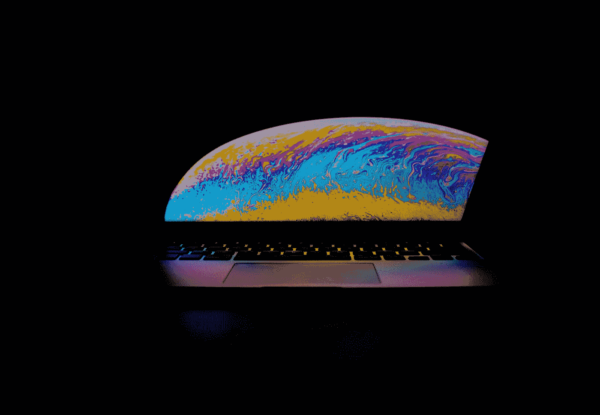

# 从零到英雄学习 Python 所需的一切

> 原文：<https://towardsdatascience.com/everything-you-need-to-learn-python-from-zero-to-hero-3dc950cb1b4c?source=collection_archive---------5----------------------->

## 计算机编程语言

## 分享我用来学习 Python 的资源，从书籍、课程、播客到编码网站和文档

维克多·加西亚在 [Unsplash](https://unsplash.com?utm_source=medium&utm_medium=referral) 上拍摄的照片

在这个编程技能非常有利可图的时代，每个人都在利用互联网上的大量资源来学习编程。你不仅可以开发供你个人使用的程序，或者仅仅是为了构建一些东西，而且你还可以通过大量的实践和正确的关系不断增强你的技能，从而在知名公司如谷歌、特斯拉、亚马逊等赢得一席之地。

史蒂夫·乔布斯曾说过一句名言:

> “我认为每个人都应该学习如何给计算机编程(学习一种计算机语言)，因为它教你如何思考。”—史蒂夫·乔布斯

也就是说，我自己正在开发我的编程技能，更具体地说是 Python，这是目前最流行的编程语言之一。这就是为什么我搜遍了互联网，收集了这个动物园或个人收藏的资源，我将用它们来真正全面地掌握 Python。我不建议任何人从这个列表中学习每一个资源，因为一个人的时间是有限的，所以一定要选择几个你想使用的和你认为可以获得最大收益的资源。

有些书和在线课程是免费的，有些不是，所以在决定付费之前，一定要确保它们是你学习和发展的好投资。我希望这篇文章对任何想学习 Python 的人来说都是有用的资源。

## 目录

1.  书
2.  在线课程
3.  油管（国外视频网站）
4.  编码挑战
5.  博客和网站
6.  播客
7.  时事通讯
8.  IDEs 与环境

# 书

书籍是信息的驱动力，为一个更伟大、更有知识的社会提供动力。从书本中学习技能总是很棒的，因为它们是可靠和紧凑的。我发现编程和编码的书最好是电子书，这样更容易参考和使用。这里有几个我觉得对学习 Python 很有帮助的例子。

## 初学者

这构成了 python 的基础，从安装和设置 Python 到用类和函数(OOP)编写成熟的程序

*   [用 Python 自动化枯燥的东西(第二版)](https://automatetheboringstuff.com/2e/chapter0/) —这是一本免费的两部分书籍，涵盖了自动化计算机上单调任务的基础知识和项目，帮助初学者直接应用他们的知识。
*   [Python 速成教程(第二版)](https://ehmatthes.github.io/pcc_2e/regular_index/) — PCC 对概念有更详细的解释，也是一本分为两部分的书，第一部分是基础知识，从打印 hello world 到 OOP，从头开始编写类和函数，第二部分是 3 个有趣的小项目—创建游戏、可视化数据和 web 应用程序。
*   [Think Python 2e](https://greenteapress.com/wp/think-python-2e/)——Think Python 是前两本书的后续免费书籍，主要是因为它教你计算机科学的基础知识，并使用 Python 来实现这一目标。
*   [艰难地学习 Python 3](https://learnpythonthehardway.org/python3/)——这是编程初学者钻研 Python 的另一个选择。这并不困难，因为你不会理解任何东西，这是一种不同的学习方法，作者将其解释为“指导”，通过重复来培养技能。

## 中级/高级

这些包括更高级的概念，并教你如何编写 pythonic 代码以及项目和应用程序。

*   [学习 Python(第五版)](https://www.oreilly.com/library/view/learning-python-5th/9781449355722/) —这是一本厚重的书(1600 页)，比你从头到尾通读一遍的书更适合作为参考。当你想深入某个特定主题并了解它的全部内容时，这是一本很棒的书。
*   [有效的 Python](https://effectivepython.com) —写更好的 Python 的 90 种方法合集是本书的副标题，不言自明。这些技巧来自 Python 语言的老手，肯定会对您的开发有用。
*   [Python 食谱](https://www.oreilly.com/library/view/python-cookbook-3rd/9781449357337/) —这本书包含了无数应用程序的食谱(因此得名食谱)。这种食谱的合并是为那些想要测试最新工具的有经验的程序员准备的，因为每个主题都给你一个现成的代码块，以及解释
*   [流畅的 Python](https://www.oreilly.com/library/view/fluent-python/9781491946237/) —这本书帮助你对 Python 有一个很深的理解，并教你表现抽象和具体。它告诉你如何和为什么。它更加高级，并且期望您事先能够熟练地在可变项目中使用 Python。

## 数据科学

*   [从零开始的数据科学](/the-best-book-to-start-your-data-science-journey-f457b0994160) —如果你刚刚接触数据科学，从零开始的 DS 是一个很好的资源。要了解更多，请查看我的[文章](/the-best-book-to-start-your-data-science-journey-f457b0994160)。
*   [python like you mean it](https://www.pythonlikeyoumeanit.com/)—PLYMI 是一个免费资源，用于学习 Python 和 NumPy 的基础知识，因此它非常适合那些学习 Python 进行数据分析和机器学习的人。
*   [Python 数据科学手册](https://jakevdp.github.io/PythonDataScienceHandbook/)——这是一本免费手册，面向那些希望使用 Python 处理数据操作、转换、清理、可视化和机器学习模型的人，这些都是数据科学家的日常任务。Python 中科学计算的必备。
*   [用于数据分析的 Python](https://www.oreilly.com/library/view/python-for-data/9781449323592/)—以数据科学的数据分析部分为中心，介绍了解决大量数据分析问题的库。由熊猫图书馆的作者撰写，这本书解决了许多实际研究，是有抱负的分析师的理想选择。

## 机器学习

*   [机器学习 w Python 简介](https://www.oreilly.com/library/view/introduction-to-machine/9781449369880/) —这本书教你如何用 Python 和 scikit-learn 构建 ML 应用。它在光谱的实践方面，帮助你获得对 ML 的直观理解。
*   [使用 Scikit 动手操作 ML-学习& Tensorflow，第二版。](https://www.oreilly.com/library/view/hands-on-machine-learning/9781492032632/) —动手 ML 是一本学习和应用都很棒的书。读者可以应用他们的知识，接触 ML 世界中两个流行的框架。
*   [机器学习 w Python Cookbook](https://www.oreilly.com/library/view/machine-learning-with/9781491989371/) —从名字就能看出来，里面包含了很多让你在日常生活中应用 ML 的食谱。它让你超越理论和概念，并为你提供在实际应用中使用 ML 的工具。

## 算法

*   [Grokking Algorithms](https://livebook.manning.com/book/grokking-algorithms/table-of-contents/) —这是一本很棒的书，用直观的方式教你关于算法的知识，给出的代码例子都是用 python 写的。对于程序员来说，学习算法是至关重要的，因为它允许你考虑不同类型的算法在不同时间复杂度(大 O 符号)下的权衡。另外，它在 manning.com 是免费的
*   [使用 Python 的算法和数据结构解决问题](https://runestone.academy/runestone/books/published/pythonds/index.html)——这是一本学习算法和数据结构解决问题的免费电子书，是计算机科学的基础。

更简洁详细的列表，请看这篇[文章](https://realpython.com/best-python-books/)。

# 在线课程

在线课程就像大学教育一样，但是完全免费。MOOCs 的兴起对经济能力较差的社区非常有利，并提供了无数新的机会，这些机会曾经因贫困而不可能实现。网上学习是一种祝福和礼物，我们不应该把它视为理所当然。这里有一些我知道的很棒的 Python 课程。

## 介绍

*   [面向所有人的 Python](https://www.py4e.com)——可能是最受欢迎的 Python 入门课程。在 Coursera 和 YouTube 上，由 Charles Severance 教授。查看免费电子书。
*   [计算机科学和 Python 编程简介](https://ocw.mit.edu/courses/electrical-engineering-and-computer-science/6-0001-introduction-to-computer-science-and-programming-in-python-fall-2016/) —麻省理工学院的《计算机科学导论》是编程初学者学习 Python 计算和问题解决的绝佳课程。
*   [谷歌的 Python](https://developers.google.com/edu/python) —谷歌的 Python 课程是掌握 Python 基础或复习概念的一种快速而有趣的方式，它配有讲座视频、交互式代码和练习。
*   [FreeCodeCamp](https://www.freecodecamp.org/)——以免费课程和令人惊叹的 YouTube 教程闻名，FCC 最近发布了 Python 课程，供所有人免费学习。
*   实用 Python 编程 Github 上的一门免费课程，向您传授 Python 的实用知识，如处理数据、测试和调试，以及高级主题，如函数装饰器、静态和类方法。

## 数据科学和人工智能

*   [Python UMich](https://www.coursera.org/specializations/data-science-python)应用数据系统专业——该专业也非常受所有有抱负的数据科学家的欢迎，以 Python 授课，从基础到顶点项目，确保您做好充分准备并具备应用数据科学方法和技术的技能。
*   [计算思维和数据科学简介](https://ocw.mit.edu/courses/electrical-engineering-and-computer-science/6-0002-introduction-to-computational-thinking-and-data-science-fall-2016/)——这是用 python 讲授 cs 简介的延续，更侧重于计算思维和数据科学，也用 Python 讲授。
*   [CS50 用 Python 介绍 AI](https://www.edx.org/course/cs50s-introduction-to-artificial-intelligence-with-python)—CS50 是最著名的 CS 课程之一，它专注于使用 Python 中的机器学习，向您介绍算法和模型，这些算法和模型揭示了自动驾驶汽车、推荐系统等背后的隐藏机制。
*   构建人工智能(Building AI)——这门课程面向任何想要提高人工智能相关词汇和技能的人，包括非程序员和可以用 Python 编程的人。

## 深度学习

*   [fast.ai](https://www.fast.ai) — fast.ai 是一门非常受欢迎的免费学习深度学习的课程，大部分课程都是用 Python 和 PyTorch 教授的。如果你对自己的 python 能力以及对机器学习的良好理解有信心，fast.ai 是你迈向精通的下一步。

其他网站，如 [Dataquest.io](https://www.dataquest.io) 、 [Codeacademy](https://www.codecademy.com/catalog/language/python) 、 [Educative.io](https://www.educative.io/courses/learn-python-3-from-scratch) 、 [pluralsight](https://www.pluralsight.com/paths/python) 和 [Udemy](https://www.udemy.com/topic/python/) 都是很好的课程，有简明的路径让初学者轻松完成，但它们相当昂贵，所以这真的取决于偏好。

# 油管（国外视频网站）

YouTube 是互联网诞生以来最伟大的平台之一，尽管它有大量的错误信息、点击诱饵和成堆的广告。这仍然是学习新技能的最好方法之一，这里有一些 YouTube 频道，里面有令人惊叹的 Python 教程。

*   科里·斯查费——一个伟大的编程渠道，涵盖不同技能水平的主题，包括 Python、Git、开发环境、终端、SQL、JS、cs 等等。他的 [Python 播放列表](https://www.youtube.com/playlist?list=PL-osiE80TeTt2d9bfVyTiXJA-UTHn6WwU)有超过 140 个视频，并且还在增加，这对初学者来说是惊人的，非常实用。
*   [Sentdex](https://www.youtube.com/channel/UCfzlCWGWYyIQ0aLC5w48gBQ)——除了 python 教程，sent dex 还有涵盖机器学习、数据分析、web 开发、游戏开发等等的视频。他的 Python 教程范围很广，涵盖了[机器学习](https://www.youtube.com/playlist?list=PLQVvvaa0QuDfKTOs3Keq_kaG2P55YRn5v)的[非常基础的](https://www.youtube.com/playlist?list=PLQVvvaa0QuDeAams7fkdcwOGBpGdHpXln)到从头构建[神经网络](https://www.youtube.com/playlist?list=PLQVvvaa0QuDcjD5BAw2DxE6OF2tius3V3)。
*   [TechWithTim](https://www.youtube.com/c/TechWithTim/featured) —资源丰富多样的 Tim 拥有大量关于多种语言的教程，他的 python 教程涵盖了许多主题，包括构建[机器人](https://www.youtube.com/playlist?list=PLzMcBGfZo4-kdivglL5Dt-gY7bmdNQUJu)、[机器学习](https://www.youtube.com/playlist?list=PLzMcBGfZo4-mP7qA9cagf68V06sko5otr)、[聊天机器人](https://www.youtube.com/playlist?list=PLzMcBGfZo4-ndH9FoC4YWHGXG5RZekt-Q)、[神经网络](https://www.youtube.com/playlist?list=PLzMcBGfZo4-lak7tiFDec5_ZMItiIIfmj)，以及许多信息视频。
*   FreeCodeCamp——它以许多长且内容丰富的视频而闻名，这些视频帮助初学者从头开始创作。他们在这个[播放列表](https://www.youtube.com/playlist?list=PLWKjhJtqVAbnqBxcdjVGgT3uVR10bzTEB)中有很棒的 python 视频。
*   [德里克·巴纳斯](https://youtube.com/c/derekbanas)——一个伟大的 Youtuber 用户，他涵盖了大量编程主题，有一个关于 [ML 和数据科学](https://youtube.com/playlist?list=PLGLfVvz_LVvQy4mkmEvtFwZGg1S38MUmn)的惊人系列

# 编码挑战

编码挑战就像轻推，帮助你巩固你的知识，同时学会新的技巧来提高你的编码能力。虽然它在编码面试中使用并不是一个程序员能力的真实表现(通过足够的练习，一个人最终可以记住挑战的答案)，但它对培养编程的习惯很有帮助，并帮助你衡量你当前的能力。

*   伟大的用户界面和设计，我个人使用它，我认为它有一个伟大的概念，用它学习编程很有趣。
*   被许多公司用于工作面试的 HackerRank，一天一个问题会增加你到时候解决编码问题的机会。
*   [exercisem](https://exercism.io/)—一种在命令行界面中应对编码挑战的有趣方式。有一个 python Track，你可以选择实践模式或导师模式(导师对你的解决方案给出评论)
*   [Python 挑战赛](http://www.pythonchallenge.com)——初学者学习 Python 的一种有趣方式，当你被讲座视频和书籍搞得精疲力尽时很有用
*   [CheckIO](https://checkio.org) —面向初学者和高级程序员的编码游戏，在这里你可以通过使用 [Python](https://py.checkio.org/) 和 [TypeScript](https://js.checkio.org/) 解决引人入胜的挑战和有趣的任务来提高你的编码技能

更多的编码挑战网站，请查看我的文章[20 大编码挑战网站](/top-20-websites-for-coding-challenge-and-competition-in-2020-f667089a5b47)。

# 博客和网站

博客和网站是互联网上的信息口袋，就像图书馆里的书一样。有大量的程序员和资深人士对编程给出了惊人的解释和启发性的见解，还有教程和文档。在 StackOverflow、Reddit 和 Discord 这样的网站上，你可以与成千上万的其他初学者一起努力解决一个问题，或者完全被一位 10 年经验丰富的程序员的惊人的一行解决方案难倒。这里有一组在线 python 资源

## 在线指南/教程

*   [Python 的搭便车指南](https://docs.python-guide.org) —这是一本手工制作的指南，为 Python 开发新手和专家提供日常安装、配置和使用 Python 的最佳实践手册。
*   [全栈 Python](https://www.fullstackpython.com) —全栈是一个术语，基本上是关于构建和部署应用程序的能力，包括后端和前端。这本在线书籍可以帮助你将你的 Python 知识从小程序和代码片段变成一个成熟的 web 应用程序。现在你终于可以向你的朋友和家人展示你的技能了。
*   PythonProgramming.net[——一系列视频教程，指导你构建项目，从机器学习和游戏开发到量子计算机编程。](https://pythonprogramming.net)

## 备忘单

*   Python 的一个有趣的小备忘单。
*   [全面的 Python 备忘单](https://gto76.github.io/python-cheatsheet/)

## 博客

*   [行星巨蟒](https://planetpython.org)
*   [Ned Batchelder 博客](https://nedbatchelder.com/blog/)
*   [真正的蟒蛇](https://realpython.com)

## Python 官方网站

*   [Python 的官方教程](https://docs.python.org/3/tutorial/index.html#tutorial-index)
*   [Python 语言文档](https://docs.python.org/3/reference/index.html#reference-index)

## Github repos

*   [终极巨蟒](https://github.com/huangsam/ultimate-python)
*   [牛逼蟒蛇](https://github.com/vinta/awesome-python)
*   [给大家的 Python 资源](https://learnbyexample.github.io/py_resources/)

## Reddit

*   [r/learn python](https://www.reddit.com/r/learnpython/)—python 资源和子编辑的惊人列表[在这里](https://www.reddit.com/r/learnpython/wiki/index)。

## StackOverflow

*   [网站](https://stackoverflow.com/questions/tagged/python)

## 不和谐服务器

*   查看我的[文章](/top-20-data-science-discord-servers-to-join-in-2020-567b45738e9d),为 Python 和其他人加入服务器。

# 播客

播客是收听专家对话和讨论的免费门票，尽管其间偶尔会有赞助广告。堵车了？散步吗？每天从家坐一小时火车去上班？每天坚持听一些播客，如果你把它变成一种习惯，你会惊讶地发现你会学到多少东西，谢谢你的复利。

*   [Django 聊天](https://djangochat.com/)
*   [播客。__init__](https://podcastinit.com/)
*   [Python 字节](https://pythonbytes.fm/)
*   [试生产](https://runninginproduction.com/)
*   [跟我说说 Python](https://talkpython.fm/)
*   [测试和编码](https://testandcode.com/)
*   [真正的 Python 播客](https://realpython.com/podcasts/rpp/)

# 时事通讯

除了垃圾邮件和订阅，你已经好几个星期没联系了，高质量的时事通讯，像詹姆斯·克利尔的，可以非常足智多谋，帮助你保持知情。如果你已经每天都在查看你的电子邮件，为什么不在里面放些有用的信息呢？这里有一些建议。

*   [牛逼的 Python 简讯](http://python.libhunt.com/newsletter)
*   Pycoder 周刊
*   [Python 的把戏](https://realpython.com/python-tricks/)
*   [Python 周刊](http://www.pythonweekly.com/)
*   [真正的 Python 简讯](https://realpython.com/newsletter/)
*   [丹的 Python 简讯](https://dbader.org/newsletter)
*   [高级 Python 简讯](https://migrateup.com/)
*   [咬人的蟒蛇](http://newsletter.pythontips.com/)
*   [Python 拼图](https://finxter.com/)

# IDEs 与环境

要编程，你需要 ide 和对什么是虚拟环境的理解(基本上是用于不同类型项目的虚拟机，这样兼容性和版本控制就不会全乱了)。

*   [SublimeText3](https://www.sublimetext.com/3) —非常适合学习和编写小程序和代码，因为它快速且易于使用
*   Atom —另一个轻量级且设计精美的 IDE，非常适合小程序和代码。
*   py charm——python 程序员构建东西的伟大工具，它与 anaconda 无缝协作。PyCharm + Anaconda 是数据科学相关项目的实际组合，但是您也可以将它用于 python 项目。如果你想获得 Pycharm Professional，可以通过 GitHub 学生开发者包免费获得。
*   Anaconda——一个令人惊叹的免费应用程序，它可以帮助你在一个地方管理成千上万的库和包，并消除编程和版本控制的大部分痛苦。
*   [Visual Studio 代码](https://code.visualstudio.com/) —有些更喜欢 PyCharm，有些喜欢 VScode。这取决于你用它做什么。虽然 VScode 更轻量级，耗电更少。
*   [repl . it](https://repl.it/languages/python3)——当你只想在浏览器上快速运行或测试几行代码时，它是完美之选。
*   [Kaggle 笔记本](https://www.kaggle.com/notebooks)——伟大的数据科学相关的 python 代码。

# 摘要

照片由[丹妮尔·麦金尼斯](https://unsplash.com/@dsmacinnes?utm_source=medium&utm_medium=referral)在 [Unsplash](https://unsplash.com?utm_source=medium&utm_medium=referral) 上拍摄

如果你一直对脸书、Twitter、Instagram 等价值数十亿美元的应用程序是如何构建的感到好奇，那么开始学习永远不会太晚，学习编程不仅能启发你了解应用程序运行背后的隐藏层，还能赋予你创造自己喜欢的东西的能力。

互联网上有大量的资源可以学习你感兴趣和好奇的东西，尤其是在经济不景气和失业率上升的不确定时期。掌握一项新技能可以为你带来更多的工作机会。

在线学习最重要的是专注和注意力，这两者都被社交媒体、流媒体服务和人们经常跳舞的应用程序高度利用。是时候用提高生产力和时间管理的应用程序来收回你的注意力了， **Google Calendar** 用于规划你一天的时间块， **Todoist** 用于创建你的 todolist，**concept**用于写日志和笔记，以及定时器应用程序 **Forest** 用于激励你专注并在工作中获得流动。

我希望你觉得我的文章很有资源，并在下面的评论中留下你认为对学习 python 有帮助的任何其他资源。在我的下一篇文章中再见，注意安全！

# 欲了解更多资源，请访问:

 [## Stephen h67/python-resources-2019

### 9/6/20 更新了 Python 3 资源、书籍、网站、教程、代码挑战的精选列表。如果你有…

github.com](https://github.com/stephenh67/python-resources-2019)  [## 常规 Python 资源

### Python 速成班的指导原则是，“为了……你至少需要知道什么

ehmatthes.github.io](https://ehmatthes.github.io/pcc_2e/recommended_reading/general_python/) 

## 如果您对学习数据科学感兴趣，就从这两个系列开始吧！

 [## 如何“超级学习”数据科学—第 1 部分

### 这是一个简短的指南，基于《超学习》一书，应用于数据科学

medium.com](https://medium.com/better-programming/how-to-ultralearn-data-science-part-1-92e143b7257b)  [## 数据科学简介

### 关于什么是数据科学、大数据、数据和数据科学过程及其应用。

towardsdatascience.com](/the-data-scientists-toolbox-part-1-c214adcc859f) 

## 查看这些关于数据科学资源的文章。

 [## 2020 年你应该订阅的 25 大数据科学 YouTube 频道

### 以下是你应该关注的学习编程、机器学习和人工智能、数学和数据的最佳 YouTubers

towardsdatascience.com](/top-20-youtube-channels-for-data-science-in-2020-2ef4fb0d3d5)  [## 互联网上 20 大免费数据科学、ML 和 AI MOOCs

### 以下是关于数据科学、机器学习、深度学习和人工智能的最佳在线课程列表

towardsdatascience.com](/top-20-free-data-science-ml-and-ai-moocs-on-the-internet-4036bd0aac12)  [## 机器学习和数据科学的 20 大网站

### 这里是我列出的最好的 ML 和数据科学网站，可以提供有价值的资源和新闻。

medium.com](https://medium.com/swlh/top-20-websites-for-machine-learning-and-data-science-d0b113130068)  [## 开始数据科学之旅的最佳书籍

### 这是你从头开始学习数据科学应该读的书。

towardsdatascience.com](/the-best-book-to-start-your-data-science-journey-f457b0994160)  [## 数据科学 20 大播客

### 面向数据爱好者的最佳数据科学播客列表。

towardsdatascience.com](/top-20-podcasts-for-data-science-83dc9e07448e) 

# 联系人

如果你想了解我的最新文章[，请通过媒体](https://medium.com/@benthecoder07)关注我。

也关注我的其他社交资料！

*   [领英](https://www.linkedin.com/in/benthecoder/)
*   [推特](https://twitter.com/benthecoder1)
*   [GitHub](https://github.com/benthecoder)
*   [Reddit](https://www.reddit.com/user/benthecoderX)

请关注我的下一篇文章，记得**保持安全**！