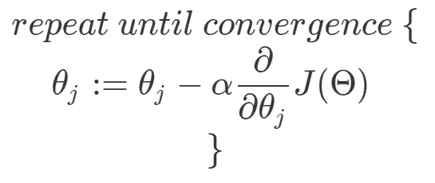

# 关于梯度下降你应该知道的一切

> 原文：<https://towardsdatascience.com/everything-you-should-know-about-gradient-descent-49ed9f247637?source=collection_archive---------45----------------------->

丹尼尔·里昂在 [Unsplash](https://unsplash.com?utm_source=medium&utm_medium=referral) 上的照片

## 这是数据科学中最流行的优化算法之一。你知道它是如何工作的吗？

# 我为什么要看这个？

大多数机器学习模型使用某种优化算法来寻找产生最小误差的参数，梯度下降可能是这些算法中最受欢迎的一种。

如果你是一名数据科学家或从事机器学习工作，你肯定会使用某种使用梯度下降的算法。即使您可能永远不会自己硬编码它，理解它是如何工作的可以帮助您理解为什么您的模型没有给出好的结果，甚至根本没有收敛。

# 它是如何工作的？

梯度下降寻找导致函数局部最小值的参数。在最大似然算法中，该函数通常是某种代价函数，与模型输出和实际观测值之间的差异有关。

## 直觉

梯度下降在函数中选择一个随机点，并开始向周围的最低点“行走”，直到它达到局部最小值。起点是产生一定成本(误差)的参数的随机组合。接下来的步骤就是在附近找一个这个成本更低的点，移动到这个点上。

想象你在黑暗中走在一座山上，试图找到可能的最低点。你慢慢摸索着路，试图一直走下去。斜坡越平缓，你走得越慢，因为你越期待它到达终点。

Gif 来自 [Gfycat](https://gfycat.com) 。

## 使其正式化

但是，在函数中搜索时，如何控制速度呢？利用函数在特定点的导数。

然后，您将使用成本函数 j(θ)在您现在所在点上的导数，按顺序更新您的函数参数θ，由⍺.进行调整

⍺是学习率(当算法“行走”时，你调整“步”的大小)。如果⍺太小，算法就会太慢。如果⍺太大，算法可能无法收敛甚至发散。

:=是一个赋值操作符，意味着我们把这样的值赋给变量。

所以，理想情况下，你希望自己的学习率尽可能高(这样你的算法运行得越快越好)，而不至于高到发散。下次你的模型不收敛的时候，试着用一个小一点的学习率。

# 替代版本

对于非常大的数据集，梯度下降在计算上非常昂贵，因为它必须在每次迭代中计算整个数据集的 J。因此，让我们来看看一些更适合大量数据的替代方法。

## 随机梯度下降

随机梯度下降从随机洗牌开始。这很重要，因为它将一步一步地阅读观察结果，所以它们不应该有任何特定的顺序。然后，它将只为第一次观察计算成本函数，并只基于该观察向最小值迈出第一步。对于第二次迭代，它将做同样的事情，仅仅基于第二次观察。依此类推，直到它到达训练集中的最后一个观察值。如果您有很多数据，这仍然应该在合理的时间内产生令人满意的结果。

## 小批量梯度下降

小批量版本介于随机版本和经典版本之间。这里，它不是在每次迭代中只使用一个训练示例，而是使用一个用户定义的参数，大小为 *b* 的小批量。这意味着，例如，如果我们设置 b = 10，我们将在每次迭代中使用 10 个观测值进行梯度下降。这有时实际上比随机版本更快。如果你仔细想想，你会发现随机版本实际上是迷你批量的特例，当 b = 1 时。

# 结论

现在你知道了梯度下降是如何工作的，你知道了当梯度下降不收敛时，如何通过改变学习速率来修复它，以及如何通过实现它的替代版本来使它更快。

如果你喜欢这篇文章，你可能也会喜欢其中的一篇:

 [## 线性回归:基础

### 回归技术帮助您测量变量的相关程度。他们允许你说，例如…

towardsdatascience.com](/linear-regression-the-basics-4daad1aeb845)  [## XGBoost:理论与实践

### 了解最流行的算法之一是如何工作的，以及如何使用它

towardsdatascience.com](/xgboost-theory-and-practice-fb8912930ad6) 

> 如果你想进一步讨论，请随时在 [LinkedIn](https://www.linkedin.com/in/melloarthur/) 上联系我，这将是我的荣幸(老实说)。