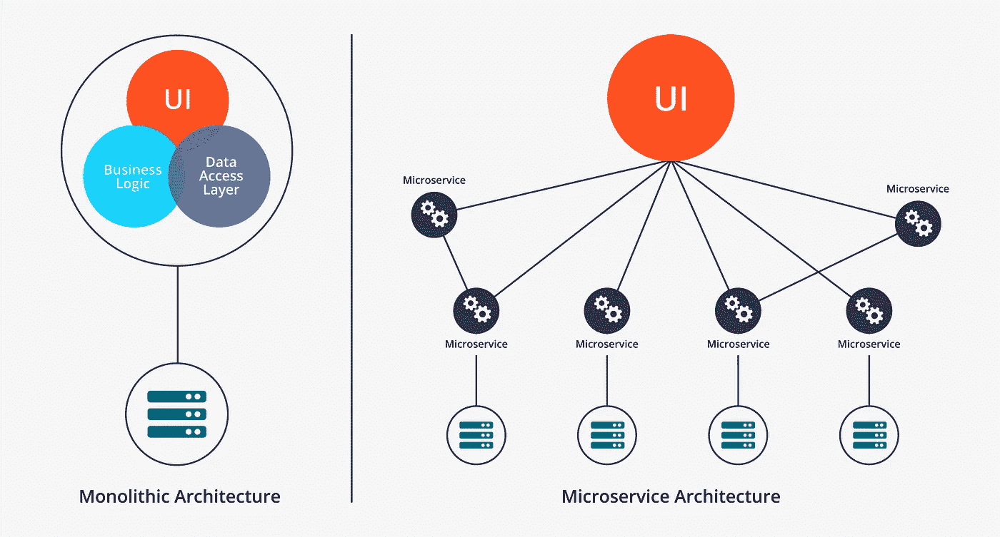

# 将整体架构迁移到微服务架构

> 原文：<https://towardsdatascience.com/evolution-from-monolithic-architecture-to-microservice-architecture-c58246822ea4?source=collection_archive---------20----------------------->

## 微服务、框架和设计的原则

## 我们为什么需要微服务？

微服务是这几天的热门话题。但是为什么大家都在说微服务呢？什么是单片架构，什么是微服务架构？我将通过从整体架构到微服务架构的迁移过程来解释这一点。我还将介绍微服务架构的特点、优势，以及它面临的一些挑战。

独石。[Zoltan·塔斯](https://unsplash.com/@zoltantasi?utm_source=medium&utm_medium=referral)在 [Unsplash](https://unsplash.com?utm_source=medium&utm_medium=referral) 上的照片

# 什么是整体架构？

整体架构意味着我们将应用程序的所有功能放在一个归档包中进行部署和运行。例如，如果你使用 Java，你所有的函数都打包到一个 Jar 包或 War 包中。这种风格的架构可以称为单一应用程序风格架构，也称为整体架构。

## 单片架构的优势

这种架构有什么优势？它有很多优点，包括相对简单，大家都熟悉。此外，它是 IDE 友好的。ide 通常被设计成可以轻松地开发、部署、调试和分析单个应用程序。它非常容易部署，例如，由于只有一个 war 包或 jar 包，或者一个可执行程序，您可以很容易地将其部署在一个目录或多个目录中。

## 整体架构的缺点

当然，这种整体架构也有其缺点。缺点主要在于系统的复杂性，尤其是网上商城、网上银行等复杂系统。**这些单个应用程序的代码库将会庞大而难以维护**，这也很难理解。

单片软件的代码很难理解。照片由 [Tim Gouw](https://unsplash.com/@punttim?utm_source=medium&utm_medium=referral) 在 [Unsplash](https://unsplash.com?utm_source=medium&utm_medium=referral) 上拍摄

况且由于代码基数特别大，**启动**要花很多时间。以前做单申请的时候，要半个小时才能开始，所以我们都有足够的时间去打乒乓球。

它缺乏可扩展性。由于所有的功能都放在同一个应用程序中，而如果我想改变一个微小的功能，比如我稍微修改了一下用户注册功能，但是后勤模块没有改变，甚至连后勤模块都没有改变，我不得不能够再次重新部署它，这是痛苦和低效的。

还有很多其他的缺点因为是单代码库，所以**我们只能用一个技术栈**，全 Java，全 C++，全 Python 等。，会有很多限制。这些都是单片架构的缺点。

# 如何解决单片架构的不足？

现在有这些不足，怎么解决呢？软件世界中的解决方案的方法论与通常的世界是一样的。当我们面对生活中复杂的问题时，我们的方法是**分而治之**，这和这个软件世界是一样的。整体架构简单来说就是 all in one，即将所有东西放在一起。如果我想解决这些问题，我必须通过一些划分。

首先，**垂直划分**会划分出完全不相关的应用。例如，用户注册模块和图片显示模块完全互不干扰。我们可以把它分成多个独立的模块，使它们耦合性更小。

分而治之是微服务之道。照片由 [Alex](https://unsplash.com/@worthyofelegance?utm_source=medium&utm_medium=referral) 在 [Unsplash](https://unsplash.com?utm_source=medium&utm_medium=referral) 上拍摄

当系统慢慢变得越来越复杂，单个模块可能更复杂的时候，我们可能会考虑再次分而治之，也就是**横分**。什么是水平分割？例如，物流模块可能需要访问用户信息，信贷模块可能也需要访问用户信息，等等。如果所有模块都访问同一个用户数据库，数据库负载将会非常高。因此，我们将它们横向划分，我们将所有与用户相关的放在一个较低级别的用户管理模块中，将与订单相关的放在一个订单管理模块中。这是解决单一架构缺陷的第二步。如果经过这两步划分，模块仍然非常复杂，我们将在系统中引入微服务模型。

整体架构与微服务架构

# 微服务模型

微服务模式目前没有一个严格的定义，但大致可以分为以下几个特征。**整个系统按照业务场景**来划分，比如刚才说的用户管理模块可能包括用户注册、用户登录等。我们根据业务场景来划分，这样它的扩展性可以更好。同时，**服务通过几种语言无关的机制进行通信**，包括 HTTP 的 RESTful 风格，这是常用的一种。

另外，**每个服务都是自主的。**简单来说，我的数据归我。仅作为示例，用户数据由用户管理模块管理。要让其他人访问用户数据，您需要其他人通过您的用户管理模块获取数据，而不是直接访问您的数据库。

还有一个特性，因为在它被分成越来越多的小服务之后，到最后，它的部署可能会比较困难，所以**微服务模型需要一个自动化部署的特性**。

划分服务，直到它们变得非常微小。Jo Szczepanska 在 [Unsplash](https://unsplash.com?utm_source=medium&utm_medium=referral) 上拍摄的照片

当然，当你开发越来越多的微服务时，你可能需要考虑一种方法来管理它们。比如一个城市以前只有一个企业，你可以很容易的联系上。但是当以后几千家或者几百家企业发展起来了，你不可能一个一个找出来处理。也许会有工商局。当我寻找这项服务时，我首先寻找公共局，寻找提供这项服务的公司，我会找到联系地址。然后我再找一家公司和他沟通。**这是集中管理的一个特点。**

接下来，**微服务**在不同机器上的分布当然是自然的，多个服务、多个机器、多个实例被部署形成一个分布式系统。基于这些特点，微服务是有优势的，而这正是单片架构所缺乏的。

另一个优势包括**对代码**的更好理解。以前所有的代码都放在一起，大家可能看不懂，很复杂。但是一个服务模块可能只有一个简单的功能，如用户注册、用户登录、信用查询等。如此简单的功能模块，**代码简单，易于维护，开发效率高。**还具有良好的扩展能力。例如，我想在注册过程中添加一个电子邮件通知。是的，不需要编辑用户注册码。

代码简单且易于维护。由[克里斯多佛·高尔](https://unsplash.com/@cgower?utm_source=medium&utm_medium=referral)在 [Unsplash](https://unsplash.com?utm_source=medium&utm_medium=referral) 拍摄的照片

**技术堆栈的选择更加灵活**，因为我们通过与语言无关的协议相互通信。比如商城推荐系统可以用流行的 Python 实现，商品管理系统还是用 Java。这没关系，因为通信协议是语言不可知的，这是它的优势之一。

另外，**版本更新更加敏捷**，因为每个模块都是单独维护的。

最重要的是**它更健壮**，这意味着如果单个模块挂起，不是所有模块都挂起。比如物流系统暂停了一个小时，但是我还可以进货，注册，登录。这对微服务来说是一个巨大的优势。

# 微服务的挑战

当然，世界上没有十全十美的事情。这些优势会带来一些其他的困难。微服务带来的困难有哪些？首先，**它的复杂度会更高**，因为它的服务众多，你管理起来会有困难。

此外，因为服务分布在不同的机器和不同的进程上，**它们的事务很难控制**。考虑像银行账户之间的现金转移这样的用例，用户从一个微服务中扣除了钱，然后调用另一个服务来转移现金。利用以前的整体架构，它可以确保通过数据库进行事务处理的即时性。那么如果是分布式的，**就需要通过复杂的机制来保证交易的即时性。**我会在后面的文章里继续说。

上千个微服务之间的连接会很麻烦。约翰·巴克利在 [Unsplash](https://unsplash.com?utm_source=medium&utm_medium=referral) 上拍摄的照片

另一个挑战是服务分工。**现在我们还没有一个如何划分的标准。**不同的公司甚至一个公司内的不同部门都会有各自的分工策略。

最后一个是部署。我刚刚提到，因为有更多的服务，**比单一架构更难部署**。过去，软件可能只有一个应用程序和一个服务，部署很容易。现在一个应用可能有上百甚至上千个服务，部署会有很大的挑战。

# 摘要

首先，我们简单介绍一下什么是单片架构，它的优点和缺点，我们必须继续通过分而治之的方法来解决它的缺点，然后逐渐演变为微服务架构，它的特点和优点为软件设计提供了巨大的改进。同时，我们还介绍了微服务架构实现这些优势将面临的一些挑战。