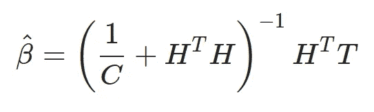
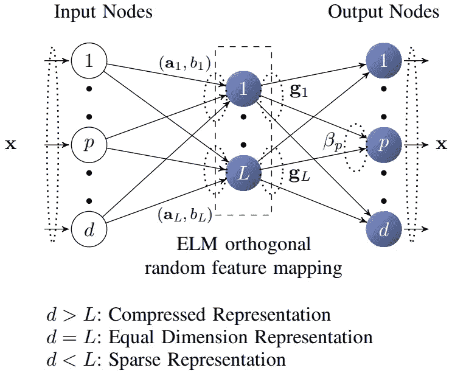
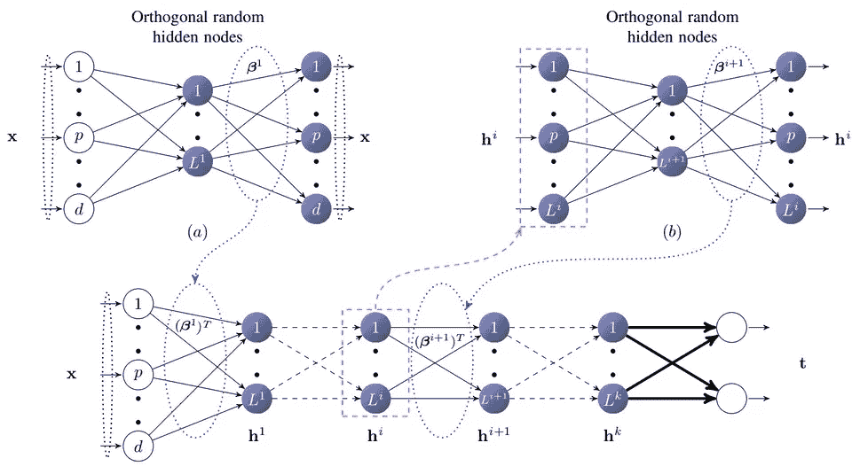
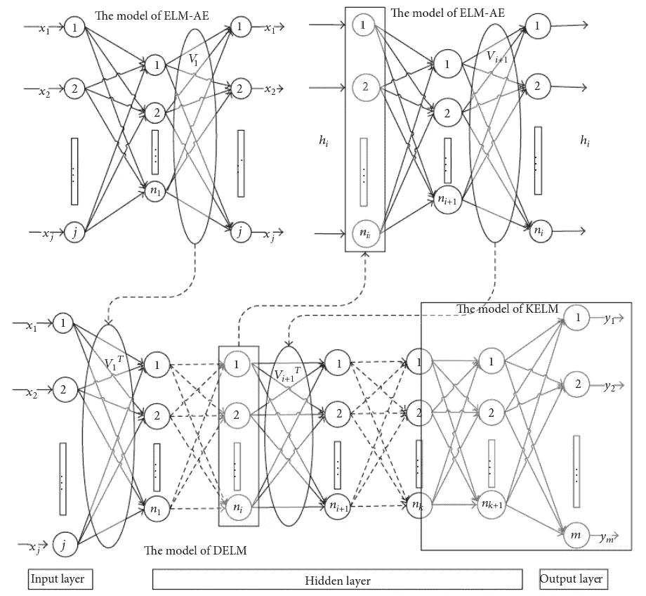

# 极限学习机的进化

> 原文：<https://towardsdatascience.com/evolution-of-extreme-learning-machines-2c7caf08e76b?source=collection_archive---------46----------------------->

## 理解 ML

## 这些年来榆树是如何进化的，现在它们的地位如何？

*多层结构。来源:* [*用榆树进行大数据的具象学习*](https://pdfs.semanticscholar.org/8df9/c71f09eb0dabf5adf17bee0f6b36190b52b2.pdf)

> *注意！这只是榆树进化的一个主要概述。它并没有包括所有可能的版本和这些年来对 ELMs 所做的调整。*

# 榆树是什么？

ELM(极限学习机)是前馈神经网络。于 2006 年由 *G. Huang* 发明，它基于逆矩阵近似的思想。

如果你不熟悉 ELMs，请先看看我的文章“[极限学习机简介](/introduction-to-extreme-learning-machines-c020020ff82b)”。

# 进化是什么时候开始的？

## [我-ELM (2006 年)](https://www.researchgate.net/profile/Chee_Siew/publication/6928613_Universal_Approximation_Using_Incremental_Constructive_Feedforward_Networks_With_Random_Hidden_Nodes/links/00b4952f8672bc0621000000.pdf)

*工字形榆树结构。来源:* [*增量式极限学习机的一种改进算法*](https://www.researchgate.net/publication/341365884_An_improved_algorithm_for_incremental_extreme_learning_machine)

在 2006 年的原始论文发表后，黄和他的同事们发表了另一篇关于不同类型的 ELM 的论文，称为 [I-ELM](https://www.researchgate.net/profile/Chee_Siew/publication/6928613_Universal_Approximation_Using_Incremental_Constructive_Feedforward_Networks_With_Random_Hidden_Nodes/links/00b4952f8672bc0621000000.pdf) (增量 ELM)。顾名思义，I-ELM 是标准 ELM 网络的增量版本。I-ELM 的想法很简单:

从 l=0 开始定义最大隐节点数 l 和期望训练精度*ϵ*(l 为当前隐节点数):

*   增量 l_t = l_{t-1} + 1
*   随机初始化新添加的隐藏神经元的权重 w_l 和偏置 b_l(不要重新初始化已经存在的神经元)
*   计算输出向量 H
*   计算权重向量 *β* ^
*   添加节点后计算错误
*   检查 E < *ϵ*
*   如果没有，则增加隐藏节点的数量，并重复该过程。

有一种可能是，l > L 在过程中的某一点和 *E* > *ϵ* 。此时，我们应该重复训练和初始化的整个过程。

增加网络大小的想法并不新鲜，通常比“手动”设置网络大小产生更好的结果。就 ELMs 而言，有一个缺点特别重要，那就是计算时间。如果你的网络碰巧很大(假设有 1000 个隐藏节点)，在更糟糕的情况下，我们必须进行 1000 次矩阵求逆。

如果您对 I-ELM 感兴趣，您应该知道它有许多变体:

*   II-ELM(改进的 I-ELM)
*   CI-ELM(凸 I-ELM)
*   EI-ELM(增强型 I-ELM)

我不打算一一解释，因为这篇文章应该只是一个快速总结和一个起点，而不是关于榆树所有变种的整本书。除此之外，可能每个阅读这篇文章的人都在这里，如果他/她知道要找什么，他/她知道如何找到关于一个有趣主题的更多信息:P

## [P-ELM (2008 年)](https://www.researchgate.net/publication/222429523_A_fast_pruned-extreme_learning_machine_for_classification_problem)

在引入 ELM 的增量版本之后，另一个改进是使用修剪来实现网络的最佳结构。P-ELM(修剪榆树)于 2008 年由荣海军引进。该算法从一个非常大的网络开始，并删除与预测无关的节点。“不相关”是指节点不参与预测输出值(即输出值接近 0)。这个想法能够产生更小的分类器，并且最适合模式分类。

## [埃姆-埃尔姆(2009 年)](https://www.researchgate.net/publication/26665344_Error_Minimized_Extreme_Learning_Machine_With_Growth_of_Hidden_Nodes_and_Incremental_Learning)

这个版本的 ELM 不是一个独立的版本，而是对 I-ELM 的改进。EM 代表误差最小化，允许添加一组节点而不是一个节点。这些节点被随机插入网络，直到误差不低于 *ϵ* 。

## [规则化榆树(2009)](https://www.researchgate.net/publication/224453283_Regularized_Extreme_Learning_Machine)

从 2009 年开始，郑研究了 ELM 的稳定性和推广性能。他和他的团队想出了在计算 *β* ^的原始公式中加入正则化的想法。

现在看起来像是:

## [TS-ELM (2010 年)](https://dl.acm.org/doi/10.1016/j.neucom.2010.07.012)

两级 ELM (TS-ELM)是一个再次最小化网络结构的建议。顾名思义，它包括两个阶段:

1.  应用前向递归算法从每一步随机产生的候选节点中选择隐节点。添加隐藏节点，直到满足停止标准。
2.  对现有结构的审查。即使我们用最少数量的节点创建了一个网络来满足我们的标准，其中一些节点可能不再有用。在这一阶段，我们将删除不重要的节点。

## [凯尔姆(2010)](https://dl.acm.org/doi/10.1145/2851613.2851882)

引入了基于内核的 ELM (KELM ),它使用内核函数来代替 *H^T H* 。这个想法是受 SVM 的启发，ELMs 使用的主要核函数是 RBF ( [径向基函数](https://en.wikipedia.org/wiki/Radial_basis_function))。凯尔姆被用来设计深榆树。

## [V-ELM (2012)](https://www.researchgate.net/publication/220313291_Voting_based_extreme_learning_machine)

基于投票的 ELM (V-ELM)是在 2012 年提出的，旨在提高分类任务的性能。问题是 ELM 的标准训练过程可能无法达到分类的最佳边界，然后随机添加节点。因此，靠近该边界的一些样本可能会被错误分类。在 V-ELM 中，我们不是只训练一个网络，而是训练许多网络，然后基于多数投票法，选择最佳网络。

## [ELM-AE (2013)](https://pdfs.semanticscholar.org/8df9/c71f09eb0dabf5adf17bee0f6b36190b52b2.pdf)

当 2013 年像 [RBM](https://en.wikipedia.org/wiki/Restricted_Boltzmann_machine) 和[自动编码器](https://en.wikipedia.org/wiki/Autoencoder)这样的想法开始流行时，卡斯努发表了一篇关于 ELM-AE (ELM 自动编码器)的论文。主要目标是能够再现输入向量，就像标准的自动编码器一样。ELM-AE 的结构看起来与标准 ELM 相同

*榆树-AE 结构。来源:* [*大数据用 ELMs 的具象学习*](https://pdfs.semanticscholar.org/8df9/c71f09eb0dabf5adf17bee0f6b36190b52b2.pdf)

有三种类型的 ELM-AE:

*   压缩。高维输入空间到低维隐藏层(比输入少的隐藏节点)。
*   平等代表权。数据维度保持不变(隐藏和输入中的节点数量相同)
*   稀疏化。高维隐藏层的低维输入空间(比输入更多的隐藏节点)

标准 ELMs 和 ELM-AE 有两个主要区别。第一个是 ELM-AE 是无人监管的。作为输出，我们使用与输入相同的向量。第二件事是 ELM-AE 中的权重是正交的，隐藏层中的偏差也是如此。这很重要，因为 ELM-AE 用于创建 ELMs 的深度版本。

## [MLELM (2013)](https://pdfs.semanticscholar.org/8df9/c71f09eb0dabf5adf17bee0f6b36190b52b2.pdf)

在同一篇论文(使用 ELMs 进行大数据的表征学习)中，Kasnu 提出了一种称为多层 ELM 的 ELM 版本。这个想法基于堆叠式自动编码器，由多个 ELM-AE 组成。

*多层结构。来源:* [*用榆树进行大数据的具象学习*](https://pdfs.semanticscholar.org/8df9/c71f09eb0dabf5adf17bee0f6b36190b52b2.pdf)

你可能会问“为什么还要用 ELMs 创建类似于堆栈式自动编码器的东西呢？”。如果我们看看 MLELM 是如何工作的，我们会发现它不需要微调。这使得它比标准的自动编码器网络构建起来要快得多。就像我说过的，MLELM 使用 ELM-AE 来训练每个层中的参数，并删除输出层，因此我们只剩下 ELM-AEs 的输入层和隐藏层。

## [DELM (2015)](https://www.researchgate.net/publication/277881335_Deep_Extreme_Learning_Machine_and_Its_Application_in_EEG_Classification)

Deep ELM 是最新的(也是在撰写本文时 ELM 发展的最后一次主要迭代)之一。delm 基于 MLELMs 的思想，使用 KELM 作为输出层。

*DELM 结构。来源:* [*深度极限学习机及其在脑电分类中的应用。*](https://www.researchgate.net/publication/277881335_Deep_Extreme_Learning_Machine_and_Its_Application_in_EEG_Classification)

# 结论

这些年来，ELMs 一直在进化，并且肯定抄袭了机器学习领域的一些主要思想。其中一些想法真的很棒，在设计现实生活中的模型时会很有用。你应该记得那只是对榆树领域所发生的事情的一个简短的总结，而不是一个完整的回顾(甚至不接近)。如果您在 ELM 之前键入某个前缀，很可能已经有一个版本的 ELM 带有该前缀:)

# 参考资料:

*   光-黄斌，秦-朱钰，徐志敬。《极限学习机:理论与应用》，2006 年[出版](https://www.ntu.edu.sg/home/egbhuang/pdf/ELM-NC-2006.pdf)
*   光、雷震、萧启庆。“使用带有随机隐藏节点的增量构造前馈网络的通用逼近”，2006 年[出版物](https://www.researchgate.net/profile/Chee_Siew/publication/6928613_Universal_Approximation_Using_Incremental_Constructive_Feedforward_Networks_With_Random_Hidden_Nodes/links/00b4952f8672bc0621000000.pdf)
*   荣，王海俊，姚谭，阿惠，朱，泽轩。(2008).一种用于分类问题的快速剪枝极端学习机。神经计算。[出版](https://www.researchgate.net/publication/222429523_A_fast_pruned-extreme_learning_machine_for_classification_problem)
*   冯、、黄、林广斌、庆平、盖伊、罗伯特。(2009).隐节点增长和增量学习的误差最小化极限学习机。[出版](https://www.researchgate.net/publication/26665344_Error_Minimized_Extreme_Learning_Machine_With_Growth_of_Hidden_Nodes_and_Incremental_Learning)
*   、邓、郑、清华、陈、林。(2009).正则化极限学习机。[出版](https://www.researchgate.net/publication/224453283_Regularized_Extreme_Learning_Machine)
*   蓝，苏，黄广彬(2010)。用于回归的两阶段极限学习机。[出版](https://dl.acm.org/doi/10.1016/j.neucom.2010.07.012)
*   萧、和。2016.一种用于回归的极限学习机优化方法。[出版](https://dl.acm.org/doi/10.1145/2851613.2851882)
*   曹，九文，林，志平，黄，刘广斌，南。(2012).基于投票的极限学习机。[出版](https://www.researchgate.net/publication/220313291_Voting_based_extreme_learning_machine)
*   卡森，李亚娜阿拉奇&周，洪明&黄，光斌&冯，智民。(2013).面向大数据的 ELMs 表示学习。[出版](https://pdfs.semanticscholar.org/8df9/c71f09eb0dabf5adf17bee0f6b36190b52b2.pdf)
*   丁、、张、南、徐、新郑、郭、丽丽、张、简。(2015).深度极限学习机及其在脑电分类中的应用。[出版](https://www.researchgate.net/publication/277881335_Deep_Extreme_Learning_Machine_and_Its_Application_in_EEG_Classification)

*最初发布于*[*https://erdem . pl*](https://erdem.pl/2020/07/evolution-of-extreme-learning-machines)*。*