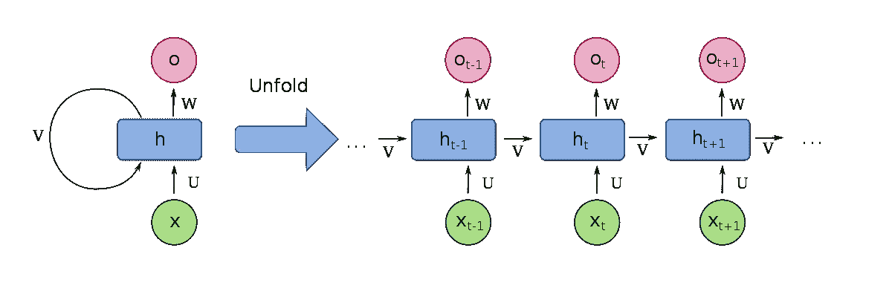
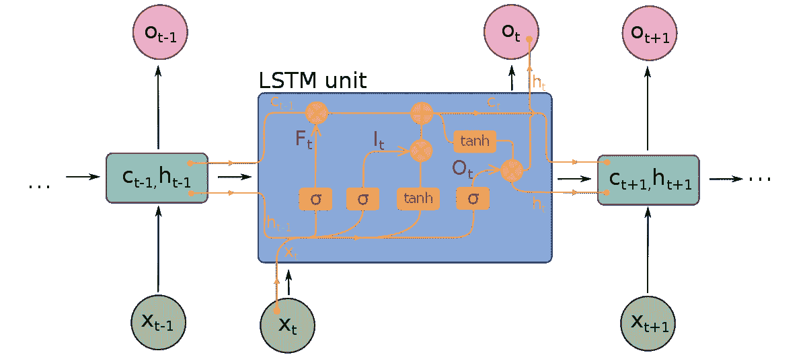
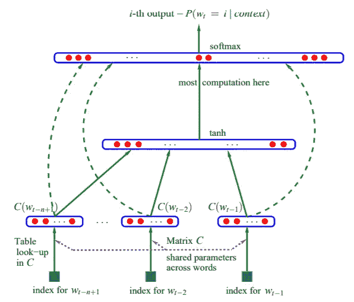
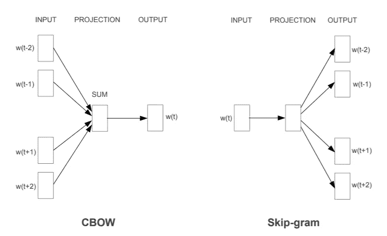
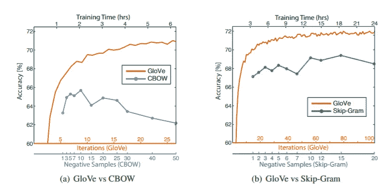
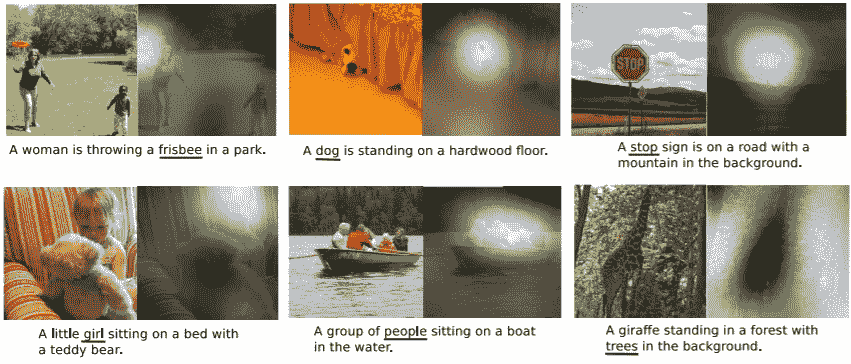
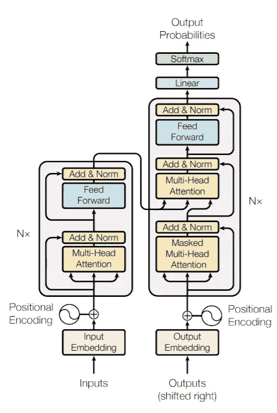
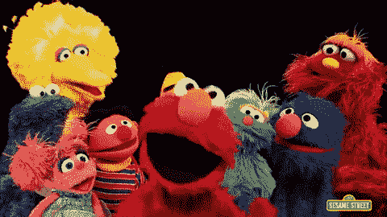

# 语言模型的演变:N-gram、单词嵌入、注意力和变形金刚

> 原文：<https://towardsdatascience.com/evolution-of-language-models-n-grams-word-embeddings-attention-transformers-a688151825d2?source=collection_archive---------9----------------------->

约翰尼斯·普莱尼奥在 [Unsplash](https://unsplash.com?utm_source=medium&utm_medium=referral) 拍摄的图片

## 在这篇文章中，我认为整理一些关于自然语言处理(NLP)这些年来的进步的研究是很好的。

你会惊讶于这个领域有多年轻。

我知道我是。

但是首先，让我们为什么是语言模型打下基础。

> 语言模型只是简单地将概率分配给单词序列的模型。

对于神经语言模型来说，它可能是像 N-Grams 一样简单的东西。

甚至预训练的单词嵌入也是从语言建模中导出的，即 Word2Vec、Glove、SVD、LSA

我倾向于把语言模型看作是一把更大的伞，其中包含了一大堆东西。

说完了，让我们从头开始。:)

> 注意:请容忍我到 2000 年。从那以后变得更有趣了。

# 1948-1980 年之前——N-gram 和规则系统的诞生

照片由[蒂姆·比什](https://unsplash.com/@tjsocoz?utm_source=medium&utm_medium=referral)在 [Unsplash](https://unsplash.com?utm_source=medium&utm_medium=referral) 上拍摄

总的来说，这一时期的大多数 NLP 系统是基于规则的，最初的一些语言模型是以 N-gram 的形式出现的。

根据我的研究，不清楚是谁创造了这个术语。

然而，N-Grams 的第一次引用来自克劳德·香农在 1948 年发表的论文“[通信的数学理论](http://people.math.harvard.edu/~ctm/home/text/others/shannon/entropy/entropy.pdf)”。

Shannon 在本文中总共引用了 N 元语法 3 次。

这意味着 N-Grams 的概念可能是在 1948 年之前由其他人制定的。

# 1980-1990 年——计算能力的崛起和 RNN 的诞生

一个单位递归神经网络的示意图(RNN)，2017 年 6 月 19 日，作者 [fdeloche](https://commons.wikimedia.org/wiki/User:Ixnay) ( [来源](https://commons.wikimedia.org/wiki/File:Recurrent_neural_network_unfold.svg))

在这十年中，大多数 NLP 研究集中在能够做出概率决策的统计模型上。

1982 年，John Hopfield 引入了递归神经网络(RNN ),用于对序列数据(即文本或语音)的操作

到 1986 年，第一个将单词表示为向量的想法出现了。这些研究是由现代人工智能研究的教父之一杰弗里·辛顿进行的。([辛顿等人 1986](https://stanford.edu/~jlmcc/papers/PDP/Chapter1.pdf)；[鲁梅尔哈特等人 1986 年](https://web.stanford.edu/class/psych209a/ReadingsByDate/02_06/PDPVolIChapter8.pdf)

# 1990-2000—自然语言处理研究的兴起和 LSTM 的诞生

一个单位的长短期记忆图(LSTM)，2017 年 6 月 20 日由 [fdeloche](https://commons.wikimedia.org/wiki/User:Ixnay) ( [来源](https://commons.wikimedia.org/wiki/File:Long_Short-Term_Memory.svg))

在 20 世纪 90 年代，NLP 分析开始流行起来。

n 元语法在理解文本数据方面变得非常有用。

到 1997 年，[长短期记忆网络](https://www.bioinf.jku.at/publications/older/2604.pdf) (LSTM)的概念由 Hochreiter 等人(1997)提出。

然而，在这个时期仍然缺乏计算能力来充分利用神经语言模型的最大潜力。

# 2003 年——第一个神经语言模型

2003 年，Bengio 等人(2003)提出了第一个[前馈神经网络语言模型](http://www.jmlr.org/papers/volume3/bengio03a/bengio03a.pdf)。

Bengio 等人(2003)的模型由一个单独的隐藏层前馈网络组成，用于预测序列的下一个单词。

本吉奥等人于 2003 年提出的第一个神经语言模型([来源](http://www.jmlr.org/papers/volume3/bengio03a/bengio03a.pdf))

虽然特征向量在这个时候已经存在，但是 Bengio 等人(2003)将这个概念带给了大众。

> 今天，我们称它们为 W*order 嵌入。:)*

> 注意:还有很多其他的研究，比如[用神经网络进行多任务学习](https://ronan.collobert.com/pub/matos/2008_nlp_icml.pdf) (Collobert & Weston，2008)以及在这十年中研究的更多。

# 2013 年——广泛的预训练单词嵌入的诞生(Google 的 Word2Vec)

2013 年，谷歌推出了 [Word2Vec](https://arxiv.org/pdf/1301.3781.pdf) 。(米科洛夫等人，2013 年)

Mikolov 等人(2013)的目标是引入新技术，以便能够从可跨 NLP 应用程序转移的庞大语料库中学习高质量的单词嵌入。

这些技术是:

*   连续词袋(CBOW)
*   跳跃图

Word2Vec 型号。CBOW 架构基于上下文预测当前单词，而 Skip-gram 在给定当前单词的情况下预测周围的单词。作者 Mikolov 等人，2013 年([来源](https://arxiv.org/pdf/1301.3781.pdf))

Mikolov 等人(2013)的预训练单词嵌入的结果为未来几年的大量 NLP 应用铺平了道路。

直到今天，人们仍然在各种自然语言处理应用中使用预训练的单词嵌入。

正是在这个时期，LSTMs、RNNs 和门控循环单元(GRU)也开始被广泛用于许多不同的 NLP 应用。

# 2014 年—斯坦福:全球向量(Glove)

Word2Vec 推出一年后，斯坦福大学的 Pennington 等人(2014)推出了[手套](https://www-nlp.stanford.edu/pubs/glove.pdf)。

Glove 是一组预训练的单词嵌入，使用不同的技术在不同的语料库上训练。

Pennington 等人(2014)发现，单词嵌入可以通过共现矩阵来学习，并证明他们的方法在单词相似性任务和命名实体识别(NER)方面优于 Word2Vec。

Pennington 等人 2014 年对单词类比任务 Glove vs CBOW vs Skip-Gram 的总体准确性([来源](https://www-nlp.stanford.edu/pubs/glove.pdf))

> 作为轶事，我相信更多的应用程序使用 Glove 而不是 Word2Vec。

# 2015 —回归:奇异值分解和 LSA 词嵌入&注意力模型的诞生

照片由[科学高清](https://unsplash.com/@scienceinhd?utm_source=medium&utm_medium=referral)在 [Unsplash](https://unsplash.com?utm_source=medium&utm_medium=referral) 上拍摄

神经网络模型的最新趋势是*似乎*在单词相似性和类比检测任务方面优于传统模型。

正是在这里，研究人员 Levy 等人(2015 年)对这些趋势方法进行了一项[研究](https://www.aclweb.org/anthology/Q15-1016.pdf)，以了解它们如何与传统的统计方法相比较。

Levy 等人(2015)发现，通过适当的调整，SVD 和 LSA 等经典矩阵分解方法获得了与 Word2Vec 或 Glove 类似的结果。

他们的结论是，新旧方法之间的性能差异不明显，没有证据表明任何一种方法比其他方法有优势。

> 我想这里的教训是，新的闪亮的玩具并不总是比旧的(不那么闪亮的)玩具好。

## **注意力模型的诞生**

在以前的研究中，使用 RNNs 的神经机器翻译(NMT)的问题是，如果句子太长，它们往往会“忘记”所学的内容。

这被称为“长期依赖”问题。

因此，Bahdanau 等人(2015)提出了[注意机制](https://arxiv.org/pdf/1409.0473.pdf)来解决这个问题。

注意力机制复制了人类如何进行翻译任务，而不是让模型在翻译前记住整个输入序列。

该机制允许模型只关注最有助于模型正确翻译单词的单词。

精神食粮。

> 在开始翻译整段文字之前，你会完整地阅读整段文字吗？

当然不是。

到那时，你可能已经忘记你读过的东西了。

> 那么，为什么我们应该期望一个模型在开始翻译任务之前记住**所有的事情**？

**这是创造注意力机制背后的直觉。**

# 2016 —从神经机器翻译到注意力集中的图像字幕

在注意力机制被提出后不久，其他研究人员如徐等人(2016)开始研究如何在其他自然语言处理应用中使用注意力，如[图像字幕](https://arxiv.org/pdf/1502.03044.pdf)。

注意正确对象的例子(白色表示注意的区域，下划线表示相应的单词)徐等 2016 ( [来源](https://arxiv.org/pdf/1502.03044.pdf))

请注意模型是如何“关注”图像的正确区域来为文字添加标题的。

# 2017 —变形金刚的诞生

[米切尔·罗](https://unsplash.com/@mitchel3uo?utm_source=medium&utm_medium=referral)在 [Unsplash](https://unsplash.com?utm_source=medium&utm_medium=referral) 上的照片

鉴于注意力机制在 NLP 应用中的成功，谷歌提出了一种新的简单网络架构，称为[转换器](https://arxiv.org/pdf/1706.03762.pdf)。(瓦斯瓦尼等人，2017 年)

这是一个**范式的转变**,与 NLP 应用的标准构建方式不同。即使用用字嵌入初始化的 rnn、LSTMs 或 gru。

Vaswani 等人(2017 年)将变压器**完全建立在**注意力机制的基础上，完全摒弃了 RNNs。

瓦斯瓦尼等人于 2017 年制作的变压器模型架构([来源](https://arxiv.org/pdf/1706.03762.pdf)

Vaswani 等人(2017 年)的工作很快催生了第二年变形金刚的改变游戏规则的[双向编码器表示。(德夫林等人，2018 年)](https://arxiv.org/pdf/1810.04805.pdf)

> 有趣的事实:BERT 目前被 Google 搜索引擎使用。这里有一个[到谷歌博客的链接](https://www.blog.google/products/search/search-language-understanding-bert/)。

# 2018-今天-预训练语言模型的时代

《芝麻街》GIF”，2016 年 3 月 23 日([来源](https://giphy.com/gifs/sesame-street-letters-vxt6BqY8rPzuo))

如前所述，在过去的两年中，NLP 模型的构建方式发生了转变。

预训练的单词嵌入已经进化为预训练的语言模型。

这里的直觉是用预训练的权重来初始化**整个模型架构**，而不仅仅是用预训练的单词嵌入来初始化模型的输入层。

人们发现，预先训练的语言模型只需要微调就可以在各种 NLP 任务中表现得相对较高。

这些预训练架构的一些例子是，伯特，阿尔伯特，罗伯塔，ELMO，厄尼，XLNET，GTP-2，T5 等。

到今天为止，这些模型中的一些实际上超过了 BERT。

# 2020 年—期末注释

看起来我们终于到达了时间线的尽头！:)

GIPHY Studios Originals 制作的快乐无比激动 GIF，2016 年 11 月 18 日([来源](https://giphy.com/gifs/studiosoriginals-3oz8xRF0v9WMAUVLNK))

我发现这个关于 NLP 研究进展的时间表非常有趣，希望你也一样！

想象一下…

从引入预训练单词嵌入到转向预训练语言模型只用了 5 年时间。

令人惊讶的是，几十年来我们做事的方式在这个时期发生了巨大的转变。

《天堂单身汉》第六季 GIF，2019 年 8 月 7 日([来源](https://giphy.com/gifs/bachelorinparadise-season-6-bachelor-in-paradise-s6e2-cnuNz0fTBIUGnx4F9T))

似乎 NLP 上的领域还是一个相当年轻的领域。

我们还远远不能将世界知识编码到机器中，以真正理解人类的语言。

所以这绝对是一个激动人心的时代！

让我们拭目以待，看看未来会怎样！

就这样，我会在下一篇文章中看到你！

阿迪欧。

> 声明:这绝不是一个详尽的研究。我只是研究了我个人认为 NLP 中的关键进步。:)

LinkedIn 简介:[蒂莫西·谭](https://www.linkedin.com/in/timothy-tan-97587190/)