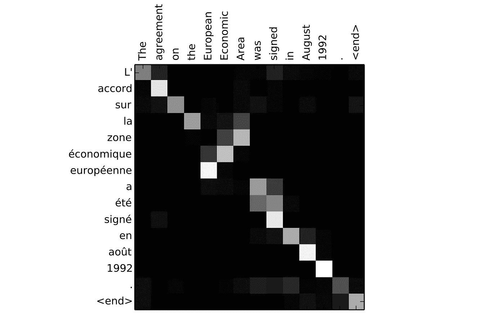
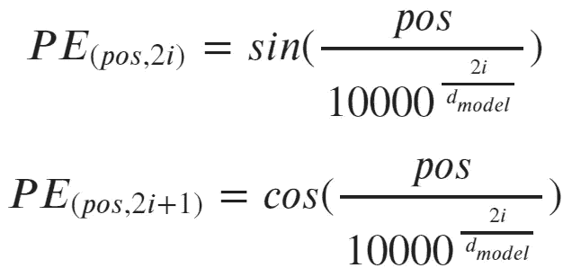
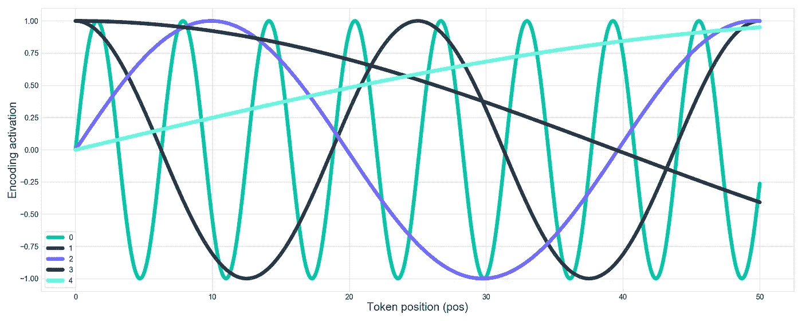
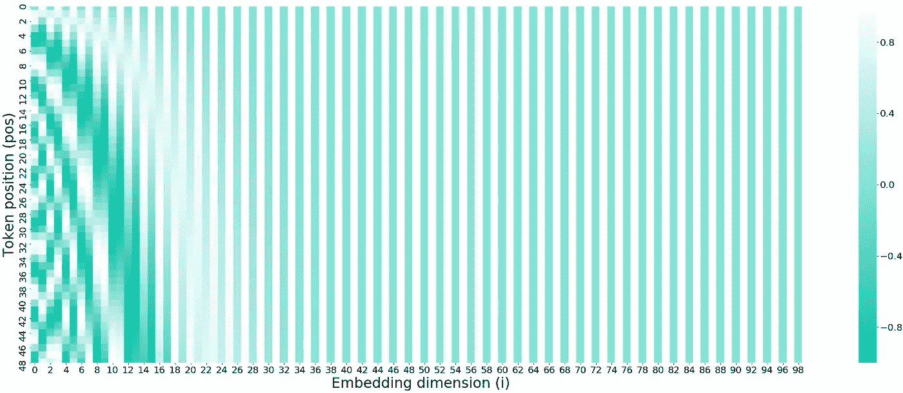
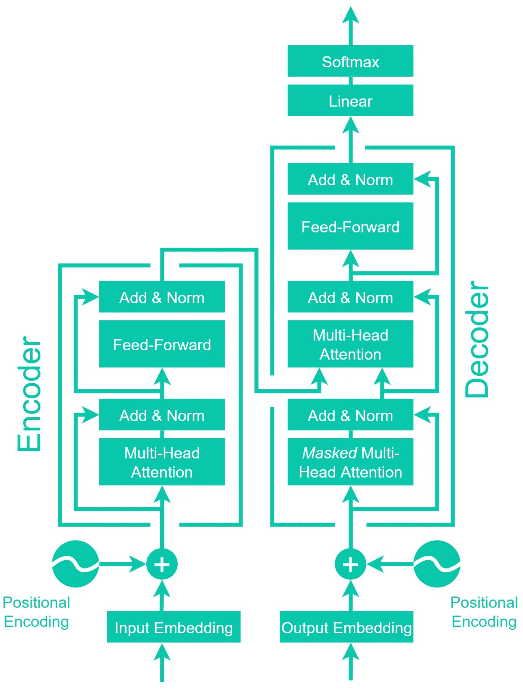

# 自然语言处理的发展

> 原文：<https://towardsdatascience.com/evolution-of-natural-language-processing-8e4532211cfe?source=collection_archive---------21----------------------->

## [入门](https://towardsdatascience.com/tagged/getting-started)

## 对过去十年自然语言处理的直观视觉解释


在 [Unsplash](https://unsplash.com?utm_source=medium&utm_medium=referral) 上 [Thyla Jane](https://unsplash.com/@owlixir?utm_source=medium&utm_medium=referral) 拍摄的照片

你所需要的只是一个关心。这是 2017 年一篇论文的名称，该论文将注意力作为一种独立的学习模型进行了介绍——这是我们现在在自然语言处理(NLP)领域占据主导地位的先驱。

变形金刚是自然语言处理领域的新锐，它们可能看起来有些抽象——但是当我们回顾自然语言处理领域过去十年的发展时，它们开始变得有意义了。

我们将讨论这些发展，看看它们是如何导致今天使用的变压器的。本文并不假设您已经理解了这些概念——我们将建立一个直观的理解，而不会过于专业。

我们将涵盖:

```
**Natural Language Neural Nets**
  - Recurrence
  - Vanishing Gradients
  - Long-Short Term Memory
  - Attention**Attention is All You Need**
  - Self-Attention
  - Multi-Head Attention
  - Positional Encoding
  - Transformers
```

# 自然语言神经网络

随着 Mikolov 等人在 2013 年发表的介绍 word2vec 的论文[2]，NLP 真正爆发了。这引入了一种通过使用单词向量来表示单词之间的相似性和关系的方法。


这些初始单词向量包含 50-100 个值的维度。这些向量的编码机制意味着相似的单词将被分组在一起(周一、周二等)，向量空间上的计算可以产生真正深刻的关系。


一个众所周知的例子是，取*国王*的向量，减去向量*男人*，加上向量*女人*，导致最近的数据点是*王后*。

## 重现

在 NLP 的繁荣时期，递归神经网络(RNN)迅速成为大多数语言应用程序的最爱。rnn 非常适合语言，这要感谢它们的*重现*。


递归神经网络单元将消耗第一个时间步*，将其输出状态传递给下一个时间步**【快速】**——该递归过程持续特定长度的时间步(序列长度)。*

*这种循环允许神经网络考虑单词的顺序及其对前后单词的影响，从而更好地表达人类语言的细微差别。*

*虽然我们直到 2013 年才看到它们的普遍使用，但 RNNs 的概念和方法在 20 世纪 80 年代的几篇论文中都有讨论[2]，[3]。*

## *消失渐变*

*rnn 带来了他们的问题，主要是消失梯度问题。这些网络的循环意味着它们本质上是非常深的网络，具有许多包含输入数据和神经元权重之间的运算的点。*

*当计算网络的误差并使用它来更新网络权重时，我们一个接一个地通过网络更新权重。*

*如果更新梯度是一个小数字，我们乘以一个越来越小的数字——这意味着整个网络要么需要很长时间来训练，要么根本不起作用。*

*另一方面，如果我们的权重循环值太高，我们就会遭遇爆炸梯度问题。这里，网络权重将振荡，而不学习任何有意义的表示。*

## *长短期记忆*

*随着长短期记忆(LSTM)单元的引入，消失梯度问题得到了解决。*

**

*LSTM 单位引入了一种更稳定的信息通道——细胞状态，如上图黑色所示。*

*LSTMs 引入了一个额外的信息流，沿着时间状态链，通过“门”控制最少数量的转换。*

**

*单元状态允许信息以较少的转换从早期状态传递到后期状态。*

*这允许通过允许来自序列中更早的信息被保留并应用于序列中更晚的状态来学习长期依赖性。*

## *注意力*

*很快，循环的编码器-解码器模型被附加的隐藏状态和神经网络层所补充——这些产生了注意力机制。*

**

*注意编解码器 LSTMs。*

*添加编码器-解码器网络允许模型的输出层不仅接收 RNN 单元的最终状态，而且还接收来自输入层的每个状态的信息，从而创建一种“注意”机制。*

**

*英法翻译任务中编码和解码神经元间的注意。图像源[3]。*

*使用这种方法，我们发现编码器和解码器状态之间的相似性将导致更高的权重，产生类似于上面法语翻译图像的结果。*

*对于这种编码器-解码器实现，在关注操作中使用了三个张量，即查询、关键字和值。在每个时间步长，从解码器的隐藏状态中提取查询，评估该查询和键值张量之间的对齐，以产生上下文向量。*

**

*然后，上下文向量被传回解码器，用于产生该时间步长的预测。对于解码器空间中的每个时间步长，重复该过程。*

# *你需要的只是关注*

*正如我们在简介中所说，这一切都始于 2017 年的“你只需要关注”论文[5]。你可能已经猜到了，这篇论文介绍了我们不需要在注意力旁边使用这些复杂的卷积或递归神经网络的想法——事实上，注意力就是你所需要的全部。*

## *自我关注*

*自我关注是实现这一功能的关键因素。这意味着之前的查询来自输出解码器，而现在是直接从输入值以及 T2 K ey 和 T4 V T5 值产生。*

**

*用两个略有不同的短语自我关注。通过将**累**(左)改为**宽**(右)，注意力从**动物**转移到**街道**。来源[3]。*

*因为 **Q** uery、 **K** ey 和**V**value 都是由输入产生的，所以我们能够对同一输入序列的不同部分之间的对齐进行编码。如果我们取上面的图像，我们可以看到，将最后一个词从**累**改为**宽**将注意力焦点从**动物**转移到**街道**。*

*这允许注意力机制对输入数据中所有单词之间的关系进行编码。*

## *多头注意力*

*注意力机制的下一个重大变化是增加了多个*注意力头*——本质上是并行执行的许多自我注意力操作，并用不同的权重进行初始化。*

**

*多头注意是指并行处理多个注意‘头’。这些多个头的输出被连接在一起。*

*在没有多头关注的情况下，A. Vaswani 等人的 transformer 模型实际上比它的许多前辈表现得更差[5]。*

*并行机制允许模型表示相同序列的几个*子空间*。这些不同程度的注意力然后被一个线性单元连接和处理。*

## *位置编码*

*变压器模型的输入不像 RNNs 那样是顺序的。在过去，正是这种顺序操作允许我们考虑单词的位置和顺序。*

*为了保持单词的位置信息，在进入注意机制之前，向单词嵌入添加位置编码。*

*《注意力就是你所需要的》一文中采用的方法是为嵌入维中的每一维生成不同的正弦函数。*

*还记得我们之前说过 word2vec 引入了用 50 到 100 维的向量来表示单词的概念吗？这里，在 Vaswani 等人的论文中，他们使用了相同的概念，但是表示了单词的位置。*

**

*交替位置编码值。使用字位置 **pos** ，嵌入尺寸 **i** ，嵌入尺寸数量 **d_model** 。*

*但是，这次不是使用 ML 模型计算矢量值，而是使用修改后的正弦函数计算矢量值。*

**

*正弦后接余弦函数。这种正弦-余弦-正弦的交替模式对于嵌入索引中的每个增量持续。*

*向量的每个索引被分配一个交替的正弦-余弦-正弦函数(索引 0 是正弦，索引 1 是余弦)。接下来，随着索引值从零向 d(嵌入维数)增加，正弦函数的频率降低。*

**

*使用总嵌入维数为 20 的前五个嵌入指数的正弦函数。嵌入索引位置显示在图例中。*

*我们可以从上面得到同样难以控制的正弦曲线，加上在 A. Vaswani 等人的研究中使用的 512 嵌入维数。用纸将这些绘制到*更容易理解的*热图上:*

**

*我们可以在较低的嵌入维度中看到较高的频率(左图)，它随着嵌入维度的增加而降低。在第 24 维附近，频率降低了很多，以至于我们在剩余的(交替的)正弦余弦波中不再看到任何变化。*

*这些位置编码然后被添加到单词嵌入中。*

**顺便提一下，这意味着单词嵌入维度和位置编码维度必须匹配。**

## *变形金刚*

**

*A. Vaswani 等人的变压器架构。改编自同一篇论文。*

*注意力模型的这些变化产生了世界上第一个变压器。*

*除了已经讨论过的单词嵌入、位置编码和多头自我关注操作，这个模型相当容易理解。*

*我们有加法和归一化层，我们简单地将两个矩阵相加，然后归一化它们。还有普通的前馈神经网络。*

*最后，我们将张量输出到线性层。这是一个完全连接的神经网络，它映射到一个 logits 向量——一个大向量，其中每个索引映射到一个特定的单词，其中包含的值是每个相应单词的概率。*

*然后，softmax 函数输出最高概率索引，该索引映射到我们的最高概率单词。*

*这就是全部(我承认，这是很多)。*

*NLP 中目前最先进的技术仍然使用变压器，尽管有一些奇怪而奇妙的修改和添加。尽管如此，核心概念仍然是相同的，即使像 GPT-3 和伯特模型。*

*我相信，NLP 的未来将和过去一样多样化，我们将在未来几年看到一些真正迷人的、坦率地说是改变世界的进步——这是一个非常令人兴奋的领域。*

*我希望这篇文章能够帮助您更好地理解 transformer 模型的基础知识，以及它们为什么如此强大。如果你想了解更多，我在 [YouTube 上发布了编程/ML 视频](https://www.youtube.com/channel/UCv83tO5cePwHMt1952IVVHw)！*

*如果您有任何问题、想法或建议，请通过 [Twitter](https://twitter.com/jamescalam) 或在下面的评论中联系我们。*

*感谢阅读！*

# *参考*

*[1] T. Mikolov 等人，[向量空间中单词表示的有效估计](https://arxiv.org/abs/1301.3781) (2013)，ICLR*

*[2] D. Rumelhart 等人，[通过错误传播学习内部表征](https://apps.dtic.mil/dtic/tr/fulltext/u2/a164453.pdf) (1985)，ICS 8504*

*[3] M. Jordan，[串行顺序:并行分布式处理方法](https://cseweb.ucsd.edu/~gary/258/jordan-tr.pdf) (1986)，ICS 8604*

*[4] D. Bahdanau 等人，[通过联合学习对齐和翻译的神经机器翻译](https://arxiv.org/abs/1409.0473) (2015)，ICLR*

*[5] A. Vaswani 等人，[注意力是你所需要的全部](https://arxiv.org/abs/1706.03762) (2017)，NeurIPS*

*[🤖带变压器的 NLP 课程](https://www.udemy.com/course/nlp-with-transformers/?couponCode=MEDIUM)*

***所有图片均由作者提供，除非另有说明**