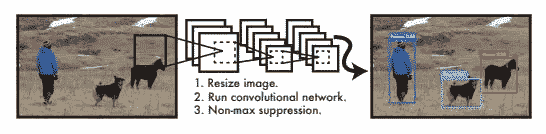
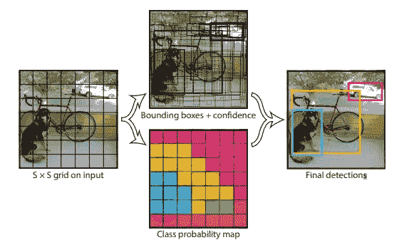
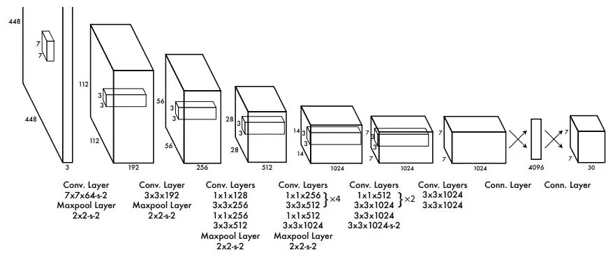
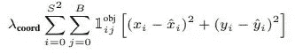
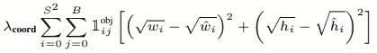
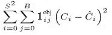
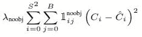
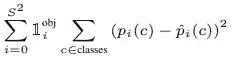
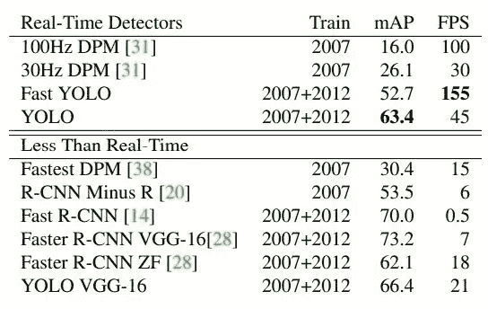

# YOLO-YOLO 版本 1 的演变

> 原文：<https://towardsdatascience.com/evolution-of-yolo-yolo-version-1-afb8af302bd2?source=collection_archive---------16----------------------->

## YOLO 的起源——“你只看一次”物体探测

**来源:** [你只看一次:Joseph Redmon 等人的统一实时物体检测](https://arxiv.org/pdf/1506.02640.pdf)

YOLO(**Y**ou**O**only**L**ook**O**nce)是最流行的对象检测卷积神经网络(CNN)之一。Joseph Redmon 等人在 2015 年发表了他们的第一篇 YOLO [论文](https://arxiv.org/pdf/1506.02640.pdf)之后，随后的版本分别由他们在 [2016](https://arxiv.org/pdf/1612.08242.pdf) 、 [2017](https://arxiv.org/pdf/1804.02767.pdf) 和 Alexey Bochkovskiy 在 [2020](https://arxiv.org/pdf/2004.10934.pdf) 发表。本文是一系列文章中的第一篇，概述了 YOLO CNN 是如何从第一个版本发展到最新版本的。

# 1.YOLO v1 —动机:

在 YOLO 发明之前，诸如 [R-CNN](https://arxiv.org/pdf/1311.2524.pdf) 的对象检测器 CNN 首先使用区域提议网络(RPNs)来在输入图像上生成边界框提议，然后在边界框上运行分类器，最后应用后处理来消除重复检测以及细化边界框。R-CNN 网络的各个阶段必须单独训练。R-CNN 网络很难优化，而且速度很慢。

YOLO 的创造者被激励去设计一个单级 CNN，它可以被端到端地训练，易于优化并且是实时的。

# 2.YOLO v1 —概念设计:

**图 1:** YOLO 版本 1 概念设计(**来源:** [你只看一次:Joseph Redmon 等人的统一实时物体检测](https://arxiv.org/pdf/1506.02640.pdf))

如图 1 左图所示，YOLO 将输入图像分成 S×S 网格单元。如图 1 中上图所示，每个网格单元预测 B 个边界框和一个“对象性”得分 P(Object ),表示网格单元是否包含对象。如图 1 中下部图像所示，每个网格单元还预测网格单元包含的对象所属类的条件概率 P(Class | Object)。

对于每个边界框，YOLO 预测了五个参数——x，y，w，h 和一个置信度得分。边界框相对于网格单元的中心由坐标 *(x，y)* 表示。 *x* 和 *y* 的值介于 0 和 1 之间。边界框的宽度 *w* 和高度 *h* 被预测为整个图像的宽度和高度的一部分。所以它们的值在 0 和 1 之间。置信度得分指示边界框是否具有对象以及边界框有多精确。如果边界框没有对象，则置信度得分为零。如果边界框具有对象，则置信度得分等于预测边界框和基础真值的并集上的交集(IoU)。因此，对于每个网格单元，YOLO 预测了 B×5 个参数。

对于每个网格单元，YOLO 预测 C 类概率。这些类别概率是基于网格单元中存在的对象的条件。即使格网单元具有 B 边界框，YOLO 也只预测每个格网单元的一组 C 类概率。因此，对于每个网格单元，YOLO 预测 C+B×5 个参数。

图像的总预测张量= S x S x (C + B x 5)。对于 PASCAL VOC 数据集，YOLO 使用 S = 7、B = 2 和 C = 20。因此，帕斯卡 VOC 的最终 YOLO 预测是 7×7 ×( 20+5×2)= 7×7×30 张量。

最后，YOLO 版本 1 应用非最大值抑制(NMS)和阈值来报告最终预测，如图 1 右图所示。

# 3.YOLO v1 — CNN 设计:

**图 2:** YOLO 第一版 CNN ( **来源:** [你只看一次:Joseph Redmon 等人的统一实时物体检测](https://arxiv.org/pdf/1506.02640.pdf))

YOLO 版本 1 的 CNN 如图 2 所示。它有 24 个卷积层，作为特征提取器。接着是两个完全连接的层，负责对象的分类和边界框的回归。最终输出是一个 7 x 7 x 30 的张量。YOLO CNN 是一个简单的单路 CNN，类似于 [VGG19](https://arxiv.org/pdf/1409.1556.pdf) 。YOLO 使用 1x1 卷积，然后是 3x3 卷积，灵感来自谷歌的[盗梦空间版本 1](https://arxiv.org/pdf/1409.4842.pdf) CNN。泄漏 ReLU 激活用于除最后一层之外的所有层。最后一层使用线性激活函数。

# 4.YOLO v1 —损失设计:

平方和误差是 YOLO 损失设计的基础。因为多个网格单元不包含任何对象，并且它们的置信度得分为零。它们压倒了包含对象的几个单元的梯度。为了避免这种导致训练发散和模型不稳定的过度控制，YOLO 增加了来自包含对象的边界框的预测的权重( **λ** *coord =* 5)，并减少了权重( **λ** *noobj = 0。* 5)用于不包含任何对象的边界框的预测。

**图 3:** YOLO v1 丢失部分 1 —包围盒中心坐标(**来源:** [你只看一次:Joseph Redmon 等人的统一实时物体检测](https://arxiv.org/pdf/1506.02640.pdf))

图 3 示出了 YOLO 损失的第一部分，其计算边界框中心坐标预测中的误差。损失函数仅惩罚边界框中心坐标的误差，如果该预测器负责地面真实框的话。

**图 4:** YOLO v1 丢失部分 2——包围盒宽度和高度(**来源:** [你只看一次:Joseph Redmon 等人的统一实时物体检测](https://arxiv.org/pdf/1506.02640.pdf))

图 4 示出了 YOLO 损失的第二部分，其计算边界框宽度和高度的预测误差。如果小边界框与大边界框的预测误差大小相同，则它们会产生相同的损失。但是相同大小的误差对于小边界框比大边界框更“错误”。因此，这些值的平方根用于计算损失。因为宽度和高度都在 0 和 1 之间，所以它们的平方根对于较小的值比较大的值增加更多的差异。损失函数仅惩罚边界框的宽度和高度误差，如果该预测值负责地面真实框的话。

**图 5:** YOLO v1 损失部分 3-物体置信度得分(**来源:** [你只看一次:约瑟夫·雷德蒙等人的统一实时物体检测](https://arxiv.org/pdf/1506.02640.pdf))

图 5 示出了 YOLO 损失的第三部分，其计算具有对象的边界框的对象置信度得分的预测误差。损失函数仅惩罚对象置信度误差，如果该预测器负责基本事实框的话。

**图 6:** YOLO v1 损失第 4 部分——无对象置信度得分。(**来源:** [你只看一次:Joseph Redmon 等人的统一实时物体检测](https://arxiv.org/pdf/1506.02640.pdf))

图 6 示出了 YOLO 损失的第四部分，其计算没有对象的边界框的对象置信度得分的预测误差。损失函数仅惩罚对象置信度误差，如果该预测器负责基本事实框的话。

**图 7:** YOLO v1 丢失部分 5 类概率(**来源:** [你只看一次:Joseph Redmon 等人的统一实时物体检测](https://arxiv.org/pdf/1506.02640.pdf))

图 7 示出了 YOLO 损失的第五部分，其计算具有对象的网格单元的类概率预测中的误差。如果网格单元中存在对象，损失函数只惩罚类概率错误。

# 5.YOLO 第一版—结果:

图 8: YOLO v1 —结果(**来源:** [你只看一次:Joseph Redmon 等人的统一实时对象检测](https://arxiv.org/pdf/1506.02640.pdf))

YOLO v1 在 PASCAL VOC 2007 数据集上的结果如图 8 所示。YOLO 实现了 45 FPS 和 63.4 %的 mAP，与另一种实时对象检测器 DPM 相比显著提高。尽管速度更快的 R-CNN VGG-16 的 mAP 更高，为 73.2%，但其速度相当慢，为 7 FPS。

# 6.YOLO 第一版—限制:

1.  YOLO 很难发现成群出现的小物体。
2.  YOLO 在探测具有不寻常长宽比的物体时有困难。
3.  与快速的 R-CNN 相比，YOLO 犯了更多的定位错误。

# 7.参考资料:

[1] J. Redmon，S. Divvala，R. Girshick 和 a .法尔哈迪，[你只看一次:统一的实时对象检测](https://arxiv.org/abs/1506.02640) (2015)，arxiv.org

[2] R. Girshick，J. Donahue，T.Darrell 和 J. Malik，[用于精确对象检测和语义分割的丰富特征层次](https://arxiv.org/abs/1311.2524) (2013)，arxiv.org

[3] K. Simnoyan 和 A. Zisserman，[用于大规模图像识别的甚深卷积网络](https://arxiv.org/abs/1409.1556) (2014)，arxiv.org

[4] C .塞格迪，w .刘，y .贾，p .塞尔马内，s .里德，d .安盖洛夫，d .埃汉，v .万霍克和 a .拉宾诺维奇，[用卷积深化](https://arxiv.org/abs/1409.4842) (2014)