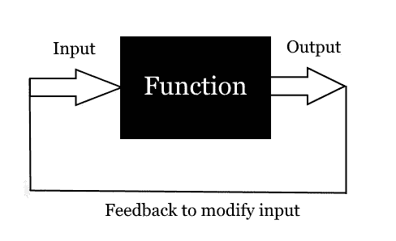
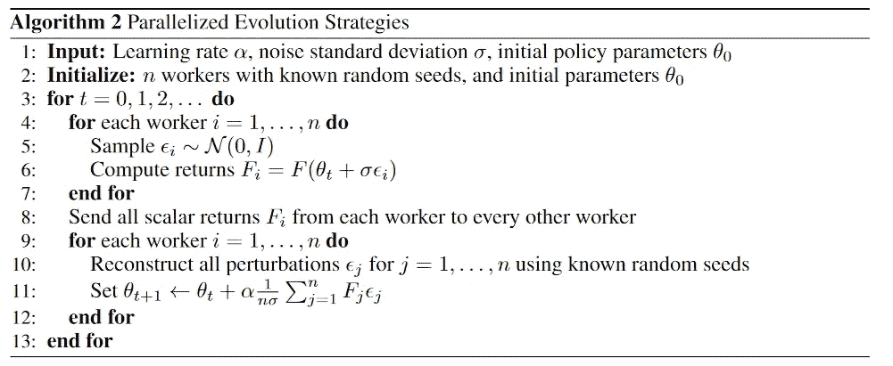
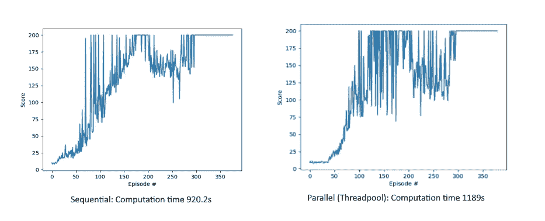
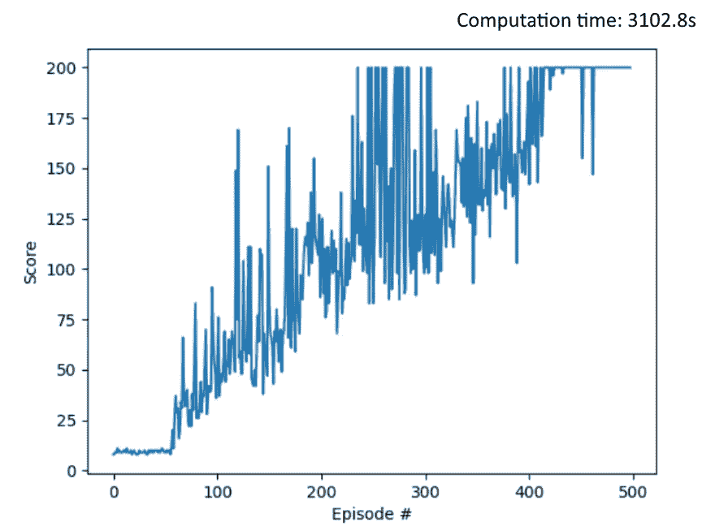

# 强化学习的进化策略

> 原文：<https://towardsdatascience.com/evolution-strategies-for-reinforcement-learning-d46a14dfceee?source=collection_archive---------24----------------------->

## 只用蛮力就解决了著名的倒立摆问题。

丹尼尔·佩莱斯·杜克在 [Unsplash](https://unsplash.com?utm_source=medium&utm_medium=referral) 上拍摄的照片

在上一篇[文章](/how-to-implement-prioritized-experience-replay-for-a-deep-q-network-a710beecd77b?source=your_stories_page---------------------------)中，我们给自己设定的目标是通过优先化的经验回放来优化深度 Q-Learning，换句话说，为算法提供一点帮助来判断什么是重要的，什么是不应该记住的。在大多数全球范围内，根据当前的技术成就，在人工干预的帮助下，算法往往表现更好。以图像识别为例，假设你要对苹果和香蕉进行分类。有了香蕉是黄色的先验知识，你的算法肯定会比它自己学习更准确。这也可以通过过度设计一组超参数来解释，这些超参数只会优化非常具体的任务。至于强化学习，证明算法可以通用化的一个方法就是用多种环境来测试，来求解。这正是为什么 OpenAI 环境被制造出来，允许研究人员通过提供一个简单的接口来测试他们的算法，使我们能够非常容易地在环境之间转换。

现在，关于优先体验重放，该出版物表明，它可以在大多数环境中很好地推广，但这一点点人工干预帮助在我们的情况下没有好处。毕竟，也许这个环境确实需要更多的**随机性**才能被解决。在深度 Q 学习的情况下，随机性是通过使用一个ε贪婪策略来创建的，该策略是“我们不不时地采取最优化的行动，看看会发生什么，怎么样”。这也叫**探索。但是这实际上是一种非常苍白的随机行为，因为它是基于随机(概率)策略的。呃。在这种情况下，如何使它完全随机？**

照片由[凯蒂·史密斯](https://unsplash.com/@kate5oh3?utm_source=medium&utm_medium=referral)在 [Unsplash](https://unsplash.com?utm_source=medium&utm_medium=referral) 上拍摄

强化学习随机性烹饪食谱:

*   第一步:用一个有一组权重的神经网络，我们用它来把一个输入状态转化成一个相应的动作。通过在这个神经网络的指导下采取连续的行动，我们收集并累加每个连续的奖励，直到体验完成。
*   步骤 2:现在添加随机性:从这组权重中，通过将随机噪声添加到原始权重参数中来生成另一组权重，也就是说，使用采样分布(例如高斯分布)对它们进行一点修改。尝试新的体验并收集总奖励。
*   第三步:重复随机抽样的权重参数，直到你达到理想的分数。

这是你能做的最随意的事情。拉出一个随机权重的随机神经网络，看看是否可行，如果不行就再试一次。事实是，这不太可能行得通。(或者至少在合理的时间内工作)。然而，最近几年发表的一些非常有前途的论文，在让类人机器人学习如何走路等任务中提供了非常有竞争力的结果，离应用这一非常基本的烹饪食谱不远了。

我们开始吧。现在想象一下，不是围绕相同的初始权重集进行采样，而是在每次采样迭代中，将您的奖励与前一个权重集的奖励进行比较。如果回报更好，这意味着你的神经网络对什么是最优策略有更好的想法。现在，您可以从这里开始，对另一组砝码进行采样。这个过程叫做**爬山。**

这个类比非常简单，你试图优化你的总回报(位于山顶)，你正在采取连续的步骤。如果你的一步让你更接近顶峰，那么你就非常自信地从那里开始下一步。否则，你回到上一步，尝试另一个方向。它实际上看起来非常像梯度上升，通过“攀爬”您试图优化的函数来优化函数。区别在于神经网络更新。在爬山中，不使用反向传播来更新权重，而只使用随机采样。

爬山实际上属于一组叫做黑盒优化算法的算法。

我们不知道我们试图优化的函数到底是什么，我们只能给它输入并观察一个结果。基于输出，我们能够修改我们的输入，以尝试达到最佳结果值。实际上，呃，这听起来很熟悉！事实上，强化学习算法也依赖于一个黑盒，因为它们基于一个环境，该环境为代理人采取的每一步(输入)提供奖励(输出)。例如，当你试图教一个人形机器人如何行走时，你对你试图行动的模型的运动学和动力学完全没有先验知识，甚至不知道重力意味着什么！这是一个相当黑的盒子，不是吗？如下图所示，我们试图优化的是我们自己对环境的近似函数。

在深度 Q 网络的情况下，当我们执行反向传播时，我们有我们试图优化的函数的概念，所以在某种意义上，只有环境被认为是黑盒。至于爬山，我们盲目地修改一组权重，而不知道如何使用这些权重，这可以被认为是一个黑盒。

现在，让我们爬上一些山，看看这将如何实现。我们从另一个叫做 Cart Pole 的环境开始，它基本上是一个倒立摆。这通常是一个非常好的测试算法和想法的环境，因为它很容易解决，没有特别的局部最小值。Cart pole 也很受欢迎，因为它也用于经典控制理论(提供解析解)。

让我们先看看现实生活中的倒立摆是什么样子，这里由 Naver Labs 的一个令人印象深刻的机器人来平衡:

现在让我们试着从我们的健身房环境中平衡车杆。在这个实现中，我们假设提供了一个代理(github 上的代码),它可以评估完整剧集的报酬。

很简单不是吗？我们实际上做了一个小小的改进，而不是使用所有的奖励来计算新的权重，我们只使用其中的一小部分，称为“精英”权重，即提供最佳奖励的权重。我们也可以更加贪婪，只取回报最高的权重，但这样会不够健壮，也不能很好地处理局部最小值。另一方面，用所有结果计算新的权重更健壮，但是也更慢。使用结果的一部分代表了鲁棒性和快速收敛之间的某种平衡。

爬山结果

该算法可以用大约 470 秒的处理时间在 104 次迭代中求解 cart 极点环境。让我们享受观看训练有素的代理人执行他的任务。肯定没有人形机械手臂平衡重量好看，但这已经很了不起了！

现在爬山是一种可能的黑盒算法实现。在这篇[论文中，](https://arxiv.org/pdf/1703.03864.pdf)open ai 团队(也是 OpenAI gym 的制造商)推出了另一个版本，他们说这个版本可以解决复杂的 RL 问题，例如 Mujoco 运动任务或 Atari 游戏集合。他们还声称，他们可以比最有效的 RL 算法更快地解决这些任务，至少快 10 倍。让我们看看这种成功背后的算法是什么:

进化策略

抛开数学符号不谈，这里的内容与爬山算法非常相似。首先通过高斯分布随机抽样生成权重集，评估每组权重的回报，并使用所有结果更新新的权重。主要区别在于更新，而爬山只是平均最好的权重，进化策略将使用一个更新率缓慢地向最佳方向移动。与所有 RL 算法一样，这确实意味着避免直接陷入局部最小值并增加鲁棒性。除此之外，这很像爬山。而*认为*能够比最复杂的 RL 算法执行得更好？呃。关键词其实就在快照的标题里:**并行化**。

并行化是将处理任务分开，并同时执行它们。比方说，当您想要评估每组权重的奖励时，您可以同时评估所有权重，然后在所有权重完成后收集结果。如果只使用一台计算机，当然这将要求它具有难以置信的强大功能，但这里的技巧是，计算不仅限于一台机器。并行化可以通过与其他计算机共享计算任务来完成。例如，OpenAI 团队表示，为了教会人形机器人行走，他们在 80 台机器上使用了**1440 个 CPU。**

如果你想获得不错的结果，那么现在让任务并行化来解决 RL 问题是必须的。例如，相对著名的 A3C 算法的目标是利用并行计算，这是作者所谓的深度 RL 异步方法的一部分。进化策略(es)的不同之处在于，ES 完全利用了并行化，尽管它是一段简单得多的代码，但堆叠越来越多的计算机将会产生更好的结果。

即便如此，我(可能还有你)手头没有 80 台计算机，尝试运行这种带有异步计算的算法仍然很有趣，以便更好地了解它实际上是如何工作的，并看看我们是否能超越爬山性能。

为了尝试并行化进化策略算法，我们需要深入研究 Python 中的并行计算以及执行多线程的不同方式。幸运的是，我们可以依靠一些非常好的文章，这些文章详细介绍了我们正在寻找的东西，目前是关于哪个库最适合我们的指南，其中有一些代码片段教我们如何使用它。(实际上这应该是本文的一部分，但是嘘)。

> > > > >[在这里插入 Python 中的多线程分析](/unraveling-pythons-threading-mysteries-e79e001ab4c) < < < < <

使用新获得的知识，我们可以尝试并行化进化策略算法。
我们实现的基础层与前面介绍的相同，它依赖于一个代理，该代理可以评估给定的一组权重的总回报。代理只需对用指定权重构建的神经网络执行正向传递，以找出每一步要采取的行动，并总结健身房环境提供的奖励。

我们现在想通过为我们的案例选择正确的库来利用我们的线程知识。我们希望通过并行化繁重的计算来优化进化策略的收敛时间。最重要的是，我们希望将来能够使用多个独立计算机的内核。选择是显而易见的，我们想用**多处理**库。

可以看到，使用多处理时，一些数据类型无法成功序列化，代理就是这种情况，可能是由于 pytorch 数据类型的存在。为了解决这个问题，代理被定义为全局变量，以便它们仍然可以从线程访问，这不是一个好的设计，并且不能用于在多台计算机之间共享计算的情况。至于测试，这是目前测量并行计算效率的主要方法。该算法的基础如下:在每次迭代中，为您想要使用的每个并行代理启动一个线程。然后在每个线程中采样一组权重并调用 evaluate 函数。收集每个线程产生的所有奖励，并更新权重。请注意，更新需要奖励和采样权重，但线程只返回奖励。这是使用种子技巧:np.random 实际上并没有那么随机，如果多次调用 np.random.randn，然后重置种子并重复，它将提供完全相同的结果。利用这一点，我们可以只返回种子，然后在需要时重新创建权重，而不是返回权重集(这对复杂的神经网络来说可能是巨大的)。对于一些应用来说，不串行化/解串行化权重的时间增益是必然的。下面是这个实现的样子:

运行这段代码有一个问题。多处理 apply_async 在第二次迭代开始时被阻塞。似乎某些适合多重处理的内部锁正在阻塞计算。由于第一次迭代是成功的，我们可以猜测第一次迭代的一些残余会阻碍下一次迭代的开始。可能是当 mp 的对象超出范围时。无法正确销毁池()句柄。
一种可能的解释是，多重处理在内部使用“fork”方法创建线程，该方法复制线程环境，而不是“繁殖”重新评估“所有变量”。可能不是所有的数据类型(和底层数据类型)都有一个定义良好的复制构造函数，这会导致死锁。那用“产卵”法怎么样？由于多处理重新评估所有变量，健身房环境以及代理本身确实受到相同的处理，这非常耗时(至少比调用 sample_reward 函数本身多得多)。即使这种方法仍然可行，但它肯定不能让我们达到固定的目标，提高进化策略算法的计算效率。

那现在怎么办？多处理似乎不是一个可行的替代方案，唯一的其他解决方案是使用线程池库，它受到全局解释器锁(GIL)的限制。我们仍然可以使用该库来验证性能水平，看看与基本的顺序方法相比是否有所提高。在这两种情况下，我们使用 50 个代理，它们能够为随机抽样的一组重量生成总报酬:

该算法一直运行到平均奖励达到 195。在这两种情况下，行为看起来相似，并且环境通过等量的情节得到解决。在此之前，一切看起来都很好。算法是相同的，唯一的区别是计算的并行化。然而，计算时间是不同的，在使用线程池执行器库的情况下，计算时间实际上更长。这与不同线程方法的基准测试结果相呼应。我们只是确认了预期的结果。

我们现在发现自己陷入了一个僵局，我们首选的线程库没有像预期的那样工作，其他方法实际上比顺序方法要慢。我们处理线程的方式需要有所不同。如果我们能在体育馆环境中直接并行化计算，事情会简单得多…

你猜怎么着？这个接口有..算是存在的。有一个名为 VecEnv 的接口，它实际上是 openai 健身房环境的数组。实际上，这听起来与我们之前采用的方法非常相似。除了这个 VecEnv 充当传统 gym 环境的包装器，并允许您执行“step”操作的并行计算。在下面的 evaluate 函数实现示例中，“step”函数现在接受一组动作，并返回一组奖励和新状态:

在我们将一集的奖励累积过程并行化之前，我们在这里称每个“步骤”为多线程。好处是我们在已经执行了神经网络前向传递之后调用了一个线程。这意味着应该避免前一节中遇到的与 pytorch 数据类型和多重处理相关的问题。让我们检查一下性能结果:

当我们期待计算时间有巨大的改进时，实际上却发生了相反的情况。尽管与之前的 400 次迭代相比，该算法使用了大约 500 次迭代就收敛了，但它需要多花大约三倍的时间来计算。
现在，让我们试着拆开“步进”函数，从算法的其余部分分别测量性能。

我们创建了两个代理，一个实现通常的“步进”功能，将一个动作作为参数并返回新的状态和获得的奖励，而另一个使用 VecEnv(环境向量)并实现“步进”功能，将一组动作作为参数并输出一组状态和奖励。我们重复调用“步骤”的过程固定次数，并比较结果:

我们知道，VecEnv 通过实现多处理来执行线程，这是一种正确的方法，应该可以提供显著的计算改进。然而，我们观察到，即使在线程数量等于 PC 内核数量(本例中为 4 个)的最有利情况下，性能仍然落后于简单的顺序情况。

这种性能缺乏的一个原因可能是环境太简单，无法解决:“step”函数只需要很少的时间就可以返回，而多处理确实需要序列化和反序列化(我们不知道数量，因为它隐藏在 VecEnv 实现中)。很可能在更复杂的环境中，当仿人机器人学习行走时，“步进”功能将需要更多的计算能力，从而充分利用线程实现。

结论:

*   虽然我们最初计划改进我们的月球着陆器，但我们选择先解决倒立摆问题，作为测试实施效率的简单方法。
*   我们可以观察到，由于 Pytorch 的原因，将体验奖励的完整评估分离到不同线程中的简单线程实现无法工作。
*   我们改用线程池执行器，并证明这种方法仍然受到 GIL(全局解释器锁)的限制。
*   最后，我们尝试了 gym 环境的 VecEnv 包装器，它提供了一个使用多线程执行“步骤”的接口。然而，这种方法似乎并不成功，可能是因为我们的环境过于简单，无法利用多线程方法。

待完成:

*   在更复杂的环境中尝试该算法(例如 Mujoco 环境)。

Github 回购:[https://github.com/Guillaume-Cr/evolution_strategies](https://github.com/Guillaume-Cr/evolution_strategies)