# 进化决策树:当机器学习从生物学中汲取灵感时

> 原文：<https://towardsdatascience.com/evolutionary-decision-trees-when-machine-learning-draws-its-inspiration-from-biology-7d427fa7554b?source=collection_archive---------12----------------------->

[来源](https://pixy.org/1423243/)

## 发现进化决策树

**随着时间的推移，我们在生物学或生命科学方面的知识大幅增加，它已经成为许多寻求解决挑战性问题和开发创造性创新的工程师的巨大灵感来源。**

以日本高速列车 ***新干线*** 为例，它是世界上最快的列车之一，时速超过 300 公里。在构思过程中，工程师们遇到了严重的困难，因为列车前方空气置换产生的大量噪音，甚至会对几个隧道造成结构性破坏。

为了解决这个问题，他们求助于一个不太可能的来源，翠鸟！这种鸟有一个细长的喙，这使他能够潜入水中以最小的水花猎食。

因此，通过以鸟的形象重新设计火车，工程师们不仅能够解决最初的问题，还能将火车的电力消耗降低 15%，并将速度提高 10%。

图 1 —日本高速列车*新干线、* [*来源*](https://www.digitaltrends.com/cool-tech/biomimicry-examples/)

**利用生物学中的知识作为灵感来源，在机器学习中也是可能的。**

## 内容

在本文中，我将重点介绍一个例子: ***进化决策树*。**

这些分类器使用**进化算法**，该算法依赖于受生物进化启发的机制来构建更健壮、更高效的决策树。

阅读本文后，您将了解到:

*   什么是*决策树*？
*   如何使用*进化算法*构建*决策树*？
*   与其他分类器相比，*进化决策树*表现如何？

## 资料组

为了说明整篇文章中将要讨论的概念，我将依赖一个数据集，该数据集收集了**航空公司乘客满意度调查的结果。**关于数据集的更多信息可在[这里](https://www.kaggle.com/teejmahal20/airline-passenger-satisfaction)找到。

目标是预测客户对航空公司服务满意的可能性。从公司决策的角度来看，这样的研究是至关重要的。它允许任何提供商品或服务的公司不仅定义其产品的哪些方面需要改进，而且定义改进的程度和迫切程度。

事不宜迟，让我们从回顾决策树的基础开始。

# **1。什么是*决策树*？**

***决策树*** 指一种依靠流程图的树状结构的分类器。底层模型通过学习从数据特征中推断出的简单决策规则来对观察结果进行分类。

下图提供了一个*决策树*的例子。已经使用 *Scikit Learn* 决策树模块对其进行了航空公司乘客满意度调查培训。

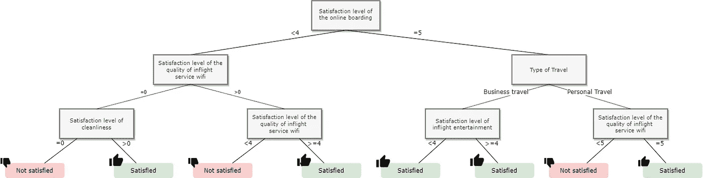

图 2—决策树示例

*决策树*显示，对于商务旅行，客户满意度的主要因素是在线登机:简单高效的在线登机增加了客户满意的可能性。这也凸显了机上服务 wifi 质量的重要性。

它们已经被广泛用于分类任务，因为它们提供了**许多优点:**

*   **类似人类推理的可理解和可解释的性质**；
*   处理**数字和分类数据**的能力；
*   分层分解允许更好地使用可用变量。

大多数用于诱导决策树的算法依赖于**贪婪的自顶向下递归划分策略**来增长树。

代表树的**根节点**的源集合根据特定的规则被分成子集(**子节点**)。对每个派生的子集重复该过程，直到节点处的子集具有目标变量的所有相同值，或者分裂不会给预测增加任何值。

用于确定在节点和分割中生成测试的最佳方式的**度量**因算法而异。最常见的有 ***信息增益*** (或 ***熵*** )和 ***基尼杂质*** 。它们是**杂质度量**，意味着当一个节点的所有样本属于同一类别时，它们等于 0，并且当我们具有均匀的类别分布时(即，当该节点的所有类别具有相等的概率时)，它们达到最大值。更多信息，可以阅读这篇[文章](https://en.wikipedia.org/wiki/Decision_tree_learning#Metrics)。

然而，这种策略有两个主要缺点:

1.  它可能导致次优解决方案；
2.  它会生成过于复杂的树，这些树不能很好地从训练数据中概括出来，从而导致过度拟合的问题。

已经提出了几种技术来克服这些问题:

*   **剪枝技术:**首先，完全构建决策树，即直到一个叶子中的所有实例属于同一类。然后，通过移除“无关紧要的”节点或子树来减小树的大小。
*   **集合树:**不同的树被构建，最终的分类通过特定的规则给出，在大多数情况下是投票方案。请注意，这导致决策树的可理解性方面的损失。

因此，有必要探索生成模型树的其他方法。在这种背景下，**进化算法(EAs)** 最近获得了强烈的兴趣。

它们在候选解的空间中执行稳健的全局搜索，而不是局部搜索。**因此，与贪婪方法相比，进化算法能够更好地处理属性交互。**

让我们来看看它们是如何工作的。

# 2.**如何用进化算法构建决策树？**

**进化算法是搜索试探法，使用受自然生物进化过程启发的机制。**

在这个范例中，**群体中的每个“个体”**代表一个给定问题的候选解决方案。每个个体由一个**适应值**评估，该适应值测量他作为解决方案的质量。因此，第一种群通常被随机初始化，并向搜索空间的更好区域进化。

在每一代，选择过程确保具有低适应值的最佳个体具有更高的繁殖概率。

此外，通过受遗传学启发的操作，群体经历特异性，例如:

*   **交叉和突变，或重组机制:**来自两个个体的信息被混合并传递给它们的后代；
*   突变:微小的随机变化适用于个体。

该过程反复重复，直到满足**停止标准**为止。选择最合适的个体代表作为解决方案。

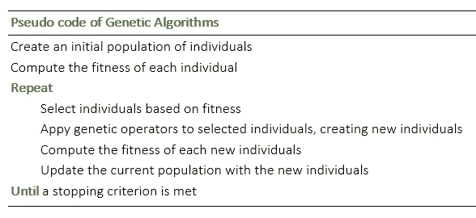

*基于 EA 的决策树*为普通技术带来了一个有趣的替代方案，原因如下:

*   作为随机搜索技术，它们有助于避免贪婪的、自上而下的递归划分策略可能导致的局部极小值；
*   决策树的可理解性与集成方法相反。
*   它不仅可以优化一个指标，还可以将**不同的目标整合到适应值中。**

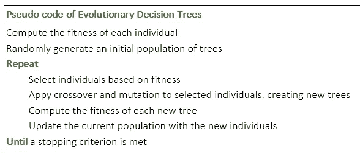

## 2.1.原始群体

在*进化决策树*，**中，个体是树。**第一种群由随机生成的树组成。

随机树可以按如下方式生成:

从一个根节点和两个孩子开始，该算法以预定义的概率 *p.* 决定孩子是分裂还是该节点成为终端节点(叶子)

*   如果子节点被拆分，算法会随机选择属性并拆分值。
*   如果该节点成为终端节点(叶)，则分配一个随机的类标签。

## 2.2.健康

分类器的目标是为新的未标记数据获得最佳预测准确性。*决策树*分类器还必须控制最终树的大小，因为小树会导致欠拟合问题，而复杂树会导致过拟合问题。

因此，可以定义一个适应度函数来平衡这两个标准:

> 适应度= α1 f1 + α2 f2

其中:

*   f1 是训练集上的准确度；
*   f2 根据树的深度惩罚个体的大小；
*   α1 和α2 是要选择的参数。

## 2.3.选择

在选择将被用来创造下一代的双亲时，有几种选择。

最常见的有以下几种:

*   **适应度比例选择，或轮盘赌选择:**每个个体相对于群体的适应度用于分配选择的概率。
*   **锦标赛选择:**通过从群体中随机选择的一组个体中选择具有最高适应性的个体来选择父母。
*   **精英主义:**具有最高适应值的个体被直接带入下一代，这确保了保留最成功的个体。

请注意，一个个体可以被选择多次，这使他能够将其基因传播给更多的孩子。

## 2.4.交叉

交叉子代是通过组合当前父代的父代对获得的。

首先，选择两个个体成为父母。然后，在两棵树中随机选择一个节点。因此，通过用来自第二个亲本的子树替换来自第一个亲本的子树来形成新的个体(后代)。

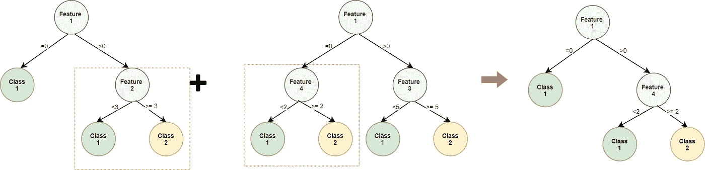

图 3—交叉

## 2.5.变化

突变是指在一个群体的个体中做出的小的随机选择。这对于确保遗传多样性和使遗传算法能够搜索更广阔的空间是至关重要的。

在*决策树*的上下文中，可以通过随机改变一个属性，拆分随机选择的一个节点的值来实现。

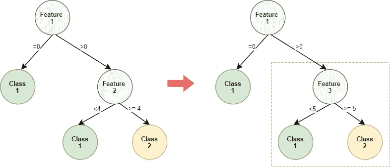

图 4 —突变

## 2.6.停止标准

如果群体中最佳个体的适应度在固定数量的代期间没有提高，则认为该算法已经收敛。

如果收敛缓慢，为了限制计算时间，预先设置最大代数。

# **3。与其他分类器相比，进化决策树的表现如何？**

*进化决策树*看起来很吸引人，**但是与通常的*机器学习*算法相比，它的性能如何呢？**

## 3.1.一个简单的实验

为了了解它的效率，我实现了它，并在包含航空公司乘客满意度调查的数据集上进行了训练。

**目标是了解哪些因素会带来高水平的客户满意度。**在这种情况下，有一个简单但可靠的模型来解释客户满意或不满意的途径是至关重要的。

[Ross Parmly](https://unsplash.com/@rparmly?utm_source=unsplash&utm_medium=referral&utm_content=creditCopyText) 在 [Unsplash](https://unsplash.com/s/photos/plane?utm_source=unsplash&utm_medium=referral&utm_content=creditCopyText) 上拍摄的照片

**关于数据集**

数据集很大，超过 100k 行。

*   **它包含关于客户及其旅行的事实信息:**客户性别、年龄、客户类型(忠诚或不忠诚的客户)、旅行类型(个人或商务旅行)、航班等级(商务、经济、经济加)和飞行距离。
*   **它还包含以下服务的客户满意度:**机上 wifi 服务、出发/到达时间便利性、在线预订便利性、登机口位置、食品和饮料、在线登机、座位舒适度、机上娱乐、机上服务、腿部空间服务、行李搬运、值机服务、机上服务、清洁度。

因此，目标变量是客户满意度，可以是“满意”或“中性或不满意”。

**方法论**

下面是我遵循的步骤的快速总结:

1.  **数据预处理:**将分类变量转换为指标变量。将数据集分成随机的训练和测试子集。
2.  **建模和测试:**在训练子集上考虑每个模型的训练，并在验证子集上测量。
3.  **车型性能对比。**

我选择将*进化决策树(EDT)* 方法与仅基于树的模型、*决策树* *(DT)、*和*随机森林(RF)、*进行比较，以有限的树深度 3 作为约束。我还将 *EDT* 的总体规模值和 *RF* 的估计数设置为 10，以便能够在合理的计算时间内以一致的方式比较它们。

**结果**

这是结果

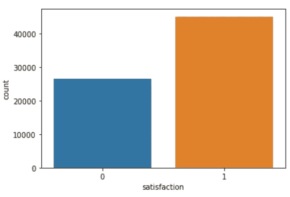

图 5—满意的客户数量和不满意的客户数量

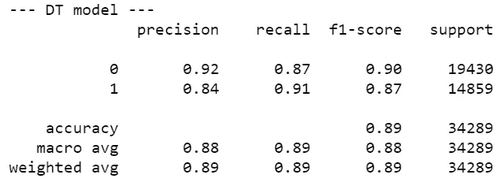

表 1—DT 模型的分类报告

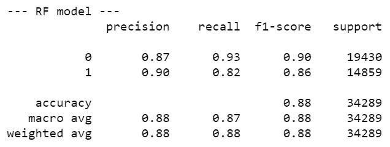

表 2 —射频模型的分类报告

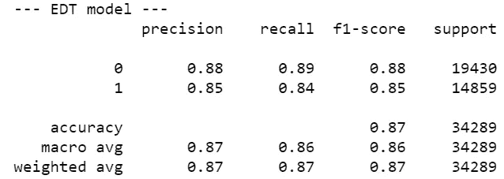

表 EDT 模型的分类报告

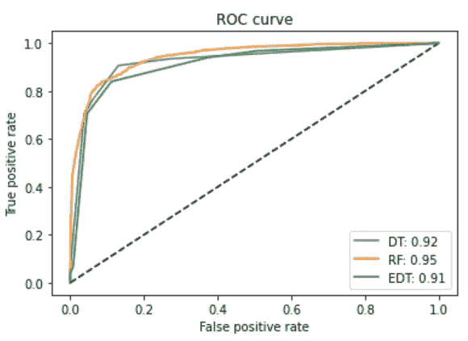

图 6-三个模型的 ROC 曲线和 AUC

在这种设置下， *EDT* 的性能与另外两种*机器学习*算法非常相似。

然而， *EDT* 模型因其提供**单一决策树的能力而脱颖而出:**

*   这可以**可视化**，与 *RF* 模型相反，在该模型中，多个决策树被聚合，
*   与简单的 *DT* 模型相反，这是健壮的，因为它是种群中最好的树。

下面是在最大深度设置为 2 的情况下训练算法时，在 *EDT* 群体中的最佳决策树的表示。

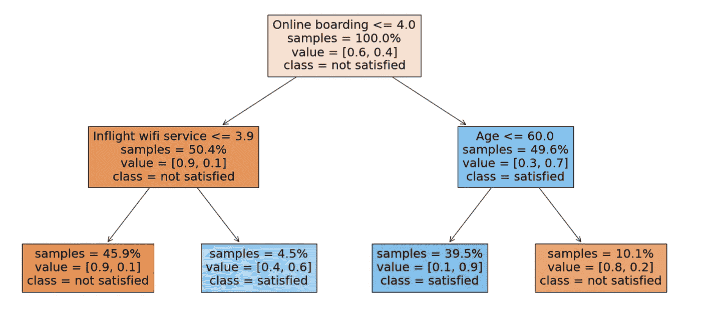

图 EDT 最佳决策树的表示

## 3.2.EDT 方法的更一般的实验验证

与其他*机器学习*算法相比，上面进行的实验当然不足以评估*进化决策树*的性能和可靠性。

因为它仅使用一个数据集，所以它没有探索所有的可能性，例如目标的类的数量的影响、特征和观察的数量的影响等。

在[ [2](https://hal.inria.fr/hal-01405549/document) ]中，作者使用真实的 [UCI 数据集](https://archive.ics.uci.edu/ml/datasets.php)，比较了 EDT 方法与其他机器学习方法的性能。

让我们来探究这篇文章的发现。

**关于数据集**

下表简要描述了所使用的数据集:

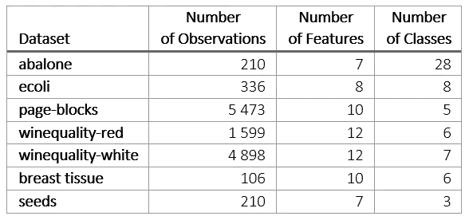

表 4—数据集的特征

如您所见，数据集在观测值、要素和目标类的数量方面有很大差异。

最困难的数据集当然是第一个数据集，因为它提供了大量的类和有限的观察值。

**方法论**

以下是作者用来评估 *EDT* 模型与更“经典”*机器学习*算法相比的性能的方法的主要信息:

*   *EDT* 模型已经用以下超参数进行了训练:500 代的数量，400 的种群规模，0.6/0.4 的 ac 交叉/变异概率，具有精英主义的随机均匀选择方法。
*   使用 5x2 交叉验证测量了模型的性能。

**结果**

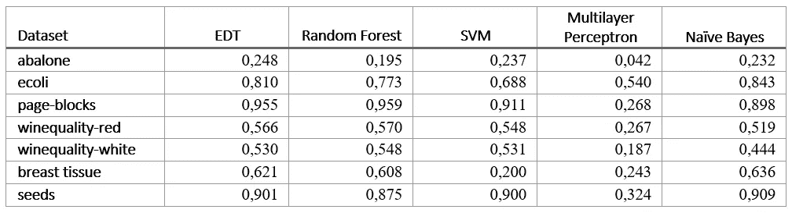

表 5-依赖于数据集的模型精度

正如作者所指出的，从上表中可以得出 **2 个想法**:

1.  **基于树的算法往往在几乎所有情况下都优于其他*机器学习*算法。**这可以用决策树自然更能选择最重要的特征这一事实来解释。此外，基于规则的模型更适合特定的数据集，尤其是当目标和特征之间的关系难以建模时。
2.  数据集*鲍鱼*上的结果特别差:这是因为目标有 28 个类，而观察值非常少(只有 210)。**然而， *EDT* 模型以最高的精度脱颖而出。这显示了它处理困难数据集和有效避免过拟合的能力。**

注意*美国东部时间*的结果是用默认参数获得的。调整参数会带来更好的性能。

# **参考文献**

[1] R. Barros 等， [*决策树归纳进化算法综述*](https://ieeexplore.ieee.org/document/5928432) *，* 2011

[2] D .扬科夫斯基等， [*决策树归纳的进化算法*](https://hal.inria.fr/hal-01405549/document) ，2016

[3] S. Cha， [*利用遗传算法构造二元决策树*](https://www.researchgate.net/publication/220862364_Constructing_Binary_Decision_Trees_using_Genetic_Algorithms) ，2008

[4] D. Carvalho 等， [*一种混合决策树/遗传算法的数据挖掘方法*](https://www.sciencedirect.com/science/article/pii/S0020025503004146#:~:text=The%20central%20idea%20of%20this,a%20small%20number%20of%20examples.) *，2003*

[5]维基百科， [*旅行推销员问题*](https://en.wikipedia.org/wiki/Travelling_salesman_problem)

[6]维基百科，[遗传算法](https://en.wikipedia.org/wiki/Genetic_algorithm)