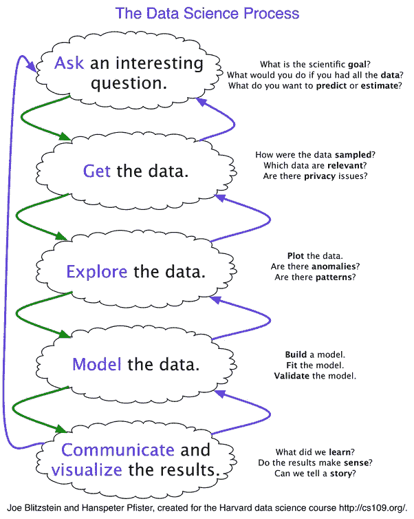
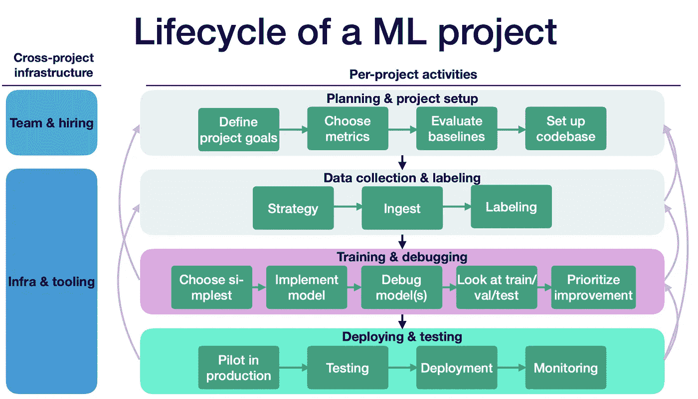
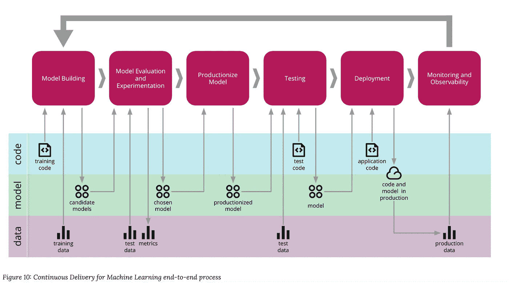
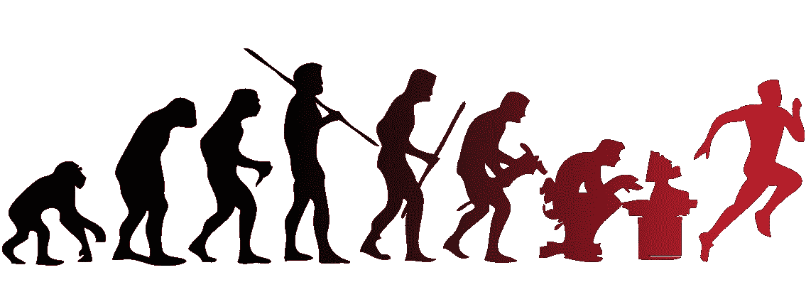

# 数据科学的发展:下一步是什么？

> 原文：<https://towardsdatascience.com/evolutions-in-data-science-ee596824d187?source=collection_archive---------51----------------------->

## 游戏变了吗？

2010 年，希拉里·梅森和克里斯·维金斯发表了一篇关于数据科学进程的[文章](http://www.dataists.com/2010/09/a-taxonomy-of-data-science/)。那时候，**获取、筛选、探索、建模和解释**是游戏的名字。然而，这并不是第一次将数据科学视为一个过程。让我们来探索基本面是如何随着时间的推移而变化的。

照片由[林赛·亨伍德](https://unsplash.com/@lindsayhenwood?utm_source=medium&utm_medium=referral)在 [Unsplash](https://unsplash.com?utm_source=medium&utm_medium=referral) 拍摄

我最近读了一本来自迈克尔·苏立文的令人惊叹的教科书[讨论统计过程。在书中，他提出了一个六步程序。但是这款和 2010 款有什么不同呢？我用一个新冠肺炎的例子来解释:](https://www.amazon.com/Fundamentals-Statistics-5th-Michael-Sullivan/dp/0134508300)

1.  **提问:**是什么导致了一个国家的高新冠肺炎传染率？
2.  **数据收集:**收集病例、人口密度、气候、口罩使用等数据。
3.  **汇总数据:**绘制每个指标。检查平均值、分组依据、方差。
4.  **建模:**使用协变量或[回归](https://en.wikipedia.org/wiki/Regression_analysis)拟合 [SIR 模型](https://en.wikipedia.org/wiki/Compartmental_models_in_epidemiology#The_SIR_model)或[空间模型。选择你的毒药。](https://en.wikipedia.org/wiki/Spatial_analysis)
5.  **推论:**定义假设。在人口密度更高的国家，传染速度更快。使用 [A/B 测试](https://en.wikipedia.org/wiki/A/B_testing)或[模拟](https://en.wikipedia.org/wiki/Simulation)。
6.  **结果交流:**制作几个漂亮的图来展示你的分析结果。

[乔·布利茨坦的课程](https://www.youtube.com/watch?v=gJZYgLyjyIQ&list=PL2qHyNjtf9vO5fAiRKlBlXksc4B5TK_F0)经由[哈佛](http://cs109.github.io/2015/)

注意，Sullivan 没有提到任何软件或 API 来提供结果。重点是分析的**值。**

我们可以回到过去。我最近在罗恩·科哈维的[精彩演讲](https://www.youtube.com/watch?v=ZfhQ-fIg4EU&feature=youtu.be&t=2655)中了解到，第一个受控实验可以追溯到《T4》旧约。这意味着我们做数据科学已经有一段时间了！然而，在过去的 2000 年中出现了新的挑战。如今，**数据就是产品**，**的价值在于对它的持续推断**。

我们还需要几个步骤来烤蛋糕。让我们来谈谈这些新的步骤以及团队是如何考虑的。

首先，让我们讨论一下**在数据科学社区中越来越流行的两个数据科学过程框架**。然后再讲还需要更多发展的步骤。我个人看到两个需要进一步探索的新领域:**机器学习工程**和**机器学习项目规划**。

## ML 项目框架的生命周期

我最近看到的关于数据科学作为一个过程的最有用的观点是由[全栈深度学习](https://fullstackdeeplearning.com/march2019)课程提出的。

乔希·托宾、谢尔盖·卡拉耶夫和彼得·阿贝耳(2019)通过[课程](https://youtu.be/tBUK1_cHu-8?t=460)

本课程在我们之前学习的迈克尔·苏立文统计过程的基础上增加了几个步骤。Sullivan 忽略的主要步骤在**计划&项目设置**和**部署&测试**矩形内部。

**计划&项目设置**步骤属于项目管理(PM)和数据科学的交集。这些是我找到的关于项目管理和数据科学挑战的最佳资源:[如何建立你的项目](https://www.fast.ai/2020/01/07/data-questionnaire/)、[如何定义成功](https://www.sequoiacap.com/article/frameworks-for-product-success#)和[价值评估](https://hackernoon.com/product-driven-machine-learning-and-parking-tickets-in-nyc-4a3b74cfe496)。**然而**，我们把**部署&测试**放在哪个学科？

这就是机器学习工程的用武之地。

机器学习工程这个术语越来越受欢迎。我不确定它的起源，但在 [NIPS 2016](https://sites.google.com/site/wildml2016nips/schedule) Martin Zinkevich 做了一个关于可靠的机器学习的演讲。他为*机器学习工程*发布了一份[规则清单](http://martin.zinkevich.org/rules_of_ml/rules_of_ml.pdf)。有趣的是，他们提到“ML 系统的可靠性工程”应该是一个新的学科。我想说 Zinkevich 的演讲是 ML 工程术语的起源，但是如果我错了，请在评论中告诉我。关于该主题的另一篇极具影响力的论文是数据科学的[隐藏技术债务](https://papers.nips.cc/paper/5656-hidden-technical-debt-in-machine-learning-systems.pdf)。

机器学习工程是关于**部署**，**监控**，以及**基础设施，**全栈框架上的最后一个矩形。如果你想深入了解这个框架的细节，你可以学习[全栈深度学习课程](https://fullstackdeeplearning.com/march2019)。他们也讨论测试和标签。

ML 项目的最后一英里:Josh Tobin、Sergey Karayev 和 Pieter Abbeel(2019)通过[课程](https://youtu.be/tBUK1_cHu-8?t=460)

## 机器学习框架的持续交付

因此，我们了解到**规划**和**部署**是任何数据科学项目的关键部分。现在让我们深入第二个数据科学流程框架。由 [Danilo Sato](https://twitter.com/dtsato) 持续交付机器学习框架(CD4ML)。

[CD4ML](https://martinfowler.com/articles/cd4ml.html#cd4ml-end-to-end.png) 通过 [thoughtworks](https://www.thoughtworks.com/)

该行业已经意识到，在生产中使用机器学习模型与使用 if-else 启发式方法非常不同。我们需要具体的[类型的测试](https://developers.google.com/machine-learning/testing-debugging)，具体的[类型的监控](https://christophergs.com/machine%20learning/2020/03/14/how-to-monitor-machine-learning-models/)，甚至[部署策略](https://docs.aws.amazon.com/sagemaker/latest/dg/how-it-works-hosting.html)。许多人和行业都在参与讨论。CD4ML 侧重于数据科学项目的数据、模型和代码组件。传统的软件开发项目不像 ML 项目那样依赖数据。[模型对象](https://machinelearningmastery.com/save-load-machine-learning-models-python-scikit-learn/)也是进入拼图的新棋子。有关 CD4ML 的更多信息，请查看 Danilo Sato 的[帖子](https://martinfowler.com/articles/cd4ml.html)。

工程推动是用 [Mlflow](https://mlflow.org/) 、 [Metaflow](https://metaflow.org/) 和 F [lyte](https://flyte.org/) 等产品**加速**。这些平台的目标是简化部署和测试。**但是，规划&项目设置方面的资源并不多。我们可以得到正确的工程，但我认为我们需要投入更多的时间来定义项目目标。**

项目设置:乔希·托宾、谢尔盖·卡拉耶夫和彼得·阿贝耳(2019)通过[课程](https://youtu.be/tBUK1_cHu-8?t=460)

*   话虽如此，如何确定数据科学努力的**优先级**？
*   我们与其他计划相比如何？
*   我们是否由于**不确定性**而未能沟通项目的**影响**？
*   我们如何评估项目的风险？
*   我们如何在**简单启发式**和 **ML** 之间做出选择？

所有这些都是我们应该开始问自己的问题。金融也有助于对话。毕竟，我们只需要估计未来的回报，并计算它们的净现值。

我见过几个如何做到这一点的例子。评估经济价值很难。这就是为什么我们有专门评估价值的金融市场和学科。这里有一个很好的 ML 例子来解释我所说的:

> 您需要从您的反欺诈解决方案中每年节省大约 140 万美元才能在市场上生存。假设您每月有 4，000 个采购订单，平均订单价值为 83 美元，那么您的平均收入为 332，000 美元。
> 
> 在机器学习之前，你必须为 40%的订单支付退款(1600 英镑)。那你每个月要花 132，800 美元。对于准确率为 95%的解决方案，您只需支付 4，000 起欺诈交易的 5%(200)，即 16，600 美元。你的收益是**退款的费用**减少，总计 116，200 美元。这相当于每年节省 1，394，400 美元。
> 
> 因此，您需要一个解决方案来检测 100 个可疑交易中的 95 个(准确性)。能够达到该阈值的工具将获得绿灯。【[来源](https://www.altexsoft.com/blog/business/how-to-estimate-roi-and-costs-for-machine-learning-and-data-science-projects/)

欺诈是一个特别容易评估价值的领域。然而，我认为这是一个不完整的分析。我们需要评估项目的风险，并考虑未来的付款。

除此之外，在生产中使用该工具的反馈循环又如何呢？准确性会随着时间降低吗？这对它的价值有什么影响？是否存在任何伦理问题或意想不到的后果？

在分类类型项目(欺诈/无欺诈)中，评估价值可能很简单。但是回归、预测和聚类呢？视觉处理、自然语言和优化怎么样？我们如何评估像苹果 Siri 这样的项目的现值？Veronika Megler 的《管理机器学习项目》是一个很好的资源。

想想谷歌是如何以及为什么决定雇佣这个星球上最好的软件工程师来开发 [Tensorflow](https://www.tensorflow.org/) vs [谷歌广告](https://ads.google.com/)。两个项目之间的预算是如何决定的？我怀疑他们在 Tensorflow 上投入了更多资金，因为他们期望在人工智能上获得比这个星球上任何其他公司都高的投资回报。我正在探索的关于这个主题的两个资源是:[如何测量任何东西](https://www.howtomeasureanything.com/3rd-edition/)和我[经济学](https://www.amazon.com/Infonomics-Monetize-Information-Competitive-Advantage/dp/1138090387)。

## **结论**

总之，数据科学过程每周都在发展和改进。谷歌、微软、亚马逊、百度和 Salesforce 等巨头的投资正在加速这一演变。在**机器学习工程**方面需要进一步分析，但在**机器学习规划**方面可能更迫切。毕竟，计划是真正的 [AI-complete](https://en.wikipedia.org/wiki/AI-complete#:~:text=AI%2Dcomplete%20problems%20are%20hypothesised,would%20also%20require%20human%20computation.) :)

来源:[1 罪恶货币](https://imgbin.com/user/1guiltymonkey)，via [Imgbin](https://imgbin.com/png/JdGJapXr/human-evolution-evolutionary-psychology-ape-png) (个人使用)