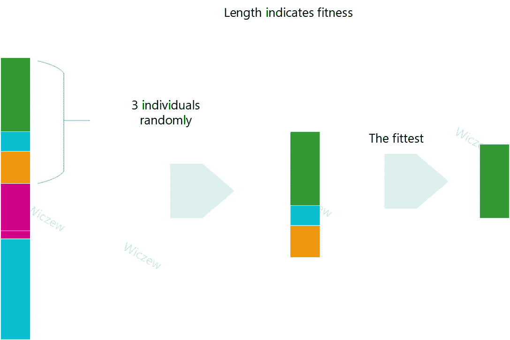
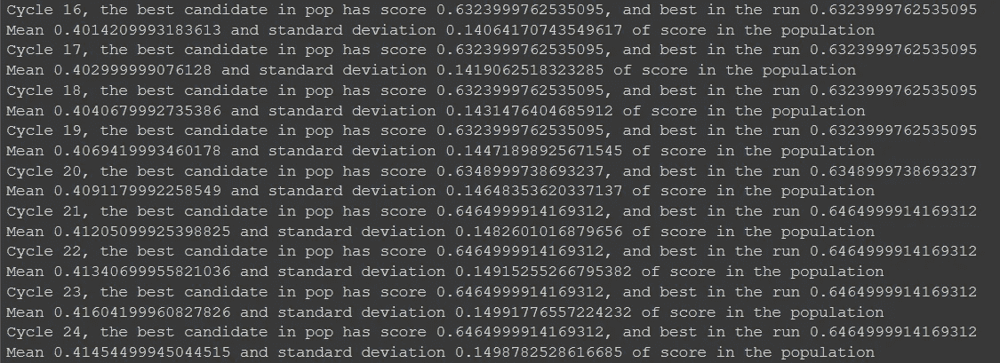
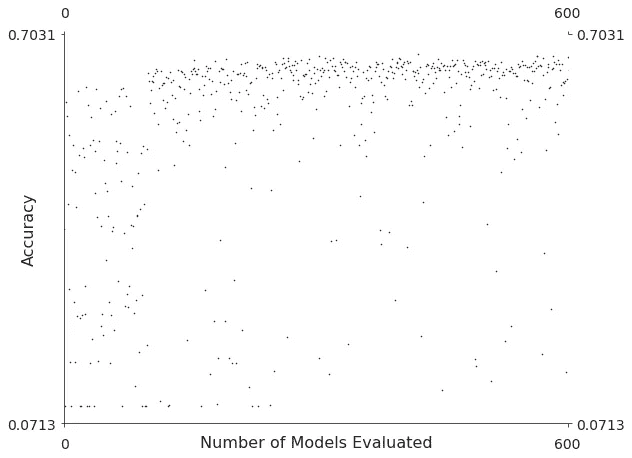

# 现在就进化你的神经网络！具有从零开始的正则化演化的 AutoML

> 原文：<https://towardsdatascience.com/evolve-your-neural-net-now-automl-with-regularized-evolution-from-scratch-444779aeeb4f?source=collection_archive---------58----------------------->

## 你是否厌倦了手工创建所有的神经网络架构？你是否在平凡而迭代的过程中浪费了宝贵的时间？一个正则化的进化算法等着你来帮助你


Johannes Plenio 在 [Unsplash](https://unsplash.com?utm_source=medium&utm_medium=referral) 上拍摄的照片

# **简介**

AutoML 是一个概念，其中机器学习算法不是由人开发的，而是由计算机开发的。因此，对于给定的问题，例如预测照片上的猫/狗或预测股票价格，AutoML 算法会创建几个具有不同参数的架构，并评估其验证准确性/验证。一个机器学习研究人员也在做类似的事情，但需要一些先验知识和直觉。通常这样的过程是乏味的，并且需要几次构建和测试的迭代来找出好的架构。因此需要研究者花费大量的时间和雇佣他的公司/机构的资金。此外，仍然存在改进这种架构的空间，如过去几年中关于 CNN(卷积神经网络)架构的几个出版物所示(例如 Resnet50、Imagenet 等。).

现在的大多数算法都非常复杂，通常使用某种强化学习[1]，贝叶斯优化过程[2]，或者某种树搜索和进化搜索[3]。没有广泛的解释、研究和编码，任何一个都不容易尝试。然而，2019 年 Google Brain 发表了一篇关于“正则化进化”的论文[4]，我将在这里解释它，甚至让它在 Jupyter 笔记本上尝试，你可以在 Google Colab 上运行。这是一个非常简单的进化算法，主要需要编写一个循环。

# 正则化进化，它是如何工作的？

在我们转向正则化进化之前，让我先介绍一下进化算法的概念。

## 进化算法

一般来说，EAs 是一组优化算法，它们受到生物进化过程的启发。其中或多或少基于突变和繁殖来选择最适合环境的。这些算法能够以一个**噪声度量** **，遍历巨大的**搜索空间*** (星号表示文章末尾的解释)。与进化过程类似，很难衡量一个比另一个更好，繁殖也有随机因素，但有机体仍然进化，能够适应给定的环境。该算法涉及到一些术语，你应该在继续之前理解，你可以在下面学习。

该算法在一组个体上工作，称为**群体**(例如机器学习模型)，其中群体的大小是固定的(例如 100)。每个个体都是由一组**基因**定义的，你可以把它想象成一个个体属性的列表或向量(例如层的类型、数学运算、数字)，这组基因被称为**染色体**。这些个体通过交叉和自身突变进行**繁殖**。**突变**是改变一个基因(例如，改变一种类型的层、参数或其他东西)，其中**交叉**你可以认为是组合两组基因(例如，来自一个个体的层列表的一半与来自另一个模型的层列表的另一半，但它不必是一半，它可以是例如 5/100)。接受繁殖的个体是根据**适合度分数、**选择的，适合度分数告诉你一个个体有多好(例如 ML 模型的验证准确性)。体能分数越高，我们的个体越好。


描绘了交换和突变。不同颜色的方块代表不同的基因。

该算法通过在繁殖和适应性分数计算之间迭代来工作，其中**最适合的和被选择用于繁殖的以及最不适合的被从种群中移除。这样的一次迭代称为一个循环，在一个循环中产生新的一代——通过突变和繁殖产生新的个体。该算法通过循环迭代，直到我们得到足够好的个体，或者当大多数群体共享相同的基因时(因此群体收敛)。该算法很少收敛到全局最优解，但很容易找到一个好的最优解。**


进化算法的一个例子。这里没有显示交叉，但是需要使用锦标赛选择来选择两个人。根据托马西尼，马可。一篇评论。(1999).

选择过程可以通过各种算法进行，最流行的是 [**锦标赛选择**](https://en.wikipedia.org/wiki/Tournament_selection) ，它从群体中随机抽取 ***k*** 个个体(其中 ***k*** 小于群体大小)并输出其中最好的。这确保了不总是选择最适合的，并给较弱的个体一个机会。这是因为最适合的个体并不总是繁殖的最佳候选人，也许其他个体在几代之后会更好。这确保了在搜索空间中遍历时更大的多样性。此外，你可能会认为这是为了防止陷入局部最大值的健康得分，即使一个人有一套非常好的基因，仍然可以有一个更好的组合。



描述了锦标赛选择。

另一种是 [**轮盘**](https://en.wikipedia.org/wiki/Fitness_proportionate_selection) 根据适应度选择个体，适应度越高，概率越高。虽然文章中没有用到，这里也没有描述。

## 有规律的进化——有什么不同？

有规律的进化也被称为老化进化——随着算法的进步，我们的种群会老化。**因此，从群体中移除最老的，而不是最不适合的**。这确保了种群的多样性，因为最适者不能确保存活，即使表现良好，也会因老化而死亡。它的工作方式与锦标赛选择一节中描述的方式类似——简而言之，就是增加多样性，防止陷入局部最小值。该算法的模式稍后在下面描述。

# **利用正则化进化实现架构搜索**

使用 regularized revolution 的架构搜索是在一个为本文准备的 Jupyter 笔记本中实现的，您可以在 Google Colab 环境(或任何其他地方，但需要一个像样的 GPU！).Jupyter 笔记本您可以在下面的我的资源库中找到:

[](https://github.com/DanielWicz/AutoMLEvol) [## 丹尼尔维奇/AutoMLEvol

### 进化 AutoML 教程。在 GitHub 上创建一个帐户，为 DanielWicz/AutoMLEvol 的发展做出贡献。

github.com](https://github.com/DanielWicz/AutoMLEvol) 

这里有一个到 Google Colab 的直接链接，你可以直接与代码交互:

[](https://colab.research.google.com/github/DanielWicz/AutoMLEvol/blob/master/regul_evolution_tut.ipynb) [## 用 Google Colab 规范进化

colab.research.google.com 的正则化进化教程](https://colab.research.google.com/github/DanielWicz/AutoMLEvol/blob/master/regul_evolution_tut.ipynb) 

请记住，计算是为了执行架构搜索，因此参数设置得尽可能低，以加快计算和训练时间。在你发现一些有趣的架构后，你可以扩大它的规模(通过增加过滤器的数量)并充分利用它。然后你可以把它和一个排名(例如[https://benchmarks.ai/cifar-10](https://benchmarks.ai/cifar-10))进行比较，并且很高兴拥有一个表现良好的小模型。此外，如果我们在卷积层中使用不同数量的填充符，例如 16、32、64，那么算法将总是选择具有大量滤波器的卷积层的模型。事实说明，对于少量的时段和参数，这里可以忽略过拟合，并选择较大的参数空间。

## 必需的软件包:

在继续之前，您必须确保已经安装了以下软件包:

*   Tensorflow 2.0 或以上
*   Numpy 1.18 或以上
*   Matplotlib 3.0.0 或以上版本
*   Seaborn 0.9.0 或以上

## 在继续之前做一点解释

有几个算法的关键部分，你应该知道。但是如果你先打开它，在你进入文本之前，在代码中浮现你自己，那将是最好的。

算法中的关键是你在算法中使用的一组基因。

基因被定义为五种类型的层，其中第一层是身份函数，因此输出与输入相同。身份函数服务于缺少层的目的，实现一个空层比从基因集中删除一个层更容易。

然后，这些基因为模型产生随机层，正如在`random_element()`方法中定义的那样。该方法返回元组，将图层类型与其参数相关联。所有层只有一个参数，包括卷积层，其中滤波器的数量固定为一个小值。小尺寸的填充物用于加速计算(见本节开头)。

接下来是使用`random_element()`函数的`random_architecture()`函数，创建一个作为元组列表的架构。例如，这可能是一个架构:`[(3, (2, 2)), (0, 16.0), (1, None), (1, None), (1, None), (3, (2, 2)), (1, None), (0, 16.0)]`。您可以解密从左到右(从第一层到最后一层)读取的架构，并比较定义的基因中第一个元组的元素中的数字，这些基因在`available_genes`字典中。如果你试着在 Jupyter 笔记本中生成一些架构来了解它将会是什么样子，这是最好的。
事实上，你现在可以得出结论，群体中的一个个体(即一个架构)由一系列元组表示，这些元组表示不同的基因(即我们的架构搜索问题中的层)。您也可以尝试使用`init_train_and_eval()`方法通过传递一个带有架构的列表来训练一个架构。该函数返回验证精度，如果模型编译失败，则精度为零。

进入进化算法之前的最后一个重要功能是`mutate_arch()`，它负责你群体中每个个体的基因突变。该函数只是在你的模型列表中选择一个随机索引，并使用`random_element()`函数用一个随机元素替换它。

## 算法是如何工作的？

正则化进化算法在`regularized_evolution()`函数中实现。如何使用该函数以及相应的参数在做什么在它的 docstring 中有解释。
算法一般通过重复三个步骤来工作，其中的步骤称为循环。在每一个循环中，通过锦标赛选择来选择一个个体，然后对其进行变异，并从群体中移除最老的个体。最后一步是通过定义 FIFO 队列数据结构中的填充来执行的，因此那些较早添加的也较早被移除。下图更精确地描述了这一过程:


作为图表的正则化进化。相对于之前的 EA 图的差异用半透明的洋红色正方形标记。基于 Real E .等人在《aaai 人工智能会议论文集》(第 33 卷，第 4780–4789 页)。

## 运行算法

当算法运行时，您应该监控一些事情，这表明它的行为有多好。



正则化进化优化过程中的日志

这里的分数表示在给定数据集(这里是 **cifar-10** )的给定架构评估期间获得的验证准确性。有几个值，像平均值、标准差和种群中最适合的个体。此外，由于在老化进化中，最适合的个体可能会死亡，因此也存在优化期间遇到的最佳模型的指示符。
随着算法的进展，你应该会看到或多或少，平均值增加，标准差减少。其背后的原因是群体中越来越多的个体共享相似的基因，从而具有相似的适合度(或验证准确性)。通常，该过程不是单调的，均值上升而标准差保持不变，然后保持不变，标准差下降。

## 算法的结果

经过指定数量的循环后，您将获得优化过程中遇到的最佳模型以及每个循环中的所有模型。您可以使用运行正则化进化的单元格下方的单元格，将其绘制为每个周期的分数分布。你应该得到如下图:



你可以发现它收敛于某一点。

您可以看到，验证准确性在开始时迅速提高，然后来回波动。通常，这是一个很好的趋同指标，表明大多数群体共享一组最佳基因。然而，有时这也表明你陷入了局部最小值，因此你可以减少锦标赛选择中的样本数。
我在 600 次循环后获得的最佳模型如下所示:

```
([(1, None),
  (0, 16),
  (0, 16),
  (-1, <function __main__.random_element.<locals>.<lambda>>),
  (1, None),
  (0, 16),
  (2, ('renorm', True)),
  (0, 16),
  (-1, <function __main__.random_element.<locals>.<lambda>>),
  (1, None)],
 0.6743999719619751)
```

这转化为具有以下层的架构:


事实上，我可以删除身份层，因为他们什么也不做。但是为了清楚起见我把它们留下了。

之后，您可以获得模型，并通过增加每个卷积层(如前一层的 2 倍，如 16、32、64、128)将其放大一点。然后，使用之前使用的数据集(cifar-10)训练模型。例如上面的例子，我在验证集上获得了大约 71%的准确率。如果我在此基础上使用图像增强，那么模型会给我多一点，大约是 77%。

然而，如果你想在真实案例中使用它，应该使用一组单独的图像(一个**测试集**)。这是因为您正在针对验证集优化您的架构，所以您的架构可能会过度适应验证集。但是那是另一个故事的主题，不是这个，但是**要小心**。

# 总结

进化算法是搜索复杂搜索空间的有效方法。他们研究群体，群体是一组个体，每个个体都有一组基因。基因是个体的特征，并且可以通过例如用其他值随机替换来突变。然后，进化算法迭代地选择那些在给定问题中表现良好的(那些最适合的)，并对它们进行变异。由于群体大小是固定的，所以那些表现不好的群体不会更早或更早地被排除在群体之外。有规律的进化(也称为老化进化)为种群中的个体引入了年龄，因此每个人都随着时间而消亡，只有年轻的个体通过从最适合的个体中选择的基因存活下来。它增加了种群的多样性，因此可以找到更好的解决方案。
进化算法可用于机器学习中的架构搜索，例如卷积神经网络。他们在大量可能的模型(搜索空间)中有效地搜索，并以相对较少的迭代次数找到最优解。

# 解释:

*   *搜索空间是某个问题中所有可能的结果或结果的集合。试着把它想象成所有的模型，你可以用给定类型的层来创建。
*   **连续训练几个机器学习模型通常会给出不同的结果，每次训练时，即使使用相同的数据和迭代次数。你可以在 Jupyter 的笔记本上找到它，连续几次训练同一个模型，仍然给出不同的结果。
*   ***您可以注意到没有交叉，这是因为没有交叉会使算法更简单，因此可以轻松地针对群集中的几个节点进行并行化。

# 参考资料:

[1] Kotthoff，l .，Thornton，c .，Hoos，H. H .，Hutter，f .，和 Leyton-Brown，K. (2017 年)。auto-WEKA 2.0:WEKA 中的自动模型选择和超参数优化。*机器学习研究杂志*， *18* (1)，826–830。

[2]福雷尔，m .，克莱因，a .，艾根伯格，k .，斯普林根伯格，j .，布卢姆，m .，&胡特，F. (2015)。高效和健壮的自动化机器学习。在*神经信息处理系统的进展*(第 2962-2970 页)。

[3]乐，傅伟文，穆尔，陈建华(2020)。使用特征集选择器将基于树的自动机器学习扩展到生物医学大数据。*生物信息学*， *36* (1)，250–256。

[4] Real，e .，Aggarwal，a .，Huang，y .，& Le，Q. V. (2019，7 月)。图像分类器结构搜索的正则化进化。aaai 人工智能会议论文集*(第 33 卷，第 4780-4789 页)。*

[5]托马西尼(1999 年)。并行和分布式进化算法:综述。