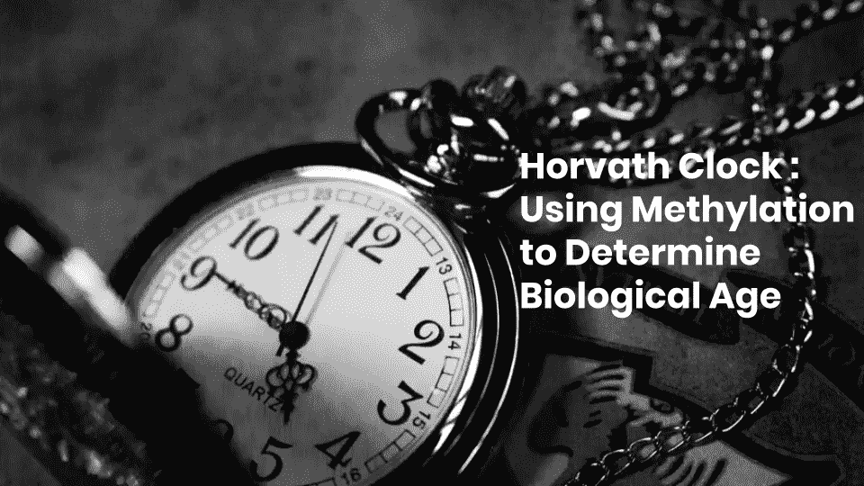
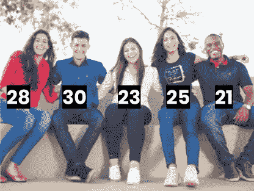
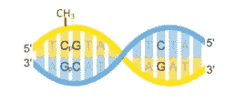
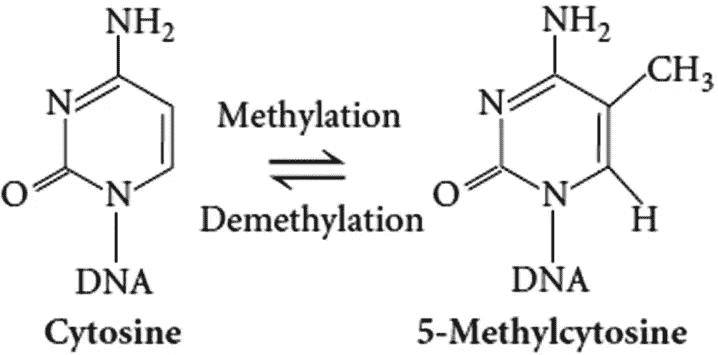
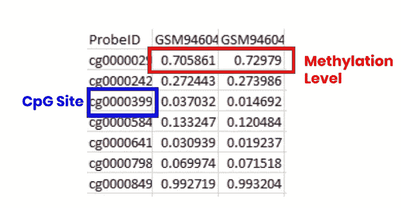
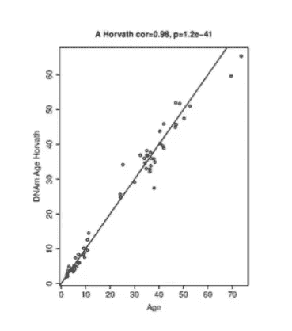

# 考察霍瓦特钟及其背后的统计方法

> 原文：<https://towardsdatascience.com/examining-the-horvath-clock-and-the-significance-of-biological-age-a5d64b73bc44?source=collection_archive---------12----------------------->

## 如何从 DNA 甲基化数据中找到生物年龄

来源: [Unsplash](https://unsplash.com/photos/OshG1lLSNa4) 本人编辑

想象一下，你是一名研究人员，在实验室里研制一种**抗衰老药丸。**经过几个月对不同历史群体使用的不同抗衰老补充剂的研究，你找到了合适的干预方法。现在的问题变成了你如何证明干预*确实抑制了*衰老？

在临床试验中，你不能等到病人的整个生命周期来验证抗衰老补充剂实际上在哪里起作用。那会浪费时间。

相反，我们需要一个能够在短时间内测量*评估不同干预的有效性*的指标。这是对**衰老生物标志物需求的主要原因。**

在我们研究不同的衰老生物标志物之前，定义几个概念是很重要的。第一个是，**什么是衰老？**

> 字典对衰老的定义是变老的过程。够简单吧？

嗯，研究人员通常将衰老分为两个不同的类别:**实足年龄、**和**生物年龄。**实足年龄是通常理解的术语中的衰老；你多大了。从你出生到现在的时间。

生物年龄是一个新概念。生物年龄是你的细胞随着时间的推移而发生变化的方式，并且会受到许多不同生活方式因素的影响。为了给你一个直观的例子，让我们以一对双胞胎为例，一个吸烟，一个不吸烟。吸烟者的 ***生物年龄*** 会高于不吸烟者。因为他做了一个糟糕的生活方式选择，加速了他的衰老。双胞胎的 ***实足年龄*** 应该是一样的。

相同实足年龄的人，由于生活方式的差异，可以有不同的生物年龄。来源: [Unsplash](https://unsplash.com/photos/Q_Sei-TqSlc) 本人编辑

通过测量你的生理年龄与实际年龄的比例，它可以给你一个很好的衰老速度的概念。如果你的某个组织按时间顺序是 50 岁，但生物学上是 30 岁，那就很好了。如果你在时间上是 50 岁，但在生理上是 70 岁，那就糟了。

这篇文章中展示的许多研究的关键是确定一个可以显示生物年龄的生物标志物。有几个可能的候选人:

1.  端粒长度(染色体末端的帽)
2.  基因表达水平
3.  蛋白质表达水平

但是最准确、最广泛使用的生物标记叫做 **DNA 甲基化。**研究人员发现，DNA 甲基化是唯一符合被认为是生物年龄标志的标准的生物标志物。

那么有哪些标准呢？

1.  与实际年龄有很强的相关性
2.  预测年龄相关的表型
3.  对不同的干预/生活方式的改变做出反应

甲基化时钟符合这些标准，这使它成为一个非常好的候选物，也是迄今为止研究最多的衰老生物标志物。

## dna 甲基化

DNA 甲基化是被称为表观遗传学的更大研究的一部分。表观遗传学是调节基因组的不同生物过程的集合。这是导致细胞分化的原因，或者说是使你的神经细胞不同于肌肉细胞的原因。

CH3(甲基)附着在 CpG 位点的胞嘧啶上来源:[维基共享](https://commons.wikimedia.org/wiki/File:CpG_vs_C-G_bp.svg)

DNA 甲基化通过在 **CpG 位点添加甲基基团(CH3)来改变表达。**CpG 位点是基因组中胞嘧啶核苷酸后接鸟嘌呤核苷酸的位置。甲基可以与胞嘧啶核苷酸结合，生成**5-甲基胞嘧啶**。基因组中 CpG 位点出现频率高的地方被称为 ***CpG 岛*** 。人类基因组上大约有**2800 万个 CpG 位点**和**27000 个 CpG 岛。**

5-甲基胞嘧啶有一个额外的甲基。来源:[研究之门](http://‘From Death, Lead Me to Immortality’ – Mantra of Ageing Skeletal Muscle - Scientific Figure on ResearchGate. Available from: https://www.researchgate.net/figure/Methylation-of-cytosine-to-5-methylcytosine_fig4_259111694 [accessed 13 Mar, 2020])

CpG 岛通常位于启动子所在的位置或 DNA 中转录开始的区域。约 **70%的人类启动子 CpG 含量高**。推测基因启动子中 CpG 位点的甲基化可能抑制基因表达。

随着年龄的增长，我们的甲基化模式会发生变化。当我们的细胞分裂时**“表观遗传噪音”**被加入并改变甲基化模式。这个想法是找到以可预测的方式变化的 CpG，以便开发生物学年龄估计。

## 开发生物年龄的预测器

现在，我们如何从 DNA 甲基化中获取信息，并将其转化为功能性衰老生物标志物？这就是加州大学洛杉矶分校的史蒂夫·霍瓦特博士发挥作用的地方。霍瓦特被认为创造了最常用的甲基化钟之一，称为“霍瓦特钟”。霍瓦特钟提供了一种可以用于多种细胞类型的生物年龄测量方法。我将概述甲基化数据转化为年龄的过程。

霍瓦特收集了从 Illumina 甲基化检测 27k 和 450k 测得的甲基化数据集。27k 看起来大约。27，000 个 CpG 站点，而 450k 查看 450，000 个 CpG 站点，因此得名。

这个截图显示了数据输入后的样子。我的电脑来源截图

甲基化是**的类似物**。它要么在 CpG 网站上，要么不在。然而，这种分析的工作方式是，它观察给定组织中成千上万个细胞的甲基化，然后找到那些甲基化细胞的比例。这就是为什么当输入到他的时钟统计模型中时，CpG 位点的值在 0 和 1 之间。1 在所有细胞中都是甲基化的，0 在所有细胞中都不是甲基化的。

跳过数据标准化步骤，为了从大约 21，000 个将被输入的位点中找到 CpG 位点，霍瓦特使用了一个根据实际年龄训练的弹性网络回归模型。这是一个使用线性回归的统计模型，但是使用了正则化技术来消除和缩减大量参数。查看[这个](https://www.youtube.com/watch?v=Q81RR3yKn30)视频系列了解更多。

该模型有 21，000 个参数，其中许多参数对创建时钟并不重要。通过使用这种弹性网络回归，它可以让你摆脱许多无用的参数，霍瓦特缩小到 **353** 。

霍瓦特时钟年龄和真实年龄的相关性来源:[维基共享资源](https://commons.wikimedia.org/wiki/File:Comparison_of_epigenetic_age_predictors.pdf)

该模型是根据实际年龄训练的，因为最重要的标准之一是它与实际年龄有很强的相关性，因为实际年龄毕竟是生物年龄的良好代表。霍瓦特时钟年龄实际上与实足年龄的皮尔逊相关系数为 0.98，这是前所未有的。

霍瓦特在 82 个数据集和许多不同类型的组织和细胞类型上训练和测试了他的模型。最终结果是一个以 353 个 CpG 位点作为输入的公式，其权重(系数)显示了与生物年龄的正或负关系。

在创建这篇文章的过程中，我遵循了霍瓦特博士布置的一个教程，该教程采用了一个数据集，并展示了如何用 r 编写模型。这是一个非常酷的教程，GitHub 链接[在这里](https://github.com/lewwwis/epigeneticclock)。

## 后续步骤

霍瓦特钟创建于 2013 年。从那以后，随着耶鲁大学的摩根·莱文博士开发的表生时钟和加州大学洛杉矶分校的阿克·卢创造的表生时钟，表观遗传学时钟领域有了很大的进展。

新的表观遗传学时钟对预测专门的疾病特异性时钟感兴趣。创造一种可以预测细胞衰老水平的时钟。随着前沿研究人员不断取得突破，有许多挑战和问题需要解决。

这篇文章是为了帮助我掌握对表观遗传时钟的第一原理的理解，这让我着迷了一段时间。关于表观遗传时钟和生物学年龄，我还有许多问题，最深刻的是甲基化变化背后的生物学机制是什么？我仍然不清楚这是如何工作的，尽管我已经读到这是由于“表观遗传维持系统”。这可能与大卫·辛克莱的衰老传播信息理论有关，我正在读他的书《寿命》。

下次见。

> *嘿大家好！👋我是亚伦，一个 15 岁的孩子，对人工智能和人类长寿之间的交叉有着超级的热情。请随时在*[*Linkedin*](https://www.linkedin.com/in/aaron-lewis-64284a188/)*上与我联系，或者查看我的完整* [*作品集*](https://tks.life/profile/aaron.lewis)