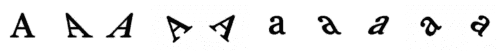
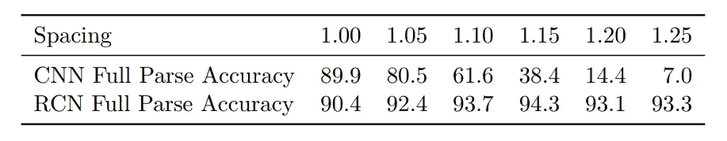
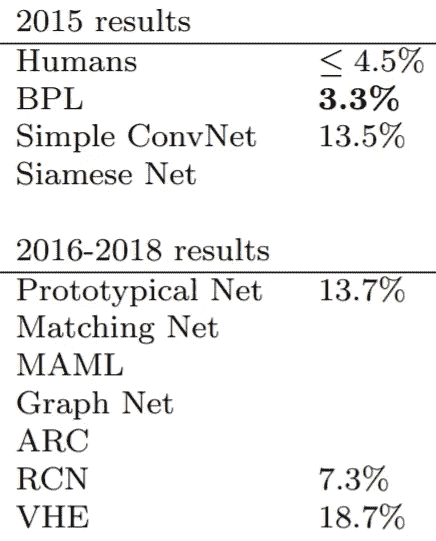
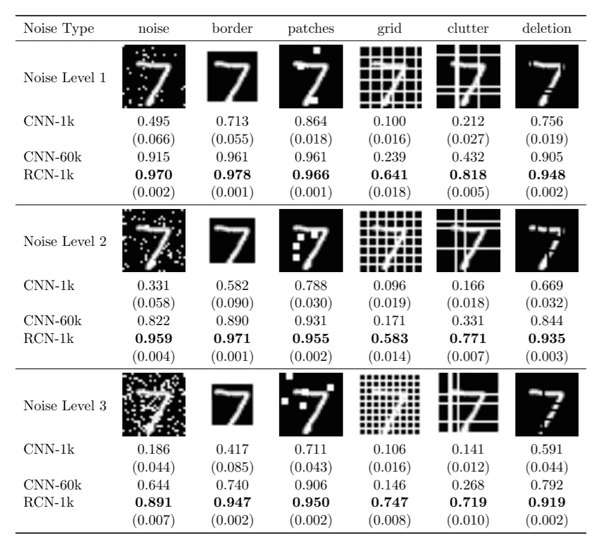
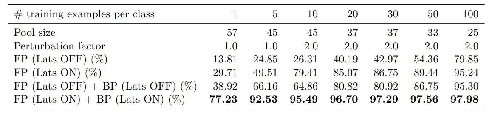

# 在流行数据集上检验 RCNs 的性能

> 原文：<https://towardsdatascience.com/examining-the-performance-of-rcns-on-popular-datasets-1d6a2a8852c1?source=collection_archive---------36----------------------->

## 皇家护理学院

## 大脑启发的计算机视觉模型有多好？

递归皮层网络基于与我们在深度学习中习惯的想法有很大不同的想法。那么，那些受神经科学启发的想法有多好呢？在这篇文章中，我们检查了 rcn 在不同任务上的表现，并对作者引入的想法进行了消融研究。除非另有说明，本文全部基于 RCNs 的论文[1]及其补充文件。

***注:本文所有图表均取自【1】。***

RCNs 的第一个测试是基于文本的验证码，它可以灵活地处理。500 个 reCAPTCHA 图像用于设置一些超参数的值，包括 RCN 将要被训练的字体。是的，RCN 实际上不是直接在 reCAPTCHA 图像上训练的，而是在对其进行了 10 次变换的单个字母上训练的，如图 1 所示，产生了总共 260 个图像的训练数据集。请记住，中间层仍在 SHREC 3D 数据集上进行训练，不包括在这些数字中。

图 1:为验证码图片构建的 RCN 的训练数据集。

这产生了一个模型，该模型以 84.2%的成功率为 reCAPTCHA 提供答案，而人类工人达到了 87.4%的准确率。然而，需要注意的是，如果答案产生的字符串长度与实际长度相似，并且有 0 或 1 个错误字符，则接受答案。这个成功率在逻辑上打破了基于文本的验证码，例如，你不希望一个机器人以这个成功率在你的网站上创建假账户。破解基于文本的验证码是否是一个壮举是另一个讨论，但这里明确的壮举是数据效率和推广到看不见的条件的能力，这将在剩余的实验中变得更加清楚。

为了了解它与 ConvNet 的对比，作者建立了一个 reCAPTCHA 控制集，并基于谷歌街景和 reCAPTCHA 团队 2013 年的一篇论文建立了一个 conv net 模型[2]。该论文声称，在困难的例子上达到 99.8%的准确率，但训练集“在数百万的数量级”。RCN 的作者在 79，000 张图像上训练了 ConvNet，并添加了残余连接，因为论文是旧的。前一段的 ConvNet 和 RCN 得分相当。然而，在增加测试集中字符之间的水平间距时(该间距不在训练集中，但应该使字母更清晰、更容易识别)，ConvNet 的性能急剧下降，而 RCN 的性能则有所增加，如表 1 所示。

表 1:reCAPTCHA 控制集上 RCN 和 ConvNet 的性能比较。“间距”是水平间距。

为了展示 rcn 的高数据效率，他们在一次性学习 Omniglot 挑战赛上进行了测试。数据集由 20 个符号组成，每个符号有一个训练图像和一个测试图像。从 Omniglot 挑战的 3 年进度报告中，您可以看到他们的成果仍然令人印象深刻，如摘自该报告的表 2 所示[3]。在您的评估中，您应该考虑到 rcn 与 ConvNets 不同，几十年来没有经过不同研究人员的改进。需要注意的是，BPL 并不是像 RCNs 那样的通用架构，这也是它表现如此出色的原因。

表 2:不同型号在单镜头 Omniglot 挑战赛上的表现。

RCN 论文中的另一个重要实验是对 MNIST 噪声变体的测试。实验如下进行。他们在 MNIST 数据集的干净图像上训练了 3 个模型:1000 幅图像上的 RCN，1000 幅图像上的 CNN，以及 60000 幅图像上的 CNN。然后，他们在 MNIST 测试图像上测试了每个模型的性能，但添加了 6 种不同强度的不同类型的噪声，如表 3 所示。RCN 在这项测试中的优势从数字中显而易见，因为它始终胜过 ConvNets。但是，我仍然希望您记住，rcn 是在 SHREC 3D 数据集的 10K 图像上预先训练的。

表 3:一个 RCN 和两个 ConvNets 在噪声 MNIST 上的性能。报告的数字是测试精度，括号中的数字是标准偏差。

此外，作者进行了一项消融研究，以观察横向连接和反向传递是否有用。在这项研究中，他们测试了具有不同配置的 RCN 在噪声*小于* MNIST 方面的性能，如表 4 所示。这个测试表明，对于高数据效率，RCNs 中的所有思想都非常有用。

表 4:消融研究结果。报告的数字是分类精度。FP 指的是向前传递，BP 指的是向后传递，Lats 指的是横向连接。扰动因子是横向连接的超参数。

作者做了更多的实验，包括在 ICDAR 挑战上测试 rcn，在不同的 CAPTCHA 数据集上测试，在从有噪声的 MNIST 图像重建上测试，以及在 3D 对象的分类上测试。然而，它们不会在本文中讨论，但是我可能会将它们包含在后续文章中，该后续文章将对 rcn 进行更具批判性的分析，以及我们可以从中学到什么。

您可能会有一个迫切的问题，如果 rcn 是数据有效的，为什么不在现实生活中应用。这有多种原因，但即使是作者也承认的两个主要原因是，它不适用于大规模数据集，并且它假设背景是单一的东西，不包含信息。用作者自己的话说，这是两个原因:

> “…因为 RCN 将每个训练样本的原型存储在其倒数第二层(用于分类)，所以扩展到非常大的数据集，如 ImageNet 和其他对象识别基准，其中 CNN(如 AlexNet)是最先进的，可能会很困难…”
> 
> 在真实图像中，背景上下文提供了关于场景中可能存在的对象的无价信息。这个信息目前被 RCN 忽略，RCN 只对前景对象建模，忽略上下文。另一个极端是，CNN 不加区分地汇总前景和背景信息(这样就有可能通过显示脱离上下文的对象来欺骗 CNN)”

那为什么要写各种各样的文章呢？因为这两个缺点并不存在于所有的数据集中(想想资源不足的语言的 OCR ),因为想法在开始时有很多限制是正常的，就像胶囊网络一样。

本文到此为止。如果你想了解更多关于 RCNs 的知识，你可以查看它的论文[1]和补充材料文档，或者你可以阅读我的关于 RCNs 结构的文章。

# 参考资料:

[1] [D. George，W. Lehrach，K. Kansky 等，一种以高数据效率进行训练并打破基于文本的验证码的生成视觉模型(2017)，科学杂志(第 358 卷—第 6368 期)。](https://science.sciencemag.org/content/358/6368/eaag2612.full?ijkey=DmvGldXIEXVoQ&keytype=ref&siteid=sci)

[2] [I. Goodfellow，Y. Bulatov，J. Ibraz 等，利用深度卷积神经网络从街景图像中识别多位数号码(2013)，Arxiv。](https://arxiv.org/abs/1312.6082)

[3] [B. Lake，R. Salakhutdinov，& J. Tenenbaum，《Omniglot 挑战:三年进度报告》(2019 年)，Arxiv。](https://arxiv.org/pdf/1902.03477.pdf)