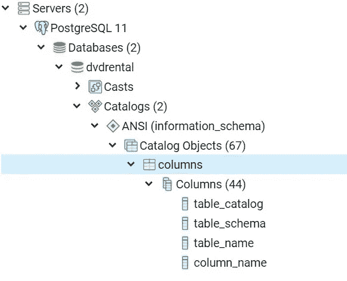
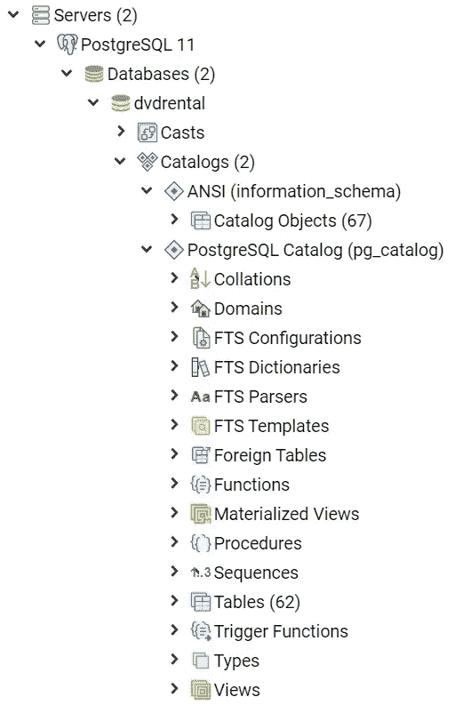

# 使用 Python 检查 Postgres 目录

> 原文：<https://towardsdatascience.com/examining-the-postgres-catalog-with-python-70d872b8f6d5?source=collection_archive---------55----------------------->



Postgres 目录中的大量信息

## 充分利用数据库元数据

像 Postgres 这样的关系数据库包括一组描述数据库中的表的表。这组元数据表被称为**目录**，它包含了关于数据库的大量细节。我最近需要编写一个程序来从数据库目录中自动提取见解，这使我编写了一个简单的 Python 模块来连接到 Postgres 数据库，从目录中获取信息，并将该信息加载到 Pandas 数据帧中，以便用 Python 进行进一步处理。这篇文章描述了我遵循的过程。

## 介绍

关于 Postgres 的一个关键事实是，它有两个目录，而不是一个:

*   **ANSI** (information_schema):这个目录包含为 ANSI 标准定义的公共关系数据库信息。如果您将目录的使用限制在 information_schema，那么您的代码应该与实现 ANSI 标准的其他关系数据库一起工作。
*   **PostgreSQL** (pg_catalog):这个目录包含特定于 Postgres 的元数据。如果您的代码依赖于这个目录，那么在它可以与其他关系数据库一起使用之前，需要对它进行更新。

当您使用 Postgres UI 管理工具 [pgAdmin](https://www.pgadmin.org/) 检查与数据库相关的对象时，您可以看到数据库 dvdrental 有以下两个目录:



出于本文的目的，我将重点放在 ANSI 目录上，因为它有我需要的信息，并且我编写的用于 Postgres ANSI 目录的代码应该可以用于其他关系数据库的目录。

## 设置 Postgres 目录的探索

为了从 Python 程序中探索 Postgres ANSI 目录，我遵循了以下步骤:

1.  [下载了](https://www.postgresql.org/download/)并安装了 Postgres，还有 [pgAdmin](https://www.pgadmin.org/download/) 。出于本练习的目的，pgAdmin 提供了快速检查目录和复查 Python 代码结果的完美方法。
2.  设置 [dvdrental](https://www.postgresqltutorial.com/postgresql-sample-database/) 数据库。这个示例数据库很容易设置，并且有丰富的数据库对象，包括触发器、视图、函数和序列，所以在它的 ANSI 目录中有很多需要研究的内容。
3.  创建了一个 Python 模块来连接数据库，运行一个查询来从一个目录表中提取信息，并将结果保存为一个 pickled 数据帧

以下部分描述了我为实现步骤 3 而编写的 Python 代码。

## 探索 Postgres 目录的 Python 模块

你可以在这里找到探索 Postgres 目录[的 Python 模块。以下是该守则的要点:](https://github.com/ryanmark1867/dl_auto_catalog/blob/master/notebooks/scrape_db_catalog.py)

1.  使用 psycopg2 库创建到 Postgres 数据库的连接。使用从配置文件[scrape _ db _ catalog _ config . yml](https://github.com/ryanmark1867/dl_auto_catalog/blob/master/notebooks/scrape_db_catalog_config.yml)读取的参数和用户交互提供的 Postgres 密码建立连接:

2.使用配置文件中的参数构建查询来检查目录中的一个表，运行查询，并将结果复制到 Python 变量 record_col_details 中。

3.将查询结果写入熊猫数据帧:

配置文件包含连接参数(在 general 部分)和查询参数(在 query_scope 部分)。

通过更新配置文件中的参数，您可以轻松地更改查询，以检查不同的目录表(通过更新 from_table)或目录表中不同的列集(通过更新 cols)。这意味着您可以重复地重新运行 Python 模块来从目录中获得您需要的细节，而不必接触 Python 代码。

例如，如果我想在查询的输出中包含 ordinal_position 列，我只需将它添加到配置文件的 cols 列表中:

请注意，Postgres 连接的密码不包含在配置文件中。相反，代码会直接提示用户输入密码:

以下是 Python 模块的输出示例，显示了从 ANSI 目录的列表(information_schema.columns)中选择的列。我可以使用列的数据类型信息来帮助自动创建简单的深度学习模型，以对这些表中的数据进行预测。

```
column_name                    data_type     table_name
0     last_name            character varying          actor
1      actor_id                      integer          actor
2    first_name            character varying          actor
3   last_update  timestamp without time zone          actor
4    first_name            character varying     actor_info
5      actor_id                      integer     actor_info
6     last_name            character varying     actor_info
7     film_info                         text     actor_info
```

## 结论

Postgres ANSI 目录包含关于 Postgres 数据库的有用元数据。通过使用 psycopg2 库连接到数据库并在配置文件中维护连接和查询参数，您可以从 Python 模块中有效地检查目录。

## 相关资源

*   包含本文所述代码的回购:【https://github.com/ryanmark1867/dl_auto_catalog 
*   Python PostgreSQL 教程使用 psycopg 2:[https://pynative.com/python-postgresql-tutorial/](https://pynative.com/python-postgresql-tutorial/)
*   结构化数据深度学习主 repo:[https://github . com/ryanmark 1867/Deep _ Learning _ for _ Structured _ Data](https://github.com/ryanmark1867/deep_learning_for_structured_data)
*   结构化数据深度学习书籍:[https://www . manning . com/books/deep-Learning-with-Structured-Data](https://www.manning.com/books/deep-learning-with-structured-data)