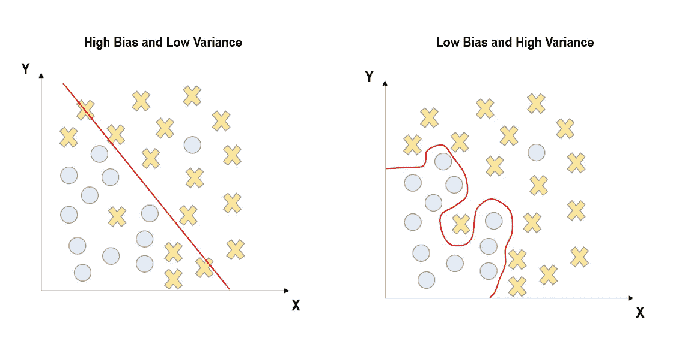
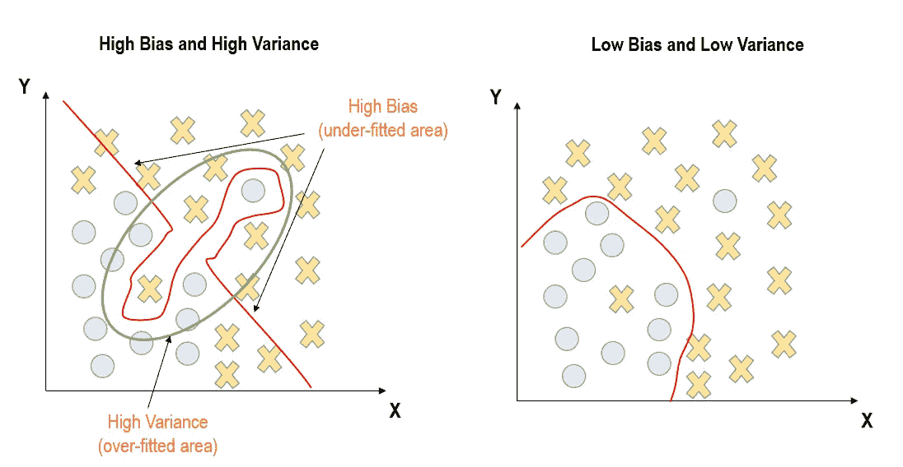
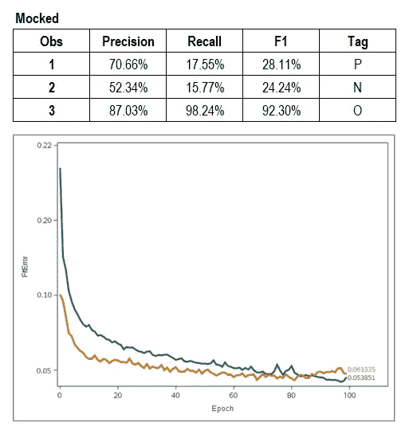
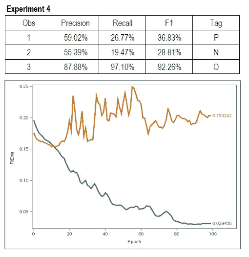
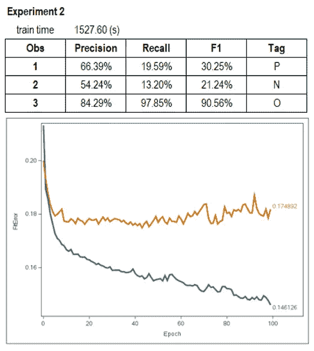
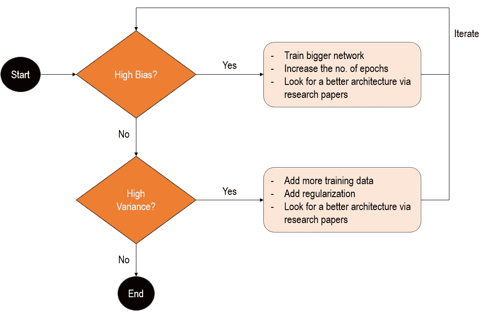
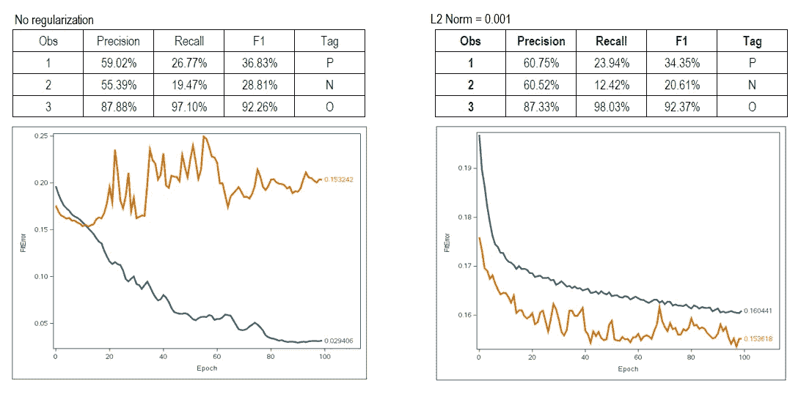
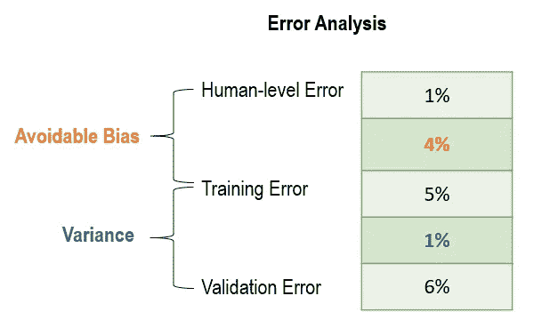
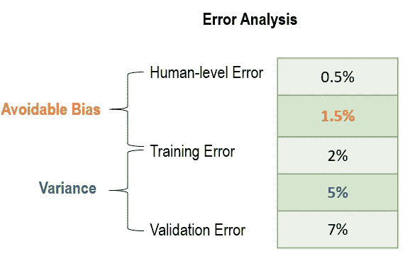
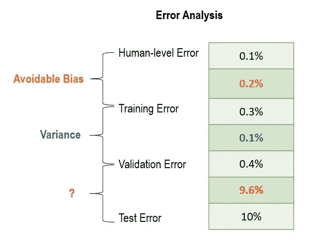

# 深度学习中偏差方差权衡的例子

> 原文：<https://towardsdatascience.com/examples-of-bias-variance-tradeoff-in-deep-learning-6420476a20bd?source=collection_archive---------26----------------------->

西蒙·艾布拉姆斯在 [Unsplash](https://unsplash.com?utm_source=medium&utm_medium=referral) 上拍摄的照片

# 介绍

啊…偏差-方差权衡…

到目前为止，你可能已经在互联网上看到了大量关于这方面的文章。

> *这不像他们中的一个。*

似乎缺乏关于深度学习(高/低)偏差和方差实际上是什么样子的例子。

希望这篇文章能填补这个空白。

以下是我将要报道的内容:

1.  对偏差和方差的简要概念理解
2.  不同情况下拟合损失曲线可能的样子
3.  如何缓解
4.  如何优先考虑先减轻什么——你应该先降低偏差还是方差？

# 机器学习中的偏差和方差

术语“偏差”和“方差”实际上在不同的行业有不同的含义。

在心理学中，“偏见”可以指所有的认知偏见！例如信息偏差、确认偏差、注意偏差等。

> 有趣的事实:我花了 4 年时间获得心理学学位。然而，我在这里写的是一个与此无关的帖子。生活的结局很有趣。

在数学中，术语“方差”指的是平均值的平方偏差。

然而，在机器学习的背景下，它只是指你训练的模型要么学习得太少(偏差)，要么学习得太多(方差)。

简单来说，

**偏差=一个*简单的*模型，它不符合数据**

相反地…

**方差=过度拟合数据的*复杂*模型**

那么这在概念上看起来如何呢？

下面是不同场景的样子。

> 原谅看起来凌乱的曲线..这些是我用 powerpoint 画的哈哈。

高偏差和低方差与低偏差和高方差的对比示例

高偏差和高方差与低偏差和低方差的对比示例

我认为最难理解的概念是高偏差和高方差的情况。

我已经对图表进行了注释，指出了高偏差和差异的区域，这样您就可以直观地理解它在概念上的样子。

到目前为止还不错，是吗？

> 如果你正在寻找数学和推导，有大量的其他职位涵盖这一点。我不会报道这些。

现在你已经对机器学习中的偏差和方差有了一个简单的理解，让我们来看看它们实际上是什么样子的。

# 偏差方差权衡的例子

这里是一些实际的屏幕截图，展示了不同的偏差与方差的情况。

这些是运行多个深度学习模型以找到每个模型的好例子的结果。:)

# 低偏差和低方差

低偏差和低方差示例

# 低偏差和高方差

低偏差和高方差示例

# 高偏差和低方差

高偏差和低方差示例

# 高偏差和高方差

高偏差和高方差的例子

您已经看到了四个例子，展示了每种组合可能的样子。

> 你能说出哪些有高偏差或高方差吗？你在看什么来得出你的结论？

这是我用来确定偏差和方差的东西。

我首先关注的是拟合误差统计。

在上面的结果中，这是曲线上标注的两个数字。这些数字代表跨时代的最小训练/验证误差。

如果**训练误差很高，**比如说 15.39%，那么你*可以*说你的模型**不合适或者偏差很大。**

> 我会在后面解释为什么“可能”是斜体。这里有一个潜在的假设。

如果**验证误差很高，**比如说 17.77%，**并且验证误差和训练误差之间的差异相对较大**(看行间的空白)，那么你可以说你的模型是**过拟合** **或者方差很大。**

综合来看，如果**训练和验证误差较大，且两个统计量之间的差异相对较大**，则存在**高偏倚和高方差。**

> *请随意向上滚动，再次查看结果，以确认您的理解。*

# 你如何减轻偏差和差异的问题？

这里有一个解决机器学习中偏差/差异的通用框架。

在这种情况下，对于你的深度学习项目。

深度学习项目中如何解决偏差和差异的流程图

这里有一个具体的例子来说明正规化是如何帮助的。

正则化对深度学习模型的影响的示例

可悲的是，在正规化时，有时你可能会以上述场景结束。

该模型从低偏差、高方差变为高偏差、低方差。

换句话说，通过将 L2 正则化设置为 0.001，我对权重进行了过多的惩罚，导致模型欠拟合。

# 确定缓解工作的优先顺序

正如你已经看到上面的流程图，你应该*几乎*总是优先减少偏差。

然而，回想一下，我在上面用斜体提到了“*可能*”，并暗示了一个潜在的假设。

精神食粮。

> 你的偏见是根据什么来衡量的？

想一想。

如果你没有注意到，方差的基础是你的偏见。

那么偏见的底线是什么呢？15.39%的训练误差真的很糟糕吗？

看情况。

它*肯定会*坏！或者……也许不是。

> 偏倚比较的基础是对特定任务的人类水平表现的假设。

如果我告诉你，我正在训练的任务是一个困难的名称实体识别(NER)任务，人类往往有 15%的时间弄错标签。

然后…

15% vs 15.33%还不算太差！

我甚至会说这个模型非常合适！

**这个模型的表现相当于人类的表现。**

现在问题来了。

> *你如何衡量人的水平表现？*

一个好的方法是对训练集进行分层采样，并覆盖标签。然后让一个人或一群人煞费苦心地给样品贴上标签。

这个人工标记任务的结果就是你的人类水平的表现。

现在只是为了形式和技术…

你的训练错误和人类水平的错误之间的区别就是所谓的“可避免的偏差”。

> 注意:在做研究时，你可能会遇到术语“贝叶斯错误”。人为误差是贝叶斯误差的近似值。在统计学中，贝叶斯误差是随机结果的任何分类器的最低可能****误差**。它类似于数学中的渐近线；你的目标是尽可能地接近它，但是你知道你永远也不会达到它。**

**现在这个问题已经解决了，让我们回到最初关于优先级的问题。**

> ***什么时候应该关注减少偏差还是减少方差？***

# **机器学习错误分析**

**为了了解你应该把时间和精力放在哪里，你需要做一个错误分析。**

**下面是机器学习错误分析的例子。**

**理解起来相当简单。**

****

**优先化偏见的一个例子**

**在这个例子中，可避免的偏差高于方差；4%对 1%。**

**因此，您的首要任务应该是减少模型中的偏差。**

**现在假设我们稍微改变一下。**

**你现在应该优先考虑哪个？**

****

**区分差异优先级的示例**

**在这种情况下，方差高于可避免的偏差；5%对 1.5%。**

**如果是这种情况，那么把你的时间集中在减少差异上。**

**到目前为止，我已经介绍了我想介绍的内容。**

**但是既然我们谈到了错误分析这个话题，让我们更进一步。**

> ***如果发生这种情况，你该怎么办？***

****

**高测试误差示例**

**我不知道测试和验证错误之间的区别的名称，所以我把它标为“？”。**

**但是请注意，该模型在训练集和验证集上都做得很好。**

**但是，它在测试集上没有表现出来。**

**这是为什么呢？**

**如果这种情况发生在你身上，你可以参考以下几点:**

1.  **你的测试集和你的验证集来自同一个发行版吗？如果你训练一个猫分类器，你的测试集是老虎的图片吗？**
2.  **您是否过度使用了验证集？增加验证集的大小。记住也要打乱你的数据。**
3.  **您在培训/验证期间使用的评估标准不是一个好的指标。您可能需要改变度量标准。**

**可能有更多的原因，但这是我会做的几件事。**

# **结尾注释**

**以下是到目前为止你所读内容的快速总结:**

1.  **我开始给你一个概念上的理解，在机器学习的背景下什么是偏差和方差。**
2.  **接下来，我展示了四个真实的例子，展示了每种情况下拟合误差曲线的样子。这是为了确保你自己能够更好地识别它们。**
3.  **我还通过一个典型的流程图讲述了如何减轻偏差-方差问题。**
4.  **最后，我介绍了像人的水平的性能这样的概念，并介绍了如何执行错误分析。**

**良好的..就是这样！**

**我真诚地希望你从中有所收获！**

**直到下一个帖子，再见！！**

> **剧透:下一篇文章会很长。我已经就深度学习网络的变化如何影响预测结果进行了大量实验，并一直在记录我的结果。期待下一个帖子！:)**

**LinkedIn 简介:[蒂莫西·谭](https://www.linkedin.com/in/timothy-tan-97587190/)**