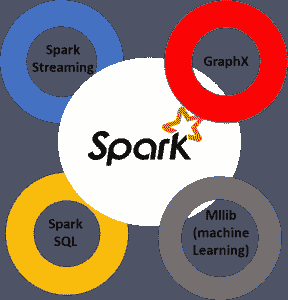
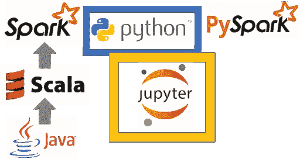
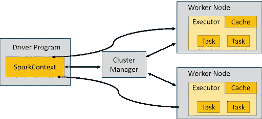
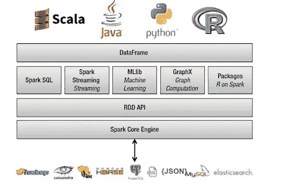

# 使用 Python 将 Apache Spark 与 PySpark 结合使用的示例

> 原文：<https://towardsdatascience.com/examples-of-using-apache-spark-with-pyspark-using-python-f36410457012?source=collection_archive---------18----------------------->

Apache Spark 是技术领域最热门的新趋势之一。这可能是最有可能实现大数据和机器学习联姻成果的框架。

它运行速度很快(由于内存操作，比传统的 [Hadoop MapReduce](https://www.tutorialspoint.com/hadoop/hadoop_mapreduce.htm) 快 100 倍)，提供健壮的、分布式的、容错的数据对象(称为)，并通过补充包(如 [Mlib](https://spark.apache.org/mllib/) 和 [GraphX](https://spark.apache.org/graphx/) )与机器学习和图形分析的世界完美集成。



[资料来源:Exxact](https://blog.exxactcorp.com/the-benefits-examples-of-using-apache-spark-with-pyspark-using-python/)

Spark 在 [Hadoop/HDFS](https://hadoop.apache.org/docs/r1.2.1/hdfs_design.html) 上实现，大部分用 [Scala](https://www.scala-lang.org/) 编写，一种类似 Java 的函数式编程语言。事实上，Scala 需要在您的系统上安装最新的 Java，并在 JVM 上运行。然而，对于大多数初学者来说，Scala 并不是他们进入数据科学世界首先要学习的语言。幸运的是，Spark 提供了一个奇妙的 Python 集成，称为 **PySpark** ，它允许 Python 程序员与 Spark 框架进行交互，并学习如何大规模操作数据，以及如何在分布式文件系统上处理对象和算法。

在本文中，我们将学习 PySpark 的基础知识。有很多概念(不断发展和引入)，因此，我们只关注一些简单例子的基本原理。我们鼓励读者在这些基础上，自己探索更多。

# Apache Spark 的短暂历史

Apache Spark 于 2009 年作为加州大学伯克利分校 AMPLab 的一个研究项目启动，并于 2010 年初开源。这是加州大学伯克利分校的一个班级项目。想法是建立一个集群管理框架，它可以支持不同类型的集群计算系统。该系统背后的许多想法在多年来的各种研究论文中都有介绍。发布后，Spark 成长为一个广泛的开发人员社区，并于 2013 年转移到 Apache Software Foundation。今天，该项目是由来自数百个组织的数百名开发人员组成的社区合作开发的。

# Spark 不是一种编程语言

需要记住的一点是，Spark 不是像 Python 或 Java 那样的编程语言。它是一个通用的分布式数据处理引擎，适用于各种环境。它对于大规模和高速的大数据处理特别有用。

应用程序开发人员和数据科学家通常将 Spark 集成到他们的应用程序中，以快速查询、分析和转换大规模数据。一些最常与 Spark 相关联的任务包括:跨大型数据集(通常为万亿字节大小)的 ETL 和 SQL 批处理作业；处理来自物联网设备和节点的流数据、来自各种传感器、各种金融和交易系统的数据；以及电子商务或 IT 应用程序的机器学习任务。

在其核心，Spark 建立在 Hadoop/HDFS 框架之上，用于处理分布式文件。它主要是用 Scala 实现的，Scala 是 Java 的一种函数式语言变体。有一个核心的 Spark 数据处理引擎，但在此之上，还有许多为 SQL 类型的查询分析、分布式机器学习、大规模图形计算和流数据处理而开发的库。Spark 以简单接口库的形式支持多种编程语言:Java、Python、Scala 和 r。

# Spark 使用 MapReduce 范式进行分布式处理

分布式处理的基本思想是将数据块分成可管理的小块(包括一些过滤和排序)，使计算接近数据，即使用大型集群的小节点来完成特定的任务，然后将它们重新组合起来。分割部分被称为“映射”动作，重组被称为“缩减”动作。他们共同创造了著名的“MapReduce”范式，这是谷歌在 2004 年左右推出的(见[原文)。](https://static.googleusercontent.com/media/research.google.com/en//archive/mapreduce-osdi04.pdf)

例如，如果一个文件有 100 条记录要处理，那么 100 个映射器可以一起运行，每个映射器处理一条记录。或者也许 50 个映射器可以一起运行，每个处理两个记录。在所有的映射器完成处理之后，框架在将结果传递给 reducers 之前对它们进行洗牌和排序。映射器仍在运行时，缩减器无法启动。具有相同键的所有地图输出值都被分配给一个 reducer，然后该 reducer 聚合该键的值。

# 如何设置 PySpark

如果您已经熟悉 Python 和库(如 Pandas 和 Numpy ),那么 PySpark 是一个很好的扩展/框架，可以通过在后台利用 Spark 的能力来创建更具可伸缩性、数据密集型的分析和管道。

安装和设置 PySpark 环境(在一台独立的机器上)的确切过程有些复杂，可能会因您的系统和环境而略有不同。目标是使用 PySpark 包让您的常规 Jupyter 数据科学环境在后台与 Spark 一起工作。

[**这篇关于 Medium 的文章**](https://medium.com/free-code-camp/how-to-set-up-pyspark-for-your-jupyter-notebook-7399dd3cb389) 提供了关于逐步设置过程的更多细节。



[资料来源:Exxact](https://blog.exxactcorp.com/the-benefits-examples-of-using-apache-spark-with-pyspark-using-python/)

或者，您可以使用 Databricks 设置来练习 Spark。这家公司是由 Spark 的最初创建者创建的，拥有一个优秀的现成环境，可以使用 Spark 进行分布式分析。

但想法总是一样的。您在许多节点上以固定的小块分发(和复制)大型数据集。然后，您将计算引擎靠近它们，以便整个操作是并行的、容错的和可扩展的。

通过使用 PySpark 和 Jupyter notebook，您可以学习所有这些概念，而无需在 AWS 或 Databricks 平台上花费任何东西。您还可以轻松地与 SparkSQL 和 MLlib 进行接口，以进行数据库操作和机器学习。如果您事先已经理解了这些概念，那么开始处理现实生活中的大型集群将会容易得多！

# 弹性分布式数据集(RDD)和 SparkContext

许多 Spark 程序都围绕着弹性分布式数据集(RDD)的概念，这是一个可以并行操作的容错元素集合。SparkContext 驻留在驱动程序中，通过集群管理器管理工作节点上的分布式数据。使用 PySpark 的好处是，所有这些复杂的数据分区和任务管理都在后台自动处理，程序员可以专注于特定的分析或机器学习工作本身。



[来源:Exxact](https://blog.exxactcorp.com/the-benefits-examples-of-using-apache-spark-with-pyspark-using-python/)

*rdd-1*

创建 rdd 有两种方法——在驱动程序中并行化现有集合，或者引用外部存储系统中的数据集，例如共享文件系统、HDFS、HBase 或任何提供 Hadoop InputFormat 的数据源。

```
from pyspark import SparkContext import numpy as np sc=SparkContext(master="local[4]") lst=np.random.randint(0,10,20) A=sc.parallelize(lst)
```

***注意参数*中的‘4’。它表示 4 个计算核心(在您的本地机器中)将用于这个 SparkContext 对象**。如果我们检查 RDD 对象的类型，我们得到如下结果，

```
type(A) >> pyspark.rdd.RDDA.collect() >> [4, 8, 2, 2, 4, 7, 0, 3, 3, 9, 2, 6, 0, 0, 1, 7, 5, 1, 9, 7]
```

但是 A 不再是简单的 Numpy 数组。我们可以使用 glom()方法来检查分区是如何创建的。

```
A.glom().collect() >> [[4, 8, 2, 2, 4], [7, 0, 3, 3, 9], [2, 6, 0, 0, 1], [7, 5, 1, 9, 7]]
```

现在停止 SC，用 2 个内核重新初始化它，看看重复这个过程会发生什么。

```
sc.stop() sc=SparkContext(master="local[2]") A = sc.parallelize(lst) A.glom().collect() >> [[4, 8, 2, 2, 4, 7, 0, 3, 3, 9], [2, 6, 0, 0, 1, 7, 5, 1, 9, 7]]
```

RDD 现在分布在两个块上，而不是四个！您已经了解了分布式数据分析的第一步，即控制如何将您的数据划分为更小的块以供进一步处理

# RDD &派斯帕克基本操作的一些例子

# 数数元素

```
>> 20A.first() >> 4 A.take(3) >> [4, 8, 2]
```

# 使用 distinct 删除重复项

**注意**:这个操作需要一个**洗牌**来检测跨分区的复制。所以，这是一个缓慢的操作。不要过度。

```
A_distinct=A.distinct() A_distinct.collect() >> [4, 8, 0, 9, 1, 5, 2, 6, 7, 3]
```

# 使用 reduce 方法对所有元素求和

注意这里使用了 lambda 函数，

```
A.reduce(lambda x,y:x+y) >> 80A.sum() >> 80
```

# 通过归约寻找最大元素

```
A.reduce(lambda x,y: x if x > y else y) >> 9
```

# 在文本块中查找最长的单词

```
words = 'These are some of the best Macintosh computers ever'.split(' ') wordRDD = sc.parallelize(words) wordRDD.reduce(lambda w,v: w if len(w)>len(v) else v) >> 'computers'
```

# 使用过滤器进行基于逻辑的过滤

```
# Return RDD with elements (greater than zero) divisible by 3 A.filter(lambda x:x%3==0 and x!=0).collect() >> [3, 3, 9, 6, 9]
```

# 编写与 reduce()一起使用的常规 Python 函数

```
def largerThan(x,y): """ Returns the last word among the longest words in a list """ if len(x)> len(y): return x elif len(y) > len(x): return y else: if x < y: return x else: return y wordRDD.reduce(largerThan) >> 'Macintosh'
```

注意这里的 x < y does a lexicographic comparison and determines that Macintosh is larger than computers !

# Mapping operation with a lambda function with PySpark

```
B=A.map(lambda x:x*x) B.collect() >> [16, 64, 4, 4, 16, 49, 0, 9, 9, 81, 4, 36, 0, 0, 1, 49, 25, 1, 81, 49]
```

# Mapping with a regular Python function in PySpark

```
def square_if_odd(x): """ Squares if odd, otherwise keeps the argument unchanged """ if x%2==1: return x*x else: return x A.map(square_if_odd).collect() >> [4, 8, 2, 2, 4, 49, 0, 9, 9, 81, 2, 6, 0, 0, 1, 49, 25, 1, 81, 49]
```

# groupby returns a RDD of grouped elements (iterable) as per a given group operation

```
result=A.groupBy(lambda x:x%2).collect() sorted([(x, sorted(y)) for (x, y) in result]) >> [(0, [0, 0, 0, 2, 2, 2, 4, 4, 6, 8]), (1, [1, 1, 3, 3, 5, 7, 7, 7, 9, 9])]B.histogram([x for x in range(0,100,10)]) >> ([0, 10, 20, 30, 40, 50, 60, 70, 80, 90], [10, 2, 1, 1, 3, 0, 1, 0, 2])
```

# Set operations

Check out [**这个 Jupyter 笔记本**](https://github.com/tirthajyoti/Spark-with-Python/blob/master/SparkContext%20and%20RDD%20Basics.ipynb) 有更多的例子。

惰性评估是一种评估/计算策略，它为计算任务准备了执行流水线的详细的逐步内部图，但是将最终执行延迟到绝对需要的时候。这一策略是 Spark 加速许多并行化大数据操作的核心。

让我们在这个例子中使用两个 CPU 内核，

```
sc = SparkContext(master="local[2]")
```

# 用一百万个元素做一个 RDD

```
%%time rdd1 = sc.parallelize(range(1000000)) >> CPU times: user 316 µs, sys: 5.13 ms, total: 5.45 ms, Wall time: 24.6 ms
```

# 一些计算功能—需要时间

```
from math import cos def taketime(x): [cos(j) for j in range(100)] return cos(x)
```

# 检查 taketime 函数花费了多少时间

```
%%time taketime(2) >> CPU times: user 21 µs, sys: 7 µs, total: 28 µs, Wall time: 31.5 µs >> -0.4161468365471424
```

# 现在对函数进行映射操作

```
%%time interim = rdd1.map(lambda x: taketime(x)) >> CPU times: user 23 µs, sys: 8 µs, total: 31 µs, Wall time: 34.8 µs
```

*为什么每个函数需要 45.8 us，但一百万元素 RDD 的地图操作也需要类似的时间？*

**由于懒惰评估，即在之前的步骤中没有进行任何计算，只制定了一个执行计划**。变量 interim 不指向数据结构，而是指向一个执行计划，用依赖图表示。依赖图定义了 rdd 如何相互计算。

# reduce 方法的实际执行

```
%%time print('output =',interim.reduce(lambda x,y:x+y)) >> output = -0.28870546796843666 >> CPU times: user 11.6 ms, sys: 5.56 ms, total: 17.2 ms, Wall time: 15.6 s
```

现在，我们还没有保存(具体化)任何中间结果，所以另一个简单的操作(例如，计数元素> 0)将花费几乎相同的时间。

```
%%time print(interim.filter(lambda x:x>0).count()) >> 500000 >> CPU times: user 10.6 ms, sys: 8.55 ms, total: 19.2 ms, Wall time: 12.1 s
```

# 缓存以减少类似操作的计算时间(消耗内存)

还记得我们在上一步中构建的依赖图吗？我们可以像以前一样使用 cache 方法运行相同的计算，告诉依赖图规划缓存。

```
%%time interim = rdd1.map(lambda x: taketime(x)).cache()
```

第一次计算不会改进，但是它缓存了中间结果，

```
%%time print('output =',interim.reduce(lambda x,y:x+y)) >> output = -0.28870546796843666 >> CPU times: user 16.4 ms, sys: 2.24 ms, total: 18.7 ms, Wall time: 15.3 s
```

现在在缓存结果的帮助下运行相同的过滤方法，

```
%%time print(interim.filter(lambda x:x>0).count()) >> 500000 >> CPU times: user 14.2 ms, sys: 3.27 ms, total: 17.4 ms, Wall time: 811 ms
```

哇！计算时间从之前的 12 秒下降到不到 1 秒！这样，延迟执行的缓存和并行化就是 Spark 编程的核心特性。

# Dataframe 和 SparkSQL

除了 RDD，Spark 框架中的第二个关键数据结构是。如果您使用过 Python Pandas 或 R DataFrame，这个概念可能会很熟悉。

数据帧是指定列下的行的分布式集合。它在概念上相当于关系数据库中的一个表、一个带有列标题的 Excel 表或 R/Python 中的一个数据框，但是在底层有更丰富的优化。数据帧可以从各种来源构建，例如:结构化数据文件、Hive 中的表、外部数据库或现有的 rdd。它还与 RDD 有一些共同的特征:



[资料来源:Exxact](https://blog.exxactcorp.com/the-benefits-examples-of-using-apache-spark-with-pyspark-using-python/)

*   本质上是不可变的:我们可以创建一次数据框架/ RDD，但不能改变它。并且我们可以在应用变换之后变换数据帧/ RDD。
*   惰性评估:这意味着直到一个动作被执行，一个任务才被执行。分布式:RDD 和 DataFrame 都分布在自然界。

# 数据框架的优势

*   数据帧是为处理大量结构化或半结构化数据而设计的。
*   Spark 数据帧中的观察结果组织在命名列下，这有助于 Apache Spark 理解数据帧的模式。这有助于优化这些查询的执行计划。
*   Apache Spark 中的 DataFrame 能够处理数 Pb 的数据。
*   DataFrame 支持多种数据格式和数据源。
*   它有对不同语言的 API 支持，比如 Python，R，Scala，Java。

# 数据框架基础示例

[**火花数据帧基础知识**](https://github.com/tirthajyoti/Spark-with-Python/blob/master/Dataframe_basics.ipynb) [**火花数据帧操作**](https://github.com/tirthajyoti/Spark-with-Python/blob/masterDataFrame_operations_basics.ipynb)

有关数据帧的基础知识和典型使用示例，请参见以下 Jupyter 笔记本，

# SparkSQL 有助于弥补 PySpark 的不足

关系数据存储易于构建和查询。用户和开发人员通常更喜欢用类似人类的可读语言(如 SQL)编写易于解释的声明性查询。然而，随着数据的数量和种类开始增加，关系方法无法很好地扩展以构建大数据应用程序和分析系统。

借助 Hadoop 和 MapReduce 范式，我们在大数据分析领域取得了成功。这很强大，但是通常很慢，并且给用户提供了一个低级的、**过程化的编程接口**,要求人们为非常简单的数据转换编写大量代码。然而，一旦 Spark 发布，它就真正彻底改变了大数据分析的方式，专注于内存计算、容错、高级抽象和易用性。


[来源:Exxact](https://blog.exxactcorp.com/the-benefits-examples-of-using-apache-spark-with-pyspark-using-python/)

Spark SQL 本质上试图在我们之前提到的两种模型——关系模型和过程模型——之间架起一座桥梁。Spark SQL 通过 DataFrame API 工作，可以对外部数据源和 Spark 内置的分布式集合执行关系操作——大规模！

为什么 Spark SQL 这么快，这么优化？原因是因为一个新的可扩展优化器， **Catalyst** ，它基于 Scala 中的函数式编程结构。Catalyst 支持基于规则和基于成本的优化。虽然在过去已经提出了可扩展的优化器，但是它们通常需要复杂的特定于领域的语言来指定规则。通常，这导致了很长的学习曲线和维护负担。相比之下，Catalyst 使用 Scala 编程语言的标准特性，例如模式匹配，让开发人员可以使用完整的编程语言，同时仍然可以轻松地指定规则。

[**SparkSQL 数据库操作基础知识**](https://github.com/tirthajyoti/Spark-with-Python/blob/master/Dataframe_SQL_query.ipynb)

关于 SparkSQL 数据库操作的介绍，可以参考下面的 Jupyter 笔记本:

# 你将如何在你的项目中使用 PySpark？

我们讲述了 Apache Spark 生态系统的基础知识，以及它是如何工作的，并给出了一些使用 Python 接口 PySpark 的核心数据结构 RDD 的基本例子。此外，还讨论了 DataFrame 和 SparkSQL 以及代码笔记示例的参考链接。

将 Apache Spark 与 Python 结合使用，还有很多东西需要学习和尝试。PySpark 网站是一个很好的参考网站，他们会定期更新和增强——所以请关注它。

此外，如果您对使用 Apache Spark 进行大规模分布式机器学习感兴趣，请查看 PySpark 生态系统的 [MLLib 部分。](https://spark.apache.org/mllib/)

*原载于 2020 年 4 月 7 日*[*【https://blog.exxactcorp.com】*](https://blog.exxactcorp.com/the-benefits-examples-of-using-apache-spark-with-pyspark-using-python/)*。*