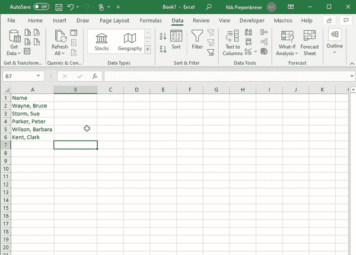
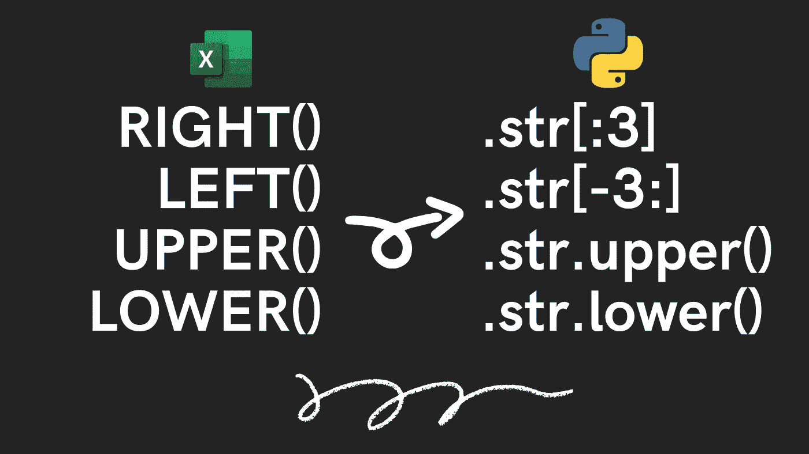

# 3 个中级 Excel 函数以及如何用 Python 来做！

> 原文：<https://towardsdatascience.com/excel-functions-in-python-17d35defebdd?source=collection_archive---------17----------------------->

## 不仅仅是在熊猫身上试水！

让我们和熊猫一起出发吧！资料来源:Nik Piepenbreier

你想尝试一下蟒蛇和熊猫的有趣世界吗？

Python 通常被认为比 Excel 更难掌握，但却有无限的潜力。本教程将带您逐步了解您已经在 Excel 中使用的函数。

# Pandas 中的文本转列

当您得到由奇怪结构的数据组成的大型数据集时，Text to columns 是这些基本功能之一。

例如，可能会给你一列人名。但是不是一列表示姓，另一列表示名，而是一列表示姓*，名*。

Excel 中的文本到列。资料来源:Nik Piepenbreier

Excel 的“文本到列”功能让您可以轻松地将这些数据拆分到单独的列中。

您只需选择列，单击数据→文本到列，并用逗号分隔。

瞧啊。

现在在熊猫身上做同样简单！

让我们来看看这段代码:

Pandas 中的文本到列。资料来源:Nik Piepenbreier

要创建包含姓氏和名字的两个新列，只需编写以下代码:

Pandas 中的文本到列-代码。资料来源:Nik Piepenbreier

让我们来看看拆分功能:

*   我们指定要在逗号(，)上进行拆分。
*   我们还指出 expand=True，这意味着数据被拆分到新的列中。如果该值为 False，将创建一个字符串列表。
*   还可以使用 n=来指定想要拆分字符串的次数。默认值为-1，表示所有实例。

# 用熊猫代替文本函数(如 RIGHT()、PROPER())

Excel 也塞满了不同的文本函数。您可以使用 LEFT()和 RIGHT()等函数来提取字符，使用 PROPER()和 LOWER()来修改单元格内的文本。

让我们加载另一个数据帧，看看如何用 Pandas 实现这些:

加载更多数据。资料来源:Nik Piepenbreier

现在，让我们应用一些文本函数:

应用字符串函数。资料来源:Nik Piepenbreier

LEFT()和 RIGHT()函数通过索引每一列中的字符串来工作。由于字符串是 Python 中的*可迭代*对象，所以可以对它们进行索引。

通过编写[:3]，您要求 Python 返回第三个字符之前的字符(但不包括第三个字符)。

Excel 和 Pandas 中的一些常用文本函数。资料来源:Nik Piepenbreier

# 跨列应用计算

Excel 使得对列的操作非常直观。由于每个单元格都有一个特定的引用，您可以使用该单元格引用轻松地将其乘以一个值，将两个单元格相加，等等。

现在还不清楚你是否能在熊猫身上做到这一点。

让我们加载一个包含两列重量的样本数据帧，我们假设重量单位为千克:

加载第三个数据帧。资料来源:Nik Piepenbreier

如果我们想要创建一个包含 weight1 和 weight2 之和的新列，我们可以简单地将它们相加:

添加两列。资料来源:Nik Piepenbreier

最后，如果我们想将 sum 列转换为磅(通过乘以 2.2)，您可以直接应用该乘法:

在熊猫中乘一列。资料来源:Nik Piepenbreier

# 结论

感谢阅读！资料来源:Nik Piepenbreier

感谢阅读这篇文章！我希望你学到了一些东西，并且对尝试 Python 和熊猫的有趣世界感到更舒服了！

如果你想更深入地了解这一点，可以看看我的其他文章或我的电子书，带你从完全初学者到中级熊猫！你可以在这里找到:[https://gumroad.com/l/introtopythonfordatascience](https://gumroad.com/l/introtopythonfordatascience)