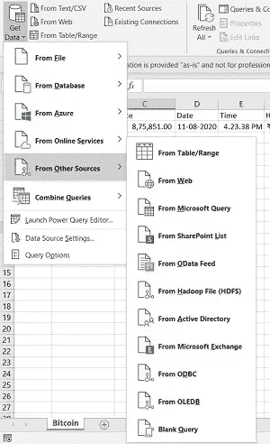
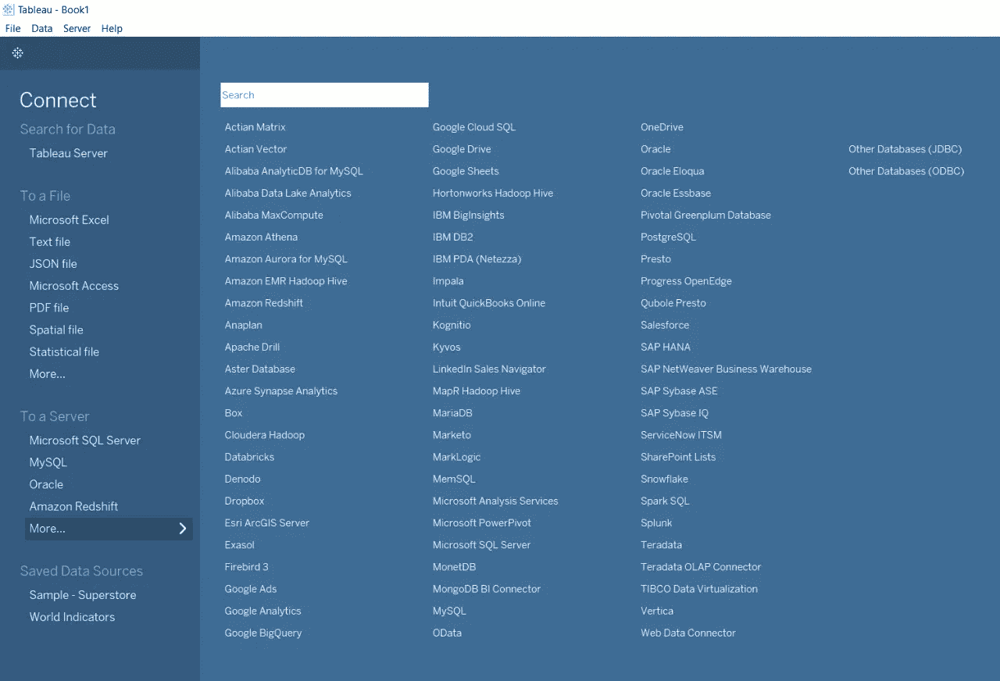
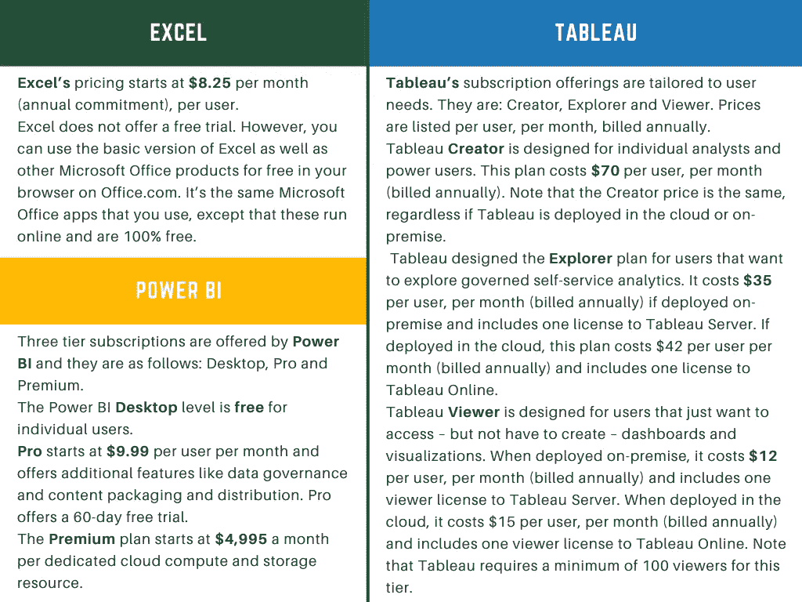

# Excel，Tableau，Power BI…应该用什么？

> 原文：<https://towardsdatascience.com/excel-tableau-power-bi-what-should-you-use-336ef7c8f2e0?source=collection_archive---------3----------------------->

## 找出你需要什么数据分析或可视化。

杰森·斯特鲁尔在 [Unsplash](https://unsplash.com?utm_source=medium&utm_medium=referral) 上的照片

在发表了我的[上一篇关于 Power BI 的数据可视化的文章](/how-to-visualize-data-using-power-bi-9ec1413e976e)之后，我收到了很多关于 Power BI 相对于 Tableau 或 Excel 的能力的问题。如果使用得当，数据可以变成数字黄金。那么，作为个人或组织，您必须使用什么来分析和可视化您的数据呢？请继续阅读，寻找答案。

在本文中，我们将了解所有这三个系统，并比较它们的各种特性。

微软 Excel 发布于 1985 年，本质上是一个具有计算、绘图工具、数据透视表和宏编程语言等功能的工具。可以在 Windows、Mac、Android、iOS 等多种操作系统上使用。

接下来是 ***的画面。***Tableau 成立于 2003 年，是一款交互式数据可视化软件。它被认为是发展最快的数据可视化工具，主要是因为它能够帮助用户查看和理解数据。它只是将原始数据转换成易于理解的视觉效果，从而改变人们使用数据解决问题和做出决策的方式。

***动力 BI*** 发布于 2014 年。它是微软基于云的分析和商业智能服务。它旨在为 It 用户提供交互式可视化和商业智能功能，以及简单的数据共享、数据评估和可扩展的仪表板。

下面列出几个参数，对三款软件进行对比。

作者图片

## **1。数据来源**

Excel 是一种灵活、易用的电子表格，通常用于创建数据集。借助数据连接功能，它可以将数据从外部数据源拉入您的电子表格。它还可以从 Web、Microsoft Query、SharePoint List、OData Feed、Hadoop Files (HDFS)等来源获取数据。因此，Excel 文件经常被用作 Power BI 和 Tableau 的数据源。

Tableau 支持数百种数据连接器，包括在线分析处理(OLAP)和大数据选项(如 NoSQL、Hadoop)以及云选项。

作者图片

Power BI 非常能够连接到用户的外部资源，包括 SAP HANA、JSON、MySQL 等等。它使用户能够连接到微软 Azure 数据库、第三方数据库、文件和在线服务，如 Salesforce 和谷歌分析。

当用户从多个来源添加数据时，Tableau 和 Power BI 会自动确定关系。然而，Power BI 连接有限的数据源，同时在每月更新中增加其数据源连接器。

## **2。数据发现**

数据发现是通过可视化导航数据或应用引导式高级分析来检测数据中的模式和异常的过程。

使用 Excel 时，您需要知道数据需要将您引向何处，以便找到关键的见解。Excel 中的股票和地理位置等选项有助于快速获取数据细节。

Tableau 和 Power BI 允许您自由探索数据，而无需提前知道您想要的答案。使用这个软件，你能够发现相关性和趋势，然后深入了解是什么导致了它们的发生，而不是相反。这些系统让你一目了然地了解你的数据。

## **3。数据模型和适用性**

Excel 侧重于创建具有广泛功能的结构化和简单的数据模型，最适合于结构化数据的统计分析。

Tableau 允许您创建一个简单的数据模型，比如单个表，也可以是更复杂的模型，包含使用不同关系、连接和联合组合的多个表。它最适合快速简单地表示大数据，有助于解决大数据问题。

Power BI 的数据模型专注于数据摄取，并轻松构建潜在的复杂数据模型。

## 4.形象化

可视化是突出不可或缺的数据的好方法。

在使用 excel 进行数据可视化时，我们首先处理显示的数据，然后手动创建不同的图表。为了使可视化容易理解，您应该很好地理解 excel 的功能。

用户可以选择许多可视化作为蓝图，然后使用 Power BI 将侧栏中的数据插入到可视化中。此外，它允许用户通过用自然语言进行查询来创建可视化效果。在深入数据集进行分析时，Power BI 确实设置了 3，500 个数据点的限制。但是，此数据点限制也有一些例外:R 视觉效果的最大数据点数量限制为 1，50，000，Power BI 视觉效果的最大数据点数量限制为 30，000，散点图的最大数据点数量限制为 10，000。

Tableau 允许用户创建不同类型的基线可视化，包括热图、折线图和散点图。此外，用户能够提出数据的“假设”问题，并可以在其分析中自由使用任意数量的数据点。

此外，Power BI 和 Tableau 允许用户集成 Python、R 等编程语言来创建可视化。

由 [giphy](https://giphy.com/) 上的 [Paloma Health](https://giphy.com/palomahealth)

此外，一个好的 API 通过提供所有的构建模块，使开发可视化变得更加容易，然后由程序员将这些模块组合在一起。API 由一组子程序定义、通信协议和构建软件的工具组成。实质上，它是各种组件之间的一组明确定义的通信方法。 [Excel](https://docs.microsoft.com/en-us/office/dev/add-ins/reference/overview/excel-add-ins-reference-overview#:~:text=An%20Excel%20add%2Din%20interacts,tables%2C%20charts%2C%20and%20more.) 、 [Tableau](https://tableaumagic.com/tableau-application-programming-interfaces-apis/) 和 [Power BI](https://powerbi.microsoft.com/en-us/blog/tag/api/) 允许用户合并 API 并利用数据创建引人注目的可视化效果。

## 5.仪表板

Excel 为创建仪表板提供了有限的功能，刷新仪表板是一个繁琐的过程。Tableau 和 Power BI 允许您创建由不同类型的图表、地图和图示组成的定制仪表板。使用 Tableau 和 Power BI 很容易刷新您的仪表板，它们使用户能够创建美观的仪表板。当谈到嵌入数据时，这可以在所有三个系统上轻松完成，但是与 Power BI 相比，在 Tableau 中这样做是一个实时挑战。

## 6.用户界面

为了充分发挥 excel 的潜力，需要具备宏和 visual basic 脚本知识。

Tableau 和 Power BI 拥有不需要编码知识就能开发复杂的可视化界面。

Tableau 有一个智能用户界面，能够轻松创建仪表板。和力量 BI 相比，画面有点难。

Power BI 界面非常简单易学。由于其简单性，Power BI 经常受到用户的青睐。

## **7。语言依赖性**

VBA (Visual Basic for Applications)是 Excel 和其他 Microsoft Office 程序的编程语言。此外，当您从数据透视表字段列表中选择项目时，Excel 使用 MDX 来检索字段和数据值。从 Analysis Services 多维数据集中导入数据时，也可以手动生成 MDX 查询。

但是什么是 MDX 呢？MDX 代表多维表达式，是一种用于 OLAP 数据库的查询语言。

Tableau 的软件工程师使用几种编程语言，但构成 Tableau 桌面绝大部分的代码是 C++。

DAX 和 M 是在 Power BI 中使用的语言，用于构建 Power BI 模型时有所不同，它们并不相互依赖。m 是一种查询公式语言。在将数据加载到 Power BI 模型之前，可以使用 m 语言在 Power Query 编辑器中查看、编辑和准备数据。M 中的表达式是在转换完成时自动生成的。DAX 是一种分析数据计算语言。您可以使用 DAX 为计算列和度量(也称为计算字段)定义自定义计算，所有这些都可以在数据视图阶段进一步用于深入的数据分析。DAX 包括 Excel 公式中使用的一些函数，以及用于处理关系数据和执行动态聚合的附加函数。

## **8。性能**

Excel 以中等速度运行，没有加速选项。Tableau 和 Power BI 也以中等速度运行，具有优化和增强操作进度的选项。Power BI 是为普通利益相关者而构建的，不一定是数据分析师。为了帮助团队建立他们的可视化，Power BI 的界面更多地依赖于拖放和直观的特性。总的来说，在数据可视化方面，Power BI 在易用性方面胜出，但 Tableau 在速度和功能方面胜出。

## **9。数据可用性**

Excel 是用户特定的。但是，您可以使用 Power BI 与同事共享您的 Excel 工作簿。

在 Tableau 上创建的可视化可以存储在 Tableau 服务器上，并与其他 Tableau 用户共享。

Power BI 专注于报告和分析建模，它允许您通过将仪表板发布到工作区来存储和共享仪表板，以便每个人都可以在其上进行协作。存储容量限制取决于您的工作区类型(共享或高级)。

更多关于这方面的信息可以在[这里](https://docs.microsoft.com/en-us/power-bi/admin/service-admin-manage-your-data-storage-in-power-bi)找到。

## 10。产品和定价

Excel 与 [MS Office](https://www.microsoft.com/en-in/microsoft-365/microsoft-office) 工具捆绑，可以[单独购买](https://www.microsoft.com/en-us/microsoft-365/p/excel/cfq7ttc0k7dx?activetab=pivot%3aoverviewtab)。

Tableau 拥有众多产品，如 Tableau Server、Tableau Online、Tableau Public Server、Tableau Desktop、Tableau Public Desktop、Tableau Reader、Tableau Mobile 和 Tableau Prep Builder，它们都有不同的用途。这些产品及其详细信息可在[这里](https://www.tableau.com/products)找到。

使用 Tableau Public，这是一个免费软件，任何人都可以将电子表格或文件连接到它，并为 web 创建交互式数据可视化。接下来，我们有 Tableau Reader，它也是免费的，允许你打开并与 Tableau 桌面中的可视化交互。

你可以访问 [Tableau 的网站](https://www.tableau.com/pricing/individual)了解他们产品和价格的更多详情。

Power BI 也有一些产品，如 Power BI 桌面，Power BI 移动，Power BI 报表服务器等。他们所有的产品都可以在[他们的网站](https://powerbi.microsoft.com/en-us/desktop/)上找到。

有关产品及其定价的更多信息，请参见下表:

作者图片

就价格而言，Power BI 通常是更实惠的选择。对于优先考虑免费试用功能的用户，Power BI 提供了强大的 60 天专业试用，而 Tableau 的免费试用为 14 天，Excel 应用程序不提供免费试用，除非付费。此外，Power BI 的起价为每个用户每月 9.99 美元，而 Tableau Explorer 的起价为 35 美元。

# **最后的裁决是什么？**

在阅读了上述所有三个系统的比较之后，是时候通过问自己以下问题来决定您或您的组织需要什么了:

1.  你的重点是数据处理还是数据可视化？
2.  您或您的组织需要什么样的报告？
3.  您多久创建一次报告？
4.  你的预算怎么样？

Excel 非常适合创建快速、一次性的报告。虽然 Excel 是一个使用起来很强大的工具，但是创建和维护重复的报表、创建可视化和演示文稿以及深入查看数据的粒度视图都需要一些关于其功能的高级知识。

但是，选择哪一个取决于用户的业务规模和需求。

财力和人力资源有限的小型企业，如果正在寻求更经济实惠的商业智能解决方案，应该从 Power BI 开始。然而，优先考虑数据分析并拥有人力资本支持数据分析的中型和企业公司使用 Tableau 会更好。

牢记企业高管，Tableau 创建。其数据可视化和自助服务功能允许决策者调出报告或仪表板，并自由深入到信息的粒度级别。这种解决方案可能很昂贵，但是如果您正在创建许多必须快速更新的重复性报告，那么它是值得的。如果您的企业创建了更多的一次性报表，而不是更新定期报表，您可能需要考虑学习 Excel 的更多高级功能。Tableau 允许用户在其分析中集成无限数量的数据点，并提供全面的支持选项。

Power BI、Tableau 和 Excel 基于不同的意识形态和原则。因此，对我们来说，决定哪一个是最好的是具有挑战性的。根据我们的需求，我们可以选择我们需要的系统。

我希望这篇文章，以及上面提到的众多参数的比较，有助于你决定你需要在哪些方面投入时间和金钱。

谢谢你阅读它。

## 参考

[1] Excel 帮助和学习:[https://support.microsoft.com/en-us/excel](https://support.microsoft.com/en-us/excel)

[2]入门—Tableau:[https://help . Tableau . com/current/pro/desktop/en-us/getting Started _ overview . htm](https://help.tableau.com/current/pro/desktop/en-us/gettingstarted_overview.htm)

[3] Power BI 文档:[https://docs . Microsoft . com/en-us/Power-BI/#:~:text = Power % 20BI % 20 amplifies % 20 your % 20 insights，how%20you%20use%20Power%20BI。](https://docs.microsoft.com/en-us/power-bi/#:~:text=Power%20BI%20amplifies%20your%20insights,how%20you%20use%20Power%20BI.)