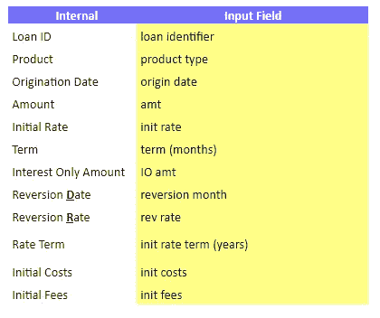
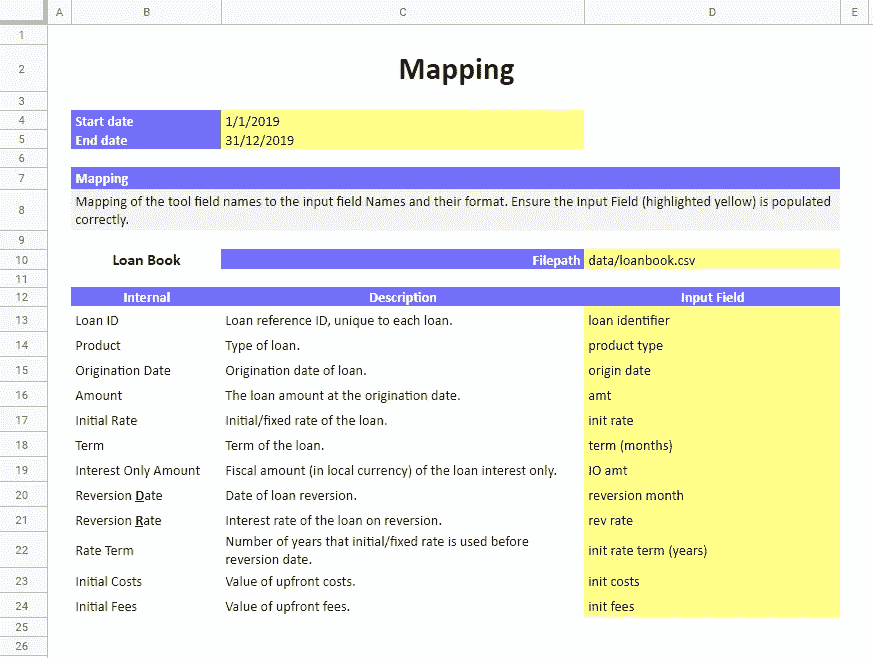

# Excel 到 Python

> 原文：<https://towardsdatascience.com/excel-to-python-79b01638f2d9?source=collection_archive---------5----------------------->

## 为 Python 工具构建前端 Excel 工作簿


[M. B. M.](https://unsplash.com/@m_b_m?utm_source=medium&utm_medium=referral) 在 [Unsplash](https://unsplash.com?utm_source=medium&utm_medium=referral) 上拍摄的照片

D 在 Build 2016 大会上，微软宣布全球有 12 亿人在使用 Excel [1]。同年，地球人口估计为 74 亿[2]。

那就是**地球上所有人的 16.2%**。

根据 2019 年的一份报告[3]，Python 相比之下只有 820 万活跃开发者——占地球人口的 0.001%。

考虑到这些数字，鼓励 Excel 和 Python 之间更多的交互可能对我们有好处——为大量新用户打开 Python 构建的工具的闸门。

面向 Python 的 Excel 前端的机会是巨大的。在本文中，我们将看看如何做到这一点，并实现一个“典型的”财务 Excel 设置表。

# 先有工具，后有 Excel

在我能想到的几乎所有场景中，首先构建工具的 Python 部分会更方便。但是，我们必须保持工具“输入”格式的灵活性。


更改输入数据集格式不应破坏代码。

我的意思是，如果我们使用 Pandas 读取一个或两个 CSV/Excel 表——对于第一个原型，我们可能依赖于一组给定的列名。

但是，如果成千上万行代码，我们依赖于相同的硬编码值，当我们试图用 Excel 使这些输入列名动态化时，就会遇到问题。

因此，在初始原型阶段，**如果还没有 Excel 表**，使用代码的初始部分将列标签重命名为它们的内部(希望更具描述性)标签名称:

稍后，这将被我们的 Excel 表映射所取代。

# Excel 前端

一旦 Python 工具被构建成一个更实际的原型，我们就该开始构建 Excel 前端了。首先，我们必须决定哪些变量可以从 Excel 工作表中进行调整。

总是在假设输入数据的格式会改变的情况下构建这些类型的工具。

根据您的工作地点和您正在开发的工具，这要么非常重要，要么不重要。一些过程只是被很好地定义，数据格式不太可能改变。

但是，我总是谨慎行事，通过 Excel 前端包含更多而不是更少的灵活性。别太复杂了。



使用 Excel 将内部 Python 列标签映射到外部 CSV/Excel 列标签。

使用内部命名系统并允许 Excel 用户指定列映射是保持灵活性的一个很好的例子。现在，Excel 用户可以调整这些映射，而不必依赖于硬编码的列名，甚至不用接触 Python。

# 映射

集成的核心是`mappings`字典。这将需要一个包含工具“设置”的 Excel 选项卡(我通常称之为映射)。

为了填充映射字典，我们需要读取 Excel mapping 选项卡的函数。为此，我们使用 **openpyxl** 。

我们可以从 Excel 的给定单元格中读取一个值，如下所示:

使用这个方法，我们现在可以开始填充我们的`mappings`字典。我们将调整上面的代码，将本地路径添加到“tool _ setup”Excel 工作簿。

我们还假设最初活动的工作表可能不是映射工作表，在添加、删除或移动选项卡的情况下，我们使用列表理解来查找“映射”选项卡索引:

现在我们可以添加一些映射:

```
mappings = {}
mappings['Amount'] = ws["E4"].value
mappings['Term'] = ws["E5"].value
```


照片由[诺德伍德主题](https://unsplash.com/@nordwood?utm_source=medium&utm_medium=referral)在 [Unsplash](https://unsplash.com?utm_source=medium&utm_medium=referral) 上拍摄

# 保持灵活性

在从我们的 Excel mapping 选项卡中添加或删除行的情况下，这种方法将构建一个不正确的`mapping`字典。为了避免这种情况，我们使用了`search_col`功能。这将迭代地搜索一列中的每个单元格，直到找到包含我们想要的值的单元格(或者超出行`limit`)。

此时，search_col 返回包含我们想要查找的数据的列和行。



如果设置不正确，仅仅在一行中添加一个小的注释就可能破坏这个工具。左边 **B12** 单元格包含 **Internal** 字样，表示我们列映射表的表头行，右边是 **B14** 。

这允许我们通过在列 B 中搜索**‘内部’**来搜索列映射表，如下所示:

```
search_col(ws, 'B', 'Internal')
```

`[Out]: ('B', 12)`

从这里，我们可以创建一个循环，将从列 C 到列 E 的映射添加到我们的`mappings`字典中。一旦看到两个或更多的空白单元格，我们可以确信映射表已经结束，因此我们可以从循环中断开:

一旦运行这段代码，我们将得到一个类似于下面这样的 Python 字典`mappings` :

```
{
    'Loan ID': 'loan identifier',
    'Product': 'product type',
     ...
    'Initial Fees': 'init fees'
}
```

如果我们还想引入其他变量，例如 filepath，它在映射表截图中显示为`data/loanbook.csv`。我们只需找到包含 *'* 文件路径'的行，并提取列 D 中的相应值:

```
row, _ = search_col(ws, 'C', 'Filepath')
mappings['filepath'] = ws[f'D{row}].value
```


照片由[格伦·麦卡勒姆](https://unsplash.com/@glenmcc?utm_source=medium&utm_medium=referral)在 [Unsplash](https://unsplash.com?utm_source=medium&utm_medium=referral) 上拍摄

# 综合

最后一步也是最简单的，将这些新的列名集成到我们的 Python 脚本中。

让我们使用上面的映射表来读入数据，并将输入列标签转换为它们的内部标签。

```
data = pd.read_csv(mappings['Filepath'])
```

在将输入列标签转换为它们的内部标签之前，我们必须将键-值对交换为值-键对。

```
# invert the dictionary
inv_mappings = {mappings[key]: key for key in mappings}
```

尽管对于这个简单的例子来说，在构建`mappings`字典时这样做似乎更方便。对于更复杂的工具，我总是发现保持我们在这里使用的内部:外部映射格式更好。尽管如此，这个细节还是由你来决定。

最后，将输入标签转换为内部标签:

```
data.rename(inv_mappings, axis=1, inplace=True)
```

我们可以在这里增加更多的灵活性。为了避免前导/尾随空格或小写/大写输入错误，我们重写了这部分代码:

我想加入的另一个可选部分。当我们在 Excel 表中显示内部列标签时，它们是大写的，并且包含正常间距。然而，作为个人偏好，我在内部维护了 [snake_case](https://en.wikipedia.org/wiki/Snake_case) 格式，转换为:

```
"Loan ID" -> "loan_id"
"Initial Rate" -> "initial_rate"
```


[钳工](https://unsplash.com/@benchaccounting?utm_source=medium&utm_medium=referral)对[去毛刺](https://unsplash.com?utm_source=medium&utm_medium=referral)拍照

我见过无数大量使用 Excel 的办公室，这些办公室可以节省数百个小时来检查复选框、键入值或等待 Excel 模型处理哪怕是最小的数据集。

虽然自动化和机器学习的时代正在迅速自动化许多 Excel 繁重的领域，但 Excel 不会很快走向任何地方。

目前，许多行业可以通过世界上发展最快的编程语言和世界上使用最多的软件之间的更紧密集成获得巨大的利益。

感谢阅读！

# 参考

[1] J. Osborne， [Build 2016:来自第 1 天和第 2 天的最大新闻](https://www.techradar.com/uk/news/computing/pc/build-2016-1318027) (2016)，techradar

[2]世界银行，[总人口](https://data.worldbank.org/indicator/sp.pop.totl) (2019)，世界银行公开数据

[3] M. Carraz，J. Stichbury，S. Schuermans，P. Crocker，K. Korakitis，C. Voskoglou，[Developer Economis:the State of the Developer Nation](https://slashdata-website-cms.s3.amazonaws.com/sample_reports/ZAamt00SbUZKwB9j.pdf)(2019)，SlashData

说到弥合不同技术之间的差距，我写过一篇关于用 Python 为 SQL 增压的文章。请点击这里查看:

[](/supercharging-ms-sql-server-with-python-e3335d11fa17) [## 用 Python 为 MS SQL Server 增压

### 如何使用 Python 来自动化 SQL 的一切

towardsdatascience.com](/supercharging-ms-sql-server-with-python-e3335d11fa17)