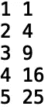

# Python 中的异常处理

> 原文：<https://towardsdatascience.com/exception-handling-in-python-7f639ce9a3d?source=collection_archive---------40----------------------->

## Python 中异常处理的介绍


[来源](https://www.pexels.com/photo/stainless-steel-close-wrench-on-spanner-210881/)

异常处理是以编程方式响应需要特殊处理的异常情况的方法。在 python 中，为各种各样的错误类型实现异常处理是非常简单的。在本帖中，我们将讨论如何在 python 中实现异常处理。

我们开始吧！

首先，让我们考虑下面的整数列表:

```
my_list1 = [1, 2, 3, 4, 5]
```

我们可以遍历列表并使用“for-loop”打印元素:

```
for value in my_list1:
    print(value)
```


在“for-loop”中，我们还可以执行操作并打印结果。让我们计算每个元素的平方并打印结果；

```
for value in my_lis1t:
    square = value**2
    print(value, square)
```



假设我们的列表也包含字符串值“6”:

```
my_list2 = [1, 2, 3, 4, 5, '6']
```

让我们试着计算这个新列表中每个元素的平方。这将返回一个“类型错误”:

```
for value in my_list2:
    square = value**2
    print(value, square)
```


该错误指定了有问题的代码行:

```
square = value**2
```

引发了“TypeError”，因为“**”幂运算符不支持操作数“str”。假设我们希望我们的代码能够处理字符串值的整数而不抛出错误。这就是异常处理发挥作用的地方。我们可以使用 python 关键字 **try** 和 **except** 来处理“类型错误”。首先，让我们**尝试**平方并打印每个值:

```
for value in my_list2:
    try:
        square = value**2
        print(value, square)
```

当我们得到一个“类型错误”时，我们使用 **except** 关键字来处理“类型错误”。由于字符串包含数值，我们可以使用' int()'方法将字符串转换为整数，并计算异常内的平方:

```
for value in my_list2:
    try:
        square = value**2
        print(value, square)
    except(TypeError):
        square = int(value)**2    
        print(value, square)
```


值得注意的是，我们处理错误的方式很大程度上取决于错误类型和我们正在处理的数据类型。

接下来，假设我们的列表包含一个单词或类似列表的另一种类型。我们希望能够处理这些错误，而不让我们的代码产生任何输出。让我们考虑以下包含字符串' ## '的列表:

```
my_list3 = [1, 2, 3, 4, 5, '##']
```

如果我们尝试循环这个新列表并计算其平方，我们会得到一个“ValueError”:

```
for value in my_list3:
    try:
        square = value**2
        print(value, square)
    except(TypeError):
        square = int(value)**2    
        print(value, square)
```


这个错误是说我们不能将字符串“##”转换成整数。我们需要为这种错误类型编写额外的处理。例如，我们可以用一些填充值替换字符串，如 0 或“NaN”:

```
import numpy as np
for value in my_list3:
    try:
        square = value**2
        print(value, square)
    except(TypeError):
        square = np.nan
        print(value, square)
```


让我们考虑另一个异常处理的例子。假设我们有以下包含编程语言的字符串列表:

```
my_list4 = ['python c++ java',  'SQL R scala', 'pandas keras sklearn']
```

我们可以使用“split()”方法来拆分字符串，并使用“+”运算符添加文本“is awesome ”:

```
for value in my_list4:
    print([i +' is awesome' for i in value.split()])
```


由于“split()”方法是一个字符串对象方法，如果我们的列表中有非字符串值，将会引发“AttributeError”。让我们在列表中添加一个字典，然后再次运行我们的代码:

```
my_list4 = ['python c++ java',  'SQL R scala', 'pandas keras sklearn', {'language': ''golang'}]
for value in my_list4:
    print([i +' is awesome' for i in value.split()])
```


该错误指出“dict()”对象没有属性“split()”。让我们编写一些 try/except 逻辑来处理这个错误:

```
my_list4 = ['python c++ java',  'SQL R scala', 'pandas keras sklearn', {'language': 'golang ruby julia'}]
for value in my_list4:
    try:
        print([i +' is awesome' for i in value.split()])
    except(AttributeError):
        print([i +' is awesome' for i in value['language'].split()])
```


我就讲到这里，但是我鼓励你自己去研究代码。

# 结论

总之，在这篇文章中，我们讨论了 python 中的异常处理。我们展示了如何使用 try/except 关键字和错误类型来处理数据中的错误值。我们看看处理“类型错误”和“属性错误”的例子。我鼓励您研究其他错误类型以及如何处理它们。附加的错误类型包括“SyntaxError”、“ZeroDivisionError”、“FileNotFoundError”等等。我希望你觉得这篇文章有用/有趣。这篇文章中的代码可以在 [GitHub](https://github.com/spierre91/medium_code/blob/master/basic_python/exception_handling.py) 上找到。感谢您的阅读！