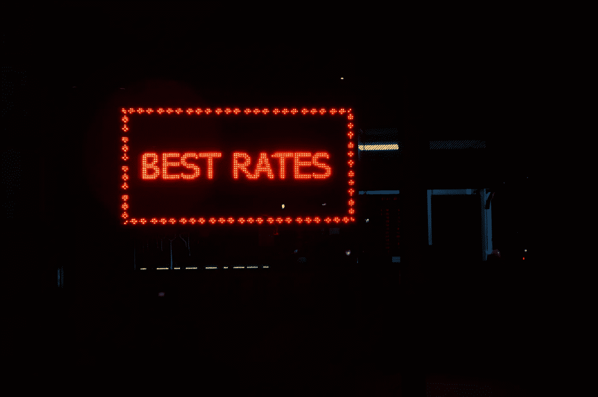
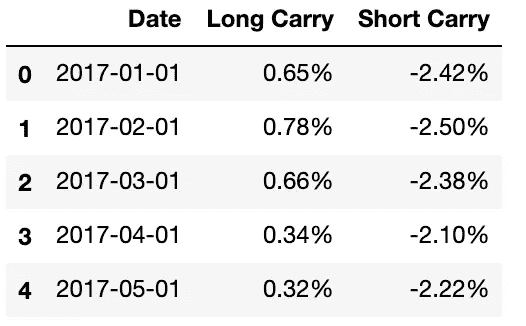
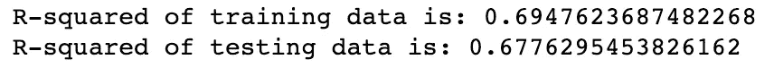
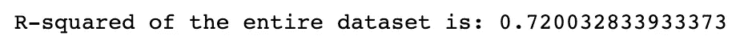
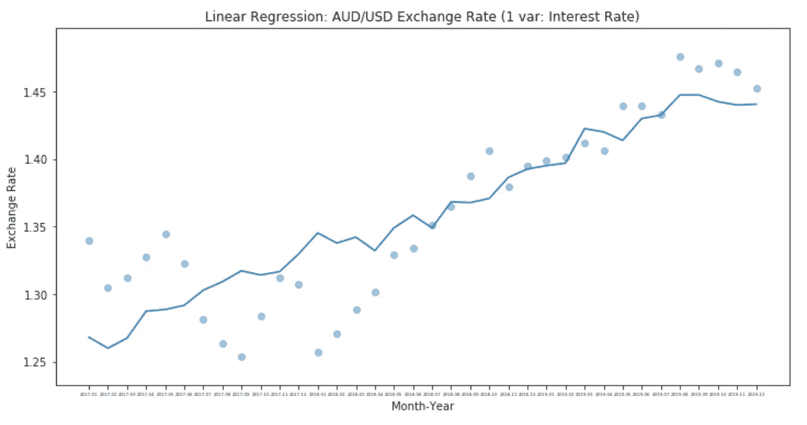
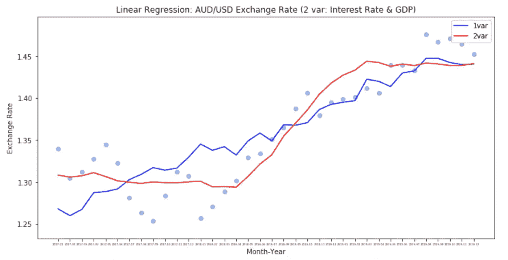
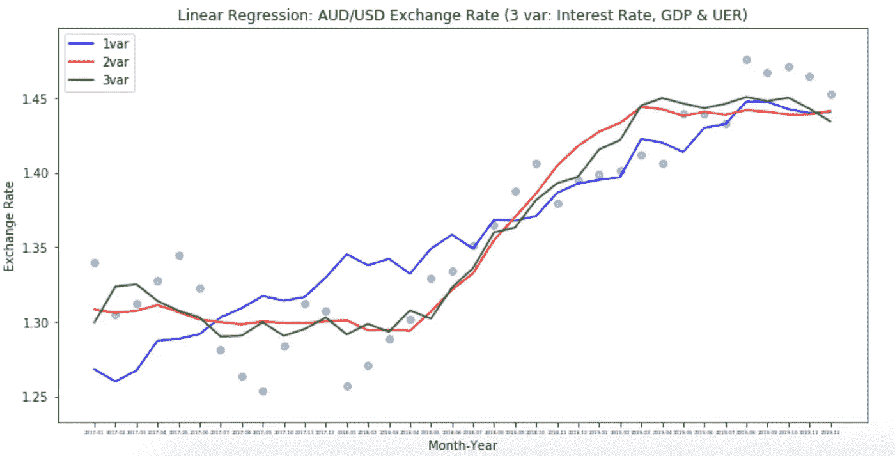
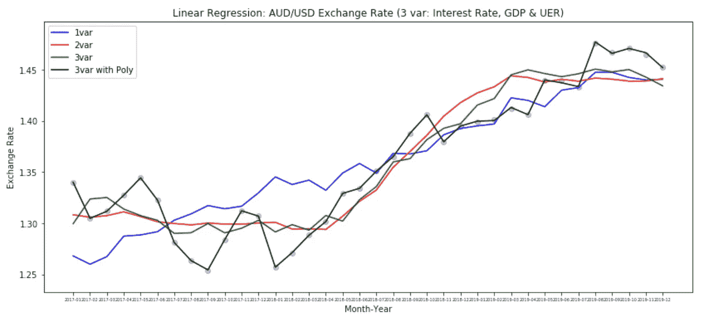
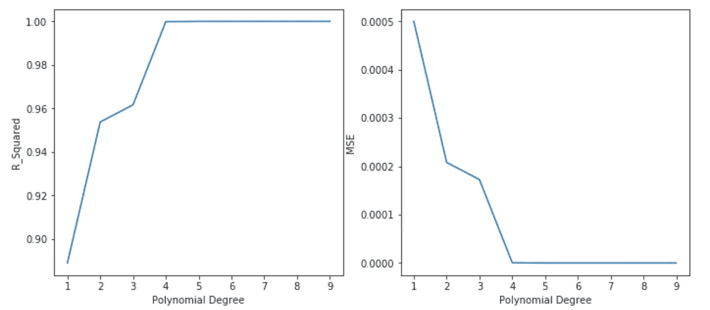

# 汇率预测:具有 5 个回归模型的机器学习

> 原文：<https://towardsdatascience.com/exchange-rate-prediction-machine-learning-with-5-regression-models-d7a3192531d?source=collection_archive---------17----------------------->

## 在数据清理和可视化之后，这一部分使用机器学习来寻找适合所有数据点的最佳直线，为最终部分的预测做准备。



来源:https://unsplash.com/photos/7JoXNRbx6Qg

如果你错过了我的**第一部分**关于汇率预测的端到端项目，请随时查看这里的[](https://medium.com/analytics-vidhya/exchange-rate-prediction-part-1-276b6cd5338)****。****

**概括地说，该项目旨在分析不同国家货币对美元汇率的历史模式，从而预测 2020 年的汇率值。为了得到最好的模型，我把这个项目分成了三个部分，我希望这三个部分能够涵盖预测所需的内容:**

1.  ****第 1 部分**:解释性数据分析(EDA) &数据可视化(奖励:假设检验)**
2.  ****第二部分:具有 4 个回归模型的机器学习****
3.  **第三部分:机器学习(续)与 ARIMA**

**今天，我将带你看第二部分，它部署了机器学习，目的是**找到最适合**多年来汇率模式的线。也就是说，线性回归似乎是正确的模型，或者至少是我们分析的基础。除此之外，在决定使用哪个模型进行预测之前，我还测试了其他线性回归模型(第 3 部分):**

*   **线性回归**
*   **多元线性回归**
*   **多项式回归**
*   **岭回归(L2 正则化)**
*   **拉索回归(L1 正则化)**

**我们开始吧！**

**根据 Investopedia，有 3 种预测汇率的常用方法:购买力平价(PPP)、相对经济实力和计量经济模型。在这三种方法中，我决定选择第三种，因为它涉及到影响汇率变动的众多因素。**

**[](https://www.investopedia.com/articles/forex/11/4-ways-to-forecast-exchange-rates.asp) [## 学习预测货币汇率的三种常用方法

### 使用货币汇率预测可以帮助经纪人和企业做出明智的决策，以帮助最小化风险…

www.investopedia.com](https://www.investopedia.com/articles/forex/11/4-ways-to-forecast-exchange-rates.asp) 

> “计量经济模型中使用的因素通常基于经济理论，但任何变量****都可以加上**，如果**认为它会显著影响**汇率。”——Investopedia，作者 Joseph Nguyen。**

**这种方法与使用“任何独立变量”对因变量产生影响的方向——线性回归非常一致。因此，我想测试的因素是**利率差**、 **GDP 增长率**和**收入增长率**，顺序但累积。对于这个项目，我使用澳元/美元的汇率进行分析。**** 

# ****1.线性回归****

****让我们以一个独立变量开始我们的线性回归模型:**利率差**。如果你热衷于探索，可以参考这个[数据来源](https://forexop.com/swaps/AUDUSD/)。****

```
**ir_df = pd.read_csv("aud usd interest carry trade.csv")
ir_df.head()**
```

********

****以上是 2017-2019 年澳元/美元利率差表。如果你想更多地了解什么是“多头套利”和“空头套利”，可以查看 Investopedia 上关于[套利交易](https://www.investopedia.com/terms/c/currencycarrytrade.asp)的这篇文章，以及 FXCM 上关于[利率套利交易](https://www.fxcm.com/markets/insights/interest-rate-carry-trades/)的另一篇文章。简言之，****

> ****利率套利交易是一种套利形式，其中有人利用两个市场之间的差异来获利。****

****因此，让我们转换这些数据进行分析(在这种情况下，我使用长期套利利率):****

```
**x_ir = ir_df['Long Carry'].astype(str)
x_ir = x_ir.replace({'%':''}, regex = True)
x_ir = x_ir.astype(float)
x_ir = np.array(x_ir).reshape(-1,1)aud_usd_fx = df_groupby_aud[(df_groupby_aud['month_year'] >= '2017-01') & (df_groupby_aud['month_year'] <='2019-12')].reset_index(drop=True)
aud_usd = aud_usd_fx['AUD_USD']y_fx = aud_usd**
```

****这里， **x_ir** 是指影响我们汇率的自变量。为了更容易使用，我用 **regex 替换**去掉了数字中的“%”，并将它们转换为 float。由于回归模型中需要 2D 阵列数据，我们需要使用**将我们的 1D x_ir 转换为 2D。整形(-1，1)。**如果您还记得第一部分，我们已经清理了整个数据集，因此现在我们可以更容易地选择澳元/美元数据(y_fx)作为因变量。****

****请注意，为了简单起见，我在这个项目中只用了很短的一段时间(从 2017 年到 2019 年，36 个月)。****

****好了，让我们通过从 **Scikit-learn** 库中导入相关函数来运行我们的第一个机器学习模型！****

```
**from sklearn.model_selection import train_test_split
from sklearn.linear_model import LinearRegression**
```

****您可能已经知道，为了测试我们模型的准确性，我们被建议将数据集分成训练集和测试集。本质上，我们在训练集上训练模型，然后用测试集预测值。****

```
**x_train, x_test, y_train, y_test = train_test_split(x_ir, y_fx, train_size=0.8, test_size=0.2, random_state=1)model = LinearRegression()
model.fit(x_train, y_train)
y_predict = model.predict(x_test)print(model.score(x_train, y_train))
print(model.score(x_test, y_test))**
```

****这里我把数据拆分成 80%的训练和 20%的测试，意思是模型会通过 80%的训练数据学习模式，然后用 20%的测试数据预测 y 值。**。score()** 告诉我们因变量(汇率)被自变量(利率差)或我们所知的 **R 平方**解释的百分比。****

********

****如您所见，训练和测试数据之间的百分比非常接近，这意味着模型的准确性相对较好。****

****然而，根据我的观察，数据集的大小相对较小(n=36，因为我们只覆盖 2017 年到 2019 年)，为了简单起见，我想看看我是否能够不将数据分成训练集和测试集。****

```
**model = LinearRegression()
model.fit(x_ir, y_fx)
y_fx_predict = model.predict(x_ir)print(model.score(x_ir, y_fx))**
```

********

****分割和不分割之间的 R 平方差异极小，这可能是由于数据集较小。因此，我将**而不是**分割数据并使用整个数据集。****

****让我们看看我们的模型在创建“最佳拟合”线方面表现如何:****

```
**month_year = aud_usd_fx['month_year']
month_year = month_year.astype(str)plt.figure(figsize=(12,6))
plt.scatter(month_year, y_fx, alpha=0.4)
plt.plot(month_year, y_fx_predict)
plt.title("Linear Regression: AUD/USD Exchange Rate (1 var: Interest Rate)")
plt.xlabel("Month-Year")
plt.ylabel("Exchange Rate")
plt.xticks(fontsize=4)
plt.show()**
```

********

****结合 R 平方，该线似乎可以在一定程度上刻画汇率(R 平方为 72%)。让我们添加另一个变量，用多元线性回归来看看我们的 R 平方提高了多少。****

# ****2.多元线性回归****

****正如本文开头所分享的，我们能够向模型中添加额外的变量，只要它们对因变量有影响。这就引出了第二个线性回归模型，它包含**多于 1 个自变量**。****

****我们把 **GDP 增长率**加到我们的数据集中，可以从[这个域](https://fred.stlouisfed.org/)找到。****

```
**aus_gdp = pd.read_csv("AUS GDP.csv")
usa_gdp = pd.read_csv("USA GDP.csv")aus_gdp = aus_gdp.rename(columns={'GDP': 'AUS_GDP'})
aus_usa_gdp = pd.merge(aus_gdp, usa_gdp, on="month_year", how="inner")
aus_usa_gdp = aus_usa_gdp.rename(columns={'GDP': 'USA_GDP'})
aus_usa_gdp['GDP_diff'] = aus_usa_gdp['AUS_GDP'] - aus_usa_gdp['USA_GDP']aus_usa_gdp_20172019 = aus_usa_gdp[(aus_usa_gdp['month_year'] >= '2017-01') & (aus_usa_gdp['month_year'] <='2019-12')].reset_index(drop=True)gdp_diff = ["%.4f" %num for num in aus_usa_gdp_20172019['GDP_diff']]**
```

****加载完数据后，我应用 EDA 进行清理，将数据帧中的 **gdp_diff** 提取到一个列表中，以便与 **x_ir** 变量结合起来进行多元线性回归。****

```
**x_ir_gdp = np.array(list(zip(x_ir, gdp_diff)))
x_ir_gdp = x_ir_gdp.astype(np.float)model.fit(x_ir_gdp, y_fx)
y_fx_predict_2 = model.predict(x_ir_gdp)print(model.score(x_ir_gdp, y_fx))**
```

****在模型中加入另一个变量后，R 平方有了相当显著的提高，从 72%提高到 87.2%。让我们直观地将其与我们创建的第一行进行比较:****

********

****看起来不错，对！好吧，让我们尝试向我们的模型添加另一个独立变量，**消费者价格指数(CPI)。**同样，数据集可以从[这个域](https://fred.stlouisfed.org/)中找到。****

```
**cpi = pd.read_csv("aus usa cpi difference.csv")cpi_diff = cpi['CPI_diff']x_ir_gdp_cpi = np.array(list(zip(x_ir, gdp_diff, cpi_diff)))
x_ir_gdp_cpi = x_ir_gdp_cpi.astype(np.float)model.fit(x_ir_gdp_cpi, y_fx)
y_fx_predict_4 = model.predict(x_ir_gdp_cpi)print(model.score(x_ir_gdp_cpi, y_fx))**
```

****这一次，R 平方确实略有增加，从 87.2%增加到 87.3%。这意味着 CPI 不会显著影响汇率的变动，也不会有助于改进我们的模型。视觉上，也没什么区别。****

********

****让我们用另一个变量——失业率(UER)代替 CPI 变量，看看这是否能改进我们的模型。****

```
**unemployment_rate = pd.read_csv("aus usa unemployment rate.csv")unemployment_rate['uer_diff'] = unemployment_rate['aus_unemployment rate'] - unemployment_rate['usa_unemployment rate']
uer_diff_all = unemployment_rate['uer_diff']uer_diff = ["%.4f" % num for num in uer_diff_all]x_ir_gdp_uer = np.array(list(zip(x_ir, gdp_diff, uer_diff)))
x_ir_gdp_uer = x_ir_gdp_uer.astype(np.float)model.fit(x_ir_gdp_uer, y_fx)
y_fx_predict_3 = model.predict(x_ir_gdp_uer)print(model.score(x_ir_gdp_uer, y_fx))**
```

****好的，R 平方提高了一点，从 87.2%提高到 88.9%。从统计和视觉上看，还不错。您可以继续向模型中添加更多的变量，但要小心**过度拟合**！****

********

****对我来说，我没有添加更多的自变量，而是决定测试另一个回归模型来找到更好的拟合线:多项式回归。****

# ****3.多项式回归****

****什么是多项式回归？它仍然是一种线性回归，但是是一个更“适应”的版本。****

****传统上，线性回归旨在找到适合所有数据点的最佳线性线，但情况可能并不总是如此。因此，多项式回归充当从坐标(x，y)绘制直线的另一种形式，将 ***y 建模为 n 次多项式*** 。****

****让我们从 Sciki-learn 库中导入函数并构建我们的模型:****

```
**from sklearn.preprocessing import PolynomialFeaturespoly = PolynomialFeatures(degree=4)x_poly = poly.fit_transform(x_ir_gdp_uer)model_poly = LinearRegression()
model_poly.fit(x_poly, y_fx)
y_pred = model_poly.predict(x_poly)print(model_poly.score(x_poly, y_fx))**
```

****线性回归和多项式回归在函数上的唯一区别是**次数**参数。在得出结果之前，我先简单说明一下:**。fit_transform()** 就是把你的自变量从线性转换成多项式。函数的其余部分保持不变。****

****在这里，我随机选择了 4 和 R 的平方接近完美的程度:99.9%！你可能想直观地看到它？****

********

****黑线表示多项式回归找到的拟合度为 4。有多神奇？但问题是:“哪个程度是最好的，既不会过拟合也不会欠拟合数据？”****

****我们知道我们的目标是找到尽可能高的 R 平方，因为它很好地解释了因变量(汇率)受自变量影响的事实。除此之外，还有另一个指标能够评估我们模型的准确性:**均方误差(MSE)。******

****为了找到最佳的度数，我决定在我们的模型上分别用 **a for loop** 测试一个度数范围，从 1 到 10，并将其可视化:****

```
**from sklearn.metrics import mean_squared_errorr_squared_list = []
mse_list = []
a = range(1,10,1)for i in a:
    poly = PolynomialFeatures(degree=i)
    x_poly = poly.fit_transform(x_ir_gdp_uer)

    model_poly = LinearRegression()
    model_poly.fit(x_poly, y_fx)
    y_pred = model_poly.predict(x_poly)

    r_squared = model_poly.score(x_poly, y_fx)
    mse = mean_squared_error(y_pred, y_fx)

    r_squared_list.append(r_squared)
    mse_list.append(mse)**
```

********

****正如您在两个图表中看到的，随着直线从 1 度增加到 4 度，R 平方和 MSE 显著提高(R 平方越高越好，MSE 越低越好)。然而，它在 4 度时达到峰值，并且从 5 度开始没有看到进一步的改善。这意味着 4 度为我们的模型带来了最好的准确度分数！所以我们还是坚持用 4 吧！****

****耶！多亏了多项式回归，我们终于得到了最符合历年汇率的直线！****

# ****4.& 5.岭回归和套索回归****

****这最后两个是我在线性回归模型的“生态系统”中的最新实验，我以前在某个地方听说过。哦，是的，它关系到 L1 和 L2 的正规化！因此，我想在我的项目中测试这两个模型，看看它们与上述模型相比表现如何。****

****然而，在进入它们之前，让我们快速指出这些模型的起源，**正则化**，以及它们在我们通常所知的线性回归中扮演的角色。****

****这一切都是从**超配**开始的。简而言之，当机器学习模型过于适合某个数据集(特别是有太多独立变量/特征)并因此无法推广到其他数据集时，就会发生过度拟合。因此，引入了**规则**来防止这种现象。本质上，规范化的作用是:****

*   ****降低模型的复杂性，同时保持独立变量/特征的数量****
*   ****从技术上讲，减少系数的大小作为损失函数的惩罚项****

****如果你想深入了解它是如何工作的，从数学上来说，查看这篇关于[走向数据科学](/intuitions-on-l1-and-l2-regularisation-235f2db4c261)的文章，了解更多细节。****

****岭回归和套索回归就是从这种正则化概念发展而来的。两者的唯一区别是:****

*   ******岭回归**使用 L2 正则化技术，将系数缩小到零，但**不是绝对零******
*   ******套索回归**使用 L1 正则化技术，将系数缩小到**绝对零******

****这是因为 Ridge 保留了所有变量/特征 ***，而*** Lasso 只保留了重要的变量/特征，因此当我们的数据集有太多变量/特征时，它被选为变量/特征选择技术。****

****好了，回到我们的数据集！****

****尽管我们的模型没有太多的变量(在本例中是 3)，我仍然想看看岭和套索回归在我的数据集上的表现。****

```
**from sklearn.linear_model import Ridge, Lassoridge = Ridge(alpha=0.001)
ridge.fit(x_ir_gdp_uer, y_fx)y_fx_ridge = ridge.predict(x_ir_gdp_uer)
print(ridge.score(x_ir_gdp_uer, y_fx))lasso = Lasso(alpha=0.001)
lasso.fit(x_ir_gdp_uer, y_fx)y_fx_lasso = lasso.predict(x_ir_gdp_uer)
print(lasso.score(x_ir_gdp_uer, y_fx))**
```

********

****山脊的 r 平方是 88%，而套索是 87%。当我们将这些数字与我们的多元线性回归(88.9%)进行比较时，还不算太坏。这证明我们的模型没有出现过拟合！****

****哇！这是这个项目第二部分的总结！吸收太多了，不是吗？但是我真的希望你已经发现这篇文章的信息和可操作性。****

****简而言之，我们已经**找到了最符合我们的数据集**的直线，极大地解释了多年来的汇率模式！下一步是什么？****

****再次提醒，请注意我项目的最后一部分**,它将涵盖**我如何使用我们刚刚发现的回归线预测 2020 年**的汇率。与此同时，如果您觉得这有帮助，请给我一个掌声，并在这里随意查看我的 Github 以获得完整的资源库:******

****github:[https://github.com/andrewnguyen07](https://github.com/andrewnguyen07)LinkedIn:[www.linkedin.com/in/andrewnguyen07](http://www.linkedin.com/in/andrewnguyen07)****

****谢谢！****