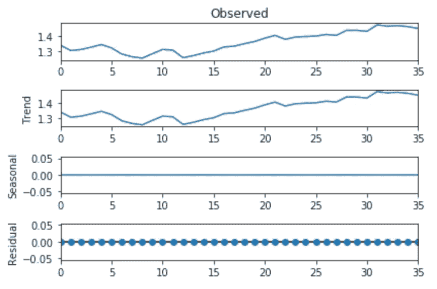
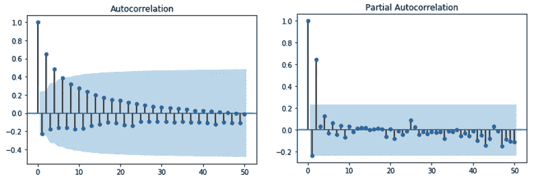
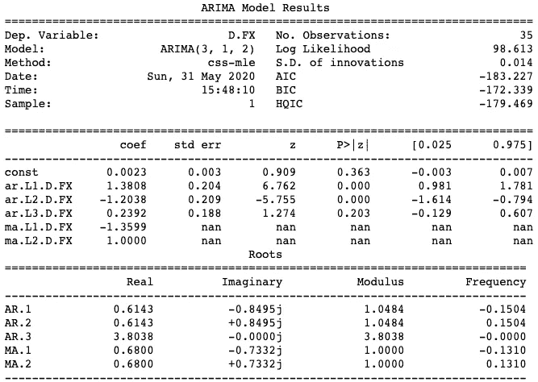
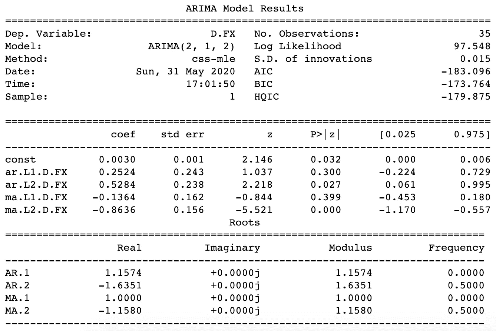
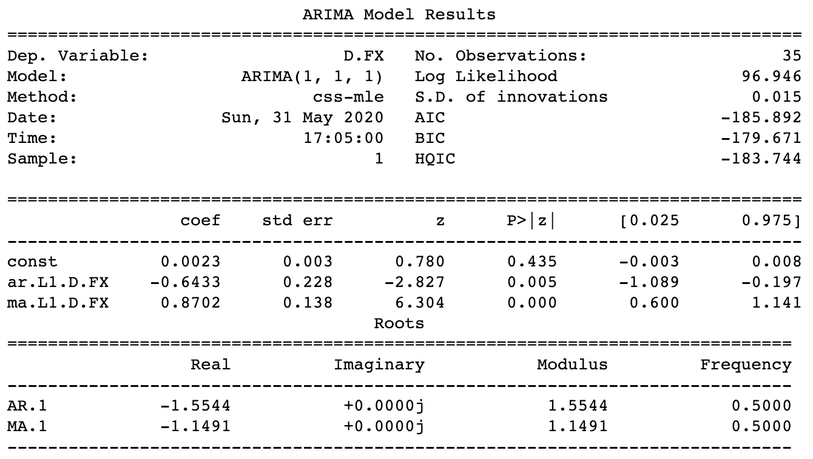
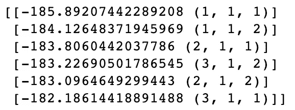
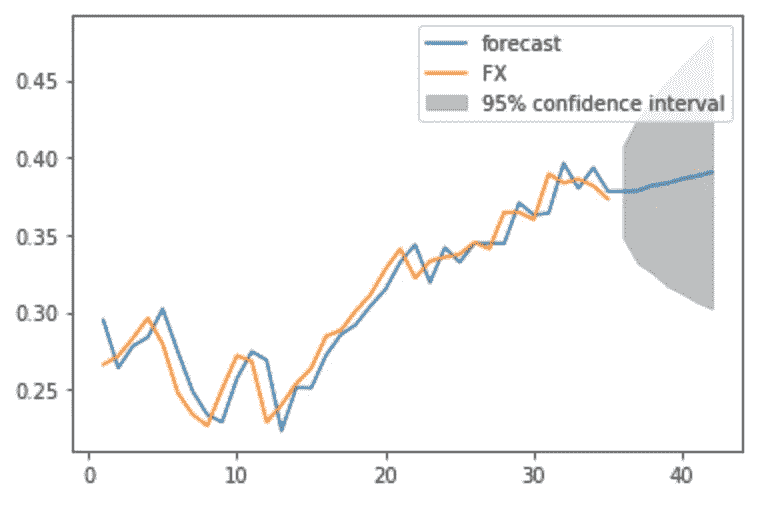
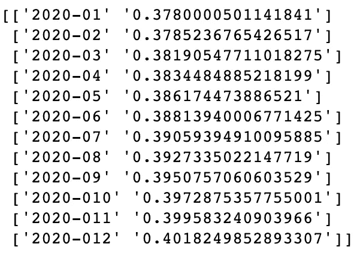
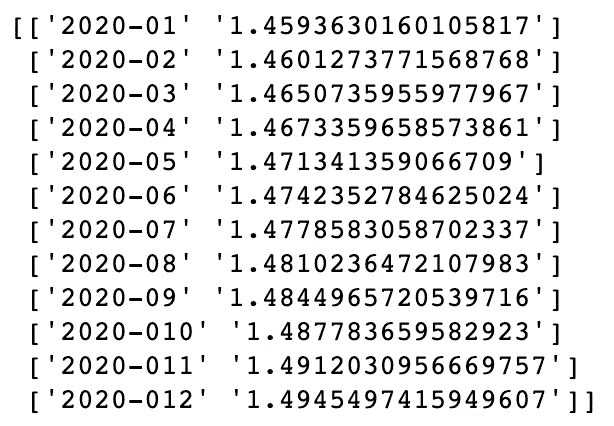
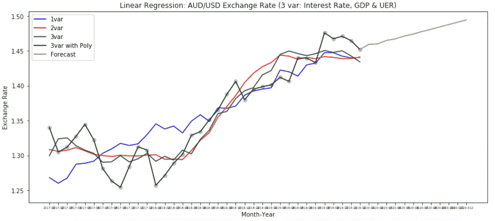

# 汇率预测:用 ARIMA 进行时间序列预测

> 原文：<https://towardsdatascience.com/exchange-rate-prediction-time-series-forecasting-with-arima-27260faafcdc?source=collection_archive---------22----------------------->

## 利用之前的回归工作，这最后一部分旨在使用 ARIMA 预测未来汇率，这是一种“从过去预测未来”的机器学习算法。


来源:https://unsplash.com/photos/6EnTPvPPL6I

我的数据科学端到端项目的**最后部分**来了。如果您遵循或阅读了前两部分，您可能已经知道本文中会出现什么。但是如果你还没有，不要犹豫去看看它们: [**第一部分**](https://medium.com/analytics-vidhya/exchange-rate-prediction-part-1-276b6cd5338) 和 [**第二部分**](/exchange-rate-prediction-machine-learning-with-5-regression-models-d7a3192531d) 。

以下是这个项目整体结构的总结:

*   **第 1 部分**:解释性数据分析(EDA) &数据可视化(奖励:假设检验)
*   **第二部分**:4 个回归模型的机器学习
*   第三部分:机器学习(续。)与 ARIMA

第一部分通过数据清理和可视化为分析奠定基础，第二部分采用回归模型拟合所有数据点，最后一部分将利用它们来**预测未来**(在这种情况下，是 2020 年的澳元/美元汇率)。为了做到这一点，应考虑先决条件和流程:

1.  静态测试(ADF 和 KPSS)
2.  自相关(ACF)和部分自相关(PACF)
3.  ARIMA 天气预报

我们开始吧！

在开始之前，您可能想知道为什么在使用 ARIMA 之前我们需要遵循上面提到的结构。如果是，让我们简单了解一下 ARIMA 是什么，需要什么优先！

# 0.简而言之 ARIMA

ARIMA 代表什么？

在预测时间序列时，我们可以选择:

*   **单变量**:如果我们相信时间序列的先前值能够预测其未来值
*   **多变量**:如果我们使用预测器而不是序列本身来预测未来值

在这种情况下，ARIMA 代表*‘自回归综合移动平均’*，这种算法源于这样一种信念，即时间序列的 ***过去值可以单独用于预测未来值*** 。

要使用 ARIMA，我们需要确定它的参数值:p，d，q

*   p:AR 项的阶数(AR:自回归)
*   d:差异的数量
*   问:移动平均线的顺序

这几乎是你熟悉下面将要发生的事情所需要的全部信息。

# 1.静态测试

什么是静态测试，我们为什么需要它？

ARIMA 要求数据集是“**稳定的**，这样模型才能产生准确的预测。简而言之，从技术上讲，平稳序列不会随时间而变化。特别是，**均值、方差、协方差等参数随时间**保持不变。

为了更直观地展示它，我们来看看下面的图表，看看平稳数据和非平稳数据之间的区别:


来源:[https://en.wikipedia.org/wiki/Stationary_process](https://en.wikipedia.org/wiki/Stationary_process)

如您所见，这并不意味着数据集在任何特定时间点都是“冻结”的。它确实发生了变化，但随着时间的推移，其均值和方差保持不变(图 1)。**与**相反，如果看到这种不寻常的峰值或谷值(没有清晰的模式)，这意味着数据集及其统计属性会随着时间而变化(图 2)。众所周知，这是由于趋势或季节性对数据集的影响。

如果你想探究这两者在数学上的区别，可以看看这篇关于数据科学的文章:

[](/stationarity-in-time-series-analysis-90c94f27322) [## 时间序列分析的平稳性

### 平稳性的概念和类型综述

towardsdatascience.com](/stationarity-in-time-series-analysis-90c94f27322) 

静态数据很重要，因为模型更容易学习模式，我们也更容易分析和预测模式，这已经成为大多数时间序列分析中的一个常见假设。

话虽如此，我们如何知道数据集是否是静态的呢？首先，我们可以依靠**统计测试**来检查平稳性，如果不是，我们需要将数据从非平稳转换为平稳。

**ADF** (增广的迪基-富勒)和 **KPSS** (科维亚特科夫斯基-菲利普斯-施密特-申)是两种常见的平稳性统计测试。这两个测试的目的在技术上是相同的，只是后面使用的技术不同。ADF 使用差分来转换数据集， **KPSS 移除趋势**使数据稳定。因此，建议使用这两种测试来确保预期的结果。

然而，需要注意的一点是，H0(零假设)和 H1(替代假设)的两个检验是彼此相反的:

*   ADF: H0 声称数据集是**而不是**静止的，而 H1 说它是静止的。
*   **KPSS** : H0 声称数据集是静止的，而 H1 却说它是**而不是**。

```
from statsmodels.tsa.stattools import adfulleradf_test = adfuller(y_pred)
print('stat=%.3f, p=%.3f' % adf_test[0:2])
if adf_test[1] > 0.05:
 print('Probably not Stationary')
else:
 print('Probably Stationary')
```

ADF 测试结果: **stat=-0.434，p = 0.904—‘可能不稳定’**

```
from statsmodels.tsa.stattools import kpsskpss_test = kpss(y_pred, nlags='auto')print('stat=%.3f, p=%.3f' % kpss_test[0:2])
if kpss_test[1] > 0.05:
    print('Probably Stationary')
else:
    print('Probably not Stationary')
```

KPSS 检验结果: **stat=0.692，p = 0.014——“可能不平稳”**

原来数据集根本不是静止的！让我们直观地看一下:

```
from statsmodels.tsa.seasonal import seasonal_decomposey_pred_list = y_pred.tolist()
result = seasonal_decompose(y_pred_list, model='additive', period=1)result.plot()
```



**Seasonal_decompose** 告诉我们数据集在趋势、季节性和残差方面的表现。如您所见，观察值和趋势值之间的模式非常相似，这意味着趋势已经作为非平稳数据的原因介入其中。

让我们再一次让它静止！！

```
date = list(range(1,37))
date_fx = pd.DataFrame(zip(date, y_pred_list), columns=['Date', 'FX'])date_fx_log = np.log(date_fx)date_fx_log_diff = date_fx_log - date_fx_log.shift(1)
date_fx_log_diff.dropna(inplace=True)y_stationary = date_fx_log_diff.iloc[:,1]
```

首先，为了简单起见，我将实际日期替换为从 1 到 36 的数字范围(在我们的数据中代表 36 个月)。然后，为了稳定数据集，我用 **np.log** 对原始数据进行了变换(这可以通过不同的方法完成:幂变换、平方根或对数变换)。最后，我用**差分**让数据与**平稳。shift(1)，**将数据集中的每个点减去其前面的点。

好了，我们已经将非平稳的预测汇率(y_pred_list，如前一部分)转换为平稳的预测汇率(y_stationary)！

让我们再次与 ADF 和 KPSS 确认一下！

```
#a. ADF Test
adf_test_2 = adfuller(y_stationary)
print('stat=%.3f, p=%.3f' % adf_test_2[0:2])
if adf_test_2[1] > 0.05:
 print('Probably not Stationary')
else:
 print('Probably Stationary')#b. KPSS Test
kpss_test_2 = kpss(y_stationary, nlags='auto')print('stat=%.3f, p=%.3f' % kpss_test_2[0:2])
if kpss_test_2[1] > 0.05:
    print('Probably Stationary')
else:
    print('Probably not Stationary')
```

结果是:

*   **ADF:** stat=-5.316，p=0.000，可能是平稳的
*   **KPSS** : stat=0.192，p=0.100，可能是静止的

耶！

# 2.自相关(ACF)和部分自相关(PACF)

*什么是 ACF 和 PACF，它们与 ARIMA 有什么关系？*

在使数据集稳定后，我们继续该过程的第二步:为 ARIMA 模型确定 **p，d，q** 。这可以通过观察 ACF 和 PACF 图来实现！

根据[机器学习掌握度](https://machinelearningmastery.com/gentle-introduction-autocorrelation-partial-autocorrelation/)，

> 这些图以图形方式总结了一个时间序列中的观察值与之前时间步长中的观察值之间的关系强度。

这与我们之前完成的步骤之一完全一致:**区别于。**转变①！如果您还记得的话，我们已经采用了 shift 作为将当前值减去前一个值的方法，以使数据保持稳定。事实上，ACF 和 PACF 能做的不仅仅是差异化！

让我们把它们画出来:

```
from statsmodels.graphics.tsaplots import plot_acf, plot_pacfdate_fx_log_diff = date_fx_log_diff.values.reshape(-1)plot_acf(date_fx_log_diff, lags=50)
plot_pacf(date_fx_log_diff, lags=50)plt.show()
```



基于 ACF 和 PACF 的形状和图案，我们可以确定 ARIMA 模型的 p (AR 项)和 q (MA 项)。如果你想深入研究，可以看看这些文章[这里](https://support.minitab.com/en-us/minitab/18/help-and-how-to/modeling-statistics/time-series/how-to/autocorrelation/interpret-the-results/autocorrelation-function-acf/)和[这里](https://support.minitab.com/en-us/minitab/18/help-and-how-to/modeling-statistics/time-series/how-to/partial-autocorrelation/interpret-the-results/partial-autocorrelation-function-pacf/)。本质上，图表中显著滞后的数量“传递了信息”，在这种情况下是 p & q 的值。

正如您在 ACF 图中看到的，在滞后 1 中看到一个大尖峰，随后是 2 或 3 个滞后，所有滞后都被认为是显著的，因为它们位于“极限阈值”或“显著性线”(蓝色区域)之上。同样地，在 PACF 的图中，在第一个时间出现一个大的峰值，然后在第三个时间出现另一个峰值。那么这一切意味着什么呢？

对我来说，这一发现是测试哪种(p，d，q)组合对我们的 ARIMA 模型产生最佳结果的关键，其中 p 可以在 ACF 中找到，而 q 在 PACF。那么具体是什么 ***结果*** 呢？是 AIC。

> 赤池信息标准(AIC)是一种广泛使用的统计模型的措施。它基本上将模型的 1)拟合优度和 2)简单性/简约性量化为单个统计数据。—阿巴斯·凯什瓦尼，[酷派博客](https://coolstatsblog.com/2013/08/14/using-aic-to-test-arima-models-2/)

一般来说，AIC 越低越好。让我们转到第 3 部分，看看哪种组合的 AIC 最低！

# 3.ARIMA 预测

*让我们将 p、d、q 的值代入我们的 ARIMA 模型！*

正如我前面解释的，ACF 和 PACF 图中的显著滞后的数量可以转化为相应的 p & q。让我们看看 ARIMA 在下列值下的情况:

*   p = 3，因为 ACF 中有 3 个显著滞后
*   根据中的计算，d = 1。移位(1)
*   q =2 为 PACF 的 2 个显著滞后

```
from statsmodels.tsa.arima_model import ARIMAy = date_fx_log.iloc[:, 1]model_arima = ARIMA(y, (3,1,2))
model_arima_fit = model_arima.fit()
print(model_arima_fit.summary())
```

首先，我们从 Statsmodels 库中导入 ARIMA，并从转换后的数据集中提取 y。然后，我们用(p，d，q)的上述值拟合 ARIMA 模型，称为**。概要()**:



尽管看起来很复杂，但我们只需关注表中的两个指标:AIC 和 P 值(P>|z|)。

*   AIC = -183.227，我们将对 p，d，q 的另一个组合进行测试，看它是否是最低值。
*   p = 3 时，模型为不同行中的每个 AR 返回 3 个不同的 p 值。虽然前两个的 p 值**为< 0.05** (这是理想的推荐值)，但 AR。L3 的高于 0.05。这意味着在 ACF 图中实际上可能有 2 个明显的滞后。

基于这个发现，让我们测试(p，d，q) = (2，1，2)的另一个组合:



在这种情况下，AIC (-183.096)与第一个模型的 AIC (-183.227)相比没有改善。此外，AR 的 p 值。、马。L1(第一个 q)大于 0.05，这表明我们可能只需要 p=1 和 q=1。让我们用(p，d，q) = (1，1，1)来测试一下:



答对了。AIC 已经改进了很多，因为它是三次试验(最低 AIC 和所有 p 值<0.05).

Okay, this process has been a bit too manual and time-consuming. How about we use **与 for 循环**的迭代，看看哪个组合(p，d，q)产生最低 AIC)后的最佳值。

```
import itertoolsp = range(1, 4)
d = range(1, 2)
q = range(1, 3)pdq = list(itertools.product(p, d, q))aics = []
params = []for param in pdq:
    model = ARIMA(y, order=param)
    model_fit = model.fit()
    aic = model_fit.aic
    aics.append(aic)
    params.append(param)combo = list(zip(aics, params))
combo.sort()combo_array = np.array(combo)
print(combo_array)
```

如上所述，我根据 ACF 和 PACF 图创建了 p、d 和 q 的不同范围:

*   p = range(1，4):因为在 ACF 中看到 3 个滞后
*   d = range(1，2):因为我们至少需要 1 次差分来使数据稳定
*   q = range(1，3):因为在 PACF 看到两个滞后

然后，我使用 **itertools.product()** 从给定的值生成不同的组合。最后，我为循环应用了一个**，并用生成的每个组合来拟合 ARIMA 模型。**



所以你看，从(1，1，1)的(p，d，q)来看，最低的 AIC 是-185.892，与上面的最新试验相同！


最后，也是最后一步，预测:

```
pred = model_arima_fit.forecast(12, alpha=0.05)[0]
print(pred)model_arima_fit.plot_predict(1,42)
```

简单说一下，**。forecast()** 包括**我们需要预测的值的数量**(在本例中，数据集周期之后的 2020 年的 12 个月)和 **alpha=0.05** 作为 95%置信区间。plot_predict(1，42)作为整个预测数据集的(start，end )(在本例中，1 表示第一个月 2017 年 1 月，2 表示最后一个月 2020 年 12 月)。



关于我们 y 值(橙色)和预测(蓝色)的匹配度，看起来还不错！事实上，如果你回想一下多项式回归的图表，预测(蓝色)与我们发现的曲线完全吻合！

塔达！我们已经预测了 2020 年的汇率，这个项目快结束了。如果打印预测值，您可能会觉得奇怪:



这是因为预测值来源于数据集，该数据集在运行该模型之前已经过**的对数变换**！借助于**指数函数**简单地恢复数值，这是对数的倒数。

```
pred = np.exp(pred)
forecast = pred.tolist()fx_2020 = np.array(list(zip(month_year_future, forecast)))
print(fx_2020)
```



完美！我们整体来形象化一下，2017 年到 2020 年！

```
x_merge = ['2019-12', '2020-01']
y_merge = [y_pred[-1], forecast[0]]plt.figure(figsize=(14,6))
plt.scatter(month_year, y_fx, alpha=0.4)
plt.plot(month_year, y_fx_predict, color='b')
plt.plot(month_year, y_fx_predict_2, color='r')
plt.plot(month_year, y_fx_predict_3, color='g')
plt.plot(month_year, y_pred, color='black')
plt.plot(x_merge, y_merge, color='y')
plt.plot(month_year_future, forecast, color='y')
plt.legend(['1var', '2var', '3var', '3var with Poly', 'Forecast'])
plt.title("Linear Regression: AUD/USD Exchange Rate (3 var: Interest Rate, GDP & UER)")
plt.xlabel("Month-Year")
plt.ylabel("Exchange Rate")
plt.xticks(fontsize=5)
plt.show()
```



瞧啊。！！

这个项目到此结束——汇率预测！尽管有很多信息要吸收，我还是希望你能发现整个系列( [**第一部分**](https://medium.com/analytics-vidhya/exchange-rate-prediction-part-1-276b6cd5338) 、 [**第二部分**](/exchange-rate-prediction-machine-learning-with-5-regression-models-d7a3192531d) ，以及这里的最后一部分)是有帮助的和信息丰富的！

在不久的将来，一定要关注我的**即将到来的数据科学和机器学习项目**！与此同时，如果您觉得这有帮助，请给我一个掌声，并在这里随意查看我的 Github 以获得完整的资源库:

github:[https://github.com/andrewnguyen07](https://github.com/andrewnguyen07)LinkedIn:[www.linkedin.com/in/andrewnguyen07](http://www.linkedin.com/in/andrewnguyen07)

谢谢！