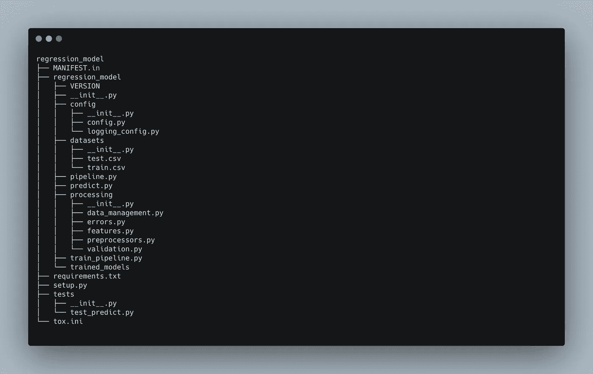
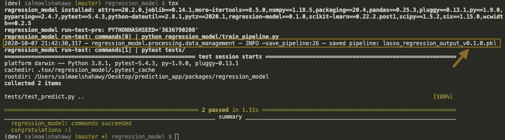
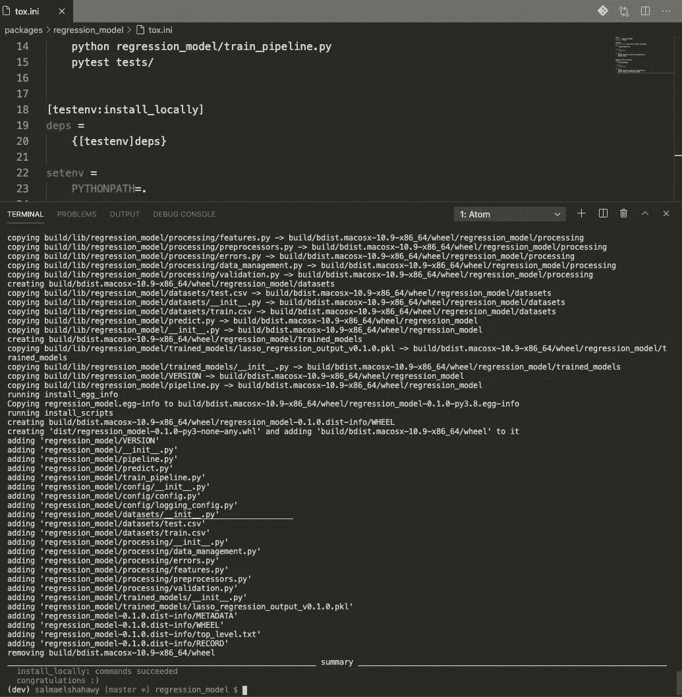
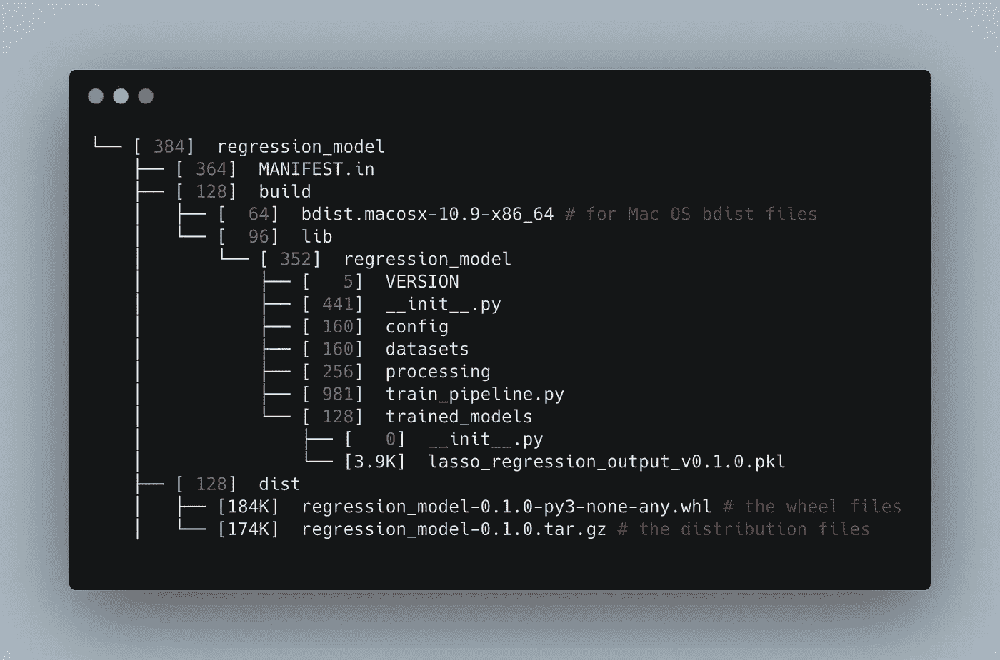
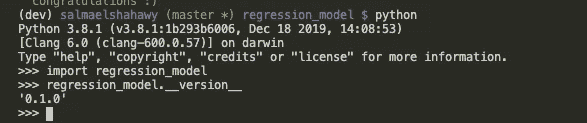
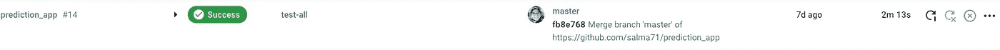
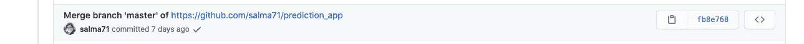
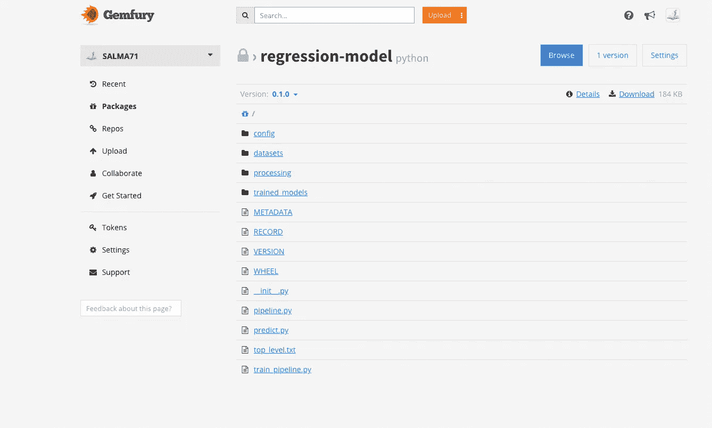

# 如何部署你的第一个机器学习模型——第一部分

> 原文：<https://towardsdatascience.com/exclusive-how-to-deploy-your-first-machine-learning-models-bf0a2109e522?source=collection_archive---------37----------------------->

## 从描述业务问题到部署，开发定制的 ML 管道。这份内容广泛的指南包括 Docker 和包装配置。


[梁杰森](https://unsplash.com/@ninjason?utm_source=unsplash&utm_medium=referral&utm_content=creditCopyText)在 [Unsplash](https://unsplash.com/s/photos/happiness?utm_source=unsplash&utm_medium=referral&utm_content=creditCopyText) 上的照片

机器学习模型只有在交付给最终用户时才会有巨大的价值。最终用户可能是房地产平台上的推荐系统，它向租房者或投资者推荐房产——例如 [Zillow](https://www.zillow.com/) 。

然而，机器学习项目只有在一个模型被部署，并且它的预测被服务的时候才能成功*。*

我很惊讶机器学习部署不寻常地在网上讨论——这是你需要在实践工作流中学习的特殊技能。

我试图谷歌这个特定的主题，但我发现了许多关于为机器学习模型设置 Flask APIs 的博客帖子。然而，这些教程都没有深入细节，开发唯一的端点。

因此，我决定在一个关于如何将 ML 模型部署到产品中的综合教程系列中写一篇关于这个主题的博客。我将首先使用 Jupyter 笔记本进行初步的统计分析，然后构建一个定制的机器学习框架——包。之后我会用 FLASK APP 开发一个端点 API。最后，我将使用 CI/CD 管道将机器学习模型部署到 Paas 平台。

我们会使用的一些技术有 Docker、Gemfury、Flask-API、CircleCI、Kaggle API 和 Sklearn。太激动了，让我们开始旅程吧。

> **免责声明，教程更侧重于事物如何工作，而不是代码逐行教程。在任何时候，您都可以使用**[**Github repo**](https://github.com/salma71/prediction_app)**提交历史来引用您的代码，当然，询问您是否需要帮助。**

这是一个两部分的教程，这是第一部分，包括构建和发布一个机器学习 python 包。**第二部分**包括构建一个 Flask API 端点并部署到 Heroku。

> 请注意，这是一个中级教程，你需要满足一定的要求才能赶上。然而，我通过添加评论和附上资源以供进一步学习和阅读，尽可能地让自己清楚。

在第一部分中，我将带您完成开发您自己的机器学习框架所需的步骤，以自动化从获取数据集到发布到云的构建步骤，以便您可以下载和使用。

# 先决条件:

本教程假设您对以下方面有一些经验

1.  python OOP——面向对象编程。
2.  拥有 Kaggle 帐户。
3.  作为文本编辑器的 VScode。
4.  具备 shell 脚本的基础知识—可选。
5.  了解终端命令的基本知识。
6.  拥有 CircleCI 账户。
7.  拥有 Github 帐户。

# 目录:

1.  使用 jupyter 笔记本浏览数据集。
2.  从笔记本迁移到 python 脚本
3.  为您的应用程序设置虚拟环境
4.  设置包的体系结构
5.  包装管理器简介—毒性
6.  包装要求
7.  构建包框架
8.  CircleCI 简介
9.  公共与私有软件包 Gemfury 简介

# 用于此项目的数据集

在本教程中，我将使用 Kaggle 的房价数据集，它是免费的。我将使用它只是为了演示的目的；我会做一些原始数据处理。可以做更精密的分析；然而，我更喜欢保持简单，因为主要话题已经够复杂了。你可以在 [Github repo](https://github.com/salma71/prediction_app/tree/master) 中查看完整的项目。

# 第一步:使用笔记本调查数据集

在此步骤中，我们将执行以下操作:

1.  探索数据集—汇总统计数据和 EDA
2.  建立回归模型并预测输出。
3.  使用 RMSE、梅度量标准评估模型性能。

我将全部细节附在 Kaggle 笔记本上，并关联了如下链接:

1.  数据分析 [part_1](https://www.kaggle.com/salmaeng/data-exploration-medium-post-1/edit)
2.  特色工程— [第二部分](https://www.kaggle.com/salmaeng/feature-engineering-medium-post-2/edit)
3.  特征选择— [第三部分](https://www.kaggle.com/salmaeng/feature-selection-medium-post-3/edit)
4.  模型构建— [第四部分](https://www.kaggle.com/salmaeng/feature-selection-medium-post-4/edit)

# 第二步:设置包结构

有很多好的搭建 CLI 包可以搭建一个标准的结构，比如 [pyscaffold](https://github.com/pyscaffold/pyscaffold) 和许多其他的来设置包结构。然而，我发现对于非软件开发背景的人来说，这并不是很令人欣慰。所以我构建了一个脚手架模板，让你不用那么担心调试后端代码。可以参考 Github 上的[源代码。你需要做的就是克隆或下载回购，然后按照说明开始。](https://github.com/salma71/ML_app_scaffold)

# 第三步:设置脚本文件

包树结构如下所示:



软件包主要模块的快照

让您的软件包正常运行是非常重要的。我们需要设置文件，以便包可以预测没有任何问题。在此步骤中，我们将进行以下操作:

*   设置 **config.py** 文件→包含训练阶段使用的模型常数。
*   遵循 OOP 最佳实践，将 **Jupyter 笔记本**转换成 python 脚本。
*   利用 python 中的日志记录→将代码从打印语句升级到日志记录——这在调试会话期间非常有用。

1.  在 ***config.py*** 文件中，我试图依靠注释来帮助你跟进。在这个文件中，我们设置了在包中使用的常量变量，比如包路径、数据集路径、模型中使用的变量等。所以应该直截了当。
2.  下载数据集并将其存储到包文件夹中指定的数据集文件夹中。
3.  ***data _ management . py***负责加载数据，保存管道，将模型保存为 pickle 文件，最后删除之前持久化的旧模型。
4.  ***errors.py*** 负责在调试会话期间引发自定义错误消息，帮助研究问题。
5.  ***features.py*** 包含数据转换逻辑——如果需要，可以随意添加更多转换
6.  ***preprocessor . py***实现缺失值插补、分类变量编码等数据角力步骤。
7.  ***validation . py***确认数据有效——输入数据没有 Nulls 或 NAs。
8.  *pipeline.py* 设置管道——构建模型所需执行的步骤。
9.  ***train _ pipeline . py***从根文件夹加载数据，将数据拆分成 train 和 test，在训练集上拟合模型，最后保存管道是必不可少的。

> 请注意，我们保留了与版本相关联的文件，这使得工作具有可追溯性和专业性。

10. ***predict.py*** 根据建立的模型获得预测。如终端中所示，保存的模型是有版本的，因此您可以跟踪要选择哪个模型——日志记录非常棒。

预测. py



日志消息的终端输出

# 第四步:包构建

对于包构建，我将使用[设置工具](https://setuptools.readthedocs.io/en/latest/)和[滚轮](https://pypi.org/project/wheel/)依赖项。这些允许您有效地构建和分发 Python 包，尤其是依赖于其他包的包。他们可以生成一个 ***dist*** 源分布文件，该文件包含 *.tar.gz* 和。 *whl* 也是扩展名文件。

您需要做的就是更新 setup.py 文件来设置包元数据。此外，您需要更新 tox.ini 文件以包含包构建命令。在构建模型之后执行包构建命令是有意义的。一旦完成，这个包就可以在本地**构建和安装了**。在终端中运行以下命令:

```
tox -e install_locally
```

现在它将选择一个已经在 ***tox.ini*** 文件中定义的特定 *tox 环境*。它将在**内创建一个新的虚拟环境*。*托克斯**目录。这个命令在第一次执行时会花费较长的时间，所以不要担心！

现在，如图所示，输出与之前运行 *tox* 的日志非常不同。这是因为它指定了所有由 ***设置工具*** 命令完成的设置。



运行 tox 命令后的终端提示符



构建包后文件夹结构的快照

# 第五步:在本地安装软件包

在终端中，运行以下命令在本地安装软件包:

```
pip install -e .
```

标签是在本地安装包，而。是指定包的根目录。

> 如果您不在包目录中，您需要指定包的路径而不是点。

安装完成后，我们可以通过使用 python 启动 python 命令行来测试它。



在本地测试包

该软件包现已成功安装在您的计算机上，可以使用了。

# 可选步骤:设置脚本从 Kaggle 获取数据集

专注于构建高效模型的一种方法是从已知的 API 中自动获取数据集。这是一个有效的方法来确保你没有忘记下载数据或把它放在错误的目录中。我将利用 [Kaggle API](https://github.com/Kaggle/kaggle-api) 来自动下载数据集。他们有一个友好的 CLI 工具，它很容易使用，会节省你大量的时间下载数据。

1.  你应该有一个 Kaggle 账户，如果没有，你可以在这里注册[。](https://www.kaggle.com/account/login?phase=startRegisterTab&returnUrl=%2F)
2.  导航到我的帐户→ API →创建新的 API 令牌→将 JSON 文件保存在您的本地机器中。
3.  将下面的代码片段放到脚本目录下的***fetch _ ka ggle _ dataset . sh***中。

如果您试图运行该文件，它会抛出一个错误，因为我们还没有设置 API 键。我们应该在接下来的步骤中设置 CircleCI/CD 管道时这样做。

# 第六步:建立 CI/CD 管道

自动化包开发的各个阶段是非常必要的。同时，确保如果添加了更新的代码或新的功能，不会出现任何问题。这就是使用持续集成/部署和交付平台(CI/CD 管道)的意义所在。根据下图，管道确保流程中的一切正常工作:

**构建→测试→合并→自动发布到公共回购→自动部署**

有许多托管平台使用 CI/CD 管道，仅举几个例子:

1.  [CircleCI](https://circleci.com/)
2.  [特拉维斯](https://travis-ci.org/)
3.  [GitLab](https://docs.gitlab.com/ee/ci/) CI
4.  詹金斯和许多其他人..等等。

我以前用过 Travis 和 Jenkins，所以我很好奇想在这个项目中尝试一下 CircleCI。如果您曾经参与过任何开发-运营管道开发，它会有相同的操作和几乎相同的命令。尽管 CircleCI 集成了 GitHub，但它只提供了一个免费的项目，用于在部署到 Paas 的过程中构建和禁用其他一些关于速度和缓存的特性。然而，其他主机平台的配置几乎相同。

> 首先，我们需要使用以下步骤在 circleci 中设置 Kaggle 环境变量:
> 
> 打开为 kaggle API 令牌下载的文件。
> 
> 进入 CircleCI 仪表板→项目名称→项目设置(在右上角)→环境变量→添加变量→
> 
> 将名称设置为`KAGGLE_USERNAME`，
> 
> 并将 ***值保存到你的 kaggle 用户名的 JSON 文件*** 中。
> 
> 重复这个过程，将名为`KAGGLE_KEY`的新变量添加到您的密钥值中。

> 根据文档，将这些环境变量命名为与上面相同的名称很重要，这样才能成功构建。

我使用了 Circleci 文档提供的[入门指南](https://circleci.com/docs/2.0/getting-started/#digging-into-your-first-pipeline)；这很容易理解。这个脚本的作用是:

1.  创建虚拟
2.  激活它
3.  升级 pip 命令
4.  在包的根目录下安装 requirements.txt 文件
5.  授予执行外壳文件的权限
6.  获取数据集
7.  运行测试

> 我在特定的 github commit 链接了基本的 [config.yml](https://github.com/salma71/prediction_app/blob/75f69b64512ab23bcf561bc3cb40703012f1dfe7/.circleci/config.yml) 文件供你参考。

每当一个新的 git commit 被推送到 master，CircleCi 就会运行测试，如果它有一个成功的构建，一个绿色的小勾就会出现在 GitHub 相应的 commit 附近。



CircleCi 仪表板



Github 接口

[https://media.giphy.com/media/Zc1sReLPQDN6Cxsezw/giphy.gif](https://media.giphy.com/media/Zc1sReLPQDN6Cxsezw/giphy.gif)

# 第七步:发布到 web

发布包有两个选项:

1.  将包公开-任何人都可以使用。你可以很容易地在[pypi.org](https://pypi.org/)上发布这个关于 pypi 文档的指南。
2.  将包设为私有-仅对特定用户可用。

在本教程中，我将使包成为私有的，因为这将是你在现实生活中面临的情况。然而，公开软件包的步骤几乎是相同的。所以让我们开始吧。

以下是您需要开始的步骤:

1.  Gemfury 帐户—如果您还没有在此处注册。Gemfury 是一个托管库，可以托管私有包。
2.  登录并导航至**令牌→完全访问令牌→复制**
3.  然后导航到

**CircleCI 仪表盘→项目名称→项目设置(右上角)→环境变量→添加变量→**

*   将名称设置为`PIP_EXTRA_INDEX_URL`，
*   和价值

```
https://${Full access token}@pypi.fury.io/${gemfury_username}
```

将完全访问令牌和 gemfury 用户名替换为您自己的之后，您就可以开始下一步了— [您也可以按照文档](https://gemfury.com/help/upload-packages/)进行操作。

4.在这一步，你需要一个 shell 脚本来发布这个包——[publish _ model . sh](https://github.com/salma71/prediction_app/blob/0731f12e5de23492ea7ea0ae5620e63a88b56252/scripts/publish_model.sh)，我按照这个[代码](https://gist.github.com/nexdrew/8944bb8725edaaa72afa2509cd715d78)做了一点调试和大量的[读取从这里](https://gemfury.com/help/pypi-server/#command-line)，这里[这里](https://circleci.com/docs/2.0/using-shell-scripts/)。

现在是时候通过添加发布包的新命令来更新 Circleci config.yml 了。

如果您登录到您的 gemfury 帐户，您将会看到在 packages 选项卡下发布的包。唷！！！



# 结论和要点

这个项目是比较中级的水平。我们探讨了许多需要包含在您的技能组合中的概念。我们探索的一些技能:

1.  坚持练习写 python 脚本而不是笔记本是最精华的。当处理可伸缩的应用程序时，它将节省大量的时间。
2.  [Python 代码的最佳实践](https://realpython.com/tutorials/best-practices/)。
3.  了解根据您的需求定制软件包的基础知识— [构建您的项目指南](https://docs.python-guide.org/writing/structure/)。
4.  分离关注点是保持你的代码有条理和可读性的一个很好的实践— [搭便车的指南代码风格](https://docs.python-guide.org/writing/style/)。
5.  自动化流水线减少了错误和 bug 的机会— [sklearn 文档](https://scikit-learn.org/stable/modules/generated/sklearn.pipeline.Pipeline.html)。
6.  将日志记录添加到源代码中，使调试变得更加容易— [您的参考资料，了解关于日志记录和格式化程序](https://www.loggly.com/ultimate-guide/python-logging-basics/)以及[日志记录指南](https://docs.python.org/3.5/howto/logging-cookbook.html)的更多信息。
7.  花足够的时间规划工作流和架构对于质量非常重要— [可选参考](https://realpython.com/python-application-layouts/)。
8.  了解业务问题并将其分解成小块使其易于管理— [可选参考](https://softmedialab.com/blog/machine-learning-for-business/) _1 和[参考 _2](https://freeandopenmachinelearning.readthedocs.io/en/latest/ml-business-use.html) 。

> **免责声明:如果您导航到**[**Github repo**](https://github.com/salma71/prediction_app)**，您会注意到我禁用了 pytest 包——单元测试被禁用。这是因为我想专注于部署，忽略单元测试中出现的任何问题。**

最后，我完成了如何从头开始开发机器学习 python 包的第 1 部分。对我来说，这是一个令人愉快又富有挑战性的项目。在[第 2 部分](/how-to-deploy-your-first-machine-learning-models-part-2-9e1d0fcfb68)中，我将利用这个包构建以下内容:

1.  使用 Flask app 构建 REST API 端点
2.  为完整的工作流程构建 docker 映像
3.  使用 Circleci 将应用程序部署到 Heroku
4.  使用 streamlit 构建前端接口。

敬请关注！

我希望这篇教程让你对机器学习模型的完整生命周期有所了解。有问题就问吧；我很乐意帮忙！快乐学习！