# 适应熊猫套餐——课程、练习和修改

> 原文：<https://towardsdatascience.com/exercises-to-get-used-to-the-pandas-package-lesson-aac431f3fe0e?source=collection_archive---------44----------------------->


# 学习熊猫

## 熊猫和数据框

因为你用的是熊猫，你必须在(几乎)所有笔记本上写的第一行是

```
import pandas as pd
```

在熊猫中，数据帧是一个表格。你可以在一个数据框架上做很多事情:对一列求和，绘制直方图，做一个数据透视表…

作为一个好的开始，简单地写“pd”在一个空的单元格中，使用键盘快捷键 **Tab** 来查看 pandas 中所有可用的功能。你会的

## 创建数据框架

要创建数据帧，请使用:

```
pd.DataFrame({
  'age':[10, 45, 13]
})
```

函数' pd。DataFrame()'使用字典:

```
{
  'age':[10, 45, 13]
}
```

其中“年龄”是列的名称，[10，45，13]是行的值。

注意您可以有多列:

```
{
  'age':[10, 45, 13],
  'name': ['George', 'Damien', 'Ingrid'],
  'gender': ['male', 'male', 'female']
}
```

你可以看到这有点不直观，因为我们习惯于把表格想象成由*行*组成的列表。更确切地说，熊猫数据框架使用了一系列*列*。这是要掌握的第一个概念。创建数据帧还有其他方法，但这是最常用的一种。其他的包括读取文件:

```
pd.read_excel('myExcelFile.xlsx')
```

*(打开文件前不要忘记关闭，否则会出错)*

或者

```
pd.read_csv('myFile.csv')
```

## 组合数据帧

组合数据帧非常简单:使用任意一种。join()，。append()、pd.concat()或。合并()。

见下文(很丑但很管用)

**同。join():**

```
pd.DataFrame({
  'age':[10, 45, 13]
}).**join(**
pd.DataFrame({
  'name': ['George', 'Damien', 'Ingrid']
})
**)**.**join(**
pd.DataFrame({
  'gender': ['male', 'male', 'female']
})
**)**
```

返回

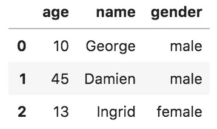

**同。append():**

```
pd.DataFrame({
  'age':[10, 45, 13]
}).**append(**
pd.DataFrame({
  'age': ['George', 'Damien', 'Ingrid']
})
**)**.**append(**
pd.DataFrame({
  'age': ['male', 'male', 'female']
})
**)**
```

返回

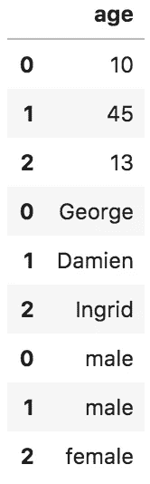

(见丑索引:0，1，2，0，1，2，0，1，2)

注意 append 不能连接列上的数据帧，它必须通过行连接(一行在另一行之上，而不是一行挨着一行)。数据帧之间必须有相同的列名，否则会得到警告。

**With pd.concat():**

```
**pd.concat([**
    pd.DataFrame({
      'age':[10, 45, 13]
    }),
    pd.DataFrame({
      'name': ['George', 'Damien', 'Ingrid']
    }),
    pd.DataFrame({
      'gender': ['male', 'male', 'female']
    })
**], axis=1)**
```

返回

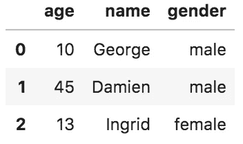

请注意，pd.concat()将用于数据帧列表，而不是数据帧。使用 pd.concat([df1，df2，…])。注意在熊猫中很常见的轴=1。基本上，轴=0 是列，轴=1 是行。

**同。merge():**

```
pd.DataFrame({
  'age':[10, 45, 13],
  'name': ['George', 'Damien', 'Ingrid']
})**.merge(**
pd.DataFrame({
  'name': ['George', 'Damien', 'Ingrid'],
  'gender': ['male', 'male', 'female']
})**, on=['name']**
**)**
```

返回


。“merge()”是 SQL“JOIN”。您至少需要一列来匹配它们。

## 在数据帧上运行操作

**总和、最大值、最小值、平均值、中值**

```
pd.DataFrame({
  'age':[10, 45, 13],
  'name': ['George', 'Damien', 'Ingrid'],
  'gender': ['male', 'male', 'female']
})**.mean()**
```

返回

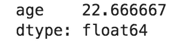

请注意，它仅对数值列进行平均。

```
pd.DataFrame({
  'age':[10, 45, 13],
  'name': ['George', 'Damien', 'Ingrid'],
  'gender': ['male', 'male', 'female']
})**.sum()**
```

返回

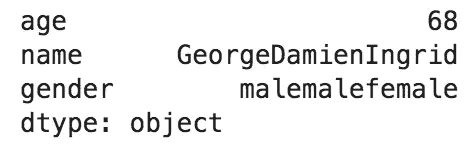

看到它适用于所有列了吗？！！它将文本连接在一起，并对“年龄”列求和。这是因为你可以用 Python 对文本求和:

```
'Damien' + 'George'
```

这里我们不关心文本的总和，但在某些情况下，它可能是有趣的。

```
pd.DataFrame({
  'age':[10, 45, 13],
  'name': ['George', 'Damien', 'Ingrid'],
  'gender': ['male', 'male', 'female']
})**.min()**
```

返回

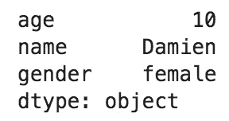

。min()返回数值的最小值，同时也返回按字母顺序排列的字符串的最小值！这是因为您可以在 Python 中比较文本:

```
'Damien' > 'George'
```

**透视表 _ 表格**

如果你是一个 Excel 用户，不需要介绍这个。数据透视表只是以一种易于阅读的方式将数据聚集在一起。

```
pd.DataFrame({
  'age':[10, 45, 13],
  'name': ['George', 'Damien', 'Ingrid'],
  'gender': ['male', 'male', 'female']
})**.pivot_table(**index='gender', aggfunc='min'**)**
```

返回

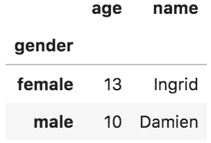

和以前一样,“min”操作符对数字列和字符串列都有效。

**自定义功能**

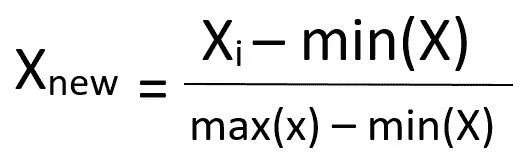

要在 0 和 1 之间缩放数据集的列，可以编写以下代码:

```
for column in df.columns:
  df[column] = \
    (df[column] — df[column].min()) / \
    (df[column].max() — df[column].min())
```

记住反斜杠是换行符。

更高级的写法是使用**。应用()**方法。顾名思义，它将一个函数同时应用于所有列或所有行。

```
df = df.apply(
  lambda column: (column-column.min()) / (column.max()-column.min())
)
```

要对 1 个特定列执行自定义功能，请使用**。**地图()【方法】。

```
df['column_1_squared'] = df['column_1'].map(
  lambda x: x * x
)
```

## 结论

尽可能多地练习这些。它们会变得非常有用。


# 练习

## 创建数据框架

创建如下图所示的数据帧。哦，找到一个聪明的方法来创建它们，不要只是在字典中硬编码这些值:

1)

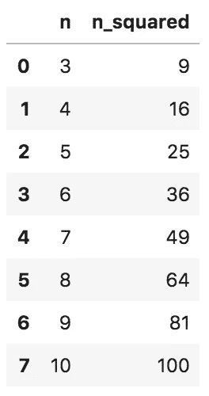

数据框#1:从 3 到 10 的正方形

2)

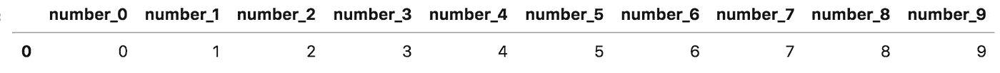

数据帧#2:多列

3)

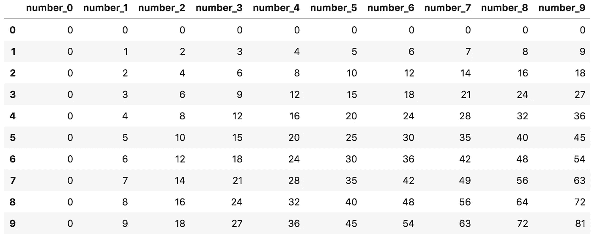

数据帧#3:平方数

## 组合数据帧

1)

```
customers1 = pd.DataFrame({
  'age':[10, 45, 13],
  'name': ['George', 'Damien', 'Ingrid'],
  'gender': ['male', 'male', 'female']
})customers2 = pd.DataFrame({
  'age':[12, 23, 25],
  'name': ['Albert', 'Jane', 'Angela'],
  'gender': ['male', 'female', 'female']
})
```

如何在一行中编写连接两个客户表的表？

2) ***难***

假设您的硬盘上有一些名为 **cust_transactions** 的文件夹中的文件。每个文件都包含一些客户交易的以下信息:

**file_482.csv** 包含以下 4 列:

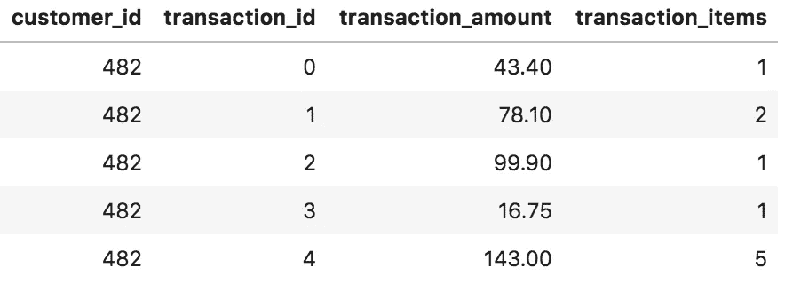

如何将所有文件读入一个名为“transactions”的数据帧？

## 最后一个

***非常困难；)***

你有一个名为 model_1，model_2，…，model_5 的 5 sklearn 二元分类模型。您希望在名为 X_train 和 X_test 的训练集和测试集上测量所有这 5 个模型的 AUC、对数损失、准确性和 f1 得分。目标的实际值分别是 y_train 和 y_test。

每行代表一个模型的性能。

你能写一个干净的代码来创建下面的表吗？

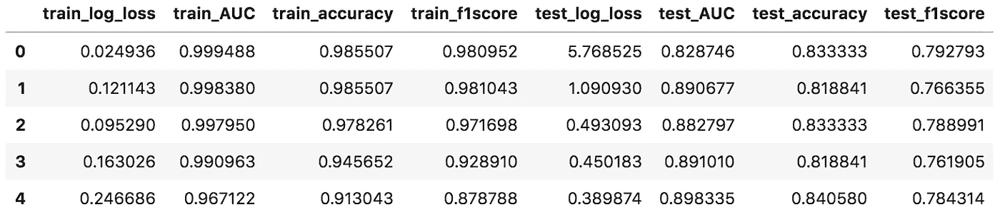

*提醒:*

这是衡量准确性的 4 个标准:

```
**from** sklearn.metrics **import** log_loss, roc_auc_score, accuracy_score, f1_score
```

**log_loss** 和 **roc_auc_score** 以预测的*概率*为输入， **accuracy_score** 和 **f1_score** 以预测的*类*为输入。

例如，如果 m 是模型的名称:

```
log_loss(y_true=y_train, **y_pred**=m.**predict_proba**(X_train)**[:,1]**)
roc_auc_score(y_true=y_train, **y_score**=m.**predict_proba**(X_train)**[:,1]**)
```

注意一个用 y_pred，另一个用 y_score。


# 修改

## 创建数据框架

1)

```
pd.DataFrame({
    'n': range(3,11),
    'n_squared': [n*n for n in range(3,11)]
})
```

2)

```
pd.DataFrame({'number_'+str(n):[n] for n in range(10)})
```

别忘了 n 旁边的 **[]** 。

3)

```
pd.DataFrame({'column_'+str(n):[n*m for m in range(10)] for n in range(10)})
```

两个列表理解交织在一起。

## 组合数据帧

1)

```
customers1.append(customers2, ignore_index=True)
```

注意 ignore_index=True 不是必须的，获得一个干净的新索引是很好的。

2)

```
import ostransactions = pd.concat([
    pd.read_csv(f) 
    for f in os.listdir('cust_transactions') 
    if f.endswith('.csv')
])
```

“导入操作系统”是调用“os.listdir('cust_transactions ')”所必需的，它列出了“cust_transactions”文件夹中的所有文件。我加了 if f.endswith(。csv)，以防文件夹中有其他类型的文件。

使用多个。这里的 append()看起来也是一个不错的选择。但是在一起读几千或者几百万个文件的时候，会很慢。将 pd.concat([])与 pd.read_csv()一起使用将是最快的选择。

## 最后一个

```
models = [model_1, model_2, model_3, model_4, model_5]pd.concat(
    [
        pd.DataFrame({
            sample+'_log_loss': [log_loss(y_true=y, y_pred=m.predict_proba(X)[:,1]) for m in models],
            sample+'_AUC':      [roc_auc_score(y_true=y, y_score=m.predict_proba(X)[:,1]) for m in models],
            sample+'_accuracy': [accuracy_score(y_true=y, y_pred=m.predict(X)) for m in models],
            sample+'_f1score':  [f1_score(y_true=y, y_pred=m.predict(X)) for m in models]
        })
        for (sample,X,y) in zip(['train', 'test'], [X_train, X_test], [y_train, y_test])
    ],
    axis=1
)
```