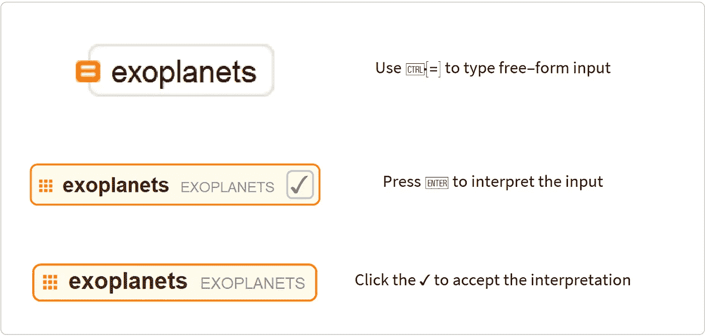
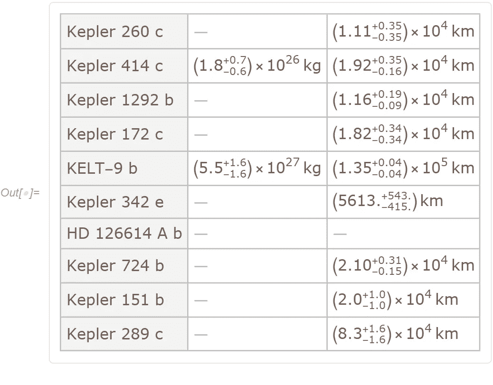
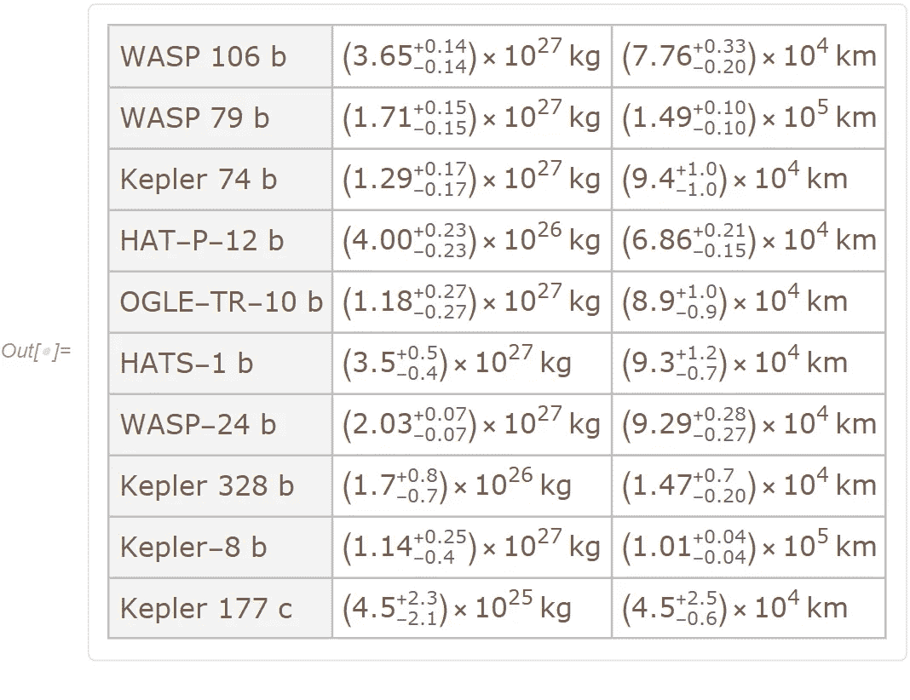
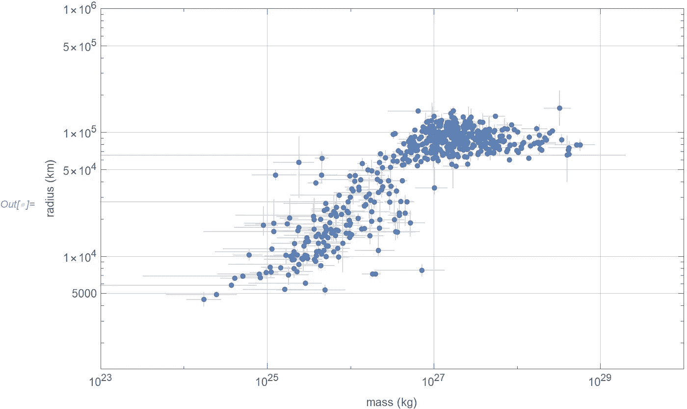
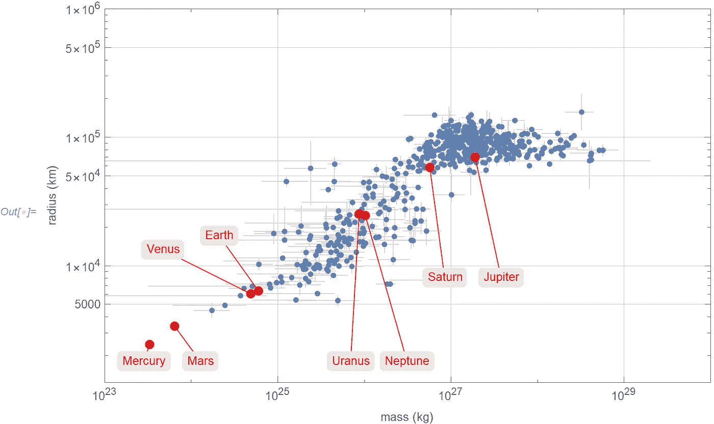
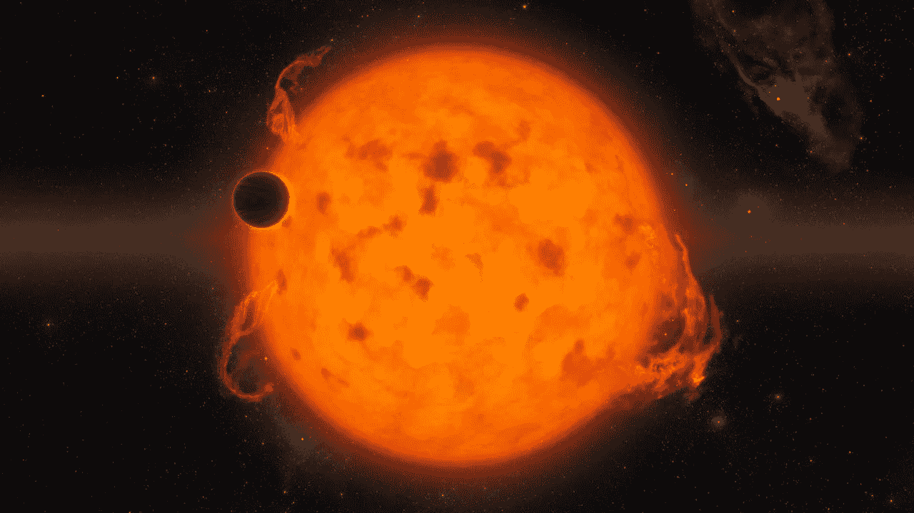

# 系外行星，我们在哪里？

> 原文：<https://towardsdatascience.com/exoplanets-where-do-we-fit-in-8f21b06d33fe?source=collection_archive---------54----------------------->

## 带有少量 Wolfram 语言的计算思维


由 [Unsplash](https://unsplash.com/s/photos/planet?utm_source=unsplash&utm_medium=referral&utm_content=creditCopyText) 上 [Greg Rakozy](https://unsplash.com/@grakozy?utm_source=unsplash&utm_medium=referral&utm_content=creditCopyText) 拍摄的照片

太阳系外的第一颗行星——系外行星——被确认至今不过 30 年左右。系外行星发现的时间表相当复杂，因为事实上早期的观察，其中一次早在 1917 年，最初并没有被认为是系外行星的证据。

在一段时间的基于地球和哈勃望远镜的发现之后，一架名为开普勒的太空望远镜于 2009 年发射，致力于寻找系外行星的任务。它一直指向夜空的一小部分，几年来耐心地记录了来自 50 多万颗恒星的光。


照片由[格雷格·拉科齐](https://unsplash.com/@grakozy?utm_source=unsplash&utm_medium=referral&utm_content=creditCopyText)在 [Unsplash](https://unsplash.com/s/photos/stars?utm_source=unsplash&utm_medium=referral&utm_content=creditCopyText) 上拍摄

在大约 10 年的任务中，它探测到了超过 2600 颗新的系外行星。加上其他发现，已知的系外行星总数超过 4000 颗。许多系外行星都有轨道周期、质量、半径等等的估计值。在这篇文章中，我将关注它们的质量和半径，并将它们与我们太阳系中的行星进行比较。

## 获取系外行星数据

在 [Wolfram 语言](https://www.wolfram.com/language/)中，这些系外行星可以从 [Wolfram 知识库](https://www.wolframalpha.com/examples/science-and-technology/space-and-astronomy/)的编程接口直接访问。在笔记本界面中，你可以通过漂亮的用户界面访问任何实体，而不仅仅是系外行星:



(图片由作者提供)

上面的最终结果也可以以纯文本代码的形式表示。它们是完全一样的东西:

```
EntityClass["Exoplanet", All]
```

我们可以通过一个简单的查询获得每个行星的质量和半径:

```
data = ExoplanetData[
 EntityClass["Exoplanet", All], {
   EntityProperty["Exoplanet", "Mass", {"Uncertainty" -> "Around"}],
   EntityProperty["Exoplanet", "Radius", {"Uncertainty" -> "Around"}]
}, "EntityAssociation"]
```

许多系外行星没有对它们的质量和/或半径的估计，而那些有估计的行星通常有很大的不确定性。十行数据的随机样本显示了典型的情况:



(图片由作者提供)

在过滤掉质量或半径缺失的情况后，我们得到了一个干净的数据集(显示了另一个 10 行的随机样本):



(图片由作者提供)

## 绘制数据

现在很容易画出每个系外行星的质量与半径的关系。极细的垂直线和水平线表明了每个系外行星的不确定性:



(图片由作者提供)

看到大量更大的系外行星并不奇怪。更大的行星更容易被发现，因此更多的行星被探测到。

为了将这些系外行星与我们太阳系中的行星进行比较，我们首先需要获得它们以及它们的质量和半径:

```
EntityValue[
 EntityClass["Planet", All], 
 {"Mass", "Radius"}, 
 "EntityAssociation"
]
```

使用额外的数据，我们现在可以重复相同的绘图，但包括太阳系行星:



(图片由作者提供)

这个挺有意思的。它表明有相当多的系外行星甚至比木星还要大。当然有一个上限，因为在某个尺寸下，一颗非常大的行星会变成一颗非常小的恒星。

在系外行星光谱的另一端，很明显我们没有发现很多非常小的行星。甚至火星也位于被探测到的主要系外行星群之外。希望有一天我们也会发现很多这样的东西！



鸣谢: [NASA](https://images.nasa.gov/details-PIA20690) (公共领域)

带代码的完整 Wolfram 笔记本可在网上[这里](https://www.wolframcloud.com/obj/arnoudb/Published/exoplanet.nb)获得。