# 通过规范化扩展您的回归曲目

> 原文：<https://towardsdatascience.com/expanding-your-regression-repertoire-with-regularisation-903d2c9f7b28?source=collection_archive---------31----------------------->

## 使用通过 tsfresh 生成的大量特征，通过逻辑回归对桶样品进行分类

你也可以在 [GitHub](https://github.com/PaulHiemstra/lasso_tsfresh_article/blob/master/lasso_tsfresh_article.ipynb) 上阅读这篇文章。这个 GitHub 存储库包含了您自己运行分析所需的一切。

# 介绍

对于许多数据科学家来说，基本的主力模型是多元线性回归。它是许多分析的第一站，也是更复杂模型的基准。它的优势之一是所得系数的易解释性，这是神经网络特别难以解决的问题。然而，线性回归并非没有挑战。在本文中，我们关注一个特殊的挑战:处理大量的特性。大型数据集的具体问题是如何为我们的模型选择相关特征，如何克服过度拟合以及如何处理相关特征。

[正规化](https://en.wikipedia.org/wiki/Regularization_(mathematics))是一种非常有效的技术，有助于解决上述问题。正则化通过用限制系数大小的项来扩展正常的最小二乘目标或损失函数来做到这一点。这篇文章的主要目的是让你熟悉正规化及其带来的好处。

在本文中，您将了解以下主题:

*   什么是更详细的正则化，为什么值得使用
*   有哪些不同类型的正规化，以及术语 L1-和 L2-规范在这种情况下的含义
*   如何实际运用正规化
*   如何使用 tsfresh 为我们的正则化回归生成特征
*   如何解释和可视化正则化回归的系数
*   如何使用交叉验证优化正则化强度
*   如何可视化交叉验证的结果

我们将从更理论化的规范化介绍开始这篇文章，并以一个实际的例子结束。

# 为什么使用规范化，什么是规范？

下图显示了一个绿色和一个蓝色函数与红色观测值相匹配([属性](https://commons.wikimedia.org/wiki/File:Regularization.svg))。两个函数都完全符合红色观测值，我们真的没有好办法使用[损失函数](https://en.wikipedia.org/wiki/Loss_function)来选择其中一个函数。

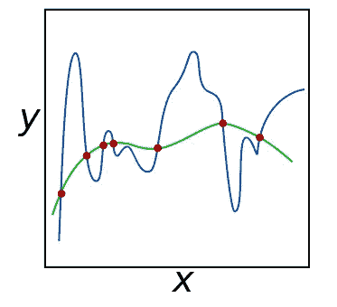

不能选择这些函数意味着我们的问题是*欠定的*。在回归中，[两个因素增加了欠定的程度](https://www.datacamp.com/community/tutorials/tutorial-ridge-lasso-elastic-net):多重共线性(相关特征)和特征的数量。在具有少量手工特征的情况下，这通常可以手动控制。然而，在更多的数据驱动的方法中，我们经常使用许多(相关的)特征，我们事先不知道哪些会工作得很好。为了克服不确定性，我们需要在问题中加入信息。给我们的问题添加信息的数学术语是*规则化*。

回归中执行正则化的一个非常常见的方法是用附加项扩展损失函数。 [Tibshirani (1997)](http://statweb.stanford.edu/~tibs/lasso/fulltext.pdf) 提出用一种叫做 [Lasso](https://en.wikipedia.org/wiki/Lasso_(statistics)) [的方法将系数的总大小加到损失函数中。](https://en.wikipedia.org/wiki/Lasso_(statistics)).)表示系数总大小的数学方法是使用所谓的*范数*:

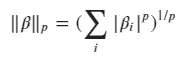

其中 p 值决定了我们使用什么样的范数。p 值为 1 称为 L1 范数，p 值为 2 称为 L2 范数，以此类推。既然我们已经有了范数的数学表达式，我们可以扩展我们通常在回归中使用的最小二乘损失函数:

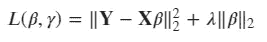

请注意，我们在这里使用 L2 范数，并且我们也使用 L2 范数表示损失函数的平方差部分。此外，λ是正则化强度。正则化强度决定了对限制系数大小与损失函数的平方差部分的关注程度。请注意，范数项在回归中引入了偏差，主要优点是减少了模型中的方差。

包含 L2 范数的回归称为[岭回归](https://en.wikipedia.org/wiki/Tikhonov_regularization) ( [sklearn](https://scikit-learn.org/stable/modules/generated/sklearn.linear_model.Ridge.html) )。岭回归减少了预测中的方差，使其更加稳定，不容易过度拟合。此外，方差的减少也[对抗多重共线性引入的方差](https://ncss-wpengine.netdna-ssl.com/wp-content/themes/ncss/pdf/Procedures/NCSS/Ridge_Regression.pdf)。

当我们在损失函数中加入一个 L1 范数时，这被称为 Lasso ( [sklearn](https://scikit-learn.org/stable/modules/generated/sklearn.linear_model.Lasso.html) )。Lasso 在减小系数大小方面比岭回归更进一步，一直减小到零。这实际上意味着变量会脱离模型，因此 lasso 会执行特征选择。这在处理高度相关的要素(多重共线性)时影响很大。Lasso 倾向于选择一个相关变量，而岭回归平衡所有特征。Lasso 的要素选择属性在您有许多输入要素，而您事先不知道哪些输入要素将对模型有益时特别有用。

如果您想混合套索和岭回归，您可以将 L1 和 L2 范数添加到损失函数中。这就是所谓的[弹性网正规化](https://en.wikipedia.org/wiki/Elastic_net_regularization)。撇开理论部分不谈，让我们进入正规化的实际应用。

# 正则化的使用示例

## 使用案例

人类非常善于识别声音。仅基于音频，我们就能够区分汽车、声音和枪支等事物。如果有人特别有经验，他们甚至可以告诉你这种声音属于哪种车。在本例中，我们将构建一个正则化的[逻辑回归](https://en.wikipedia.org/wiki/Logistic_regression)模型来识别鼓声。

## 数据集

我们模型的基础是一组 75 个鼓样品，每种鼓 25 个:[底鼓](https://en.wikipedia.org/wiki/Bass_drum)、[小军鼓](https://en.wikipedia.org/wiki/Snare_drum)和 [tom](https://en.wikipedia.org/wiki/Tom-tom_drum) 。每个鼓样本都储存在一个 wav 文件中，例如:

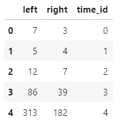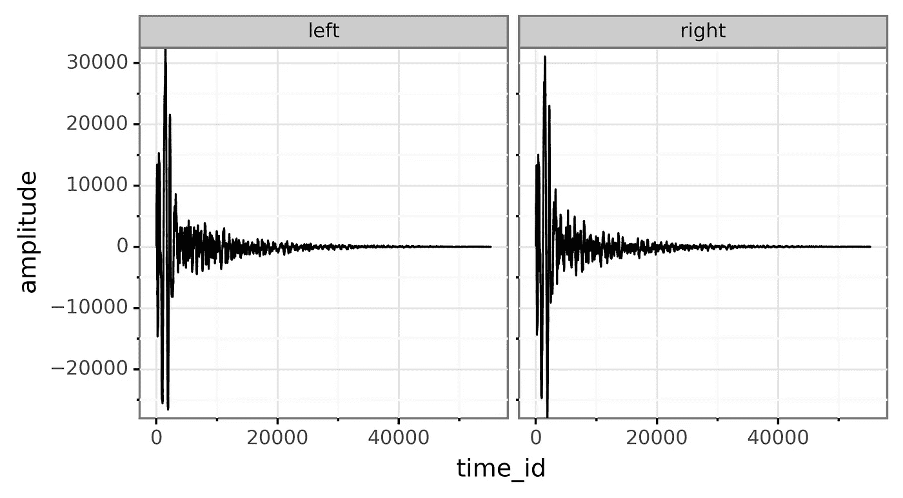

[高分辨率版本](https://raw.githubusercontent.com/PaulHiemstra/lasso_tsfresh_article/master/pics/stereo_drum.png)

wav 文件是立体声的，包含两个声道:左声道和右声道。该文件包含一个随时间变化的波形，x 轴为时间，y 轴为振幅。振幅实际上列出了扬声器的圆锥应该如何振动，以便复制存储在文件中的声音。

以下代码用所有 75 个鼓样本构造了一个`DataFrame`:

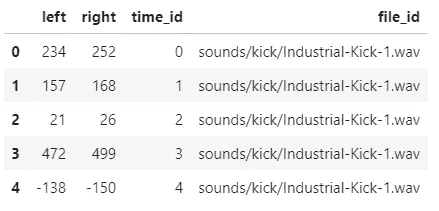

额外的函数`audio_to_dataframe`可以在文章的 github repo 中的`helper_functions.py`文件中找到。

# 使用 tsfresh 生成要素

为了适应监督模型，sklearn 需要两个数据集:一个带有我们特征的`samples` x `features`矩阵(或数据帧)和一个带有标签的`samples`向量。因为我们已经有了标签(`all_labels`)，所以我们把精力集中在特征矩阵上。因为我们希望我们的模型对每个声音文件进行预测，所以特征矩阵中的每一行都应该包含一个声音文件的所有特征。下一个挑战是想出我们想要使用的特性。例如，低音鼓的声音可能有更多的低音频率。因此，我们可以对所有样本运行 FFT，并将低音频率分离为一个特征。

采用这种手动特征工程方法可能非常耗费人力，并且有排除重要特征的很大风险。tsfresh ( [docs](https://tsfresh.readthedocs.io/en/latest/text/feature_extraction_settings.html) )是一个 Python 包，它极大地加快了这个过程。该软件包基于时间序列数据生成数百个潜在特征，还包括预选相关特征的方法。拥有数百个特征强调了在这种情况下使用某种正则化的重要性。

为了熟悉 tsfresh，我们首先使用`MinimalFCParameters`设置生成少量特征:

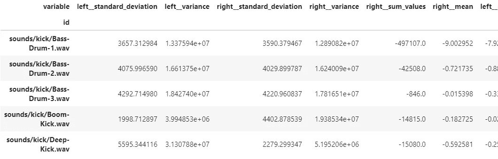

留给我们 11 个特征。我们使用`extract_relevant_features`函数来允许 tsfresh 预先选择给定标签和生成的潜在特征有意义的特征。在这种最小的情况下，tsfresh 查看由`file_id`列标识的每个声音文件，并生成诸如幅度的标准偏差、平均幅度等特征。

但是当我们生成更多的特性时，tsfresh 的优势就显现出来了。这里，我们使用高效设置来节省一些时间，而不是完全设置。注意，我从保存的 pickled 数据帧中读取结果，该数据帧是使用 github repo 中可用的`generate_drum_model.py`脚本生成的。我这样做是为了节省时间，因为在我的 12 线程机器上计算有效特性大约需要 10 分钟。

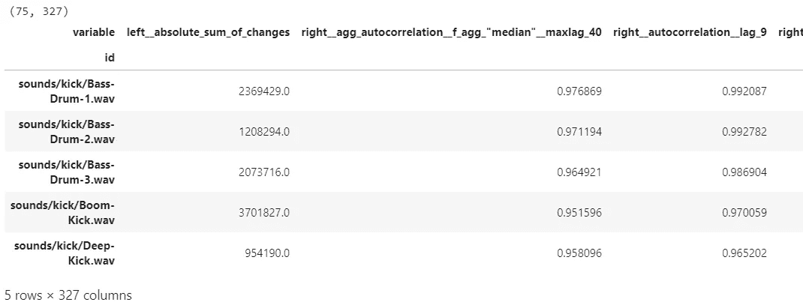

这大大扩展了特性的数量，从 11 个增加到 327 个。现在，特征包括跨越几个可能滞后的自相关、FFT 分量以及线性和非线性趋势等。这些特征为我们的正则化回归模型提供了一个非常广阔的学习空间。

# 拟合正则化回归模型

现在我们有了一组输入要素和所需的标签，我们可以继续拟合我们的正则化回归模型。我们使用来自 sklearn 的逻辑回归模型:

并使用以下设置:

*   我们将惩罚设为`l1`，也就是说，我们使用 L1 规范进行正则化。
*   我们设置`multi_class`等于`one-versus-rest` ( `ovr`)。这意味着我们的模型由三个子模型组成，每个子模型对应一种可能的鼓。当使用整体模型进行预测时，我们只需选择表现最佳的模型。
*   我们使用`saga`解算器来拟合我们的损失函数。还有很多可用的，但佐贺有一套完整的功能。
*   `C`暂时设为 1，其中 C 等于`1/regularisation strength`。注意，sklearn 套索实现使用了𝛼，它等于`1/2C`。因为我发现𝛼是一个更直观的度量，所以我们将在本文的剩余部分使用它。
*   `tol`和`max_iter`设置为可接受的默认值。

基于这些设置，我们进行了大量的实验。首先，我们将比较基于少量和大量 tsfresh 特性的模型的性能。之后，我们将重点关注使用交叉验证来拟合正则化强度，并以拟合模型的性能的更一般的讨论来结束。

## 最小 t 新鲜与高效

我们的第一个分析测试了假设，即使用更多生成的 tsfresh 特征会导致更好的模型。为了测试这一点，我们使用最小和有效的 tsfresh 特征来拟合模型。我们通过模型在测试集上的准确性来判断模型的性能。我们重复这个过程 20 次，以了解由于选择训练集和测试集的随机性而导致的准确性差异:

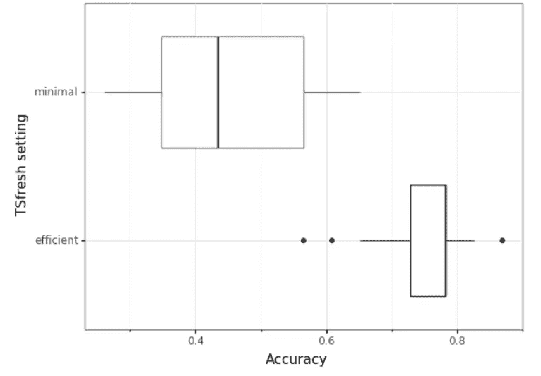

得到的箱线图清楚地表明，与基于最小特征的模型的 0.4 相比，有效的 tsfresh 变量显示出 0.75 的高得多的平均准确度。这证实了我们的假设，我们将在本文的其余部分使用高效的特性。

## 通过交叉验证选择正则化强度

使用正则化时，我们必须做出的一个主要选择是正则化强度。这里我们使用 [crossvalidation](https://en.wikipedia.org/wiki/Cross-validation_(statistics)) 来测试 c 的一系列潜在值的准确性。方便的是，sklearn 包括一个函数来执行逻辑回归分析:`[LogisticRegressionCV](https://scikit-learn.org/stable/modules/generated/sklearn.linear_model.LogisticRegressionCV.html)`。它本质上具有与`LogisticRegression`相同的接口，但是您可以传递一个潜在的 C 值列表来进行测试。关于代码的细节，我参考了 github 上的`generate_drum_model.py`脚本，为了节省时间，我们将结果从磁盘加载到这里:

注意，我们使用`[l1_min_c](https://scikit-learn.org/stable/modules/generated/sklearn.svm.l1_min_c.html)`来获得最小 C 值，对于该值，模型将仍然包含非零系数。然后，我们在此基础上添加一个介于 0 和 7 之间的对数标度，最终得到 16 个潜在的 C 值。我对这些数字没有很好的理由，我只是在`l1_min_c`链接的教程中重复使用了它们。转化为𝛼α正则化强度，取 log10 值(为了可读性)，我们最终得到:

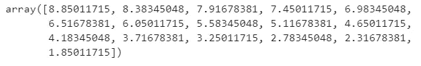

正如我们将在结果的解释中看到的，这跨越了一个很好的正则化强度范围。

交叉验证选择了以下𝛼值:

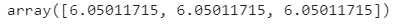

请注意，我们有三个值，每个子模型一个值(踢模型、鼓模型、响弦模型)。这里我们看到，大约 6 的正则化强度被认为是最佳的(C = `4.5e-07`)。

## 基于 CV 结果的模型的进一步解释

`cv_result`对象包含比拟合正则化强度更多的关于交叉验证的数据。在这里，我们首先看看交叉验证模型中的系数，以及它们在不断变化的正则化强度下遵循的路径。注意我们使用 github 上的`helper_functions.py`文件中的`plot_coef_paths`函数:

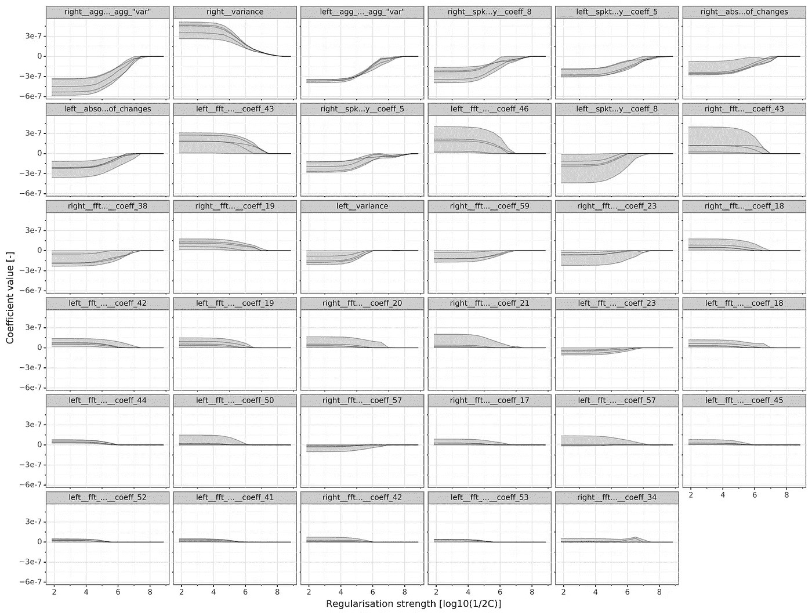

[高分辨率版本](https://raw.githubusercontent.com/PaulHiemstra/lasso_tsfresh_article/master/pics/coef_paths.png)

注意，我们在图中看到 5 条线，因为默认情况下我们执行 5 重交叉验证。此外，我们关注`kick`子模型。在该图中，以下观察结果很有趣:

*   增加正则化强度会减小系数的大小。这正是正规化应该做的，但结果支持这一点是件好事。
*   增加正则化强度会减少褶皱的拟合系数之间的差异(线条更接近)。这与规范化的目标是一致的:减少模型中的方差，并与不确定性作斗争。然而，褶皱之间的变化仍然是相当引人注目的。
*   对于后面的系数，总的系数大小下降。因此，早期系数在模型中最为重要。
*   对于交叉验证的正则化强度(6)，相当多的系数脱离了模型。在 tsfresh 生成的 327 个潜在特征中，只有大约 10 个被选择用于最终模型。
*   许多有影响的变量是 fft 分量。这在直觉上是有意义的，因为鼓样本之间的差异集中在某些频率附近(低音鼓->低频，小军鼓->高频)。

这些观察描绘了正则化回归按预期工作的画面，但肯定还有改进的空间。在这种情况下，我怀疑每种类型的鼓有 25 个样本是主要的限制因素。

除了查看系数和它们如何变化，我们还可以查看子模型的整体准确性与正则化强度。注意，我们使用了来自`helper_functions.py`的`plot_reg_strength_vs_score`图，你可以在 github 上找到。

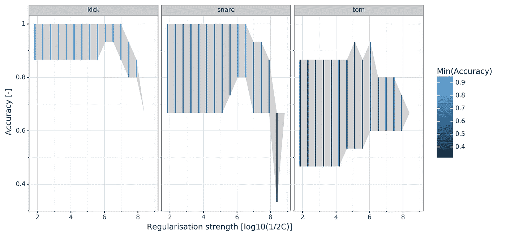

[高分辨率版本](https://raw.githubusercontent.com/PaulHiemstra/lasso_tsfresh_article/master/pics/overall_performance.png)

请注意，精确度涵盖的不是一条线，而是一个区域，因为我们在交叉验证中有每个折叠的精确度分数。该图中的观察结果:

*   kick 模型在拟合的正则化强度(6 -> 0.95)下以非常低的最小精度整体表现最佳。
*   tom 模型表现最差，其最小和最大精度低得多。
*   正则化强度在 5-6 之间达到性能峰值，这与所选值一致。在强度较小的情况下，我怀疑模型中剩余的多余变量带来了太多噪音，之后正则化提取了太多相关信息。

# 结论:我们的正则化回归模型的性能

基于交叉验证的准确度分数，我得出结论，我们在生成鼓声音识别模型方面相当成功。特别是底鼓很容易与其他两种鼓区分开来。正则化回归也为模型增加了很多价值，并减少了模型的总体方差。最后，tsfresh 在从这类基于时间序列的数据集生成特征方面显示了很大的潜力。

改进模型的潜在途径有:

*   使用 tsfresh 生成更多潜在的输入要素。对于这个分析，我使用了高效设置，但是也可以使用更复杂的设置。
*   使用更多的鼓样本作为模型的输入。