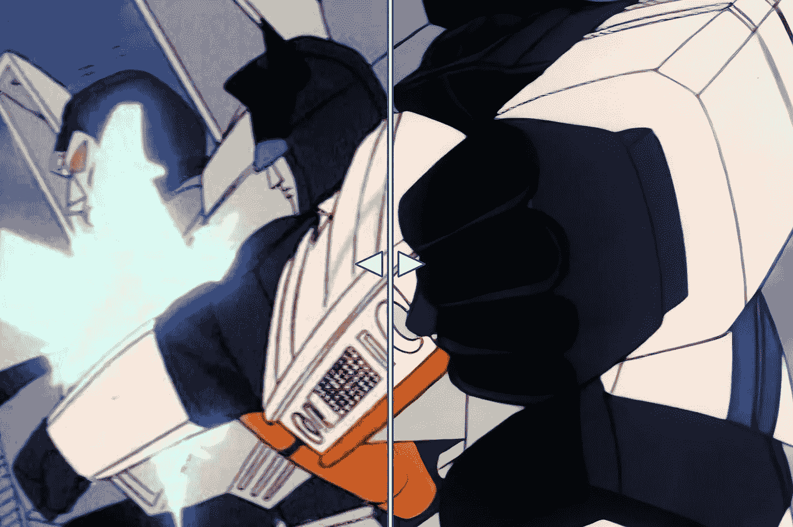
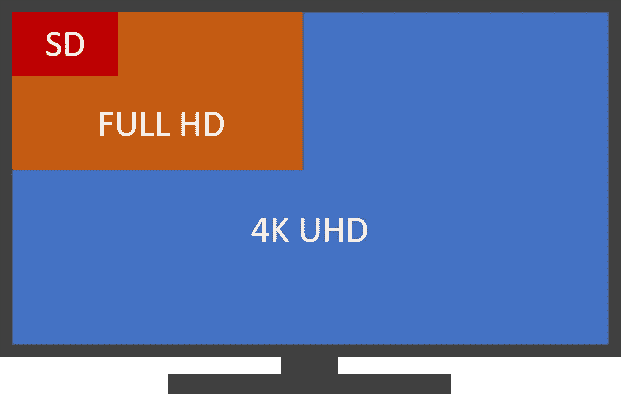
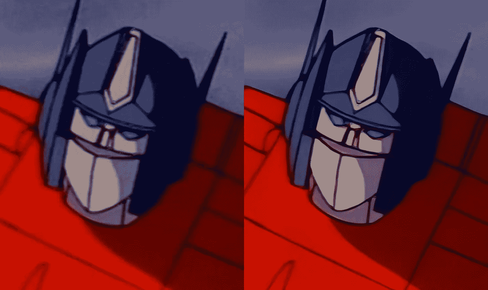
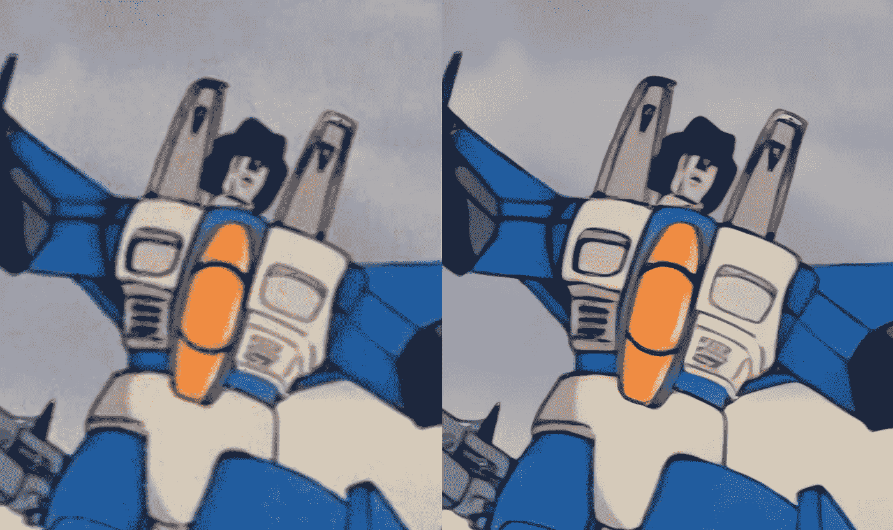
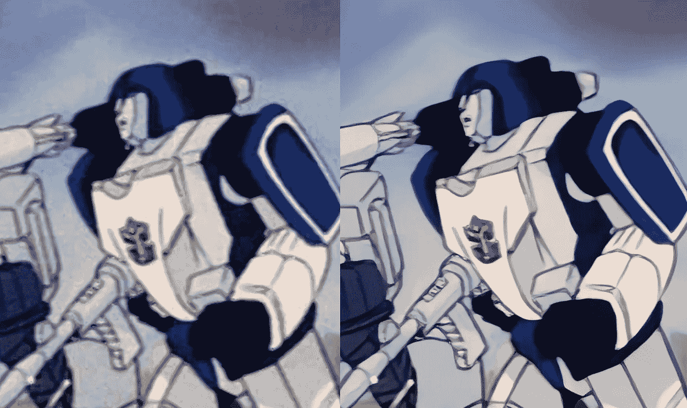

# 由于人工智能，你可以在 4K 观看童年时代的电视节目

> 原文：<https://towardsdatascience.com/expect-to-watch-tv-shows-from-your-childhood-in-4k-thanks-to-ai-7d073567c320?source=collection_archive---------31----------------------->

## 这是一个人工智能如何将 1984 年的原版《变形金刚 G1》转换成《4K》的例子

你是否在和你的孩子一起重温你最喜欢的童年电视连续剧，并问自己——如果我能在美丽的 4K 看他们，那不是很好吗？这是一个非常合理的问题，因为你正在观看的旧电视节目大多是标清质量的。这意味着分辨率最好为 720x576 像素，仅为 4K 屏幕像素的 5%。实际上，这意味着您的电视会将每个画面放大 20 倍，以填满整个 4K 屏幕。难怪照片看起来模糊不清。

标清与全高清以及 4K UHD 的对比

# 传统灌制

许多老的电视节目和电影，如《星际迷航》King》、《阿拉丁》或《狮子王》,已经被重新录制成更高的清晰度，可以在流行的流媒体平台上观看。然而，你最喜欢的童年电视节目或电影至少有全高清版本的可能性相当小。其原因在于，重新灌制更高清晰度的图像通常是一项乏味且昂贵的工作。首先，你需要拿到原始的 16 毫米或 8 毫米胶片，并希望它仍然完好无损。然后，胶片必须一帧一帧地进行数字扫描。一旦胶片被扫描，就执行手动颜色和图像校正。这都需要大量的时间和金钱，从商业角度来看，这是不合理的。你可以在这里和阅读更多关于电影修复[的内容。](https://www.premiumbeat.com/blog/4k-restorations-of-classic-films/)

# 人工智能拯救世界

人工智能、人工神经网络和机器学习都是过去几年的热门词汇。虽然经常被夸大，但人工神经网络(ann)给语音和图像识别或机器翻译等领域带来的进步不容忽视。原则上，它们是强大的模式识别算法，可以自动学习如何基于现有的数据集将输入转换为所需的输出。例如，你可以给人工神经网络输入 10 万张猫的图片和另外 10 万张狗的图片，它会自动学习如何区分这两张图片。编写一个传统的程序来区分图片中的猫和狗需要几个月的编码时间，而且可能不如简单的人工神经网络好，后者只需几天就可以建立起来。

既然人工神经网络可以在各种各样的任务上被训练，为什么不把它们用于 4K 改造呢？给人工神经网络足够多的相同图像或视频的 SD 和 4K 版本的例子，它将学习如何将低质量的 SD 输入重新制作成详细的 4K 视频。记住，当把一张 SD 图像转换成 4K 时，从技术上讲，你是把一个像素变成了 20 个像素。当你在 4K 电视上观看标清内容时，每个像素基本上都被放大 20 倍并进行模糊处理，以减少锯齿边缘。另一方面，人工神经网络将为原始视频的每个像素向 19 个新生成的像素人工添加逼真的细节。最终的 4K 结果应该是清晰的，有很多 SD 视频中没有的细节。

由于所有主要的神经网络框架都是开源的，因此您可以为 4K 升级构建和训练自己的 ANN 模型，但幸运的是，这方面的解决方案已经存在。一个这样的工具是托帕斯实验室的托帕斯视频增强人工智能。这个工具可以让你利用预训练的人工神经网络，通过几次点击，将低质量的视频升级到 4K 甚至 8K。

# 使用人工智能测试 4K 向上扩展

黄玉视频增强人工智能在 1984 年发行的原版变形金刚 G1 动画系列的 DVD 上进行了测试。这部动画系列从未以高清形式重拍，更不用说《4K》了，这使它成为一个完美的测试对象(除了它是一部伟大的剧集这一事实)。一个中档英伟达 GTX 1060 显卡花了大约 14 个小时将一集 22 分钟的内容从标清升级到 4K，但这种等待是值得的。以下是第一季介绍主题的一些对比镜头:

*左—原始 SD 版本升级到没有人工智能的 4K |右—使用人工智能的 4K 版本(原生 4K 部分)*

*左—原始 SD 版本升级到没有人工智能的 4K |右—使用人工智能的 4K 版本(原生 4K 部分)*

*左—原始 SD 版本升级到没有人工智能的 4K |右—使用人工智能的 4K 版本(4K 本地部分)*

*左—原始 SD 版本升级到没有人工智能的 4K |右—使用人工智能的 4K 版本(4K 本地部分)*

原版和 4K 版的《变形金刚》之间的差异是很难被忽略的。图像更加清晰，干净——这是普通的升级版无法做到的。你仍然会看到偶尔的电影噪音和 AI 模型无法提高动画帧率，但它无疑给了 36 岁的变形金刚一个急需的打磨。

# 期待什么

使用人工神经网络提升 4K 的结果令人印象深刻。和传统重制版一样好吗？不，但考虑到它使用起来如此简单，这是一个不可思议的成就。目前，使用人工神经网络的 4K 升级主要由爱好者和业余爱好者使用。典型的消费者不会看到或使用这样的工具，因为它们相对较慢。除了 2019 年的 Nvidia Shield，根本没有一款消费产品能够使用复杂的人工神经网络将视频实时升级到 4K。因此，问题是，我们什么时候能看到这样的人工智能成为主流？有两种可能的解决方案:

## 1.高端专用消费产品

我们可以期待在未来几年看到利用人工神经网络进行实时 4K 和 8K 升级的高端专用消费产品。这些可能采取机顶盒或控制台的形式，必须插入电视。其中一个已经存在的产品是 2019 年的 Nvidia Shield。后来，我们可以期待人工智能升级硬件直接内置到电视中。这将特别有助于销售 8K 电视，因为它实际上抵消了可用 8K 内容的缺乏。

## 2.流媒体平台开始利用人工神经网络

人工神经网络升级成为主流的另一种可能性是流媒体平台开始利用这项技术。流媒体平台必须使用人工神经网络将其标清和高清内容升级到 4K 甚至 8K，就像使用现有工具一样。一旦完成，升级后的 4K 或 8K 内容将可供每个人观看。这个过程可能需要电影工作室的一些许可澄清，但从技术的角度来看，现在没有什么会阻碍流媒体平台使用这项技术。

谁也说不准 4K 什么时候会用复杂的人工神经网络来做主持人。但是，这种技术所能达到的结果使我们希望这一天早日到来。

免责声明:《变形金刚》及其所有相关角色是孩之宝的商标，我不主张任何权利。我和 Topaz 实验室或其任何员工都没有关系。版权免责根据 1976 年版权法 107 节，允许出于批评、评论、新闻报道、教学、学术、教育和研究等目的的“合理使用”。合理使用是版权法允许的使用，否则可能侵权。