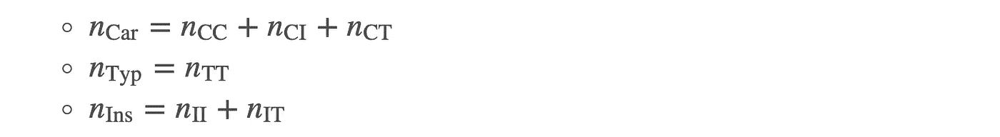

# 期望值最大化算法，已解释

> 原文：<https://towardsdatascience.com/expectation-maximization-algorithm-explained-ffaf0655357e?source=collection_archive---------10----------------------->

## [入门](https://towardsdatascience.com/tagged/getting-started)

## EM 算法的综合指南，包含直觉、示例、Python 实现和数学

登上富士山与 EM 寻找最大似然估计值的方式惊人地相似。请继续阅读，找出原因。由[吉勒·德贾尔丁](https://unsplash.com/@hobz?utm_source=medium&utm_medium=referral)在 [Unsplash](https://unsplash.com?utm_source=medium&utm_medium=referral) 上拍摄的照片

是啊！先说期望最大化算法(简称 EM)。如果您处于数据科学“泡沫”中，您可能在某个时间点遇到过 EM，并且想知道:什么是 EM，我需要知道它吗？

它是解决高斯混合模型的算法，这是一种流行的聚类方法。对于**隐马尔可夫模型**至关重要的 Baum-Welch 算法是 EM 的一种特殊类型。

> 它适用于大数据和小数据；当其他技术失败时，当信息缺失时，它会蓬勃发展。

这是一种非常经典、强大和通用的统计学习技术，几乎在所有的计算统计学课程中都有教授。阅读完本文后，您可以对 EM 算法有一个很深的理解，并知道何时以及如何使用它。

我们从两个激励性的例子开始(无监督学习和进化)。接下来，我们看看什么是 EM 的一般形式。我们跳回现实，用 EM 来解决这两个例子。然后，我们从直觉和数学两方面解释为什么 EM 像魔咒一样起作用。最后，对本文进行了总结，并提出了一些进一步的课题。

这篇文章改编自我的博文，省略了推导、证明和 Python 代码。如果你更喜欢 LaTex 格式的数学，或者想获得这里所有问题的 Python 代码，你可以在我的博客上阅读这篇文章。

# 激励的例子:我们为什么关心？

可能你已经知道为什么要用 EM，也可能你不知道。不管怎样，让我用两个激励人心的例子来为新兴市场做准备。我知道这些很长，但它们完美地突出了 EM 最擅长解决的问题的共同特征:缺失信息的存在。

## 无监督学习:求解用于聚类的高斯混合模型

假设您有一个包含 n 个数据点的数据集。它可以是一群访问你的网站的客户(客户档案)或一个有不同对象的图像(图像分割)。聚类是在您不知道(或不指定)真正的分组时，为您的数据找出 k 个自然组的任务。这是一个无监督的学习问题，因为没有使用基本事实标签。

这种聚类问题可以通过几种类型的算法来解决，例如，诸如 k-means 的组合类型或诸如 Ward 的分层聚类的分层类型。但是，如果您认为您的数据可以更好地建模为正态分布的混合，您会选择高斯混合模型(GMM)。

GMM 的基本思想是，你假设在你的数据背后有一个数据生成机制。该机制首先选择 k 个正态分布中的一个(具有一定的概率),然后从该分布中传递一个样本。因此，一旦您估计了每个分布的参数，您就可以通过选择可能性最高的数据点来轻松地对每个数据点进行聚类。

**图一。** *安* [*例*](https://commons.wikimedia.org/wiki/File:ClusterAnalysis_Mouse.svg) *混合高斯数据，使用 k-means 和 GMM 进行聚类(EM 求解)。注意 EM 发现的组看起来像正态分布。*

然而，估计参数并不是一项简单的任务，因为我们不知道哪个分布产生了哪些点(**缺失信息**)。EM 是一种算法，可以帮助我们解决这个问题。这就是为什么 EM 是 scikit-learn 的 GMM [实现](https://scikit-learn.org/stable/modules/mixture.html#gaussian-mixture)中的底层求解器。

## 群体遗传学:估计蛾的等位基因频率以观察自然选择

你以前听过“工业黑变病”这个说法吗？生物学家在 19 世纪创造了这个术语来描述动物如何由于城市的大规模工业化而改变它们的肤色。他们观察到，以前罕见的深色胡椒蛾开始主宰以煤为燃料的工业化城镇的人口。当时的科学家对此观察感到惊讶和着迷。随后的研究表明，工业化城市的树皮颜色更深，比浅色的更能掩饰深色的蛾子。你可以玩这个胡椒飞蛾[游戏](https://askabiologist.asu.edu/peppered-moths-game/play.html)来更好的理解这个现象。

**图二。** *深色(上)和浅色(下)的胡椒蛾。图片由 Jerzy Strzelecki 通过维基共享资源提供*

结果，暗蛾在捕食中存活得更好，并把它们的基因传递下去，从而形成了一个以暗斑蛾为主的种群。为了证明他们的自然选择理论，科学家们首先需要估计蛾类种群中产生黑色和产生光亮的基因/等位基因的百分比。负责蛾的颜色的基因有 C、I、T 三种类型的等位基因，基因型 **C** C、 **C** I、 **C** T 产生深色的胡椒蛾(*Carbonaria*)；产生轻微的胡椒蛾。 **I** I 和 **I** T 产生中间色的蛾( *Insularia* )。

这里有一个手绘的图表，显示了**观察到的**和**缺失的**信息。

**图三。** *花椒螟等位基因、基因型和表型之间的关系。我们观察了表型，但希望估计人群中等位基因的百分比。作者图片*

我们想知道 C、I 和 T 在人口中所占的百分比。然而，我们只能通过捕捉来观察到*炭螟*、*典型*和*岛螟*的数量，而不能观察到基因型(**缺失信息**)。事实上，我们没有观察到基因型和多个基因型产生相同的亚种，这使得计算等位基因频率变得困难。这就是 EM 发挥作用的地方。利用 EM，我们可以很容易地估计等位基因频率，并为由于环境污染而在人类时间尺度上发生的微进化提供具体证据。

在信息缺失的情况下，EM 如何处理 GMM 问题和胡椒蛾问题？我们将在后面的部分说明这些。但是首先，让我们看看 EM 到底是什么。

# 一般框架:什么是 EM？

此时，你一定在想(我希望):所有这些例子都很精彩，但真正的 EM 是什么？让我们深入研究一下。

> EM 算法是一种迭代优化方法，可在存在隐藏/缺失/潜在变量的问题中找到参数的最大似然估计(MLE)。

Dempster、Laird 和 Rubin (1977)在其著名的论文(目前引用 62k)中首次全面介绍了这一概念。它因其易于实现、数值稳定和稳健的经验性能而被广泛使用。

让我们为一个一般问题建立 EM，并引入一些符号。假设 Y 是我们的观察变量，X 是隐藏变量，我们说对(X，Y)是完全数据。我们还将任何感兴趣的未知参数表示为θ∈θ。大多数参数估计问题的目标是在给定模型和数据的情况下找到最可能的θ，即，

其中被最大化的项是不完全数据可能性。使用[总概率](https://en.wikipedia.org/wiki/Law_of_total_probability)定律，我们也可以将不完全数据的可能性表示为

其中被积分的项称为完全数据似然。

所有这些完整和不完整数据的可能性是怎么回事？

> 在许多问题中，由于信息缺失，不完全数据似然的最大化是困难的。另一方面，使用完全数据可能性通常更容易。

EM 算法就是为了利用这种观察而设计的。它在一个**期望步骤** (E 步骤)和一个**最大化步骤** (M 步骤)之间迭代，以找到 MLE。

假设上标为(n)的θ是在第 n *次*次迭代中获得的估计值，该算法在两个步骤之间迭代如下:

*   **E 步**:定义 Q(θ |θ^(n))为完全数据对数似然的条件期望 w.r.t .隐变量，给定观测数据和当前参数估计，即，

*   **M 步**:找到一个使上述期望最大化的新θ，设为θ^(n+1)，即，

乍一看，上述定义似乎很难理解。一些直观的解释可能会有所帮助:

*   **E-step** :这一步是问，给定我们的观测数据 **y** 和当前参数估计θ^(n)，不同 *X* 的概率是多少？还有，在这些可能的 *X，*下，对应的对数似然是什么？
*   **M 步**:这里我们问，在这些可能的 *X* 下，给我们最大期望对数似然的θ值是多少？

该算法在这两个步骤之间迭代，直到达到停止标准，例如，当 Q 函数或参数估计已经收敛时。整个过程可以用下面的流程图来说明。

**图 4。***EM 算法在 E 步和 M 步之间迭代，以获得最大似然估计，并在估计值收敛时停止。作者图片*

就是这样！有了两个方程和一堆迭代，你刚刚解开了一个最优雅的统计推断技术！

# EM 在行动:真的有用吗？

上面我们看到的是 EM 的一般框架，而不是它的实际实现。在这一节中，我们将一步一步地看到 EM 是如何被实现来解决前面提到的两个例子的。在验证了 EM 确实可以解决这些问题之后，我们将在下一节中直观地从数学上理解它为什么可以解决这些问题。

## 求解聚类的 GMM

假设我们有一些数据，并想模拟它们的密度。

**图 5。** *400 个点生成为四种不同正态分布的混合物。作者图片*

你能看到不同的底层分布吗？显然，这些数据来自不止一个发行版。因此，单一的正态分布是不合适的，我们使用混合方法。一般来说，基于 GMM 的聚类是将(y1，…，yn)个数据点聚类成 *k* 组的任务。我们让

因此，x_i 是数据 y_i 的一位热码，例如，如果 *k* = 3 并且 y_i 来自组 3，则 x_i = [0，0，1]。在这种情况下，数据点集合 **y** 为不完整数据，( **x** ， **y** )为扩充后的完整数据。我们进一步假设每个组遵循正态分布，即，

在通常的混合高斯模型建立之后，以概率 *w_k，*从第 k 个*组生成新点，并且所有组的概率总和为 1。假设我们只处理不完整的数据 **y** 。GMM 下一个数据点的可能性为*

其中φ(；μ，σ)是具有均值μ和协方差σ的正态分布的 PDF。n 个点的总对数似然为

在我们的问题中，我们试图估计三组参数:组混合概率( **w** )和每个分布的均值和协方差矩阵( **μ** ，**σ**)。参数估计的通常方法是最大化上述总对数似然函数与每个参数的比值(MLE)。然而，由于对数项内的求和，这很难做到。

## 期望步骤

让我们使用 EM 方法来代替！记住，我们首先需要在 E-step 中定义 Q 函数，它是完整数据对数似然的条件期望。由于( **x** ， **y** )是完整数据，一个数据点对应的可能性为

并且只有 x_{ij} = 1 的项是有效的，因为它是一次性编码。因此，我们的总完全数据对数似然是

将θ表示为未知参数的集合( **w** ， **μ** ，**σ**)。按照(2)中的 E 步公式，我们获得 Q 函数如下

在哪里

上面的 *z* 项是数据 y_i 在当前参数估计的类别 *j* 中的概率。这种概率在某些文本中也被称为责任。意味着每个类对这个数据点的责任。给定观测数据和当前参数估计，它也是一个常数。

## 最大化步骤

回想一下，EM 算法是通过在 E 步和 M 步之间迭代来进行的。我们已经在上面的 E 步骤中获得了最新迭代的 Q 函数。接下来，我们继续进行 M 步，找到一个新的θ，使(6)中的 Q 函数最大化，即我们找到

仔细观察得到的 Q 函数，会发现它实际上是一个加权正态分布 MLE 问题。这意味着，新的θ具有封闭形式的公式，可以使用微分法轻松验证:

对于 *j* = 1，…， *k* 。

## 表现如何？

我们在这一节回到开头的问题。我用四种不同的正态分布模拟了 400 个点。如果我们不知道底层的真实分组，我们会看到图 5。我们运行上面导出的 EM 程序，并设置算法在对数似然不再变化时停止。

最后，我们找到了混合概率和所有四组的平均和协方差矩阵。下面的图 6 显示了 EM 发现的叠加在数据上的每个分布的密度等值线，这些数据现在通过其地面实况分组进行了颜色编码。四个基本正态分布的位置(均值)和尺度(协方差)都被正确识别。**与 k-means 不同，EM 为我们提供了数据的聚类和它们背后的生成模型(GMM)。**

**图六。** *叠加在四个不同正态分布样本上的密度等值线。作者图片*

# 估计等位基因频率

我们回到前面提到的群体遗传学问题。假设我们捕获了 n 只*蛾，其中有三种不同的类型:*炭蛾*、*典型蛾*和*岛蛾*。然而，除了典型蛾外，我们不知道每种蛾的基因型，见上图 3。我们希望估计群体等位基因频率。让我们用 EM 术语来说。以下是我们所知道的:*

1.  观察到:

2.未观察到的:不同基因型的数量

3.但是我们知道它们之间的关系:

4.感兴趣的参数:等位基因频率

我们需要使用另一个重要的建模原则:Hardy-Weinberg 原则，该原则认为基因型频率是相应等位基因频率的乘积，或者是两个等位基因不同时的两倍。也就是说，我们可以预期基因型频率为

很好！现在我们准备插入 EM 框架。第一步是什么？

## 期望步骤

就像 GMM 的情况一样，我们首先需要计算出完整数据的可能性。注意，这实际上是一个多项式分布问题。我们有一群飞蛾，捕捉到 CC 基因型飞蛾的机会是 p_{C}，其他基因型也是如此。因此，完全数据似然就是多项式[分布 PDF](https://en.wikipedia.org/wiki/Multinomial_distribution#Probability_mass_function) :

并且完整数据对数似然可以写成以下分解形式:

请记住，在给定最新迭代的参数估计值的情况下，E-step 根据未观测数据 *Y* 对上述可能性进行有条件的期望。发现 Q 函数是

其中 n_{CC}^(n)是给定当前等位基因频率估计值的 CC 型蛾的预期数量，对于其他类型也类似。k()是一个不涉及θ的函数。

## 最大化步骤

由于我们获得了每种表型的预期数量，估计等位基因频率就很容易了。直观地，等位基因 C 的频率计算为群体中存在的等位基因 C 的数量与等位基因总数之间的比率。这也适用于其他等位基因。因此，在 M 步骤中，我们获得

事实上，我们可以通过对 Q 函数求微分并将它们设置为零(通常的优化程序)来获得相同的 M 步公式。

## 表现如何？

让我们试着用上面推导出的 em 过程来解决胡椒蛾问题。假设我们捕获了 622 只胡椒蛾。其中 85 种是*卡波尼亚*，196 种是*海岛*，341 种是*典型*。我们运行 EM 迭代 10 步，图 7 显示我们在不到 5 步的时间内获得了收敛的结果。

**图 7。** *EM 算法收敛不到五步，找到等位基因频率。作者图片*

## 我们从例子中学到了什么？

由于缺少表型信息，估计等位基因频率是困难的。EM 帮助我们解决这个问题，它用丢失的信息来补充这个过程。如果我们回头看看 E-step 和 M-step，我们会看到 E-step 在给出最新频率估计的情况下计算最可能的表型计数；M-step 然后计算给定最新表型计数估计的最可能频率。这个过程在 GMM 问题中也很明显:在给定当前类参数估计的情况下，E-step 计算每个数据的类责任；然后，M-step 使用这些责任作为数据权重来估计新的类参数。

# 解释:为什么有效？

通过前面的两个例子，我们清楚地看到 EM 的本质在于用缺失的信息增加观察到的信息的 **E 步/M 步**迭代过程。我们看到它确实有效地找到了最大似然估计。但是为什么这个迭代过程会起作用呢？EM 只是一个聪明的黑客，还是有很好的理论支撑？让我们找出答案。

## 直观的解释

我们首先对 EM 的工作原理有一个直观的理解。

> EM 通过在一些小步骤中将最大化不完全数据似然(困难)的任务转移到最大化完全数据似然(容易)来解决参数估计问题。

想象你正在富士山徒步旅行🗻第一次。在到达顶峰之前有九个站要到达，但是你不知道路线。幸运的是，有徒步旅行者从山顶下来，他们可以给你一个到下一站的大致方向。因此，下面是你可以达到顶端的方法:从基站开始，向人们询问到第二站的方向；去第二个车站，向那里的人打听去第三个车站的路，以此类推。在一天结束的时候(或者一天开始的时候，如果你在看日出的话🌄)，你很有可能到达顶峰。

这就是 EM 为我们有缺失数据的问题寻找最大似然估计所做的事情。EM 不是最大化 **ln** p( **x** )(找到登顶的路线)，而是最大化 Q 函数，找到下一个同样增加 **ln** p( **x** )(问下一站方向)的θ。下面的图 8 通过两次迭代说明了这个过程。请注意，G 函数只是 Q 函数和其他几项常数 w.r.t. θ的组合。最大化 G 函数 w.r.t. θ相当于最大化 Q 函数。

**图 8。***EM 的迭代过程分两步说明。当我们从当前参数估计建立并最大化 G 函数(等价地，Q 函数)时，我们获得下一个参数估计。在这个过程中，不完全数据对数似然也会增加。作者图片*

# 摘要

在本文中，我们看到 EM 通过优化转移框架将一个有缺失信息的难题转化为一个简单的问题。我们还通过用 Python 实现一步一步地解决两个问题(高斯混合聚类和胡椒蛾种群遗传学)来看 EM 的作用。**更重要的是，我们看到 EM 不仅仅是一个聪明的黑客，而且有坚实的数学基础来解释它为什么会起作用。**

我希望这篇介绍性文章对您了解 EM 算法有所帮助。从这里开始，如果您感兴趣，可以考虑探索以下主题。

# 更多主题

深入挖掘，你可能会问的第一个问题是:那么，EM 完美吗？当然不是。有时，Q 函数很难用解析方法获得。我们可以使用蒙特卡洛技术来估计 Q 函数，例如，检查蒙特卡洛 [EM](https://amstat.tandfonline.com/doi/abs/10.1198/106186001317115045) 。有时，即使有完整的数据信息，Q 函数仍然很难最大化。我们可以考虑替代的最大化技术，例如，参见期望条件最大化( [ECM](https://academic.oup.com/biomet/article-abstract/80/2/267/251605) )。EM 的另一个缺点是它只提供给我们点估计。如果我们想知道这些估计中的不确定性，我们将需要通过其他技术进行方差估计，例如 Louis 的方法、补充 EM 或 bootstrapping。

**感谢阅读！请考虑在下面给我留下反馈。如果你对更多的统计学习感兴趣，可以看看我的其他文章:**

 [## 线性判别分析，已解释

### 直觉、插图和数学:它如何不仅仅是一个降维工具，为什么它在现实世界中如此强大…

towardsdatascience.com](/linear-discriminant-analysis-explained-f88be6c1e00b)  [## 卷积神经网络:它与其他网络有何不同？

### CNN 有什么独特之处，卷积到底是做什么的？这是一个无数学介绍的奇迹…

towardsdatascience.com](/a-math-free-introduction-to-convolutional-neural-network-ff38fbc4fc76) 

# 参考

1.  登普斯特，A. P .，莱尔德，N. M .，，鲁宾，D. B. (1977)。通过 EM 算法不完全数据的最大似然。*英国皇家统计学会杂志:B 辑(方法论)*， *39* (1)，1–22。

*原发布于*[*https://yang xiaozhou . github . io*](https://yangxiaozhou.github.io/data/2020/10/20/EM-algorithm-explained.html)*。*